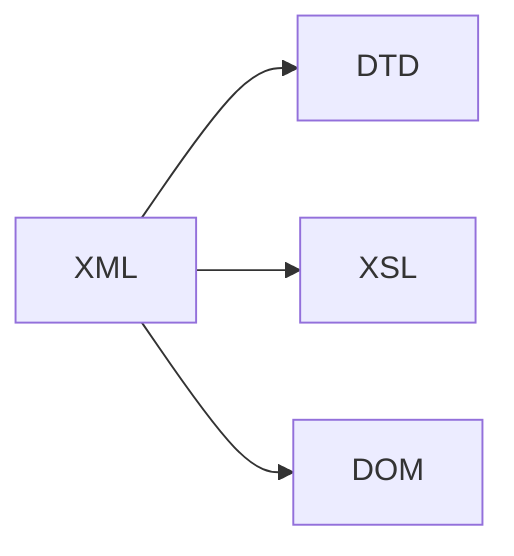

## 1.背景介绍

在信息化社会的背景下，网络投票系统已经成为人们日常生活中不可或缺的一部分。然而，传统的网络投票系统通常局限于特定的平台和操作系统，这大大限制了它们的广泛应用。为了克服这个问题，XML技术开始被应用于网络投票系统的设计和实现。

XML，全称为可扩展标记语言，是一种用于标记电子文件使其具有结构性的标记语言。由于其良好的可扩展性和平台无关性，XML技术已经在诸多领域得到了广泛的应用。

本文将深入探讨如何基于XML技术设计和实现一个调查投票系统，其中将包括核心概念、算法、数学模型、项目实践、实际应用场景、工具和资源推荐等内容。

## 2.核心概念与联系

在基于XML技术的调查投票系统设计与实现中，主要涉及到以下几个核心概念：

- **XML（Extensible Markup Language）**：一种简洁且自我描述的标记语言，用于在各种应用环境中携带、存储和传输信息。

- **DTD（Document Type Definition）**：一种用于定义XML文档结构的语言。通过DTD，我们可以定义XML文档中允许哪些元素以及元素的次序。

- **XSL（Extensible Stylesheet Language）**：一个用于XML文档格式化的语言，可以将XML数据转化为适合人类阅读或者适合进一步处理的格式。

- **DOM（Document Object Model）**：一个跨平台和语言独立的接口，允许程序和脚本动态地访问和更新文档的内容、结构和样式。

这些核心概念之间的关系可以通过以下流程图进行描述：



## 3.核心算法原理具体操作步骤

基于XML技术的调查投票系统的设计与实现主要包含以下几个步骤：

1. **设计XML文档**：首先，我们需要设计XML文档，用于存储投票信息。这个文档应该包含投票的标题、描述、选项等基本信息。

2. **定义DTD**：然后，我们需要定义一个DTD，用于规定XML文档的结构。这个DTD应该包含投票的各个元素以及元素的次序。

3. **编写XSL样式表**：接下来，我们需要编写一个XSL样式表，用于格式化XML文档。这个样式表应该定义如何显示投票的标题、描述、选项等信息。

4. **使用DOM解析XML文档**：最后，我们需要使用DOM解析XML文档，从而使得程序能够动态地访问和更新文档的内容、结构和样式。

## 4.数学模型和公式详细讲解举例说明

在设计和实现基于XML技术的调查投票系统时，我们需要处理的一个关键问题是如何统计投票结果。这涉及到一些基本的数学模型和公式。

假设我们有一个投票，其中包含$n$个选项，每个选项的得票数记为$x_i$，其中$i=1,2,...,n$。投票的总票数记为$X$，则有：

$$
X = \sum_{i=1}^{n} x_i
$$

每个选项的得票率记为$p_i$，其中$i=1,2,...,n$，则有：

$$
p_i = \frac{x_i}{X} , \quad i=1,2,...,n
$$

这些公式可以帮助我们方便地统计投票结果，并计算每个选项的得票率。

## 5.项目实践：代码实例和详细解释说明

下面我们将通过一个简单的例子来演示如何基于XML技术设计和实现一个调查投票系统。具体代码如下：

### 5.1 XML文档设计

我们首先设计一个XML文档，用于存储投票信息。例如，我们可以设计一个投票来决定最受欢迎的编程语言：

```xml
<poll>
    <title>Most Popular Programming Language</title>
    <description>Vote for your favorite programming language!</description>
    <options>
        <option>
            <name>Python</name>
            <votes>0</votes>
        </option>
        <option>
            <name>JavaScript</name>
            <votes>0</votes>
        </option>
        <option>
            <name>Java</name>
            <votes>0</votes>
        </option>
    </options>
</poll>
```

### 5.2 DTD定义

然后，我们定义一个DTD，用于规定XML文档的结构：

```xml
<!DOCTYPE poll [
<!ELEMENT poll (title, description, options)>
<!ELEMENT title (#PCDATA)>
<!ELEMENT description (#PCDATA)>
<!ELEMENT options (option+)>
<!ELEMENT option (name, votes)>
<!ELEMENT name (#PCDATA)>
<!ELEMENT votes (#PCDATA)>
]>
```

### 5.3 XSL样式表编写

接下来，我们编写一个XSL样式表，用于格式化XML文档：

```xml
<xsl:stylesheet version="1.0" xmlns:xsl="http://www.w3.org/1999/XSL/Transform">
<xsl:template match="/">
  <html> 
  <body>
    <h2><xsl:value-of select="poll/title"/></h2>
    <p><xsl:value-of select="poll/description"/></p>
    <table border="1">
      <tr>
        <th>Option</th>
        <th>Votes</th>
      </tr>
      <xsl:for-each select="poll/options/option">
      <tr>
        <td><xsl:value-of select="name"/></td>
        <td><xsl:value-of select="votes"/></td>
      </tr>
      </xsl:for-each>
    </table>
  </body>
  </html>
</xsl:template>
</xsl:stylesheet>
```

### 5.4 DOM解析

最后，我们使用DOM解析XML文档：

```javascript
let xmlDoc;
let xmlHttp = new XMLHttpRequest();
xmlHttp.onload = function() {
    if (xmlHttp.status == 200) {
        xmlDoc = xmlHttp.responseXML;
        loadPoll();
    }
};
xmlHttp.open("GET", "poll.xml", true);
xmlHttp.send();

function loadPoll() {
    let title = xmlDoc.getElementsByTagName("title")[0].childNodes[0].nodeValue;
    let description = xmlDoc.getElementsByTagName("description")[0].childNodes[0].nodeValue;

    document.getElementById("title").innerHTML = title;
    document.getElementById("description").innerHTML = description;

    let options = xmlDoc.getElementsByTagName("option");
    for (let i = 0; i < options.length; i++) {
        let name = options[i].getElementsByTagName("name")[0].childNodes[0].nodeValue;
        let votes = options[i].getElementsByTagName("votes")[0].childNodes[0].nodeValue;

        let optionElement = document.createElement("li");
        optionElement.innerHTML = name + ": " + votes + " votes";
        document.getElementById("options").appendChild(optionElement);
    }
}
```

## 6.实际应用场景

基于XML技术的调查投票系统在实际中有很多应用场景，例如：

- **在线投票**：可以用于在线投票，让用户投票选择他们喜欢的产品、服务或者观点。

- **市场调研**：可以用于市场调研，收集用户的意见和建议，从而帮助公司改进产品和服务。

- **社交媒体投票**：可以用于社交媒体投票，让用户在社交媒体上参与投票，提高用户参与度和活跃度。

- **教育评估**：可以用于教育评估，让学生投票选择他们喜欢的课程或者教师，从而帮助学校改进教育教学。

## 7.工具和资源推荐

以下是一些在设计和实现基于XML技术的调查投票系统时可能会用到的工具和资源：

- **XML Notepad**：一个简单的XML编辑器，可以用于创建和编辑XML文档。

- **XMLSpy**：一个强大的XML编辑器，提供了诸多功能，如XML编辑、转换、调试等。

- **Xerces**：一个开源的XML解析器，可以用于解析XML文档。

- **XPath Visualizer**：一个可以用于可视化XPath查询的工具。

- **W3Schools**：一个提供了大量XML相关教程和资源的网站。

## 8.总结：未来发展趋势与挑战

随着信息化社会的发展，网络投票系统的需求将会越来越大。因此，我们需要设计和实现更加高效、稳定、安全的网络投票系统。基于XML技术的调查投票系统由于其良好的可扩展性和平台无关性，具有很大的发展潜力。然而，也存在一些挑战，例如如何保证投票的公正性、如何防止恶意投票等。

## 9.附录：常见问题与解答

**Q1: 为什么选择XML技术来设计和实现调查投票系统？**

A1: 因为XML具有良好的可扩展性和平台无关性，这使得基于XML技术的调查投票系统可以跨平台使用，极大地提高了其应用范围。

**Q2: 如何防止恶意投票？**

A2: 我们可以通过一些技术手段来防止恶意投票，例如设置投票限制、使用验证码、记录IP地址等。

**Q3: 如何保证投票的公正性？**

A3: 我们可以通过公开透明的方式来保证投票的公正性，例如公开投票结果、提供投票记录等。