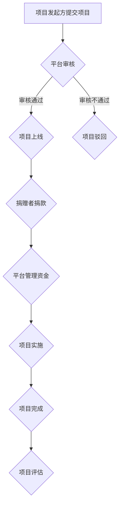

## 1. 背景介绍

### 1.1 扶贫工作的新挑战

随着中国经济的快速发展和社会进步，扶贫工作取得了举世瞩目的成就。然而，随着扶贫攻坚战进入深水区，传统的扶贫方式面临着新的挑战：

* **精准识别难:** 贫困人口分布分散，致贫原因复杂多样，精准识别贫困户难度加大。
* **资金筹集难:** 扶贫资金需求量大，政府投入有限，社会资金参与度不高。
* **项目落地难:** 扶贫项目缺乏有效对接机制，项目实施效果难以保障。
* **信息透明度低:** 扶贫信息公开不够，公众参与度和监督力度不足。

### 1.2 “互联网+扶贫”的兴起

为了应对这些挑战，近年来，“互联网+扶贫”模式应运而生。互联网技术的应用为扶贫工作带来了新的机遇：

* **精准识别:** 大数据、人工智能等技术可以帮助更精准地识别贫困人口和致贫原因。
* **高效筹资:** 互联网平台可以便捷地连接贫困地区和社会资源，提高资金筹集效率。
* **项目对接:** 线上平台可以促进扶贫项目与贫困户的精准对接，提高项目落地效果。
* **信息透明:** 互联网平台可以公开透明地展示扶贫信息，增强公众参与度和监督力度。

### 1.3 扶贫众筹平台的价值

扶贫众筹平台作为“互联网+扶贫”的重要模式之一，具有以下优势：

* **低门槛参与:** 公众可以通过小额捐赠参与扶贫，降低参与门槛。
* **精准帮扶:** 平台可以根据项目需求和贫困户情况，精准匹配捐赠资金和项目。
* **透明可信:** 平台公开透明地展示项目信息和资金流向，增强公众信任度。
* **高效便捷:** 线上平台操作便捷，提高扶贫效率。


## 2. 核心概念与联系

### 2.1 扶贫众筹平台的参与者

扶贫众筹平台涉及多个参与者，主要包括：

* **贫困户:** 接受扶贫帮助的对象。
* **项目发起方:** 负责设计和实施扶贫项目的机构或个人。
* **捐赠者:** 为扶贫项目提供资金支持的个人或组织。
* **平台运营方:** 负责平台搭建、运营和管理的机构。

### 2.2 扶贫众筹平台的功能模块

扶贫众筹平台主要功能模块包括：

* **项目展示:** 展示扶贫项目信息，包括项目介绍、目标金额、捐赠情况等。
* **在线捐赠:** 提供在线捐赠功能，支持多种支付方式。
* **项目跟踪:** 实时跟踪项目进展，定期发布项目进展报告。
* **资金管理:** 管理捐赠资金，确保资金安全和使用透明。
* **信息公开:** 公开透明地展示平台运营信息和项目进展情况。

### 2.3 扶贫众筹平台的核心流程

扶贫众筹平台的核心流程如下：




## 3. 核心算法原理具体操作步骤

### 3.1 项目推荐算法

为了提高捐赠效率，扶贫众筹平台需要根据用户偏好和项目特点，推荐合适的项目给用户。常用的项目推荐算法包括：

* **基于内容的推荐:** 根据项目信息，如项目类型、地域、目标人群等，推荐与用户历史捐赠记录相似的项目。
* **协同过滤推荐:** 根据用户的捐赠行为和项目之间的关联关系，推荐与用户兴趣相似的项目。
* **混合推荐:** 结合多种推荐算法，提高推荐精准度。

### 3.2 资金安全保障机制

为了确保捐赠资金的安全，扶贫众筹平台需要建立完善的资金安全保障机制，主要包括：

* **第三方支付:** 使用支付宝、微信支付等第三方支付平台，确保资金安全。
* **资金托管:** 将捐赠资金托管在银行等金融机构，防止资金被挪用。
* **资金使用监管:** 对项目资金使用情况进行监管，确保资金专款专用。

### 3.3 项目评估体系

为了评估项目实施效果，扶贫众筹平台需要建立科学的项目评估体系，主要包括：

* **项目目标达成度:** 评估项目是否达到预期目标。
* **项目受益人群覆盖率:** 评估项目受益人群的覆盖范围。
* **项目可持续性:** 评估项目长期效益和可持续发展能力。


## 4. 数学模型和公式详细讲解举例说明

### 4.1 项目推荐算法中的相似度计算

在基于内容的推荐算法中，需要计算项目之间的相似度。常用的相似度计算公式包括：

* **余弦相似度:**
 $$
 \cos(\theta) = \frac{\mathbf{A} \cdot \mathbf{B}}{\|\mathbf{A}\| \|\mathbf{B}\|}
 $$

其中， $\mathbf{A}$ 和 $\mathbf{B}$ 分别表示两个项目的特征向量。

* **Jaccard 相似度:**
 $$
 J(A,B) = \frac{|A \cap B|}{|A \cup B|}
 $$

其中， $A$ 和 $B$ 分别表示两个项目的特征集合。

### 4.2 资金安全保障机制中的风险控制模型

为了控制资金风险，扶贫众筹平台可以建立风险控制模型，例如：

* **信用评分模型:** 根据项目发起方的历史信用记录、项目信息等，评估项目风险等级。
* **反欺诈模型:** 利用机器学习等技术，识别和预防欺诈行为。

## 5. 项目实践：代码实例和详细解释说明

### 5.1 Spring Boot框架搭建

扶贫众筹平台可以使用 Spring Boot 框架进行快速搭建。Spring Boot 提供了丰富的功能组件和自动配置机制，可以简化开发流程。

```java
@SpringBootApplication
public class FundraisingPlatformApplication {

    public static void main(String[] args) {
        SpringApplication.run(FundraisingPlatformApplication.class, args);
    }

}
```

### 5.2 数据库设计

扶贫众筹平台需要设计数据库来存储项目信息、用户信息、捐赠记录等数据。可以使用 MySQL、PostgreSQL 等关系型数据库。

```sql
CREATE TABLE project (
    id INT PRIMARY KEY AUTO_INCREMENT,
    name VARCHAR(255) NOT NULL,
    description TEXT,
    target_amount DECIMAL(10,2) NOT NULL,
    start_date DATE,
    end_date DATE
);

CREATE TABLE user (
    id INT PRIMARY KEY AUTO_INCREMENT,
    username VARCHAR(255) NOT NULL,
    password VARCHAR(255) NOT