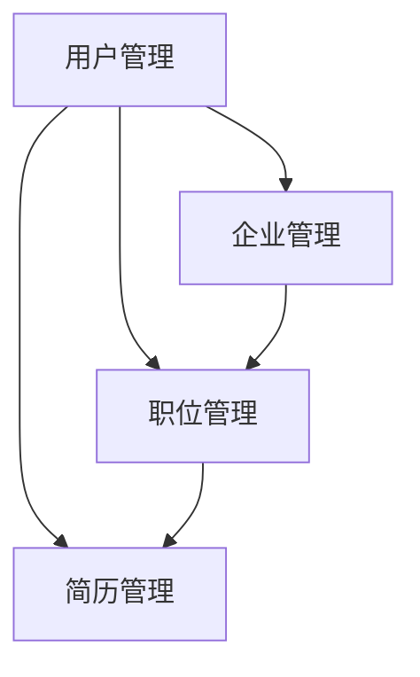

## 1. 背景介绍

### 1.1 招聘行业现状与挑战

随着互联网的快速发展和普及，传统的招聘模式已经难以满足企业和求职者的需求。企业面临着招聘成本高、效率低、人才匹配度低等问题，而求职者则面临着信息不对称、求职渠道有限、求职过程繁琐等问题。为了解决这些问题，网上招聘系统应运而生。

### 1.2 网上招聘系统的优势

与传统招聘模式相比，网上招聘系统具有以下优势：

* **信息透明化:**  网上招聘系统可以将企业信息、职位信息、求职者信息等公开透明地展示出来，减少信息不对称。
* **提高效率:** 网上招聘系统可以自动化处理简历筛选、面试安排等流程，提高招聘效率。
* **降低成本:** 网上招聘系统可以减少招聘过程中的差旅费、印刷费等成本。
* **扩大招聘范围:** 网上招聘系统可以突破地域限制，扩大招聘范围。

### 1.3 Spring Boot 框架的优势

Spring Boot 是一个用于创建独立的、基于 Spring 的生产级应用程序的框架。它简化了 Spring 应用程序的配置和部署，并提供了一系列开箱即用的功能，例如：

* **自动配置:** Spring Boot 可以根据项目依赖自动配置 Spring 应用程序，减少了手动配置的工作量。
* **嵌入式服务器:** Spring Boot 内置了 Tomcat、Jetty 和 Undertow 等服务器，无需单独部署 Web 服务器。
* **生产就绪:** Spring Boot 提供了 Actuator 模块，可以监控应用程序的运行状况、指标和配置。

## 2. 核心概念与联系

### 2.1 系统架构

本系统采用经典的三层架构：

* **表现层:** 负责用户界面展示和交互。
* **业务逻辑层:** 负责处理业务逻辑和数据校验。
* **数据访问层:** 负责与数据库交互，进行数据持久化。

### 2.2 核心模块

本系统包含以下核心模块：

* **用户管理模块:** 负责用户注册、登录、信息管理等功能。
* **企业管理模块:** 负责企业信息管理、职位发布、简历筛选等功能。
* **职位管理模块:** 负责职位信息管理、搜索、推荐等功能。
* **简历管理模块:** 负责简历信息管理、投递、评价等功能。

### 2.3 模块间关系



## 3. 核心算法原理具体操作步骤

### 3.1 简历匹配算法

本系统采用基于 Lucene 的全文检索技术实现简历匹配。

#### 3.1.1 索引创建

将简历文本进行分词、去除停用词等预处理后，构建 Lucene 索引。

#### 3.1.2 查询匹配

根据职位关键词查询 Lucene 索引，获取匹配的简历列表。

#### 3.1.3 排序规则

根据简历与职位关键词的匹配度、简历发布时间、求职者工作经验等因素对匹配结果进行排序。

### 3.2 职位推荐算法

本系统采用基于内容的推荐算法实现职位推荐。

#### 3.2.1 用户画像

根据用户的浏览历史、收藏职位等信息构建用户画像。

#### 3.2.2 职位画像

根据职位关键词、技能要求、工作职责等信息构建职位画像。

#### 3.2.3 推荐逻辑

计算用户画像与职位画像的相似度，推荐相似度高的职位给用户。

## 4. 数学模型和公式详细讲解举例说明

### 4.1 TF-IDF 算法

TF-IDF 算法用于计算词语在文档中的权重。

#### 4.1.1 公式

$$
w_{i,j} = tf_{i,j} \times idf_i
$$

其中：

* $w_{i,j}$ 表示词语 $i$ 在文档 $j$ 中的权重。
* $tf_{i,j}$ 表示词语 $i$ 在文档 $j$ 中出现的频率。
* $idf_i$ 表示词语 $i$ 的逆文档频率，计算公式如下：

$$
idf_i = \log \frac{N}{df_i}
$$

其中：

* $N$ 表示文档总数。
* $df_i$ 表示包含词语 $i$ 的文档数。

#### 4.1.2 示例

假设有以下两个文档：

* 文档 1: "Java Spring Boot"
* 文档 2: "Python Flask"

计算 "Spring" 在文档 1 中的权重：

* $tf_{Spring,1} = 1$
* $df_{Spring} = 1$
* $N = 2$
* $idf_{Spring} = \log \frac{2}{1} = 0.301$
* $w_{Spring,1} = 1 \times 0.301 = 0.301$

### 4.2 余弦相似度

余弦相似度用于计算两个向量之间的相似度。

#### 4.2.1 公式

$$
\cos(\theta) = \frac{\mathbf{a} \cdot \mathbf{b}}{\|\mathbf{a}\| \|\mathbf{b}\|}
$$

其中：

* $\mathbf{a}$ 和 $\mathbf{b}$ 表示两个向量。
* $\cdot$ 表示向量点积。
* $\|\mathbf{a}\|$ 和 $\|\mathbf{b}\|$ 表示向量 $\mathbf{a}$ 和 $\mathbf{b}$ 的模。

#### 4.2.2 示例

计算向量 $(1, 2)$ 和 $(3, 4)$ 之间的余弦相似度：

* $\mathbf{a} \cdot \mathbf{b} = 1 \times 3 + 2 \times 4 = 11$
* $\|\mathbf{a}\| = \sqrt{1^2 + 2^2} = \sqrt{5}$
* $\|\mathbf{b}\| = \sqrt{3^2 + 4^2} = 5$
* $\cos(\theta) = \frac{11}{\sqrt{5} \times 5} = 0.9839$

## 5. 项目实践：代码实例和详细解释说明

### 5.1 用户注册功能

#### 5.1.1 代码示例

```java
@RestController
@RequestMapping("/users")
public class UserController {

    @Autowired
    private UserService userService;

    @PostMapping("/register")
    public ResponseEntity<User> register(@RequestBody User user) {
        User savedUser = userService.save(user);
        return ResponseEntity.ok(savedUser);
    }
}
```

#### 5.1.2 代码解释

* `@RestController` 注解表示该类是一个 RESTful Web 服务控制器。
* `@RequestMapping("/users")` 注解将所有 `/users` 开头的请求映射到该控制器。
* `@PostMapping("/register")` 注解将 POST 请求 `/users/register` 映射到 `register()` 方法。
* `@RequestBody` 注解将请求体中的 JSON 数据绑定到 `user` 对象。
* `userService.save(user)` 调用用户服务保存用户数据。
* `ResponseEntity.ok(savedUser)` 返回 HTTP 200 OK 状态码和保存的用户数据。

### 5.2 简历搜索功能

#### 5.2.1 代码示例

```java
@RestController
@RequestMapping("/resumes")
public class ResumeController {

    @Autowired
    private ResumeService resumeService;

    @GetMapping("/search")
    public ResponseEntity<List<Resume>> search(@RequestParam String keyword) {
        List<Resume> resumes = resumeService.search(keyword);
        return ResponseEntity.ok(resumes);
    }
}
```

#### 5.2.2 代码解释

* `@GetMapping("/search")` 注解将 GET 请求 `/resumes/search` 映射到 `search()` 方法。
* `@RequestParam String keyword` 注解将请求参数 `keyword` 绑定到 `keyword` 变量。
* `resumeService.search(keyword)` 调用简历服务搜索简历数据。
* `ResponseEntity.ok(resumes)` 返回 HTTP 200 OK 状态码和搜索到的简历数据。

## 6. 实际应用场景

### 6.1 大型企业招聘

大型企业拥有庞大的人才需求，网上招聘系统可以帮助企业高效地筛选简历、安排面试，降低招聘成本，提高招聘效率。

### 6.2 中小企业招聘

中小企业招聘预算有限，网上招聘系统可以帮助企业扩大招聘范围，接触更多潜在求职者，提高招聘成功率。

### 6.3 校园招聘

高校毕业生是企业招聘的重要群体，网上招聘系统可以帮助企业方便地发布职位信息、收集简历，提高校园招聘效率。

## 7. 工具和资源推荐

### 7.1 Spring Boot

* 官方网站: https://spring.io/projects/spring-boot
* 文档: https://docs.spring.io/spring-boot/docs/current/reference/html/

### 7.2 Apache Lucene

* 官方网站: https://lucene.apache.org/
* 文档: https://lucene.apache.org/core/

### 7.3 MySQL

* 官方网站: https://www.mysql.com/
* 文档: https://dev.mysql.com/doc/

## 8. 总结：未来发展趋势与挑战

### 8.1 人工智能技术应用

未来，人工智能技术将更多地应用于网上招聘系统，例如：

* **智能简历筛选:** 利用自然语言处理技术，自动识别简历中的关键信息，提高简历筛选效率。
* **智能面试:** 利用语音识别、图像识别等技术，实现自动化面试，降低面试成本。
* **个性化推荐:** 利用机器学习技术，根据用户的求职意向和企业招聘需求，进行个性化职位推荐。

### 8.2 数据安全与隐私保护

随着网上招聘系统存储的用户信息越来越多，数据安全与隐私保护将面临更大的挑战。

## 9. 附录：常见问题与解答

### 9.1 如何保证简历信息的真实性？

* 要求用户进行实名认证。
* 与第三方征信机构合作，验证用户信息。

### 9.2 如何防止恶意刷票？

* 限制同一 IP 地址的投票次数。
* 使用验证码机制防止机器人刷票。

### 9.3 如何提高系统的安全性？

* 使用 HTTPS 协议加密传输数据。
* 定期进行安全漏洞扫描和修复。
* 制定完善的安全策略和应急预案。