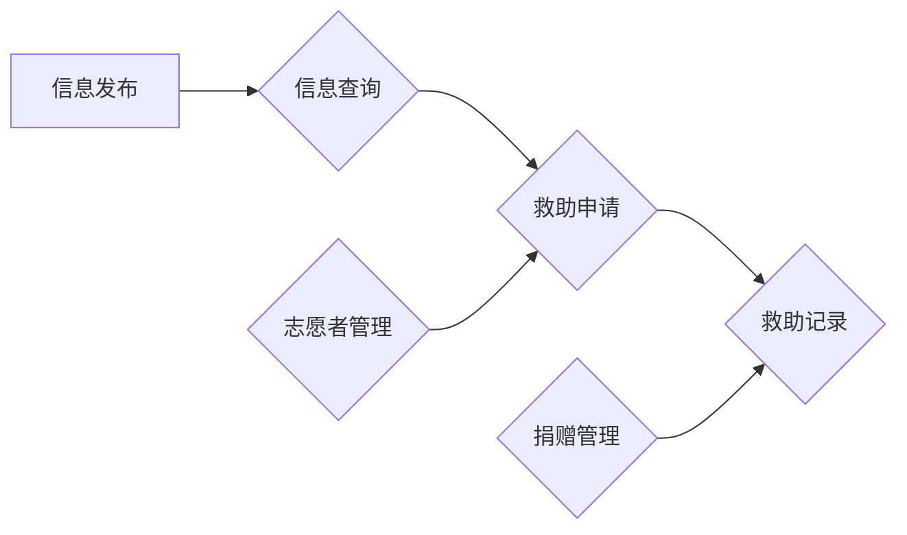

## 1. 背景介绍

### 1.1 高校流浪动物现状

近年来，随着城市化进程的加快和人们生活水平的提高，越来越多的宠物进入家庭。然而，一些宠物因为各种原因被遗弃，成为了流浪动物。高校作为人员密集的场所，也成为了流浪动物聚集地。这些流浪动物不仅影响校园环境卫生，还可能传播疾病，甚至威胁师生的人身安全。

### 1.2 传统救助方式的局限性

传统的流浪动物救助方式主要依靠志愿者和公益组织，存在以下局限性：

* 信息不对称：志愿者和公益组织难以全面掌握流浪动物的信息，导致救助效率低下。
* 资源有限：志愿者和公益组织的资金、人力、物力有限，难以满足日益增长的流浪动物救助需求。
* 缺乏科学管理：传统的救助方式缺乏科学的管理，难以对流浪动物进行有效追踪和管理。

### 1.3  SpringBoot 框架的优势

SpringBoot 框架作为一种轻量级的 Java 开发框架，具有以下优势：

* 简化开发：SpringBoot 提供了自动配置、起步依赖等功能，简化了开发流程。
* 易于部署：SpringBoot 内置了 Tomcat、Jetty 等服务器，可以方便地进行项目部署。
* 丰富的生态：SpringBoot 拥有丰富的第三方库和工具，可以方便地集成各种功能。

基于以上背景，开发一款基于 SpringBoot 的高校流浪动物保护小程序，可以有效解决传统救助方式的局限性，提高流浪动物救助效率。

## 2. 核心概念与联系

### 2.1 小程序功能模块

本小程序主要包含以下功能模块：

* **信息发布模块**: 用户可以发布流浪动物信息，包括动物种类、发现地点、照片等。
* **信息查询模块**: 用户可以根据动物种类、发现地点等条件查询流浪动物信息。
* **救助申请模块**: 用户可以申请救助流浪动物，并填写相关信息。
* **救助记录模块**: 记录流浪动物的救助情况，包括救助时间、救助人、救助结果等。
* **志愿者管理模块**: 管理志愿者信息，包括志愿者注册、信息审核、活动发布等。
* **捐赠管理模块**: 管理用户的捐赠信息，包括捐赠金额、捐赠时间、捐赠用途等。

### 2.2 模块间联系

* 信息发布模块和信息查询模块相互关联，用户发布的流浪动物信息可以被其他用户查询。
* 救助申请模块与信息发布模块和信息查询模块相关联，用户可以根据查询到的流浪动物信息申请救助。
* 救助记录模块与救助申请模块相关联，记录每个救助申请的处理结果。
* 志愿者管理模块与救助申请模块相关联，志愿者可以处理用户的救助申请。
* 捐赠管理模块与救助记录模块相关联，用户的捐赠可以用于流浪动物的救助。

### 2.3  Mermaid 流程图



## 3. 核心算法原理具体操作步骤

### 3.1  LBS 定位算法

为了方便用户发布和查询流浪动物信息，本小程序采用 LBS 定位算法，获取用户当前位置，并根据位置信息进行信息筛选。

#### 3.1.1  算法原理

LBS 定位算法基于用户的 GPS 信号或网络信号，计算用户当前位置的经纬度坐标。

#### 3.1.2  操作步骤

1. 获取用户授权，允许小程序访问用户的位置信息。
2. 调用微信小程序 API 获取用户当前位置的经纬度坐标。
3. 将经纬度坐标存储到数据库中。
4. 在用户发布和查询信息时，根据经纬度坐标进行信息筛选。

### 3.2  图像识别算法

为了提高流浪动物信息的准确性，本小程序采用图像识别算法，识别用户上传的动物照片，自动识别动物种类。

#### 3.2.1  算法原理

图像识别算法基于深度学习技术，通过训练大量的动物图片数据，构建动物种类识别模型。

#### 3.2.2  操作步骤

1. 收集大量的动物图片数据，并进行标注。
2. 使用深度学习框架训练动物种类识别模型。
3. 将训练好的模型部署到服务器上。
4. 用户上传动物照片时，调用服务器上的模型进行识别。
5. 将识别结果返回给用户。

## 4. 数学模型和公式详细讲解举例说明

### 4.1  地理距离计算公式

为了计算用户与流浪动物之间的距离，本小程序采用地理距离计算公式。

#### 4.1.1  公式

```
d = R * arccos(sin(lat1) * sin(lat2) + cos(lat1) * cos(lat2) * cos(lon2 - lon1))
```

其中：

* d: 距离
* R: 地球半径，取值 6371 km
* lat1, lon1: 用户位置的经纬度坐标
* lat2, lon2: 流浪动物位置的经纬度坐标

#### 4.1.2  举例说明

假设用户位置的经纬度坐标为 (30.54, 114.36)，流浪动物位置的经纬度坐标为 (30.55, 114.37)，则用户与流浪动物之间的距离为：

```
d = 6371 * arccos(sin(30.54) * sin(30.55) + cos(30.54) * cos(30.55) * cos(114.37 - 114.36))
```

计算结果约为 1.1 km。

### 4.2  捐赠统计模型

为了统计用户的捐赠情况，本小程序采用捐赠统计模型。

#### 4.2.1  模型

捐赠统计模型主要包括以下指标：

* 总捐赠金额
* 捐赠人数
* 平均捐赠金额
* 捐赠次数

#### 4.2.2  举例说明

假设某段时间内，用户捐赠记录如下：

| 用户名 | 捐赠金额 | 捐赠时间 |
|---|---|---|
| 张三 | 100 元 | 2024-05-18 10:00 |
| 李四 | 50 元 | 2024-05-18 12:00 |
| 王五 | 200 元 | 2024-05-19 14:00 |

则该段时间内的捐赠统计指标为：

* 总捐赠金额：350 元
* 捐赠人数：3 人
* 平均捐赠金额：116.67 元
* 捐赠次数：3 次

## 5. 项目实践：代码实例和详细解释说明

### 5.1  后端代码

#### 5.1.1  实体类

```java
@Entity
public class Animal {
    @Id
    @GeneratedValue(strategy = GenerationType.IDENTITY)
    private Long id;

    private String type; // 动物种类
    private String location; // 发现地点
    private String photo; // 照片
    private Double latitude; // 纬度
    private Double longitude; // 经度

    // ... getter 和 setter 方法
}
```

#### 5.1.2  控制器

```java
@RestController
@RequestMapping("/api/animals")
public class AnimalController {

    @Autowired
    private AnimalRepository animalRepository;

    @PostMapping
    public Animal createAnimal(@RequestBody Animal animal) {
        return animalRepository.save(animal);
    }

    @GetMapping
    public List<Animal> getAnimals(@RequestParam(required = false) String type,
                                  @RequestParam(required = false) String location,
                                  @RequestParam(required = false) Double latitude,
                                  @RequestParam(required = false) Double longitude,
                                  @RequestParam(defaultValue = "10") int pageSize,
                                  @RequestParam(defaultValue = "0") int pageNumber) {
        Pageable pageable = PageRequest.of(pageNumber, pageSize);
        return animalRepository.findAll(AnimalSpecification.searchAnimals(type, location, latitude, longitude), pageable)
                .getContent();
    }
}
```

#### 5.1.3  服务层

```java
@Service
public class AnimalService {

    @Autowired
    private AnimalRepository animalRepository;

    public Animal createAnimal(Animal animal) {
        return animalRepository.save(animal);
    }

    public Page<Animal> getAnimals(String type, String location, Double latitude, Double longitude, int pageSize, int pageNumber) {
        Pageable pageable = PageRequest.of(pageNumber, pageSize);
        return animalRepository.findAll(AnimalSpecification.searchAnimals(type, location, latitude, longitude), pageable);
    }
}
```

### 5.2  前端代码

#### 5.2.1  发布信息页面

```html
<template>
  <div>
    <input type="text" v-model="type" placeholder="动物种类" />
    <input type="text" v-model="location" placeholder="发现地点" />
    <input type="file" @change="handleFileChange" />
    <button @click="submit">发布</button>
  </div>
</template>

<script>
export default {
  data() {
    return {
      type: '',
      location: '',
      photo: null,
    };
  },
  methods: {
    handleFileChange(event) {
      this.photo = event.target.files[0];
    },
    submit() {
      // ... 上传信息到后端
    },
  },
};
</script>
```

#### 5.2.2  查询信息页面

```html
<template>
  <div>
    <input type="text" v-model="type" placeholder="动物种类" />
    <input type="text" v-model="location" placeholder="发现地点" />
    <button @click="search">查询</button>
    <ul>
      <li v-for="animal in animals" :key="animal.id">
        {{ animal.type }} - {{ animal.location }}
      </li>
    </ul>
  </div>
</template>

<script>
export default {
  data() {
    return {
      type: '',
      location: '',
      animals: [],
    };
  },
  methods: {
    search() {
      // ... 从后端查询信息
    },
  },
};
</script>
```

## 6. 实际应用场景

### 6.1  校园流浪动物救助

本小程序可以应用于高校校园流浪动物救助，方便师生发布和查询流浪动物信息，提高救助效率。

### 6.2  动物领养平台

本小程序可以作为动物领养平台，方便用户发布待领养动物信息，并提供线上领养申请功能。

### 6.3  动物保护公益活动

本小程序可以用于组织动物保护公益活动，方便志愿者报名和管理，提高活动效率。

## 7. 工具和资源推荐

### 7.1  开发工具

* IntelliJ IDEA
* 微信开发者工具

### 7.2  框架和库

* SpringBoot
* MyBatis
* MySQL
* 微信小程序 API

### 7.3  学习资源

* SpringBoot 官方文档
* 微信小程序开发文档

## 8. 总结：未来发展趋势与挑战

### 8.1  未来发展趋势

* 人工智能技术将进一步应用于流浪动物救助，例如利用人脸识别技术识别流浪动物身份，利用自然语言处理技术分析流浪动物行为等。
* 区块链技术可以用于构建去中心化的流浪动物救助平台，提高救助信息的透明度和可信任度。
* 虚拟现实技术可以用于模拟流浪动物的生活环境，提高人们对流浪动物的关注和同情。

### 8.2  挑战

* 数据安全和隐私保护：流浪动物信息涉及用户隐私，需要采取措施保障数据安全和隐私保护。
* 技术门槛：开发基于人工智能技术的流浪动物救助平台需要较高的技术门槛。
* 社会认知度：提高公众对流浪动物救助的认知度和参与度是流浪动物救助工作的关键。

## 9. 附录：常见问题与解答

### 9.1  如何发布流浪动物信息？

用户可以通过小程序的“信息发布”模块发布流浪动物信息，包括动物种类、发现地点、照片等。

### 9.2  如何申请救助流浪动物？

用户可以通过小程序的“救助申请”模块申请救助流浪动物，并填写相关信息。

### 9.3  如何成为志愿者？

用户可以通过小程序的“志愿者管理”模块注册成为志愿者，并参与流浪动物救助活动。

### 9.4  如何捐赠？

用户可以通过小程序的“捐赠管理”模块进行捐赠，支持流浪动物救助工作。