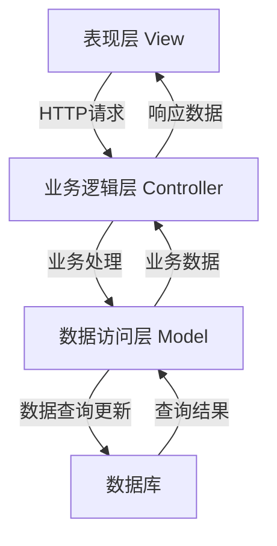

# 基于SSM的共享单车管理系统

## 1. 背景介绍

### 1.1 共享单车的兴起

近年来，共享单车在全球范围内迅速崛起,成为解决"最后一公里"出行难题的新型绿色出行方式。共享单车的出现,不仅缓解了交通拥堵问题,更为人们提供了一种便捷、经济、环保的出行选择。随着用户数量的不断增加,对共享单车系统的管理需求也日益迫切。

### 1.2 共享单车管理系统的重要性

共享单车管理系统是确保共享单车运营顺利、高效的关键所在。它需要处理诸多复杂的业务流程,包括用户管理、车辆调度、费用计算、投诉处理等。传统的人工管理方式已经无法满足日益增长的需求,因此构建一个自动化、智能化的管理系统势在必行。

### 1.3 SSM框架简介

SSM是目前Java EE领域中使用最为广泛的一种框架模式,它是Spring、SpringMVC和MyBatis三种开源框架的有机集成。SSM框架借助各个框架的优势,形成了一个高效、易用、轻量级的应用开发架构,能够帮助开发人员快速构建企业级应用。

## 2. 核心概念与联系

### 2.1 系统架构概览

基于SSM的共享单车管理系统采用了经典的三层架构设计,包括表现层(View)、业务逻辑层(Controller)和数据访问层(Model)。



1. **表现层(View)**: 负责与用户交互,接收用户请求并展示处理结果。通常使用JSP、FreeMarker等模板技术实现。
2. **业务逻辑层(Controller)**: 处理用户请求,完成业务逻辑运算,并调用Model层获取或存储数据。由Spring MVC框架提供支持。
3. **数据访问层(Model)**: 负责与数据库进行交互,执行数据查询、插入、更新和删除操作。MyBatis框架可以有效简化数据访问代码。
4. **数据库**: 存储系统所有业务数据,如用户信息、车辆信息、订单记录等。

### 2.2 Spring框架

Spring是一个轻量级的控制反转(IoC)和面向切面编程(AOP)的框架。在共享单车管理系统中,Spring主要负责以下几个方面:

1. **Bean管理**: 通过IoC容器管理应用中的所有Bean,简化对象之间的依赖关系。
2. **事务管理**: 借助声明式事务,方便地对数据库操作进行事务控制。
3. **AOP支持**: 利用AOP,可以方便地实现日志记录、性能统计等横切关注点。

### 2.3 SpringMVC框架

SpringMVC遵循了经典的MVC设计模式,是Spring框架的一个模块,主要负责系统的Web层开发。它的主要优势包括:

1. **请求映射**: 通过`@RequestMapping`注解,可以方便地将URL请求映射到对应的控制器方法上。
2. **数据绑定**: 能够自动将请求参数绑定到方法参数上,减少了数据转换的工作量。
3. **视图解析**: 支持多种视图技术,如JSP、FreeMarker等,并能自动解析视图名称。

### 2.4 MyBatis框架

MyBatis是一个优秀的持久层框架,用于执行SQL语句、映射结果集,与数据库进行交互。在系统中,MyBatis主要负责以下工作:

1. **SQL映射**: 通过XML或注解的方式,将SQL语句映射到Java方法上。
2. **结果映射**: 自动将查询结果映射为Java对象,减少了手动转换的工作。
3. **动态SQL**: 支持动态拼接SQL语句,使SQL语句更加灵活和高效。

## 3. 核心算法原理及具体操作步骤

### 3.1 用户认证与授权

用户认证与授权是系统的基础和前提,需要确保只有合法用户才能使用共享单车服务。具体的实现步骤如下:

1. **用户注册**: 用户提供基本信息(姓名、手机号、邮箱等)进行注册,系统对信息进行合法性校验并存储到数据库中。
2. **用户登录**: 用户输入手机号/邮箱和密码,系统验证身份信息是否匹配,验证通过则生成会话令牌(Session Token)。
3. **权限控制**: 根据用户的角色(普通用户、管理员等),授予不同的系统操作权限。
4. **请求拦截**: 在每次请求时,拦截器会检查Session Token的合法性,只有合法用户才能继续后续操作。

为了提高安全性,密码在存储时需要进行单向哈希加密,例如使用SHA-256算法:

$$
H(password) = SHA256(password)
$$

其中,`H(password)`表示密码的哈希值。在验证时,系统只需比对用户输入密码的哈希值与数据库中存储的哈希值是否一致即可。

### 3.2 车辆调度算法

高效的车辆调度对于共享单车系统的正常运转至关重要。我们采用了一种基于地理位置和车辆余量的调度算法,具体步骤如下:

1. **获取用户位置**: 通过GPS或基站定位,获取用户当前的地理位置坐标。
2. **查找附近车辆**: 在指定半径范围内,查找所有可用的共享单车,计算每辆车与用户的距离。
3. **计算车辆余量**: 统计每个区域内可用车辆的数量,作为该区域的车辆余量。
4. **综合评分**: 为每辆车辆计算一个综合评分,评分规则为:

$$
score = \alpha * \frac{1}{distance} + \beta * surplus
$$

其中,`distance`表示车辆与用户的距离,`surplus`表示该区域的车辆余量,`α`和`β`是两个权重系数,用于调节距离和余量的重要性。

5. **返回最优车辆**: 选取评分最高的车辆,将其位置信息返回给用户。

该算法的优点是,既考虑了用户与车辆的距离,也兼顾了车辆的区域分布,从而在方便用户和系统负载之间达成平衡。

### 3.3 费用计算

为了公平合理地收取服务费用,系统需要准确计算每次用车的费用。费用计算遵循以下规则:

1. **基础费用**: 每次使用服务需要支付基础费用,例如1元。
2. **距离费用**: 根据行驶距离计算费用,例如前3公里2元/公里,超过3公里则3元/公里。
3. **时长费用**: 根据使用时长计算费用,例如前30分钟1元/30分钟,超过30分钟则2元/30分钟。
4. **其他费用**: 例如停车费、违规费等。

假设基础费用为`base_fee`,距离费用率为`dist_rate1`和`dist_rate2`,时长费用率为`time_rate1`和`time_rate2`,则最终费用计算公式如下:

$$
fee = base\_fee + dist\_rate1 * min(distance, 3) + dist\_rate2 * max(distance - 3, 0) + time\_rate1 * min(duration, 0.5) + time\_rate2 * max(duration - 0.5, 0) + other\_fees
$$

其中,`distance`表示行驶距离(公里),`duration`表示使用时长(小时)。

该计费模式确保了费用的透明性和合理性,鼓励用户节约使用,同时也为系统带来了可观的收益。

### 3.4 投诉处理流程

为了保证用户体验,系统需要高效地处理用户投诉。投诉处理的基本流程如下:

1. **用户提交投诉**: 用户在APP或网站上提交投诉,填写投诉原因、时间、地点等相关信息。
2. **自动分类**: 系统利用自然语言处理技术,对投诉信息进行自动分类,例如"车辆故障"、"费用异常"等类别。
3. **人工审核**: 管理员对分类结果进行人工审核,必要时可以修改分类结果。
4. **指派处理人员**: 根据投诉类别,系统自动指派相应的处理人员,例如维修人员、财务人员等。
5. **处理反馈**: 处理人员根据具体情况进行处理,并将处理结果反馈给用户。
6. **投诉归档**: 所有投诉记录都会被归档保存,用于后续的数据分析和系统优化。

该流程的优势在于,通过自动化和人工审核相结合的方式,既提高了处理效率,又保证了处理质量。同时,投诉数据的收集和分析也为系统的持续改进提供了有力支持。

## 4. 数学模型和公式详细讲解举例说明

在共享单车管理系统中,数学模型和公式在多个场景下发挥着重要作用,包括用户认证、车辆调度和费用计算等。下面将对几个关键公式进行详细讲解和举例说明。

### 4.1 密码哈希加密

为了保护用户的隐私和账户安全,系统在存储用户密码时会进行单向哈希加密。常用的哈希算法包括MD5、SHA-1和SHA-256等。这里我们以SHA-256为例进行说明。

SHA-256算法的工作原理是,将任意长度的输入消息通过多次哈希运算,最终压缩为一个长度为256位(32字节)的消息摘要。这个过程是不可逆的,即无法从哈希值反推出原始消息。

假设用户输入的密码为"mypassword",SHA-256算法会将其转换为如下64个十六进制字符的哈希值:

```
f7ff9e8b7bb2e09b70935a5d785e0cc5d9d0abf0b0e5d3d7d3d7d3d7d3d7d3d7
```

在存储时,系统只需保存这个哈希值即可。当用户登录时,系统会计算输入密码的哈希值,并与数据库中存储的哈希值进行比对,如果相同则认证通过。

这种做法的优点是,即使数据库被黑客获取,也无法直接得到用户的原始密码,从而最大限度地保护了用户的隐私。

### 4.2 车辆调度评分

在第3.2节中,我们介绍了一种基于地理位置和车辆余量的车辆调度算法。其中,对每辆车辆进行综合评分的公式为:

$$
score = \alpha * \frac{1}{distance} + \beta * surplus
$$

这里将对该公式进行进一步说明。

1. **距离分数**:  `distance`表示车辆与用户的距离(单位:公里),`1/distance`即为距离分数。距离越近,分数越高。
2. **余量分数**: `surplus`表示该区域内可用车辆的数量,作为该区域的车辆余量。余量越大,分数越高。
3. **权重系数**: `α`和`β`是两个权重系数,用于调节距离和余量在评分中的重要性。通常情况下,我们会赋予距离更高的权重,例如`α=0.8,β=0.2`。

假设用户所在区域有10辆可用车辆,其中距离用户最近的三辆车的距离分别为0.5公里、0.7公里和1.2公里,那么它们的评分将是:

- 车辆1:  `score = 0.8 * (1/0.5) + 0.2 * 10 = 2.8`
- 车辆2:  `score = 0.8 * (1/0.7) + 0.2 * 10 = 2.34`
- 车辆3:  `score = 0.8 * (1/1.2) + 0.2 * 10 = 1.87`

因此,系统会将距离用户最近的车辆1推荐给用户。

该评分算法的优点是,既考虑了用户体验(距离),又兼顾了系统负载(余量),能够在两者之间达成较好的平衡。

### 4.3 费用计算公式

在第3.3节中,我们给出了计算共享单车使用费用的公式:

$$
fee = base\_fee + dist\_rate1