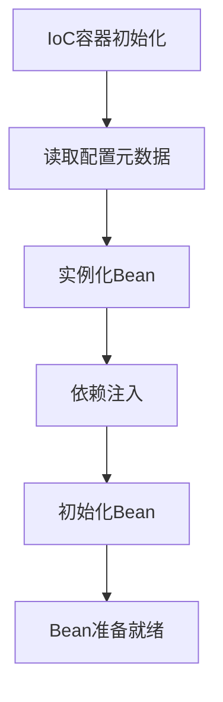
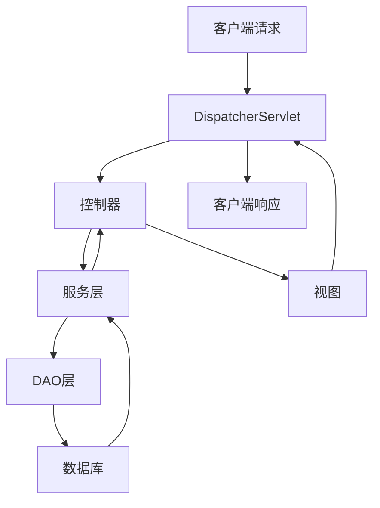
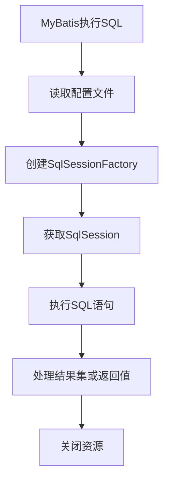

以下是关于《基于SSM的校园二手交易系统》技术博客文章的正文内容:

## 1. 背景介绍

### 1.1 校园二手交易系统的需求

在校园生活中,学生们常常会有很多闲置物品需要出售或转让,同时也需要购买一些二手物品以节省开支。传统的线下交易方式存在效率低下、交易范围有限等问题。因此,构建一个基于Web的校园二手交易平台,能够极大地方便校园内的交易活动,提高交易效率。

### 1.2 系统架构选择

目前主流的Java Web开发架构有SSH(Struts+Spring+Hibernate)、SSM(SpringMVC+Spring+MyBatis)等。SSM架构由于设计理念先进、结构清晰、开发高效等优点,逐渐取代了传统的SSH架构,成为企业级应用开发的主流选择。因此,本文选择基于SSM架构构建校园二手交易系统。

## 2. 核心概念与联系

### 2.1 Spring

Spring是一个轻量级的控制反转(IoC)和面向切面编程(AOP)的框架。它的核心思想是使用依赖注入和面向接口编程来解耦应用程序的各个组件,提高代码的可重用性和可测试性。

### 2.2 SpringMVC

SpringMVC是Spring框架的一个模块,是一种基于MVC设计模式的Web框架。它通过一个中央Servlet分发请求给控制器对象,将视图逻辑与业务逻辑分离,降低了耦合性。

### 2.3 MyBatis

MyBatis是一个优秀的持久层框架,它支持自定义SQL、存储过程以及高级映射。通过MyBatis,开发者可以避免编写大量JDBC代码,从而提高开发效率。

### 2.4 核心概念关系

SSM架构将Spring、SpringMVC和MyBatis有机结合,构建了一个高效、灵活的JavaWeb应用开发框架。Spring提供了IoC和AOP支持,SpringMVC负责Web层的请求分发和视图渲染,MyBatis则实现了持久层的数据访问逻辑。三者的有机结合使得SSM成为了一种理想的企业级应用开发架构。

## 3. 核心算法原理具体操作步骤

### 3.1 IoC容器初始化

Spring的IoC容器通过读取配置元数据,实例化、配置和组装Bean,管理它们的整个生命周期。IoC容器初始化的主要步骤包括:

1. 读取配置元数据,包括XML文件、注解等
2. 实例化Bean
3. 依赖注入
4. 初始化Bean

具体算法流程如下所示:



### 3.2 SpringMVC请求处理流程

SpringMVC通过中央Servlet分发请求给控制器对象,控制器对象完成业务逻辑处理后,将模型数据交给视图渲染,最终响应给客户端。具体流程如下:

1. 客户端发送请求到中央Servlet(DispatcherServlet)
2. DispatcherServlet根据请求URL查找对应的控制器
3. 控制器执行业务逻辑,调用服务层方法
4. 服务层方法调用DAO层访问数据库
5. 控制器将模型数据传递给视图
6. 视图渲染模型数据,生成响应页面
7. DispatcherServlet将响应返回给客户端



### 3.3 MyBatis执行SQL语句

MyBatis通过映射文件将Java对象与SQL语句相映射,使得开发者可以直接操作Java对象而无需关注底层的JDBC代码。MyBatis执行SQL语句的主要步骤包括:

1. 读取MyBatis配置文件
2. 根据配置文件创建SqlSessionFactory
3. 从SqlSessionFactory获取SqlSession
4. 通过SqlSession执行映射文件中的SQL语句
5. 处理查询结果集或更新操作的返回值



## 4. 数学模型和公式详细讲解举例说明

在校园二手交易系统中,我们可以使用一些数学模型和算法来优化用户体验和系统性能。

### 4.1 基于协同过滤的商品推荐算法

协同过滤算法是一种常用的推荐系统算法,它根据用户之间的相似度来预测用户对某个商品的兴趣程度。常见的协同过滤算法包括基于用户的协同过滤和基于物品的协同过滤。

#### 4.1.1 基于用户的协同过滤

基于用户的协同过滤算法的核心思想是:如果两个用户在过去有过相似的行为(如购买、浏览等),那么他们在将来对其他商品的兴趣也可能相似。

假设有N个用户,M个商品,用$R_{ij}$表示用户i对商品j的评分,则用户i和用户k之间的相似度可以用余弦相似度计算:

$$sim(i,k) = \frac{\sum_{j=1}^M(R_{ij}-\overline{R_i})(R_{kj}-\overline{R_k})}{\sqrt{\sum_{j=1}^M(R_{ij}-\overline{R_i})^2}\sqrt{\sum_{j=1}^M(R_{kj}-\overline{R_k})^2}}$$

其中$\overline{R_i}$和$\overline{R_k}$分别表示用户i和用户k的平均评分。

对于用户i,我们可以根据与其他用户的相似度,预测它对商品j的兴趣程度:

$$P_{ij} = \overline{R_i} + \frac{\sum_{k\in S(i,j)}sim(i,k)(R_{kj}-\overline{R_k})}{\sum_{k\in S(i,j)}sim(i,k)}$$

其中$S(i,j)$表示对商品j有过评分的用户集合。

#### 4.1.2 基于物品的协同过滤

基于物品的协同过滤算法的核心思想是:如果两个商品在过去被同一个用户喜欢,那么这两个商品在将来也可能被其他用户喜欢。

假设有N个用户,M个商品,用$R_{ij}$表示用户i对商品j的评分,则商品i和商品k之间的相似度可以用余弦相似度计算:

$$sim(i,k) = \frac{\sum_{u=1}^N(R_{ui}-\overline{R_u})(R_{uk}-\overline{R_u})}{\sqrt{\sum_{u=1}^N(R_{ui}-\overline{R_u})^2}\sqrt{\sum_{u=1}^N(R_{uk}-\overline{R_u})^2}}$$

其中$\overline{R_u}$表示用户u的平均评分。

对于用户u,我们可以根据它已评分的商品与其他商品的相似度,预测它对商品j的兴趣程度:

$$P_{uj} = \overline{R_u} + \frac{\sum_{i\in S(u,j)}sim(i,j)(R_{ui}-\overline{R_u})}{\sum_{i\in S(u,j)}sim(i,j)}$$

其中$S(u,j)$表示用户u已评分的商品集合。

### 4.2 商品搜索关键词优化

在校园二手交易系统中,用户经常需要根据关键词搜索商品。为了提高搜索效率和准确性,我们可以使用TF-IDF算法对商品标题和描述进行关键词提取和优化。

TF-IDF(Term Frequency-Inverse Document Frequency)是一种常用的文本挖掘算法,用于评估一个词对于一个文档集或一个语料库中的其他文档的重要程度。TF-IDF由两部分组成:

- TF(Term Frequency,词频):一个词在文档中出现的频率。
- IDF(Inverse Document Frequency,逆文档频率):一个词在整个文档集中的普遍重要程度。

对于一个词t和一个文档d,TF-IDF定义为:

$$tfidf(t,d) = tf(t,d) \times idf(t)$$

其中:

- $tf(t,d)$表示词t在文档d中出现的次数
- $idf(t) = \log\frac{N}{df(t)}$,其中N表示文档总数,df(t)表示包含词t的文档数量

通过TF-IDF算法,我们可以为每个商品标题和描述中的词赋予一个权重,然后在搜索时根据关键词与商品描述的相似度来排序商品。这样可以提高搜索的准确性和用户体验。

## 4. 项目实践:代码实例和详细解释说明

### 4.1 Spring IoC配置

在Spring中,我们可以使用XML或注解的方式配置Bean。以下是一个使用XML配置的示例:

```xml
<?xml version="1.0" encoding="UTF-8"?>
<beans xmlns="http://www.springframework.org/schema/beans"
    xmlns:xsi="http://www.w3.org/2001/XMLSchema-instance"
    xsi:schemaLocation="http://www.springframework.org/schema/beans
        https://www.springframework.org/schema/beans/spring-beans.xsd">

    <bean id="userService" class="com.example.service.UserServiceImpl">
        <property name="userDao" ref="userDao"/>
    </bean>

    <bean id="userDao" class="com.example.dao.UserDaoImpl"/>
</beans>
```

在上面的配置中,我们定义了两个Bean:`userService`和`userDao`。`userService`Bean通过`property`元素注入了`userDao`Bean的依赖。

我们也可以使用注解的方式配置Bean,如下所示:

```java
@Configuration
public class AppConfig {

    @Bean
    public UserService userService() {
        return new UserServiceImpl(userDao());
    }

    @Bean
    public UserDao userDao() {
        return new UserDaoImpl();
    }
}
```

在上面的示例中,我们使用`@Configuration`注解标记配置类,使用`@Bean`注解定义Bean。`userService()`方法返回一个`UserService`实例,并在构造函数中注入了`userDao()`方法返回的`UserDao`实例。

### 4.2 SpringMVC控制器

在SpringMVC中,控制器负责处理客户端请求,执行业务逻辑,并将数据传递给视图进行渲染。下面是一个简单的控制器示例:

```java
@Controller
@RequestMapping("/user")
public class UserController {

    @Autowired
    private UserService userService;

    @GetMapping("/list")
    public String listUsers(Model model) {
        List<User> users = userService.findAll();
        model.addAttribute("users", users);
        return "userList";
    }

    @GetMapping("/add")
    public String showAddForm(Model model) {
        model.addAttribute("user", new User());
        return "addUser";
    }

    @PostMapping("/add")
    public String addUser(@ModelAttribute("user") User user) {
        userService.save(user);
        return "redirect:/user/list";
    }
}
```

在上面的示例中,`@Controller`注解标记该类为一个控制器,`@RequestMapping`注解用于映射URL路径。`listUsers()`方法处理`/user/list`请求,查询所有用户并将结果传递给视图`userList.jsp`。`showAddForm()`方法处理`/user/add`请求,渲染`addUser.jsp`表单页面。`addUser()`方法处理表单提交,将用户数据保存到数据库并重定向到用户列表页面。

### 4.3 MyBatis映射文件

在MyBatis中,我们使用XML映射文件将Java对象与SQL语句相映射。下面是一个示例映射文件:

```xml
<?xml version="1.0" encoding="UTF-8" ?>
<!DOCTYPE mapper
  PUBLIC "-//mybatis.org//DTD Mapper 3.0//EN"
  "http://mybatis.org/dtd/mybatis-3-mapper.dtd">
<mapper namespace="com.example.dao.UserDao">
    <resultMap id="userResultMap" type="com.example.model.User">
        <id property="id" column="id"/>
        <result property="username" column="username"/>
        <result property="password" column="password"/>
    </resultMap>

    <select id="findAll" resultMap="userResultMap">
        SELECT * FROM users
    </select>

    <insert id="save" parameterType="com.example.model.User">
        INSERT INTO users (username, password)
        VALUES