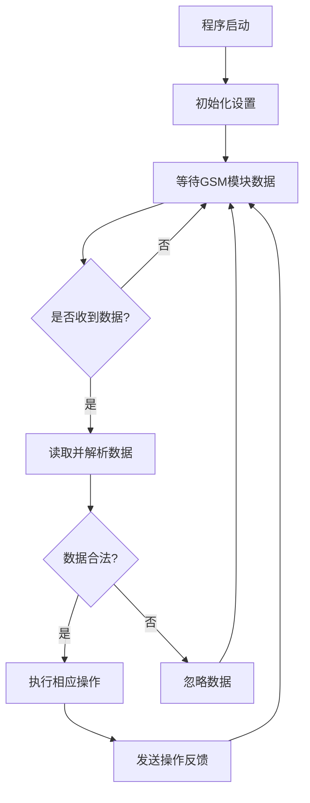

# 基于单片机GSM短信插座的设计与实现

## 1. 背景介绍

### 1.1 物联网时代的来临

随着物联网技术的不断发展,智能家居系统正在成为现代生活中不可或缺的一部分。传统的家用电器控制方式已经无法满足人们日益增长的需求,因此开发出一种便捷、高效的智能控制系统就显得尤为重要。

### 1.2 GSM短信控制的优势

GSM(全球移动通信系统)短信控制是一种基于移动通信网络的远程控制技术。利用手机发送特定指令到GSM模块,GSM模块接收并解析指令后控制相连的硬件设备。这种控制方式具有以下优势:

- 覆盖范围广,只要有移动网络信号就可以进行远程控制
- 操作简单便捷,无需安装APP或特殊软件
- 成本低廉,GSM模块价格实惠,短信资费低廉

### 1.3 单片机在物联网中的应用

单片机是一种高度集成的微型计算机芯片,具有体积小、功耗低、价格便宜等特点。将单片机与GSM模块相结合,可以构建出功能强大且成本低廉的物联网控制系统。

## 2. 核心概念与联系

### 2.1 系统硬件组成

本系统由以下几个硬件部分组成:

- 单片机: 用于接收GSM模块传来的指令并控制插座开关
- GSM模块: 用于接收手机发送的短信指令并与单片机通信
- 继电器: 用于接收单片机的控制信号,实现插座的实际开关操作
- 电源模块: 为整个系统提供稳定的电源

### 2.2 系统软件设计

软件设计包括以下几个部分:

- 单片机程序: 实现指令解析、继电器控制等核心功能
- GSM模块AT指令集: 用于与GSM模块进行通信和指令交互
- 短信指令设计: 设计合理的短信指令格式,方便用户使用

### 2.3 工作原理

系统的工作原理如下:

1. 用户通过手机发送特定格式的短信指令到GSM模块的SIM卡号码
2. GSM模块接收到短信后,通过串口与单片机进行通信,将指令内容发送给单片机
3. 单片机接收并解析指令,根据指令内容控制继电器开关状态
4. 继电器对插座电路进行开关操作,从而实现对插座的远程控制

## 3. 核心算法原理具体操作步骤  

### 3.1 单片机程序流程

单片机程序的核心流程如下:



### 3.2 指令解析算法

指令解析算法的主要步骤包括:

1. 判断指令是否为预设格式,如"开1#"、"关1#"等
2. 提取指令中的设备号和操作码
3. 根据设备号和操作码执行相应的硬件控制操作

### 3.3 硬件控制算法

控制继电器开关的算法步骤:

1. 根据指令解析的结果,确定要打开或关闭的继电器
2. 设置单片机的相应IO口电平,对继电器线圈通断电
3. 继电器线圈通电时,控制端接通,插座通电;反之断开

## 4. 数学模型和公式详细讲解举例说明

在本系统中,我们需要对GSM模块发来的数据进行校验,确保数据的完整性和正确性。常用的校验算法有奇偶校验、循环冗余校验(CRC)等。

这里我们使用简单的异或校验,公式如下:

$$checksum = data[0] \oplus data[1] \oplus ... \oplus data[n]$$

其中$data[i]$表示数据流中的第i个字节, $\oplus$为异或运算符。

发送端计算出$checksum$,将其附加在数据流的最后发送。接收端重新计算一次$checksum$,将计算结果与收到的$checksum$进行比对,如果相同则说明数据无错误,否则丢弃该数据包。

以数据流"5A A5 12 34 67"为例,计算过程为:

```
checksum = 0x5A ^ 0xA5 ^ 0x12 ^ 0x34 ^ 0x67
          = 0101 1010 ^ 1010 0101 ^ 0001 0010 ^ 0011 0100 ^ 0110 0111
          = 0010 1001
          = 0x29
```

因此,发送端需要发送的完整数据为"5A A5 12 34 67 29"。

## 4. 项目实践:代码实例和详细解释说明

### 4.1 硬件电路设计


上图为本系统的硬件电路连接示意图。其中:

- 单片机使用STC89C52RC单片机
- GSM模块使用SIM900A模块
- 继电器使用常闭式继电器SRD-05VDC-SL-C
- 电源模块使用DC 5V 1A电源适配器

### 4.2 单片机程序代码

```c
#include <reg52.h>
#include <stdio.h>
#include <string.h>

#define RELAY_ON 0x01  // 继电器打开指令
#define RELAY_OFF 0x00 // 继电器关闭指令

#define MAX_BUF 20     // 数据缓冲区大小

sfr AUXR = 0x8E;       // 辅助寄存器
bit busy;              // 标志位

char buf[MAX_BUF];     // 数据缓冲区
char cmd[5] = "AT\r\n";// AT命令
char *pbuf;

void Delay(unsigned int n)
{
    unsigned int x = 0;
    while (n--)
    {
        x = 12000;
        while (x--);
    }
}

// 发送一个字节数据到GSM模块
void SendByte(char dat)
{
    while (busy);
    busy = 1;
    SBUF = dat;
}

// 发送字符串
void SendStr(char *str)
{
    while (*str)
    {
        SendByte(*str++);
    }
}

// 初始化串口
void InitUart()
{
    TMOD = 0x20;
    PCON = 0x00;
    AUXR = 0x15;
    TH1 = 0xFD;
    TL1 = 0xFD;
    TR1 = 1;
    ES = 1;
    EA = 1;
    SendStr(cmd); // 发送AT命令
}

// 控制继电器状态
void SetRelay(bit status)
{
    P2 = (P2 & 0xFE) | status;
}

// 解析并执行指令
void ExecCmd(char *cmd)
{
    if (strstr(cmd, "open") != NULL)
    {
        SetRelay(RELAY_ON);
    }
    else if (strstr(cmd, "close") != NULL)
    {
        SetRelay(RELAY_OFF);
    }
}

// 串口中断服务程序
void UartInt() interrupt 4
{
    static char i = 0;
    char dat = SBUF;
    RI = 0;
    if (dat != '\r')
    {
        buf[i++] = dat;
        if (i >= MAX_BUF)
            i = 0;
    }
    else
    {
        buf[i] = 0;
        ExecCmd(buf);
        i = 0;
    }
    busy = 0;
}

void main()
{
    InitUart();
    while (1)
    {
        // 主循环
    }
}
```

上面是单片机程序的主要代码,其中:

- `InitUart()`函数用于初始化串口,并向GSM模块发送AT命令进行通信
- `SendByte()`和`SendStr()`函数用于发送单个字节和字符串数据
- `SetRelay()`函数用于控制继电器的开关状态
- `ExecCmd()`函数解析接收到的指令,并执行相应的操作
- `UartInt()`为串口中断服务程序,接收GSM模块发来的数据并存入缓冲区,接收完整指令后调用`ExecCmd()`执行操作

### 4.3 GSM模块AT指令

GSM模块使用AT指令集与单片机或其他设备进行通信,下面是一些常用的AT指令及其功能:

- AT: 检查GSM模块是否在线
- AT+CMGF: 设置短信格式,0为PDU模式,1为文本模式
- AT+CNMI: 设置新消息提示方式
- AT+CMGR: 读取指定索引的短信
- AT+CMGS: 发送短信
- AT+CMGD: 删除指定索引的短信

## 5. 实际应用场景

基于GSM短信的远程控制技术有着广泛的应用前景,例如:

### 5.1 智能家居控制

通过手机短信,可以远程控制家中的电器设备、空调、电视等,实现智能化家居管理。

### 5.2 农业物联网

利用GSM模块和传感器,可以实时监测农田的环境数据,并通过短信控制农业设备的运行,提高农业自动化水平。

### 5.3 工业控制

在工厂车间,可以通过手机短信远程控制生产线的启动、停止等,提高生产效率和安全性。

### 5.4 安防监控

将GSM模块与监控摄像头等设备相连,可以在发生警情时及时收到短信报警,并远程控制相关设备,提高安防系统的灵活性。

## 6. 工具和资源推荐

在开发基于GSM短信控制系统时,可以使用以下工具和资源:

### 6.1 硬件工具

- 单片机开发板: 如STC89C52RC最小系统板
- GSM模块: 如SIM900A模块
- 继电器模块
- 电源适配器

### 6.2 软件工具

- Keil C51集成开发环境: 用于编写和调试单片机程序
- 串口调试助手: 如SSCOM、串口精灵等,用于模拟GSM模块通信

### 6.3 在线资源

- STC单片机官方资料: http://www.stcmcu.com
- SIM900A GSM模块资料: https://m.eet-china.com/mp/a49115.html
- 51单片机教程: https://www.51hei.com

## 7. 总结:未来发展趋势与挑战

### 7.1 发展趋势

GSM短信控制技术将继续在智能家居、工业自动化等领域得到广泛应用。未来,GSM模块将向更小型化、低功耗、多功能集成的方向发展。

同时,新兴的物联网通信技术如NB-IoT、5G等也将为远程控制系统带来新的发展机遇。

### 7.2 挑战

虽然GSM短信控制具有简单、低成本的优点,但也存在一些挑战:

- 安全性: 短信控制缺乏有效的身份验证和加密机制,存在被窃取或拦截的风险。
-实时性: 短信传输存在一定延时,不适用于对实时性要求较高的场景。
- 扩展性: 指令格式和控制能力有限,难以满足大规模复杂系统的需求。

因此,在继续使用GSM短信控制的同时,也需要开发出更加安全、高效、智能化的控制方案,以适应未来物联网的发展需求。

## 8. 附录:常见问题与解答  

### 8.1 GSM模块无法工作?

- 检查GSM模块是否正确供电
- 检查GSM模块是否正确插入SIM卡
- 检查GSM模块与单片机的连线是否正确
- 尝试发送AT指令,查看GSM模块是否响应

### 8.2 指令无法执行?

- 检查指令格式是否正确
- 检查单片机程序的指令解析部分是否存在问题
- 检查继电器及其连线是否正常

### 8.3 控制范围受限?

GSM网络的覆盖范围决定了控制系统的使用范围。如果在无网络信号的区域,可以考虑使用其他物联网通信技术,如LoRa、NB-IoT等。

### 8.4 延时较