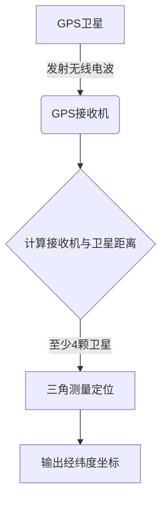
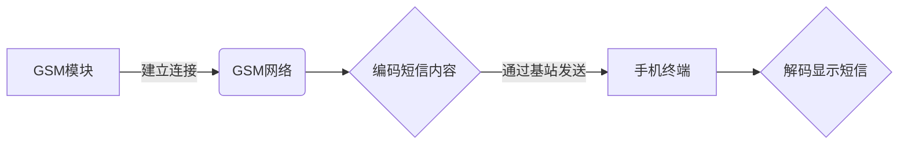
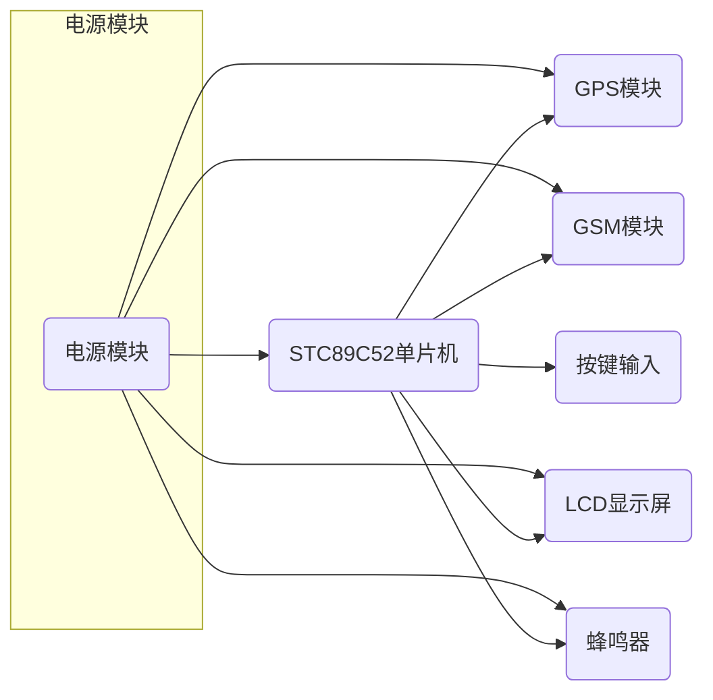

以下是关于"基于单片机汽车防丢器GPS定位GSM短信的设计与实现"的技术博客文章正文内容:

## 1.背景介绍

### 1.1 汽车防盗系统的重要性

随着社会的发展和生活水平的提高,私家车已经成为了大多数家庭的代步工具。然而,汽车盗窃案件也逐年增多,给车主带来了巨大的经济损失和精神创伤。因此,开发一种高效、实用的汽车防盗系统就显得尤为重要。

### 1.2 传统汽车防盗系统的不足

传统的汽车防盗系统大多采用遥控器对汽车进行加锁和解锁,存在以下几个问题:

1. 遥控信号可能受到干扰或遮蔽,使得操作失效
2. 防盗报警仅限于声光警报,无法将汽车位置信息告知车主
3. 无法远程控制和监控汽车状态

### 1.3 基于GPS/GSM的汽车防盗系统优势

基于GPS/GSM的汽车防盗系统能够有效解决上述问题,它具有以下优势:

1. GPS能够精确定位汽车位置
2. GSM短信模块能够将位置信息发送至车主手机
3. 可远程控制汽车启动、熄火等功能
4. 可设置防盗区域,车辆移出区域将自动报警

## 2.核心概念与联系

### 2.1 GPS定位原理

GPS(Global Positioning System)是由24颗卫星组成的全球卫星导航系统。通过测量接收机与至少4颗卫星之间的距离,利用三角测量原理即可精确计算出接收机的三维坐标(经度、纬度、高度)。

GPS定位系统工作流程如下所示:



### 2.2 GSM短信通信

GSM(Global System for Mobile Communications)是一种数字移动通信系统,可以实现语音、短消息和数据传输等功能。汽车防盗器利用GSM模块发送短信,可将GPS获取的位置坐标发送至车主手机,实现位置追踪。

GSM短信通信过程如下:



### 2.3 单片机控制系统

整个汽车防盗系统由单片机作为控制核心,负责GPS模块、GSM模块以及其他外围电路的协调工作,根据预设的防盗逻辑进行判断和处理,发出相应的指令。

## 3.核心算法原理具体操作步骤 

### 3.1 GPS模块工作原理

GPS模块通过解码从GPS卫星接收到的无线电导航数据,计算出接收机与每颗卫星之间的距离,利用三角测量原理确定接收机的三维坐标。具体步骤如下:

1. 捕获GPS卫星发出的导航电文
2. 解调和解码导航电文,提取卫星发射时刻和轨道数据
3. 计算接收机与卫星之间的距离
4. 利用至少4颗卫星的距离数据,进行三角测量定位
5. 将计算得到的经纬度坐标输出

算法伪代码:

```python
def gps_location():
    # 捕获GPS卫星导航电文
    nav_data = receive_gps_signal()
    
    # 解码导航电文,获取卫星发射时间和轨道数据
    sat_time, sat_orbit = decode_nav_data(nav_data)
    
    # 计算接收机与每颗卫星的距离
    distances = []
    for sat in satellites:
        dist = calculate_distance(sat_time, sat_orbit)
        distances.append(dist)
    
    # 三角测量定位
    lat, lon = trilateration(distances)
    
    return lat, lon
```

### 3.2 GSM短信发送算法

GSM模块发送短信的核心算法步骤如下:

1. 配置GSM模块,设置APN、用户名密码等参数
2. 建立与GSM网络的连接
3. 编码短信内容
4. 通过GSM基站发送短信
5. 等待发送状态,判断是否发送成功

算法伪代码:

```python
def send_sms(phone_num, message):
    # 配置GSM模块参数
    config_gsm_module()
    
    # 连接GSM网络
    connect_gsm_network()
    
    # 编码短信内容
    encoded_msg = encode_sms(message)
    
    # 发送短信
    send_status = send_sms_data(phone_num, encoded_msg)
    
    # 检查发送状态
    if send_status == SUCCESS:
        print("短信发送成功")
    else:
        print("短信发送失败")
```

### 3.3 防盗报警算法

防盗报警算法是整个系统的核心,它集成了GPS定位和GSM短信发送功能,根据预设的防盗策略作出相应的处理。算法流程如下:

1. 设置防盗区域范围
2. 获取当前GPS坐标
3. 判断是否移出防盗区域
4. 若移出区域,发送报警短信
5. 等待用户指令,执行相应操作(回复解锁、启动发动机等)

算法伪代码:

```python
# 设置防盗区域范围
theft_radius = 500 # 米
center_lat, center_lon = 34.123, 108.456 # 中心坐标

while True:
    # 获取当前GPS坐标
    cur_lat, cur_lon = gps_location()
    
    # 判断是否移出防盗区域
    dist = distance(cur_lat, cur_lon, center_lat, center_lon)
    if dist > theft_radius:
        # 发送报警短信
        message = f"警报!汽车已移出设定区域,当前坐标:{cur_lat},{cur_lon}"
        send_sms(owner_phone, message)
        
        # 等待用户指令
        command = receive_user_sms()
        if command == "unlock":
            unlock_car()
        elif command == "engine_start":
            start_engine()
        # 处理其他指令...
```

通过以上三个核心算法,汽车防盗系统可以实现自动防盗报警、GPS定位跟踪以及远程控制等功能。

## 4.数学模型和公式详细讲解举例说明

### 4.1 三角测量定位原理

GPS定位的核心是利用三角测量原理,通过测量接收机与至少4颗卫星之间的距离,就可以计算出接收机的三维坐标。

三角测量定位模型可以用以下方程组表示:

$$
\begin{aligned}
(x-x_1)^2 + (y-y_1)^2 + (z-z_1)^2 &= d_1^2\\
(x-x_2)^2 + (y-y_2)^2 + (z-z_2)^2 &= d_2^2\\
(x-x_3)^2 + (y-y_3)^2 + (z-z_3)^2 &= d_3^2\\
(x-x_4)^2 + (y-y_4)^2 + (z-z_4)^2 &= d_4^2\\
\end{aligned}
$$

其中$(x,y,z)$为待求接收机坐标,$(x_i,y_i,z_i)$为第i颗卫星的已知坐标,而$d_i$为接收机与第i颗卫星之间的距离。

对于二维平面定位问题,只需考虑x和y坐标,方程组可以简化为:

$$
\begin{aligned}
(x-x_1)^2 + (y-y_1)^2 &= d_1^2\\
(x-x_2)^2 + (y-y_2)^2 &= d_2^2\\
(x-x_3)^2 + (y-y_3)^2 &= d_3^2\\
(x-x_4)^2 + (y-y_4)^2 &= d_4^2\\
\end{aligned}
$$

通过求解上述方程组,即可得到接收机的平面坐标$(x,y)$。

### 4.2 距离计算公式

要计算接收机与卫星之间的距离$d_i$,需要利用卫星发射时刻$t_s$以及卫星轨道数据,并考虑信号传播时间$\Delta t$:

$$d_i = c \times \Delta t = c \times (t_r - t_s)$$

其中$c$为光速,约为$3 \times 10^8 m/s$,而$t_r$为接收机接收信号的时刻。

### 4.3 举例说明

假设接收机接收到4颗GPS卫星的导航数据,其中:

- 卫星1坐标$(1000,2000,20000)$,信号发射时刻$t_1 = 10:00:00$,接收时刻$t_r1 = 10:00:00.07$
- 卫星2坐标$(-2000,3000,18000)$,信号发射时刻$t_2 = 10:00:01$,接收时刻$t_r2 = 10:00:00.065$
- 卫星3坐标$(4000,-1000,17000)$,信号发射时刻$t_3 = 10:00:00.5$,接收时刻$t_r3 = 10:00:00.08$  
- 卫星4坐标$(-3000,-4000,22000)$,信号发射时刻$t_4 = 10:00:00.2$,接收时刻$t_r4 = 10:00:00.075$

利用公式$d_i = c \times (t_r - t_s)$计算出各个距离:

$$
\begin{aligned}
d_1 &= 3\times 10^8 \times (10:00:00.07 - 10:00:00) = 21000\text{m}\\
d_2 &= 3\times 10^8 \times (10:00:00.065 - 10:00:01) = 19500\text{m}\\
d_3 &= 3\times 10^8 \times (10:00:00.08 - 10:00:00.5) = 24000\text{m}\\
d_4 &= 3\times 10^8 \times (10:00:00.075 - 10:00:00.2) = 22500\text{m}\\
\end{aligned}
$$

将这些距离值代入三角测量方程组,并求解即可得到接收机的三维坐标。

## 5.项目实践:代码实例和详细解释说明

### 5.1 硬件部分

本项目采用的主控芯片为STC89C52单片机,外围电路包括GPS模块、GSM模块、LCD显示屏、蜂鸣器等。硬件电路原理图如下:



其中STC89C52单片机作为系统控制核心,通过串口与GPS模块和GSM模块进行通信,根据输入的按键指令控制LCD显示和蜂鸣器报警。

### 5.2 软件部分

#### 5.2.1 GPS模块驱动

```c
#include <reg52.h>
#include <stdio.h>
#include <string.h>

#define GPS_BUF_SIZE 100

// GPS模块数据缓冲区
static char gps_buf[GPS_BUF_SIZE];
static int buf_ptr = 0;

// GPS NMEA数据解析,获取经纬度
void parse_gps_data(char *nmea_data, float *lat, float *lon) {
    char *ptr = strstr(nmea_data, ",");
    if (ptr != NULL) {
        *lat = atof(ptr+1);
        ptr = strstr(ptr+1, ",");
        if (ptr != NULL) {
            *lon = atof(ptr+1);
        }
    }
}

// GPS模块串口中断服务函数
void gps_uart_isr() interrupt 4 {
    if (RI) {
        RI = 0;
        gps_buf[buf_ptr++] = SBUF;
        if (buf_ptr >= GPS_BUF_SIZE) {
            buf_ptr = 0;
        }
        if (strstr(gps_buf, "\r\n") != NULL) {
            parse_gps_data(gps_buf, &latitude, &longitude);
            buf_ptr = 0;
        }
    }
}
```

该代码实现了GPS模块的