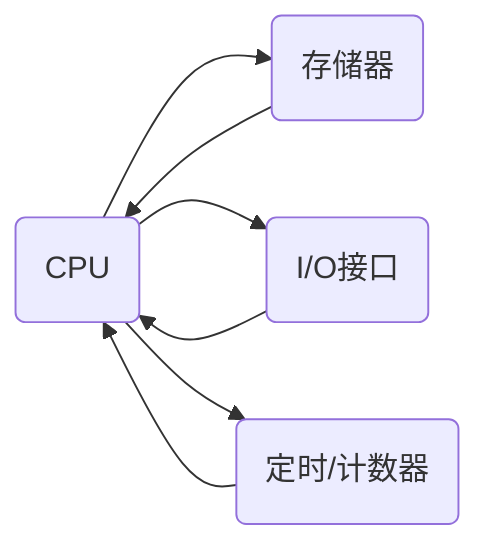
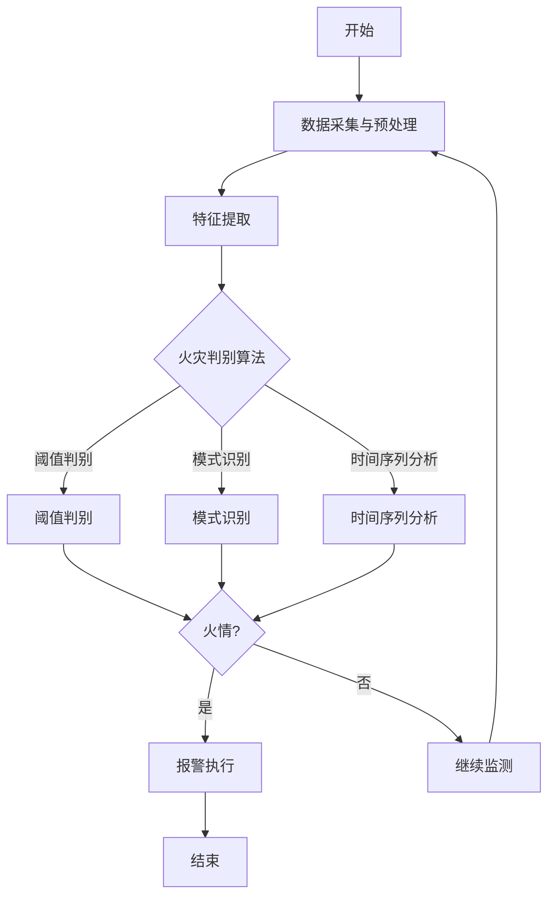

# 基于单片机火灾报警设计的设计与实现

## 1. 背景介绍

### 1.1 火灾危害

火灾一直是威胁人类生命和财产安全的重大隐患。据统计,每年全球因火灾造成的经济损失高达数百亿美元,同时也夺去了无数宝贵的生命。火灾的发生通常是由多种复杂因素引起的,如电路短路、油烟燃烧、火源管控不当等,给居住区、工厂、仓库等场所带来巨大的风险。因此,构建一个高效、可靠的火灾预警系统对于保障人民生命财产安全至关重要。

### 1.2 传统火灾报警系统局限性

传统的火灾报警系统主要依赖于烟雾探测器、温度探测器等被动式传感器。这些传感器需要等到火情已经发生并产生足够的烟雾或高温时才能被触发,响应滞后且可靠性较低。此外,大型场所需要布置大量探测器,成本高、维护困难。因此,开发一种主动式、智能化的火灾预警系统,能够实时监测环境变化,提前发现火灾隐患,发出及时预警,是当前防火领域的迫切需求。

### 1.3 单片机在火灾预警中的应用前景

单片机是一种高度集成的微型计算机,具有体积小、功耗低、成本低、可编程性强等优点。将单片机技术与各种传感器相结合,可以构建出智能化的火灾预警系统。单片机能够实时获取环境数据,并通过编程的算法对数据进行分析判断,一旦发现异常情况即可触发报警。与传统被动式报警系统相比,基于单片机的主动式预警系统具有响应快速、可靠性高、可扩展性强等优势,是未来火灾预警的发展方向。

## 2. 核心概念与联系

### 2.1 单片机工作原理

单片机(Single Chip Microcomputer)是将微处理器的运算和控制单元、存储程序以及数据的存储器、计数器、定时器、并行口、串行口等周边电路集成在一个芯片上而构成的微型计算机系统。它由中央处理器CPU、存储器、输入/输出接口、定时/计数器等部分组成。

单片机通过执行存储在存储器中的程序,控制外围设备的工作,完成特定的功能。它的工作过程包括:

1. 复位初始化
2. 从存储器取指令
3. 执行指令
4. 根据指令进行运算或数据传输
5. 将运算结果存储或输出
6. 重复以上步骤

### 2.2 单片机与传感器的集成

火灾预警系统需要实时监测环境中的烟雾、温度、气体等多种参数。通过将各种传感器与单片机相连,单片机就能够获取这些环境数据。常用的传感器包括:

- 烟雾传感器: 利用光电原理检测空气中烟雾粒子的浓度
- 温度传感器: 测量环境温度,如热电阻、热电偶等
- 气体传感器: 检测一氧化碳、可燃气体等有害气体的浓度
- 火焰传感器: 探测环境中是否存在火焰

单片机通过模数转换电路,将这些模拟量转换为数字量,再由程序对数据进行处理、分析、判断,从而实现对火灾危险的智能预警。

### 2.3 单片机与报警执行器的连接

一旦单片机检测到异常情况,如烟雾浓度过高、温度异常等,就需要触发报警执行器,发出声光报警信号。常见的报警执行器有:

- 蜂鸣器: 发出声音报警
- 警灯: 闪烁警示灯光报警  
- 通讯模块: 发送短信、调用云端服务发出报警信息

单片机通过控制相应的I/O口,驱动这些报警执行器工作,从而实现火情报警功能。

## 3. 核心算法原理及具体操作步骤

### 3.1 数据采集与预处理

首先需要从各个传感器采集环境数据,并对这些数据进行预处理,如去除噪声、数据缩放等,以获得可靠的输入数据。对于模拟量,需要通过A/D转换将其转换为数字量,以便单片机处理。

### 3.2 特征提取

从预处理后的数据中提取出能够反映火灾危险状态的特征,如烟雾浓度、温度变化率、气体浓度等。这些特征将作为后续火灾判别算法的输入。

### 3.3 火灾判别算法

#### 3.3.1 基于阈值判别

最简单的火灾判别方法是基于阈值判别。设定合理的阈值,如果某个特征值超过对应的阈值,则判定为火灾危险。例如,可以设定烟雾浓度阈值为100mg/m³,温度阈值为60°C。如果检测到烟雾浓度或温度超过这些阈值,则判定为火情,触发报警。

$$
\begin{cases}
\text{smoke} > \text{smoke}_\text{threshold} \\
\text{temp} > \text{temp}_\text{threshold}
\end{cases}
\Rightarrow \text{Fire Alarm}
$$

其中,smoke表示测量的烟雾浓度值,temp表示测量的温度值。

#### 3.3.2 基于模式识别

除了简单的阈值判别,还可以使用更加复杂的模式识别算法,如决策树、支持向量机、神经网络等,对多个特征综合判别。这些算法需要对大量历史数据进行训练,学习出特征与火灾之间的映射模型,从而提高火情判别的准确性。

以决策树算法为例,基本步骤如下:

1. 收集大量带标签的训练数据,包括正常情况和火灾情况的特征数据
2. 使用决策树算法(如ID3、C4.5)对训练数据进行建树
3. 将测试数据输入已建立的决策树模型,得到判别结果

#### 3.3.3 基于时间序列分析

除了对静态特征进行判别,还可以对特征的时间序列变化趋势进行分析。比如,温度和烟雾浓度在短时间内急剧上升,就有可能是火情的征兆。可以使用时间序列分析算法,如ARIMA模型、卡尔曼滤波等,对特征序列进行建模和预测,从而提前发现异常情况。

### 3.4 报警执行

一旦判别出火情,就需要触发相应的报警执行器,如声光报警、短信报警等,以实现快速报警。同时,可以将报警信息上传至云端平台,以便远程监控和二次处理。

### 3.5 算法流程图

该流程图描述了基于单片机的火灾预警系统的核心算法逻辑。首先从传感器获取环境数据,并进行预处理;然后提取出特征量;接着使用阈值判别、模式识别或时间序列分析等算法对特征进行分析,判断是否存在火情;一旦检测到火情,就触发报警执行器,发出报警信号;否则继续循环监测。

## 4. 数学模型和公式详细讲解举例说明

### 4.1 阈值判别模型

阈值判别是最简单的火情判别模型,它将每个特征与预设的阈值进行比较,若超过阈值则判定为火情。设有n个特征,用$x_i$表示第i个特征的值,用$t_i$表示对应的阈值,则阈值判别模型可表示为:

$$
y = \begin{cases}
1 & \text{if } \exists i, x_i > t_i\\
0 & \text{otherwise}
\end{cases}
$$

其中,y=1表示判定为火情,y=0表示正常情况。

例如,假设我们有两个特征:烟雾浓度$x_1$和温度$x_2$,它们的阈值分别设为$t_1=100\text{mg/m}^3$和$t_2=60^\circ\text{C}$。当测量到烟雾浓度大于100mg/m³或温度高于60°C时,系统就会判定为火情并触发报警。

虽然阈值模型简单直观,但也存在一些缺陷:
1. 阈值设置依赖经验,可能不够准确
2. 无法处理特征之间的相关性和组合情况
3. 对异常值sensitive较高,可能导致误报

因此,在实际应用中,我们还需要结合其他模型,以提高火情判别的准确性和鲁棒性。

### 4.2 支持向量机模式识别模型

支持向量机(Support Vector Machine, SVM)是一种常用的监督学习模型,可以用于火情的模式识别。SVM的基本思想是在特征空间中构造一个超平面,将不同类别的样本分开,同时使得离超平面最近的样本点的距离(即间隔)最大。

对于线性可分的二分类问题,SVM模型可表示为:

$$
\begin{align}
&\max\limits_{\mathbf{w},b} &&\frac{1}{\|\mathbf{w}\|}\\ 
&\text{s.t.} &&y_i(\mathbf{w}^T\mathbf{x}_i+b)\geq 1,\quad i=1,\ldots,n
\end{align}
$$

其中,$\mathbf{x}_i$是第i个样本,$y_i\in\{-1,1\}$是其类别标记,$\mathbf{w}$和$b$是待求的超平面参数。约束条件要求每个样本都被正确分类,且离超平面的距离不小于$\frac{1}{\|\mathbf{w}\|}$。

对于非线性问题,可以先将样本映射到高维空间,使其线性可分,然后再应用线性SVM。通过核技巧,我们无需显式计算高维映射,而是在原始空间上通过定义合适的核函数来等价地计算内积。常用的核函数有线性核、多项式核、高斯核等。

以高斯核为例:

$$
k(\mathbf{x}_i,\mathbf{x}_j)=\exp(-\gamma\|\mathbf{x}_i-\mathbf{x}_j\|^2),\quad\gamma>0
$$

在火情模式识别中,我们可以将各种特征(如温度、烟雾浓度等)作为SVM的输入,对火情和非火情两类样本进行训练,得到分类模型。在测试阶段,将新的特征向量输入该模型,即可判断其是否属于火情。

SVM模型的优点是泛化能力强,可以有效避免过拟合,尤其适合于高维小样本的分类问题。但训练时间复杂度较高,对大规模数据集可能较为低效。

### 4.3 ARIMA时间序列分析模型

时间序列分析是研究事物随时间变化规律的一种数学工具。在火情监测中,我们关注的不仅是单个时刻的特征值,还包括其变化趋势。ARIMA (Auto-Regressive Integrated Moving Average)模型是一种常用的时间序列分析和预测方法。

ARIMA(p,d,q)模型由三部分组成:

- AR(p):自回归(Auto-Regressive)模型,反映了序列当前值与过去p个值之间的线性关系
- I(d):差分(Integrated)次数,用于消除序列的非平稳性
- MA(q):移动平均(Moving Average)模型,反映了当前值与过去q个残差之间的关系

ARIMA模型的基本形式为:

$$
\begin{align}
(1-\sum\limits_{i=1}^p\phi_iB^i)(1-B)^dy_t &= (1+\sum\limits_{i=1}^q\theta_iB^i)\varep