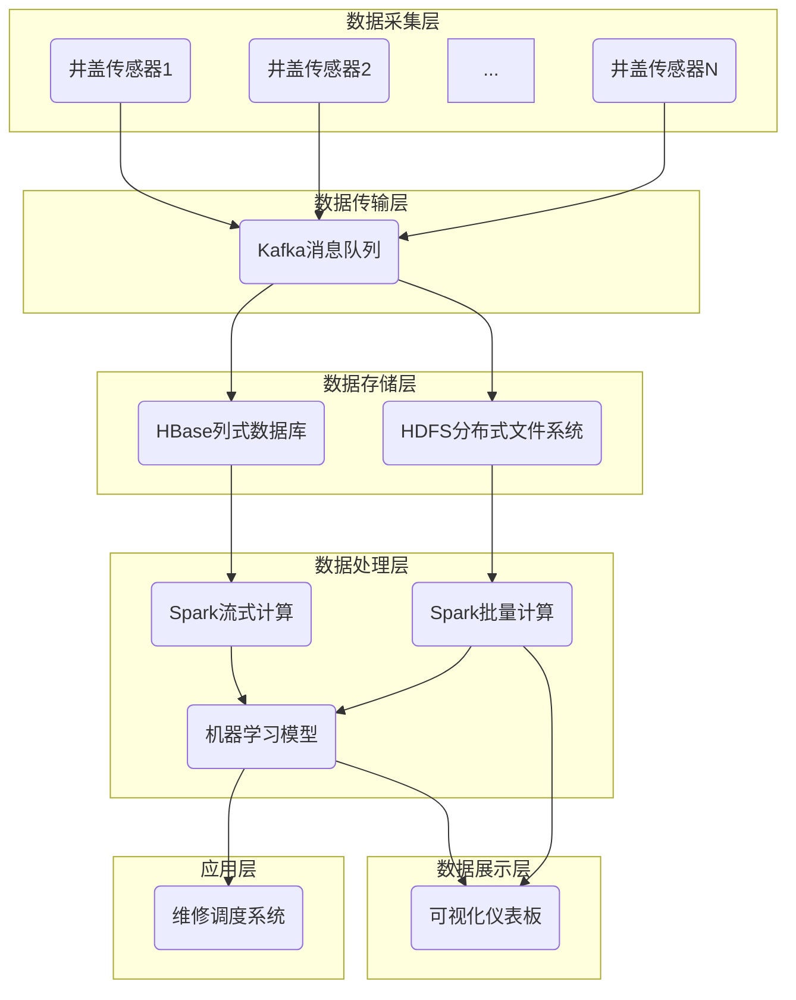

# 基于大数据的井盖监控系统的设计与开发

## 1. 背景介绍

### 1.1 城市井盖问题的现状

城市井盖是城市基础设施的重要组成部分,但由于各种原因,如车辆碾压、环境腐蚀等,井盖经常出现位移、破损等问题。这不仅影响城市道路的通行,也可能给行人和车辆带来安全隐患。传统的人工巡查和维修方式效率低下,无法及时发现和解决问题。

### 1.2 大数据在城市管理中的应用

随着物联网、云计算等技术的发展,大数据在城市管理中的应用越来越广泛。通过部署各种传感器,可以实时收集城市运行的海量数据,并利用大数据分析技术对这些数据进行处理和分析,从而发现问题、优化管理、提高效率。

### 1.3 基于大数据的井盖监控系统的必要性

基于以上背景,设计并开发一套基于大数据的井盖监控系统,可以有效解决传统管理方式的弊端。该系统通过物联网技术采集井盖数据,利用大数据分析技术对数据进行处理和分析,及时发现问题井盖,并提供高效的维修调度,从而提高城市基础设施的运营效率和安全性。

## 2. 核心概念与联系

### 2.1 物联网(IoT)

物联网是一种将各种信息传感设备与互联网相连接,以实现智能化识别、定位、跟踪、监控和管理的网络。在井盖监控系统中,物联网技术用于采集井盖的位置、倾斜角度、压力等数据。

### 2.2 大数据(Big Data)

大数据指无法在合理时间内用常规软件工具进行捕获、管理和处理的海量、高增长率和多样化的信息资产。在井盖监控系统中,需要处理来自成千上万个传感器的实时数据流,因此需要大数据技术进行存储、处理和分析。

### 2.3 云计算

云计算是一种通过互联网以服务的方式提供动态可伸缩的虚拟化资源的计算模式。在井盖监控系统中,可以利用云计算的弹性扩展能力,根据需求动态调配计算、存储和网络资源,实现高效、可靠的数据处理和存储。

### 2.4 数据挖掘和机器学习

数据挖掘是从大量数据中自动分析获得有价值模式的过程,而机器学习则是一种通过计算来模拟和实现人类学习行为的方法。在井盖监控系统中,可以利用数据挖掘和机器学习算法,从海量数据中发现异常模式,及时预警并进行维修调度。

## 3. 核心算法原理具体操作步骤

### 3.1 数据采集

利用物联网技术,在井盖上安装各种传感器,如GPS定位、倾斜传感器、压力传感器等,实时采集井盖的位置、倾斜角度、承受压力等数据,并通过无线网络传输到数据中心。

### 3.2 数据预处理

由于现实环境的复杂性,采集到的原始数据可能存在噪声、缺失、异常等问题。因此需要对数据进行清洗、规范化、去重等预处理操作,以确保数据的准确性和完整性。

### 3.3 数据存储

预处理后的数据需要存储在分布式文件系统(如HDFS)或NoSQL数据库(如HBase)中,以满足大数据场景下的高吞吐量、高并发和可扩展性要求。

### 3.4 数据分析

#### 3.4.1 实时数据分析

利用流式计算框架(如Apache Spark Streaming、Apache Flink),对实时传入的井盖数据进行实时分析,及时发现异常情况(如位移、倾斜等),并触发预警。

#### 3.4.2 批量数据分析

利用大数据计算框架(如Apache Spark、Apache Hadoop),对历史数据进行离线批量分析,发现潜在的模式和趋势,如某些区域井盖损坏率较高、某种材质井盖寿命较短等,为维修决策提供依据。

### 3.5 机器学习建模

基于历史数据,利用机器学习算法(如决策树、随机森林等),构建预测模型,对未来井盖的状态进行预测,从而实现预防性维护。

### 3.6 可视化展示

将分析结果通过图表、仪表板等形式直观展示,方便管理人员掌握全局情况,制定维修计划。

### 3.7 维修调度

根据分析结果和预测模型,合理安排维修工单,优化维修路线,提高维修效率。

## 4. 数学模型和公式详细讲解举例说明

在井盖监控系统中,可以应用多种数学模型和算法,下面对其中几种进行详细介绍。

### 4.1 聚类算法

聚类是一种无监督学习算法,其目标是将相似的对象划分到同一个簇中。在井盖监控场景下,可以利用聚类算法发现异常井盖簇,例如位移过大的井盖簇、压力异常的井盖簇等。

常用的聚类算法有K-Means、DBSCAN等。以K-Means为例,算法步骤如下:

1) 随机选取K个初始质心 $\mu_1, \mu_2, \ldots, \mu_K$
2) 对每个数据点 $x_i$,计算其与各质心的欧氏距离 $d(x_i, \mu_j)$,将其分配到距离最近的簇 $c_j$
3) 重新计算每个簇的质心 $\mu_j = \frac{1}{|c_j|} \sum_{x \in c_j} x$
4) 重复步骤2)和3),直至质心不再发生变化

目标函数:

$$\min \sum_{j=1}^K \sum_{x \in c_j} \lVert x - \mu_j \rVert^2$$

其中 $\lVert x - \mu_j \rVert^2$ 表示数据点 $x$ 与质心 $\mu_j$ 的欧氏距离。

### 4.2 异常检测算法

异常检测是发现数据集中罕见实例或事件的过程。在井盖监控中,可以检测出异常位移、倾斜、压力等情况。

一种常用的异常检测方法是基于密度的方法,如基于核密度估计(Kernel Density Estimation)的异常检测算法。其基本思路是:对于给定的数据点 $x$,估计其概率密度 $p(x)$,如果 $p(x)$ 值较小,则将其判定为异常点。

核密度估计公式:

$$\hat{p}(x) = \frac{1}{nh} \sum_{i=1}^n K\left(\frac{x - x_i}{h}\right)$$

其中 $K(\cdot)$ 是核函数(如高斯核),满足 $\int K(x)dx = 1$;$h$ 是带宽参数,控制核函数的平滑程度。

通过设置合适的阈值,可以将低密度区域的点判定为异常点。

### 4.3 时间序列分析

井盖的位移、压力等数据呈现出一定的时间序列模式,可以利用时间序列分析方法对未来状态进行预测,从而实现预防性维护。

一种常用的时间序列分析方法是ARIMA(自回归移动平均)模型,适用于具有一定周期性的平稳时间序列数据。ARIMA模型由三部分组成:

- AR(AutoRegressive)自回归部分: $\phi_1y_{t-1} + \phi_2y_{t-2} + \ldots + \phi_py_{t-p}$
- I(Integrated)差分部分: 用于消除非平稳性
- MA(Moving Average)移动平均部分: $\theta_1\epsilon_{t-1} + \theta_2\epsilon_{t-2} + \ldots + \theta_q\epsilon_{t-q}$

其中 $\phi_i, \theta_j$ 是模型参数, $\epsilon_t$ 是白噪声项。

通过拟合历史数据,确定模型阶数 $(p, d, q)$ 和参数值,即可构建ARIMA模型,并用于未来值的预测。

## 5. 项目实践:代码实例和详细解释说明

### 5.1 系统架构

井盖监控系统的总体架构如下图所示:



该架构主要包括以下几个层次:

1. **数据采集层**: 通过物联网技术采集井盖传感器数据
2. **数据传输层**: 利用Kafka等消息队列实现数据的高效传输
3. **数据存储层**: 使用HDFS、HBase等大数据存储系统存储实时和历史数据
4. **数据处理层**: 利用Spark等大数据计算框架进行实时和离线分析,并训练机器学习模型
5. **数据展示层**: 通过可视化仪表板展示分析结果
6. **应用层**: 根据分析结果调度维修工单和路线

### 5.2 关键代码实现

以下是一些关键代码实现示例,使用Python语言,基于Apache Spark框架。

#### 5.2.1 Spark Streaming实时数据处理

```python
from pyspark.streaming import StreamingContext
from pyspark import SparkContext

# 创建SparkContext和StreamingContext
sc = SparkContext("local[2]", "ManholeCover")
ssc = StreamingContext(sc, 10)

# 从Kafka读取数据流
kafkaStream = KafkaUtils.createStream(ssc, 
                                      'localhost:2181', 
                                      'consumer-group', 
                                      {'manhole-data':1})

# 处理数据流
lines = kafkaStream.map(lambda x: x[1])

# 实时检测异常
anomalies = lines.filter(lambda line: is_anomaly(line))

# 输出异常数据
anomalies.pprint()

# 启动流计算
ssc.start()
ssc.awaitTermination()
```

该示例从Kafka读取实时井盖数据流,对数据进行处理(如异常检测),并输出检测到的异常数据。

其中 `is_anomaly` 函数可以利用前面介绍的异常检测算法(如基于密度的方法)实现。

#### 5.2.2 Spark批量数据分析

```python
from pyspark.sql import SparkSession

# 创建SparkSession
spark = SparkSession.builder \
                    .appName("ManholeCover") \
                    .getOrCreate()

# 读取HDFS上的历史数据
df = spark.read.parquet("hdfs://namenode/manhole/history")

# 数据预处理
cleanDF = preprocess(df)

# 构建聚类模型
kmModel = KMeans.train(cleanDF, 
                       numClusters=5, 
                       seed=12345)

# 对数据进行聚类
clusteredDF = kmModel.transform(cleanDF)

# 分析异常簇
anomalyClusters = clusteredDF.filter("prediction == 3 OR prediction == 4")

# 保存分析结果
anomalyClusters.write.parquet("hdfs://namenode/manhole/anomaly_clusters")
```

该示例从HDFS读取历史井盖数据,进行数据预处理,然后使用K-Means算法对数据进行聚类分析,发现异常簇并保存分析结果。

其中 `preprocess` 函数用于实现数据清洗、规范化等预处理操作。

#### 5.2.3 机器学习模型训练和预测

```python
from pyspark.ml import Pipeline
from pyspark.ml.feature import VectorAssembler
from pyspark.ml.regression import RandomForestRegressor

# 读取训练数据
trainDF = spark.read.parquet("hdfs://namenode/manhole/train