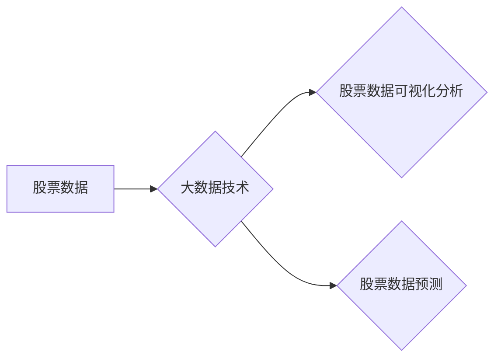

# 基于大数据背景下的股票数据可视化分析与预测

作者：禅与计算机程序设计艺术

## 1. 背景介绍

### 1.1 股票市场数据分析的意义

股票市场作为一个复杂的系统，其价格波动受到众多因素的影响，如宏观经济环境、行业发展、公司经营状况、投资者情绪等等。准确预测股票价格走势，对于投资者制定投资策略、规避风险、获取收益至关重要。

### 1.2 大数据时代的机遇与挑战

随着互联网和信息技术的快速发展，海量的股票市场数据得以积累，为基于大数据的股票分析提供了前所未有的机遇。然而，如何从海量数据中提取有价值的信息，并构建有效的预测模型，仍然面临着巨大的挑战。

### 1.3 本文研究内容概述

本文将探讨如何利用大数据技术，对股票数据进行可视化分析和预测。我们将介绍一些常用的数据分析方法、机器学习算法和可视化工具，并通过实际案例展示如何将这些技术应用于股票市场分析。

## 2. 核心概念与联系

### 2.1 股票数据

股票数据是指与股票相关的各种信息，包括：

* **基本面数据**:  公司财务报表、行业数据、宏观经济指标等
* **技术面数据**: 股票价格、成交量、技术指标等
* **市场情绪数据**:  新闻报道、社交媒体情绪、投资者调查等

### 2.2 大数据技术

大数据技术是指用于处理和分析海量数据的技术，包括：

* **数据采集**:  从各种来源收集数据，如数据库、API、网络爬虫等
* **数据存储**:  使用分布式文件系统或数据库存储海量数据
* **数据处理**:  对数据进行清洗、转换、聚合等操作
* **数据分析**:  使用统计分析、机器学习等方法分析数据
* **数据可视化**:  将分析结果以图表、图形等形式展示

### 2.3 股票数据可视化分析

股票数据可视化分析是指利用图表、图形等形式，将股票数据直观地展示出来，帮助投资者更好地理解数据、发现规律、制定决策。

### 2.4 股票数据预测

股票数据预测是指利用历史数据和相关因素，预测未来股票价格走势。

### 2.5 概念联系图



## 3. 核心算法原理具体操作步骤

### 3.1 数据预处理

#### 3.1.1 数据清洗

* 缺失值处理：使用均值、中位数或模型预测等方法填充缺失值
* 异常值处理：使用箱线图、散点图等方法识别和处理异常值

#### 3.1.2 数据转换

* 标准化：将数据转换为均值为0，标准差为1的分布
* 归一化：将数据缩放到[0, 1]区间

#### 3.1.3 特征工程

* 特征选择：选择与预测目标相关的特征
* 特征提取：从原始特征中提取新的特征

### 3.2 可视化分析方法

#### 3.2.1 时间序列分析

* 折线图：展示股票价格随时间的变化趋势
* K线图：展示股票价格的开盘价、收盘价、最高价、最低价
* 移动平均线：平滑价格波动，识别趋势

#### 3.2.2 统计分析

* 直方图：展示数据分布
* 散点图：展示变量之间的关系
* 箱线图：展示数据的统计特征

#### 3.2.3 网络分析

* 关联规则挖掘：发现股票价格之间的关联关系
* 社交网络分析：分析投资者情绪对股票价格的影响

### 3.3 预测算法

#### 3.3.1 传统统计模型

* ARIMA模型：适用于具有时间序列特征的数据
* GARCH模型：适用于具有波动性特征的数据

#### 3.3.2 机器学习模型

* 线性回归：建立线性关系预测股票价格
* 支持向量机：建立非线性关系预测股票价格
* 神经网络：模拟人脑神经元网络，进行深度学习预测

## 4. 数学模型和公式详细讲解举例说明

### 4.1 移动平均线

移动平均线 (MA) 是股票技术分析中常用的指标，用于平滑价格波动，识别趋势。其计算公式如下：

$$MA_t = \frac{P_t + P_{t-1} + ... + P_{t-n+1}}{n}$$

其中，$MA_t$ 表示时间 $t$ 的移动平均线值，$P_t$ 表示时间 $t$ 的股票价格，$n$ 表示移动平均线的周期。

**举例说明：**

假设某股票过去 5 天的收盘价分别为 10，11，12，13，14，则 5 日移动平均线值为：

$$MA_5 = \frac{10 + 11 + 12 + 13 + 14}{5} = 12$$

### 4.2 线性回归

线性回归是一种常用的机器学习算法，用于建立线性关系预测股票价格。其模型可以表示为：

$$y = \beta_0 + \beta_1 x_1 + ... + \beta_n x_n + \epsilon$$

其中，$y$ 表示股票价格，$x_1, ..., x_n$ 表示影响股票价格的因素，$\beta_0, \beta_1, ..., \beta_n$ 表示模型参数，$\epsilon$ 表示误差项。

**举例说明：**

假设我们想用公司市值和市盈率预测股票价格，则线性回归模型可以表示为：

$$y = \beta_0 + \beta_1 x_1 + \beta_2 x_2 + \epsilon$$

其中，$y$ 表示股票价格，$x_1$ 表示公司市值，$x_2$ 表示市盈率。

## 5. 项目实践：代码实例和详细解释说明

### 5.1 数据获取

```python
import pandas as pd
import yfinance as yf

# 下载苹果公司股票数据
df = yf.download("AAPL", start="2022-01-01", end="2023-01-01")

# 打印数据
print(df.head())
```

### 5.2 数据可视化

```python
import matplotlib.pyplot as plt

# 绘制收盘价折线图
plt.plot(df["Close"])
plt.title("AAPL Closing Price")
plt.xlabel("Date")
plt.ylabel("Price")
plt.show()
```

### 5.3 模型训练

```python
from sklearn.linear_model import LinearRegression

# 选择特征和目标变量
X = df[["Open", "High", "Low", "Volume"]]
y = df["Close"]

# 创建线性回归模型
model = LinearRegression()

# 训练模型
model.fit(X, y)
```

### 5.4 模型预测

```python
# 预测未来 5 天的收盘价
future_data = df[["Open", "High", "Low", "Volume"]][-5:]
predictions = model.predict(future_data)

# 打印预测结果
print(predictions)
```

## 6. 实际应用场景

### 6.1 量化交易

利用大数据和机器学习算法，构建自动化交易系统，进行高频交易、算法交易等。

### 6.2 风险管理

分析股票市场风险，构建风险预警系统，帮助投资者规避风险。

### 6.3 投资决策

提供股票市场分析报告、投资建议，辅助投资者进行投资决策。

## 7. 工具和资源推荐

### 7.1 Python库

* pandas：数据分析库
* numpy：数值计算库
* matplotlib：数据可视化库
* scikit-learn：机器学习库
* tensorflow：深度学习库

### 7.2 数据源

* Yahoo Finance
* Google Finance
* Bloomberg

### 7.3 学习资源

* Coursera
* edX
* Udacity

## 8. 总结：未来发展趋势与挑战

### 8.1 未来发展趋势

* 更加精准的预测模型
* 更智能的交易系统
* 更个性化的投资建议

### 8.2 面临的挑战

* 数据质量问题
* 模型泛化能力
* 监管和伦理问题

## 9. 附录：常见问题与解答

### 9.1 如何选择合适的预测模型？

需要根据数据的特点和预测目标选择合适的模型，并进行模型评估和优化。

### 9.2 如何提高模型的预测精度？

可以通过特征工程、模型调参、集成学习等方法提高模型的预测精度。

### 9.3 如何防范股票市场风险？

可以通过分散投资、止损策略、风险对冲等方法防范股票市场风险。