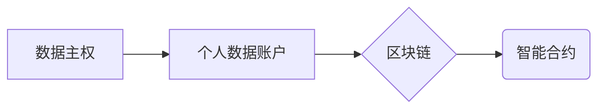

# 基于数据主权区块链的个人数据账户系统设计与实现

作者：禅与计算机程序设计艺术

## 1. 背景介绍

### 1.1 数据主权的兴起

在数字经济时代，数据已成为一种关键的生产要素。然而，数据的集中化控制引发了数据隐私、安全和垄断等一系列问题。为了解决这些问题，数据主权的概念应运而生。数据主权强调个人对其个人数据的控制权，包括访问、使用、共享和删除的权利。

### 1.2 区块链技术赋能数据主权

区块链技术具有去中心化、透明、安全和不可篡改等特点，为实现数据主权提供了强大的技术支持。区块链可以作为个人数据账户的底层基础设施，确保数据的安全存储和可信访问。

### 1.3 个人数据账户系统的需求

个人数据账户系统旨在为个人提供一个安全、可控的平台，用于管理和控制其个人数据。该系统需要满足以下需求：

* **数据自主控制:** 用户拥有对其数据的完全控制权，可以决定数据的访问、使用和共享方式。
* **数据安全和隐私:** 数据存储和传输过程需要确保安全和隐私，防止未经授权的访问和使用。
* **数据可移植性:** 用户可以方便地将数据迁移到其他平台或服务。
* **数据透明度:** 用户可以清楚地了解其数据的存储、使用和共享情况。

## 2. 核心概念与联系

### 2.1 数据主权

数据主权是指个人对其个人数据的控制权，包括访问、使用、共享和删除的权利。在基于数据主权区块链的个人数据账户系统中，用户对其数据拥有完全的控制权。

### 2.2 区块链

区块链是一种去中心化的分布式账本技术，用于记录交易和跟踪资产。在个人数据账户系统中，区块链用于存储个人数据和访问权限记录。

### 2.3 个人数据账户

个人数据账户是一个安全的数字存储空间，用于存储用户的个人数据。用户可以通过个人数据账户控制其数据的访问、使用和共享方式。

### 2.4 智能合约

智能合约是存储在区块链上的自动执行的代码，用于定义数据访问和使用规则。在个人数据账户系统中，智能合约用于实现数据访问控制和数据共享协议。

### 2.5 关系图



## 3. 核心算法原理具体操作步骤

### 3.1 数据加密存储

用户个人数据在存储到区块链之前需要进行加密处理，以确保数据安全性。加密算法可以采用对称加密或非对称加密，具体取决于系统设计需求。

### 3.2 数据访问控制

个人数据账户系统采用基于角色的访问控制（RBAC）模型来管理数据访问权限。用户可以定义不同的角色，并为每个角色分配不同的数据访问权限。

### 3.3 数据共享协议

用户可以通过智能合约定义数据共享协议，以控制数据的共享方式和范围。例如，用户可以指定数据只能与特定机构共享，或者只能用于特定目的。

### 3.4 操作步骤

1. 用户创建个人数据账户并设置访问密码。
2. 用户将个人数据加密后存储到区块链上。
3. 用户定义不同的角色和数据访问权限。
4. 用户通过智能合约定义数据共享协议。
5. 第三方应用可以通过用户授权访问用户数据。

## 4. 数学模型和公式详细讲解举例说明

### 4.1 数据加密模型

假设用户数据为 $M$，加密密钥为 $K$，加密后的数据为 $C$。采用对称加密算法，加密过程可以表示为：

$$C = E_K(M)$$

其中 $E_K$ 表示加密算法。

解密过程可以表示为：

$$M = D_K(C)$$

其中 $D_K$ 表示解密算法。

### 4.2 数据访问控制模型

RBAC 模型定义了用户、角色和权限之间的关系。用户可以属于多个角色，每个角色可以拥有多个权限。数据访问控制逻辑可以通过以下公式表示：

$$Access(User, Data) = \bigvee_{Role \in Roles(User)} Permissions(Role, Data)$$

其中 $Roles(User)$ 表示用户所属的角色集合，$Permissions(Role, Data)$ 表示角色对数据的权限。

## 5. 项目实践：代码实例和详细解释说明

### 5.1 智能合约代码示例

```solidity
pragma solidity ^0.8.0;

contract PersonalDataAccount {

    // 数据结构定义
    struct DataRecord {
        bytes32 dataHash;
        address owner;
        mapping(address => bool) accessList;
    }

    // 数据存储
    mapping(bytes32 => DataRecord) public dataRecords;

    // 事件定义
    event DataStored(bytes32 dataHash, address owner);
    event AccessGranted(bytes32 dataHash, address user);

    // 存储数据
    function storeData(bytes32 dataHash) public {
        dataRecords[dataHash] = DataRecord(dataHash, msg.sender);
        emit DataStored(dataHash, msg.sender);
    }

    // 授权访问
    function grantAccess(bytes32 dataHash, address user) public {
        require(dataRecords[dataHash].owner == msg.sender, "Only owner can grant access.");
        dataRecords[dataHash].accessList[user] = true;
        emit AccessGranted(dataHash, user);
    }

    // 检查访问权限
    function hasAccess(bytes32 dataHash, address user) public view returns (bool) {
        return dataRecords[dataHash].accessList[user];
    }
}
```

### 5.2 代码解释

* `DataRecord` 结构体用于存储数据记录信息，包括数据哈希、数据所有者和访问列表。
* `dataRecords` 映射用于存储所有数据记录。
* `storeData` 函数用于存储数据，并将数据所有者设置为调用者地址。
* `grantAccess` 函数用于授权用户访问数据。
* `hasAccess` 函数用于检查用户是否具有数据访问权限。

## 6. 实际应用场景

### 6.1 医疗数据管理

个人数据账户系统可以用于管理个人医疗数据，例如病历、检查报告和基因数据。用户可以控制医疗数据的访问权限，并选择与医疗机构共享数据用于诊断和治疗。

### 6.2 金融数据管理

个人数据账户系统可以用于管理个人金融数据，例如银行账户、信用卡信息和投资记录。用户可以控制金融数据的访问权限，并选择与金融机构共享数据用于信用评估和贷款申请。

### 6.3 教育数据管理

个人数据账户系统可以用于管理个人教育数据，例如成绩单、学历证书和学习记录。用户可以控制教育数据的访问权限，并选择与教育机构共享数据用于升学申请和职业发展。

## 7. 总结：未来发展趋势与挑战

### 7.1 未来发展趋势

* **数据互操作性:** 不同个人数据账户系统之间的数据互操作性将成为未来发展趋势，方便用户在不同平台之间迁移和共享数据。
* **隐私增强技术:** 隐私增强技术，例如差分隐私和同态加密，将被应用于个人数据账户系统，进一步提升数据隐私保护能力。
* **去中心化身份:** 去中心化身份技术将与个人数据账户系统结合，实现更加安全和可信的用户身份认证。

### 7.2 面临挑战

* **技术复杂性:** 区块链和智能合约技术相对复杂，个人数据账户系统的开发和维护需要专业的技术团队。
* **用户接受度:** 个人数据账户系统需要用户改变其数据管理习惯，用户接受度是系统推广的关键因素。
* **法律法规:** 数据主权和数据隐私相关法律法规尚未完善，个人数据账户系统的合规性需要得到保障。

## 8. 附录：常见问题与解答

### 8.1 如何创建个人数据账户？

用户可以通过选择支持个人数据账户的平台或服务创建个人数据账户。创建过程通常需要提供个人身份信息和设置访问密码。

### 8.2 如何控制数据访问权限？

用户可以通过个人数据账户平台或服务提供的界面设置数据访问权限。用户可以定义不同的角色，并为每个角色分配不同的数据访问权限。

### 8.3 如何共享数据？

用户可以通过智能合约定义数据共享协议，以控制数据的共享方式和范围。例如，用户可以指定数据只能与特定机构共享，或者只能用于特定目的。