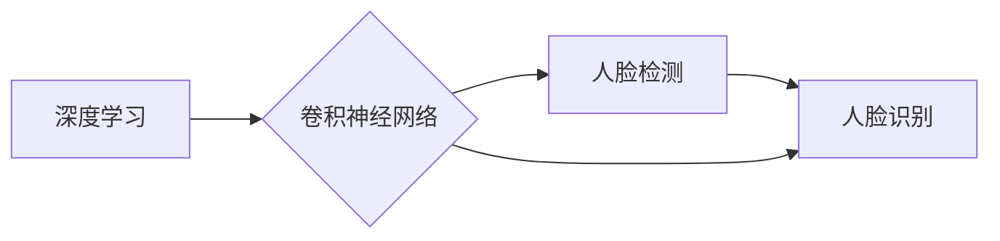

## 1. 背景介绍

### 1.1 人脸识别技术的应用与发展

人脸识别作为一种基于生物特征的身份识别技术，近年来在安防监控、金融支付、交通出行、公共安全等领域得到广泛应用。随着深度学习技术的快速发展，人脸识别技术取得了突破性进展，识别精度和效率大幅提升，应用场景不断拓展。

### 1.2 深度学习在人脸识别中的优势

传统的 人脸识别方法通常依赖于手工设计的特征提取器，对光照、姿态、表情等变化较为敏感，识别精度和鲁棒性难以满足实际应用需求。深度学习方法能够自动学习图像特征，具有更强的泛化能力和鲁棒性，在复杂环境下表现出更优异的性能。

### 1.3 本文研究目的和意义

本文旨在设计和实现一个基于深度学习的人脸检测与识别系统，探讨深度学习技术在人脸识别领域的应用，并为相关研究提供参考和借鉴。

## 2. 核心概念与联系

### 2.1 人脸检测

人脸检测是指从图像或视频中定位人脸区域的过程。人脸检测是人脸识别的基础，其目标是确定图像中是否存在人脸以及人脸的位置。

### 2.2 人脸识别

人脸识别是指将输入的人脸图像与数据库中已知人脸进行比对，确定输入人脸身份的过程。人脸识别是人脸检测的后续步骤，其目标是识别出输入人脸的身份。

### 2.3 深度学习

深度学习是一种机器学习方法，其核心是利用多层神经网络对数据进行特征提取和模式识别。深度学习方法在图像识别、语音识别、自然语言处理等领域取得了显著成果。

### 2.4 卷积神经网络

卷积神经网络（CNN）是一种常用的深度学习模型，其特点是利用卷积操作提取图像特征，具有较强的特征提取能力和泛化能力。

### 2.5 关系图



## 3. 核心算法原理具体操作步骤

### 3.1 人脸检测算法

#### 3.1.1 MTCNN算法

MTCNN (Multi-task Cascaded Convolutional Networks) 是一种基于深度学习的人脸检测算法，其核心思想是利用三个级联的卷积神经网络进行人脸检测。

**操作步骤:**

1. 构建图像金字塔，生成不同尺度的图像。
2. 利用 P-Net (Proposal Network) 对图像进行粗略的人脸区域检测，生成候选框。
3. 利用 R-Net (Refine Network) 对候选框进行进一步筛选，剔除误检框。
4. 利用 O-Net (Output Network) 对筛选后的候选框进行精细化调整，输出人脸区域和关键点信息。

#### 3.1.2 YOLO算法

YOLO (You Only Look Once) 是一种基于深度学习的目标检测算法，其特点是速度快、精度高。

**操作步骤:**

1. 将输入图像划分为 S×S 的网格。
2. 每个网格预测 B 个边界框，每个边界框包含 5 个预测值：边界框中心坐标 (x, y)、边界框宽度和高度 (w, h)、边界框置信度。
3. 每个网格还预测 C 个类别概率，表示边界框中物体属于各个类别的概率。
4. 根据边界框置信度和类别概率筛选出最终的检测结果。

### 3.2 人脸识别算法

#### 3.2.1 FaceNet算法

FaceNet 是一种基于深度学习的人脸识别算法，其核心思想是利用深度卷积神经网络学习人脸的特征表示，并将人脸映射到一个高维特征空间。

**操作步骤:**

1. 利用深度卷积神经网络提取人脸特征。
2. 将人脸特征映射到一个高维特征空间。
3. 计算不同人脸特征之间的距离，判断人脸是否属于同一个人。

#### 3.2.2 ArcFace算法

ArcFace 是一种基于深度学习的人脸识别算法，其特点是引入了角度边距损失函数，提升了人脸识别的精度和鲁棒性。

**操作步骤:**

1. 利用深度卷积神经网络提取人脸特征。
2. 将人脸特征映射到一个高维特征空间。
3. 计算不同人脸特征之间的角度距离，并引入角度边距损失函数，优化人脸识别模型。

## 4. 数学模型和公式详细讲解举例说明

### 4.1 人脸检测算法

#### 4.1.1 MTCNN算法

MTCNN算法中，P-Net、R-Net、O-Net 均采用卷积神经网络结构，其损失函数为多任务损失函数，包括人脸分类损失、边界框回归损失和关键点定位损失。

**人脸分类损失:**

$$
L_{cls} = -\frac{1}{N}\sum_{i=1}^{N}(y_i\log p_i + (1-y_i)\log(1-p_i))
$$

其中，$N$ 为样本数量，$y_i$ 为样本 $i$ 的真实标签（0 表示非人脸，1 表示人脸），$p_i$ 为模型预测样本 $i$ 为人脸的概率。

**边界框回归损失:**

$$
L_{box} = \frac{1}{N}\sum_{i=1}^{N}\sum_{j\in\{x, y, w, h\}}|t_i^j - \hat{t}_i^j|
$$

其中，$t_i^j$ 为样本 $i$ 的真实边界框参数，$\hat{t}_i^j$ 为模型预测样本 $i$ 的边界框参数。

**关键点定位损失:**

$$
L_{landmark} = \frac{1}{N}\sum_{i=1}^{N}\sum_{j=1}^{5}||l_i^j - \hat{l}_i^j||_2
$$

其中，$l_i^j$ 为样本 $i$ 的真实关键点坐标，$\hat{l}_i^j$ 为模型预测样本 $i$ 的关键点坐标。

#### 4.1.2 YOLO算法

YOLO算法的损失函数包括边界框定位损失、置信度损失和分类损失。

**边界框定位损失:**

$$
L_{loc} = \lambda_{coord}\sum_{i=0}^{S^2}\sum_{j=0}^{B}\mathbb{1}_{ij}^{obj}[(x_i - \hat{x}_i)^2 + (y_i - \hat{y}_i)^2 + (\sqrt{w_i} - \sqrt{\hat{w}_i})^2 + (\sqrt{h_i} - \sqrt{\hat{h}_i})^2]
$$

其中，$\lambda_{coord}$ 为坐标损失权重，$S^2$ 为网格数量，$B$ 为每个网格预测的边界框数量，$\mathbb{1}_{ij}^{obj}$ 表示网格 $i$ 中的第 $j$ 个边界框是否负责预测物体，$x_i$、$y_i$、$w_i$、$h_i$ 为真实边界框参数，$\hat{x}_i$、$\hat{y}_i$、$\hat{w}_i$、$\hat{h}_i$ 为模型预测边界框参数。

**置信度损失:**

$$
L_{conf} = \sum_{i=0}^{S^2}\sum_{j=0}^{B}\mathbb{1}_{ij}^{obj}(C_i - \hat{C}_i)^2 + \lambda_{noobj}\sum_{i=0}^{S^2}\sum_{j=0}^{B}\mathbb{1}_{ij}^{noobj}(C_i - \hat{C}_i)^2
$$

其中，$\lambda_{noobj}$ 为不包含物体损失权重，$C_i$ 为真实边界框置信度，$\hat{C}_i$ 为模型预测边界框置信度。

**分类损失:**

$$
L_{cls} = \sum_{i=0}^{S^2}\mathbb{1}_{i}^{obj}\sum_{c\in classes}(p_i(c) - \hat{p}_i(c))^2
$$

其中，$\mathbb{1}_{i}^{obj}$ 表示网格 $i$ 是否包含物体，$p_i(c)$ 为真实类别概率，$\hat{p}_i(c)$ 为模型预测类别概率。

### 4.2 人脸识别算法

#### 4.2.1 FaceNet算法

FaceNet算法的核心是利用深度卷积神经网络学习人脸的特征表示，并将人脸映射到一个高维特征空间。其损失函数为三元组损失函数，旨在最小化同一个人脸特征之间的距离，最大化不同人脸特征之间的距离。

**三元组损失函数:**

$$
L = \sum_{i=1}^{N}[\|f(x_i^a) - f(x_i^p)\|_2^2 - \|f(x_i^a) - f(x_i^n)\|_2^2 + \alpha]_+
$$

其中，$N$ 为样本数量，$x_i^a$ 为锚点人脸图像，$x_i^p$ 为正样本人脸图像（与锚点人脸属于同一个人），$x_i^n$ 为负样本人脸图像（与锚点人脸不属于同一个人），$f(x)$ 表示人脸图像 $x$ 的特征表示，$\alpha$ 为边距参数。

#### 4.2.2 ArcFace算法

ArcFace算法的特点是引入了角度边距损失函数，提升了人脸识别的精度和鲁棒性。

**角度边距损失函数:**

$$
L = -\frac{1}{N}\sum_{i=1}^{N}\log\frac{e^{s\cos(\theta_{y_i} + m)}}{e^{s\cos(\theta_{y_i} + m)} + \sum_{j=1, j\neq y_i}^{n}e^{s\cos\theta_j}}
$$

其中，$N$ 为样本数量，$s$ 为缩放参数，$m$ 为边距参数，$\theta_{y_i}$ 为真实类别人脸特征与权重向量之间的夹角，$\theta_j$ 为其他类别人脸特征与权重向量之间的夹角。

## 5. 项目实践：代码实例和详细解释说明

### 5.1 人脸检测代码实例

```python
import cv2
import mtcnn

# 加载 MTCNN 模型
detector = mtcnn.MTCNN()

# 加载图像
image = cv2.imread('face.jpg')

# 人脸检测
faces = detector.detect_faces(image)

# 绘制人脸边界框
for face in faces:
    x, y, w, h = face['box']
    cv2.rectangle(image, (x, y), (x+w, y+h), (0, 255, 0), 2)

# 显示结果
cv2.imshow('Face Detection', image)
cv2.waitKey(0)
```

**代码解释:**

1. 导入 `cv2` 和 `mtcnn` 库。
2. 加载 MTCNN 模型。
3. 加载图像。
4.