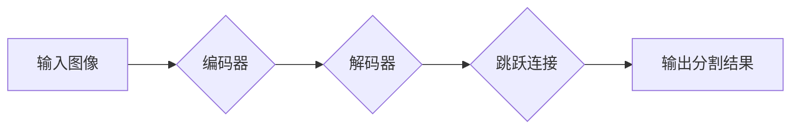
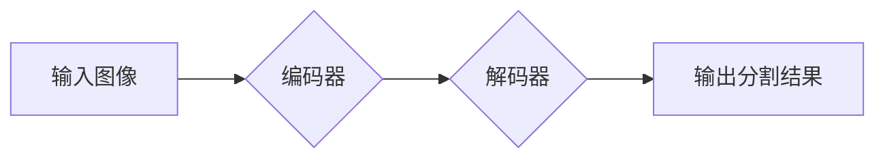
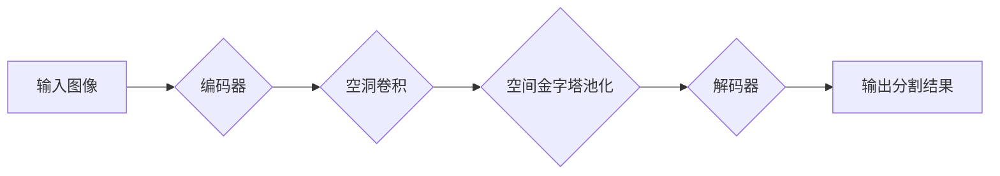

## 1. 背景介绍

### 1.1 图像分割的定义与意义

图像分割是计算机视觉领域中的一个重要任务，其目标是将图像划分成若干个具有特定语义含义的区域。换言之，它是将数字图像细分为多个图像子区域（像素的集合）（也称为超级像素）的过程。分割的目的是简化或改变图像的表示形式，使其更有意义和更容易分析。图像分割通常用于定位图像中的对象和边界（线，曲线等）。更精确地说，图像分割是为图像中的每个像素分配标签的任务，以便具有相同标签的像素共享某些特征。

图像分割在许多领域都有广泛的应用，例如：

* **医学影像分析:** 识别肿瘤、器官和病变
* **自动驾驶:**  识别道路、行人、车辆和交通信号灯
* **机器人:**  识别物体、场景和导航路径
* **安防监控:**  识别可疑人员和行为
* **图像编辑:**  抠图、替换背景等

### 1.2 传统图像分割方法的局限性

传统的图像分割方法主要基于图像的低层特征，例如颜色、纹理、边缘等。这些方法通常需要人工设计特征，并且对噪声和光照变化比较敏感。一些常见的传统图像分割方法包括：

* 阈值分割
* 边缘检测
* 区域生长
* 聚类算法

这些方法在某些特定场景下可以取得不错的效果，但是对于复杂场景的图像分割任务，往往难以满足要求。

### 1.3 深度学习为图像分割带来的突破

近年来，深度学习技术的快速发展为图像分割带来了新的突破。深度学习模型可以自动学习图像的特征表示，从而避免了人工设计特征的繁琐过程。此外，深度学习模型对噪声和光照变化具有更强的鲁棒性，能够在更复杂的场景下取得更好的分割效果。


## 2. 核心概念与联系

### 2.1 卷积神经网络(CNN)

卷积神经网络 (CNN) 是一种专门为处理网格状数据（如图像）而设计的深度学习模型。CNN 的核心思想是使用卷积操作来提取图像的特征。卷积操作通过滑动一个小的卷积核 (kernel) 在图像上，将卷积核与图像的局部区域进行点积运算，从而提取出图像的局部特征。

### 2.2 全卷积网络(FCN)

全卷积网络 (FCN) 是将 CNN 应用于图像分割任务的一种重要模型。FCN 将传统的 CNN 中的全连接层替换为卷积层，从而可以输出与输入图像尺寸相同的特征图。FCN 的输出特征图可以看作是一张像素级别的预测图，每个像素对应一个类别标签。

### 2.3 编码器-解码器架构

许多深度学习图像分割模型都采用编码器-解码器架构。编码器部分用于提取图像的特征表示，解码器部分用于将特征表示映射回像素级别的分割结果。编码器通常由一系列卷积层和池化层组成，解码器通常由一系列反卷积层和上采样层组成。

### 2.4 常用损失函数

图像分割任务常用的损失函数包括：

* **交叉熵损失函数:** 用于衡量像素级别的分类误差。
* **Dice 系数:** 用于衡量预测结果与真实结果之间的重叠程度。
* **IoU (Intersection over Union):**  用于衡量预测结果与真实结果之间的交并比。

## 3. 核心算法原理具体操作步骤

### 3.1 U-Net 网络架构

U-Net 是一种经典的编码器-解码器图像分割网络。它由一个收缩路径 (编码器) 和一个扩展路径 (解码器) 组成。收缩路径用于捕捉上下文信息，扩展路径用于精确定位分割边界。

**操作步骤:**

1. **输入图像:** 将原始图像输入 U-Net 网络。
2. **编码器:**  编码器部分由一系列卷积层和最大池化层组成，用于提取图像的多尺度特征。
3. **解码器:** 解码器部分由一系列反卷积层和上采样层组成，用于将编码器提取的特征映射回原始图像尺寸。
4. **跳跃连接:**  U-Net 使用跳跃连接将编码器和解码器对应层的特征图进行拼接，从而融合了不同尺度的特征信息。
5. **输出分割结果:**  U-Net 的最后一层使用 1x1 卷积和 sigmoid 函数输出像素级别的分割结果。

**Mermaid 流程图:**



### 3.2 SegNet 网络架构

SegNet 也是一种经典的编码器-解码器图像分割网络。它与 U-Net 的主要区别在于解码器的结构。SegNet 解码器使用最大池化层的索引来进行上采样操作，从而保留了更多的空间信息。

**操作步骤:**

1. **输入图像:** 将原始图像输入 SegNet 网络。
2. **编码器:**  编码器部分由一系列卷积层和最大池化层组成，用于提取图像的多尺度特征。
3. **解码器:** 解码器部分使用最大池化层的索引进行上采样操作，并使用卷积层进行特征映射。
4. **输出分割结果:**  SegNet 的最后一层使用 1x1 卷积和 softmax 函数输出像素级别的分割结果。

**Mermaid 流程图:**



### 3.3 DeepLab 系列网络架构

DeepLab 系列网络是 Google 提出的用于语义分割的深度学习模型。DeepLab 系列网络引入了空洞卷积 (atrous convolution) 和空间金字塔池化 (ASPP) 等技术，以提高分割精度。

**操作步骤:**

1. **输入图像:** 将原始图像输入 DeepLab 网络。
2. **编码器:**  编码器部分使用 ResNet 或 Xception 等网络作为骨干网络，用于提取图像的特征。
3. **空洞卷积:**  DeepLab 使用空洞卷积来扩大卷积核的感受野，从而捕获更大范围的上下文信息。
4. **空间金字塔池化:**  DeepLab 使用空间金字塔池化模块来提取不同尺度的特征，并将其融合在一起。
5. **解码器:** 解码器部分使用双线性插值或反卷积进行上采样操作，并使用卷积层进行特征映射。
6. **输出分割结果:**  DeepLab 的最后一层使用 1x1 卷积和 softmax 函数输出像素级别的分割结果。

**Mermaid 流程图:**



## 4. 数学模型和公式详细讲解举例说明

### 4.1 交叉熵损失函数

交叉熵损失函数用于衡量像素级别的分类误差。对于二分类问题，交叉熵损失函数的公式如下：

$$
L = -\frac{1}{N}\sum_{i=1}^{N}[y_i\log(\hat{y}_i) + (1-y_i)\log(1-\hat{y}_i)]
$$

其中：

* $N$ 表示像素数量
* $y_i$ 表示第 $i$ 个像素的真实标签 (0 或 1)
* $\hat{y}_i$ 表示第 $i$ 个像素的预测概率

**举例说明:**

假设一个图像有 100 个像素，其中 50 个像素属于类别 1，50 个像素属于类别 0。模型预测所有像素都属于类别 1，则交叉熵损失函数的值为：

$$
L = -\frac{1}{100}[50\log(1) + 50\log(0)] = \infty
$$

### 4.2 Dice 系数

Dice 系数用于衡量预测结果与真实结果之间的重叠程度。Dice 系数的公式如下：

$$
Dice = \frac{2|X \cap Y|}{|X| + |Y|}
$$

其中：

* $X$ 表示预测结果的像素集合
* $Y$ 表示真实结果的像素集合

**举例说明:**

假设一个图像有 100 个像素，其中 50 个像素属于类别 1。模型预测 60 个像素属于类别 1，其中 40 个像素与真实结果重合，则 Dice 系数的值为：

$$
Dice = \frac{2 \times 40}{60 + 50} = 0.73
$$

### 4.3 IoU (Intersection over Union)

IoU 用于衡量预测结果与真实结果之间的交并比。IoU 的公式如下：

$$
IoU = \frac{|X \cap Y|}{|X \cup Y|}
$$

其中：

* $X$ 表示预测结果的像素集合
* $Y$ 表示真实结果的像素集合

**举例说明:**

假设一个图像有 100 个像素，其中 50 个像素属于类别 1。模型预测 60 个像素属于类别 1，其中 40 个像素与真实结果重合，则 IoU 的值为：

$$
IoU = \frac{40}{60 + 50 - 40} = 0.57
$$

## 5. 项目实践：代码实例和详细解释说明

### 5.1 使用 TensorFlow 实现 U-Net 网络

```python
import tensorflow as tf

def conv2d_block(inputs, filters, kernel_size, strides, padding='same', activation='relu'):
    """
    定义一个卷积块，包含卷积层、批归一化和激活函数
    """
    x = tf.keras.layers.Conv2D(filters, kernel_size, strides=strides, padding=padding)(inputs)
    x = tf.keras.layers.BatchNormalization()(x)
    x = tf.keras.layers.Activation(activation)(x)
    return x

def unet(input_shape, num_classes):
    """
    构建 U-Net 网络
    """
    inputs = tf.keras.Input(shape=input_shape)

    # 编码器部分
    conv1 = conv2d_block(inputs, 64, 3, 1)
    conv1 = conv2d_block(conv1, 64, 3, 1)
    pool1 = tf.keras.layers.MaxPooling2D(pool_size=(2, 2))(conv1)

    conv2 = conv2d_block(pool1, 128, 3, 1)
    conv2 = conv2d_block(conv2, 128, 3, 1)
    pool2 = tf.keras.layers.MaxPooling2D(pool_size=(2, 2))(conv2)

    conv3 = conv2d_block(pool2, 256, 3, 1)
    conv3 = conv2d_block(conv3, 256, 3, 1)
    pool3 = tf.keras.layers.MaxPooling2D(pool_size=(2, 2))(conv3)

    conv4 = conv2d_block(pool3, 512, 3, 1)
    conv4 = conv2d_block(conv4, 512, 3, 1)
    pool4 = tf.keras.layers.MaxPooling2D(pool_size=(2, 2))(conv4)

    # 解码器部分
    up5 = tf.keras.layers.Conv2DTranspose(512, 2, strides=2, padding='same')(pool4)
    concat5 = tf.keras.layers.concatenate([up5, conv4])
    conv5 = conv2d_block(concat5, 512, 3, 1)
    conv5 = conv2d_block(conv5, 512, 3, 1)

    up6 = tf.keras.layers.Conv2DTranspose(256, 2, strides=2, padding='same')(conv5)
    concat6 = tf.keras.layers.concatenate([up6, conv3])
    conv6 = conv2d_block(concat6, 256, 3, 1)
    conv6 = conv2d_block(conv6, 256, 3, 1)

    up7 = tf.keras.layers.Conv2DTranspose(128, 2, strides=2, padding='same')(conv6)
    concat7 = tf.keras.layers.concatenate([up7, conv2])
    conv7 = conv2d_block(concat7, 128, 3, 1)
    conv7 = conv2d_block(conv7, 128, 3, 1)

    up8 = tf.keras.layers.Conv2DTranspose(64, 2, strides=2, padding='same')(conv7)
    concat8 = tf.keras.layers.concatenate([up8, conv1])
    conv8 = conv2d_block(concat8, 64, 3, 1)
    conv8 = conv2d_block(conv8, 64, 3, 1)

    # 输出层
    outputs = tf.keras.layers.Conv2D(num_classes, 1, activation='sigmoid')(conv8)

    model = tf.keras.Model(inputs=inputs, outputs=outputs)
    return model
```

**代码解释:**

* `conv2d_block` 函数定义了一个卷积块，包含卷积层、批归一化和激活函数。
* `unet` 函数构建 U-Net 网络，包括编码器部分、解码器部分、跳跃连接和输出层。
* 编码器部分使用一系列卷积块和最大池化层来提取图像的多尺度特征。
* 解码器部分使用一系列反卷积层和上采样层来将编码器提取的特征映射回原始图像尺寸。
* 跳跃连接将编码器和解码器对应层的特征图进行拼接，从而融合了不同尺度的特征信息。
* 输出层使用 1x1 卷积和 sigmoid 函数输出像素级别的分割结果。

### 5.2 训练 U-Net 网络

```python
# 准备训练数据
train_images = ...
train_labels = ...

# 创建 U-Net 模型
model = unet(input_shape=(256, 256, 3), num_classes=2)

# 编译模型
model.compile(optimizer='adam', loss='binary_crossentropy', metrics=['accuracy'])

# 训练模型
model.fit(train_images, train_labels, epochs=10, batch_size=32)
```

**代码解释:**

* 首先，需要准备训练数据，包括训练图像和对应的标签。
* 然后，创建 U-Net 模型，并指定输入形状和类别数量。
* 接着，编译模型，选择优化器、损失函数和评估指标。
* 最后，使用训练数据训练模型，指定训练轮数和批次大小。

## 6. 实际应用场景

### 6.1 医学影像分析

* 肿瘤分割：识别医学影像中的肿瘤区域，辅助医生进行诊断和治疗方案制定。
* 器官分割：识别医学影像中的器官，例如心脏、肝脏、肺部等，辅助医生进行手术规划和疾病诊断。
* 病变分割：识别医学影像中的病变区域，例如骨折、炎症、出血等，辅助医生进行疾病诊断和治疗方案制定。

### 6.2 自动驾驶

* 道路分割：识别道路区域，辅助自动驾驶系统进行路径规划和车辆控制。
* 行人分割：识别行人区域，辅助自动驾驶系统进行行人检测和避让。
* 车辆分割：识别车辆区域，辅助自动驾驶系统进行车辆检测和跟踪。
* 交通信号灯分割：识别交通信号灯区域，辅助自动驾驶系统进行交通规则识别和决策。

### 6.3 机器人

* 物体分割：识别机器人视野中的物体，例如工具、零件、障碍物等，辅助机器人进行抓取、操作和导航。
* 场景分割：识别机器人所处场景，例如室内、室外、工厂等，辅助机器人进行任务规划和决策。
* 导航路径分割：识别机器人可行走的路径，辅助机器人进行路径规划和导航。

### 6.4 安防监控

* 可疑人员分割：识别安防监控视频中的可疑人员，例如非法入侵者、犯罪嫌疑人等，辅助安防系统进行安全防范。
* 可疑行为分割：识别安防监控视频中的可疑行为，例如打架斗殴、盗窃等，辅助安防系统进行安全防范。

### 6.5 图像编辑

* 抠图：将图像中的目标物体从背景中分离出来，用于图像合成、背景替换等。
* 替换背景：将图像中的背景替换成其他图像或颜色，用于图像美化、创意设计等。

## 7. 工具和资源推荐

### 7.1 深度学习框架

* TensorFlow: https://www.tensorflow.org/
* PyTorch: https://pytorch.org/
* Keras: https://keras.io/

### 7.2 图像分割数据集

* Cityscapes: https://www.cityscapes-dataset.com/
* PASCAL VOC: http://host.robots.ox.ac.uk/pascal/VOC/
* COCO: http://cocodataset.org/

### 7.3 图像分割模型库

* Segmentation Models: https://github.com/qubvel/segmentation_models
* Glu