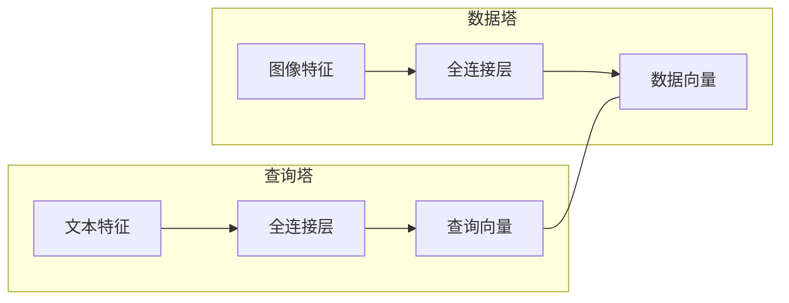
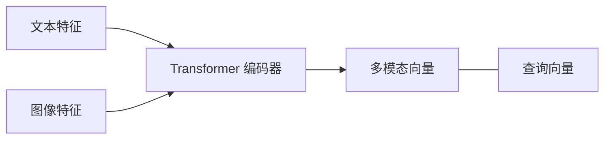

## 1. 背景介绍

### 1.1 信息检索的演变

信息检索（Information Retrieval，IR）是指从大规模信息库中找到满足用户需求信息的活动。随着互联网的快速发展，信息检索技术经历了从传统的基于文本的检索到基于内容的检索、基于语义的检索，再到如今的多模态检索的演变过程。

- **基于文本的检索:**  主要依赖于关键词匹配，例如早期的搜索引擎。
- **基于内容的检索:**  考虑了图像、音频、视频等多媒体信息，例如基于内容的图像检索。
- **基于语义的检索:**  关注于理解用户查询的语义，例如问答系统。
- **多模态检索:**  综合利用文本、图像、音频、视频等多种模态信息进行检索，例如电商平台的商品搜索。

### 1.2 多模态检索的兴起

多模态检索的兴起得益于以下几个因素：

- **海量多模态数据的爆炸式增长:**  互联网上有大量的图像、视频、音频等多媒体数据，传统的单模态检索方法难以有效利用这些数据。
- **深度学习技术的快速发展:**  深度学习技术在图像识别、语音识别、自然语言处理等领域取得了突破性进展，为多模态检索提供了强大的技术支撑。
- **用户需求的日益多元化:**  用户希望能够通过多种方式表达检索意图，例如用文字描述商品、用图片搜索相似商品等。

### 1.3 多模态检索的应用场景

多模态检索技术在很多领域都有着广泛的应用，例如：

- **电子商务:**  用户可以通过文字、图片等多种方式搜索商品。
- **社交媒体:**  用户可以通过文字、图片、视频等多种方式搜索感兴趣的内容。
- **数字图书馆:**  用户可以通过文字、图片等多种方式搜索图书、期刊等文献资料。
- **安防监控:**  可以通过图像、视频等多种方式搜索嫌疑人。

## 2. 核心概念与联系

### 2.1 多模态数据

多模态数据是指包含多种不同类型信息的数据，例如文本、图像、音频、视频等。不同模态的数据之间存在着一定的关联性，例如：

- **图像和文本:**  图像可以描述文本内容，文本可以解释图像内容。
- **音频和文本:**  音频可以转录成文本，文本可以生成语音。
- **视频和文本:**  视频可以包含文本字幕，文本可以描述视频内容。

### 2.2 特征表示

特征表示是指将多模态数据转换成计算机可以理解的数值向量。常用的特征表示方法包括：

- **文本特征:**  词袋模型（Bag-of-Words，BoW）、TF-IDF、词向量（Word Embedding）等。
- **图像特征:**  SIFT、HOG、CNN特征等。
- **音频特征:**  MFCC、LPC等。
- **视频特征:**  C3D、I3D等。

### 2.3 模态融合

模态融合是指将不同模态的特征表示进行整合，以便进行联合检索。常用的模态融合方法包括：

- **早期融合:**  将不同模态的特征拼接在一起，然后输入到模型中进行训练。
- **晚期融合:**  分别对不同模态的特征进行建模，然后将模型的输出结果进行融合。
- **混合融合:**  结合早期融合和晚期融合的优点，在不同层次进行模态融合。

### 2.4 检索模型

检索模型是指用于计算查询与数据库中数据项之间相似度的模型。常用的检索模型包括：

- **基于内容的检索模型:**  TF-IDF、BM25等。
- **基于语义的检索模型:**  潜在语义分析（Latent Semantic Analysis，LSA）、概率潜在语义分析（Probabilistic Latent Semantic Analysis，PLSA）等。
- **基于深度学习的检索模型:**  双塔模型、多模态 Transformer等。

## 3. 核心算法原理具体操作步骤

### 3.1 双塔模型

双塔模型是一种常用的多模态检索模型，其结构如下图所示：



双塔模型分别对查询和数据项进行特征提取，然后将特征向量映射到同一个向量空间，最后通过计算两个向量之间的相似度来进行检索。

具体操作步骤如下：

1. **数据预处理:**  对文本数据进行分词、去除停用词等操作，对图像数据进行缩放、裁剪等操作。
2. **特征提取:**  使用预训练的模型提取文本和图像特征。
3. **模型训练:**  使用 contrastive learning 损失函数对双塔模型进行训练，使得相似的数据对在向量空间中距离更近，不相似的數據对距离更远。
4. **检索:**  将查询文本和图像输入到模型中，得到查询向量和数据向量，计算两个向量之间的相似度，返回相似度最高的数据项。

### 3.2 多模态 Transformer

多模态 Transformer 是一种基于 Transformer 的多模态检索模型，其结构如下图所示：



多模态 Transformer 使用 Transformer 编码器对文本和图像特征进行联合编码，得到多模态向量，然后将多模态向量与查询向量进行比较，返回相似度最高的数据项。

具体操作步骤如下：

1. **数据预处理:**  对文本数据进行分词、去除停用词等操作，对图像数据进行缩放、裁剪等操作。
2. **特征提取:**  使用预训练的模型提取文本和图像特征。
3. **模型训练:**  使用 contrastive learning 损失函数对多模态 Transformer 进行训练，使得相似的数据对在向量空间中距离更近，不相似的數據对距离更远。
4. **检索:**  将查询文本和图像输入到模型中，得到多模态向量，计算多模态向量与查询向量之间的相似度，返回相似度最高的数据项。

## 4. 数学模型和公式详细讲解举例说明

### 4.1 余弦相似度

余弦相似度是一种常用的向量相似度计算方法，其公式如下：

$$
similarity(x, y) = \frac{x \cdot y}{||x|| \cdot ||y||}
$$

其中，$x$ 和 $y$ 分别表示两个向量，$\cdot$ 表示向量点积，$||x||$ 表示向量 $x$ 的模长。

余弦相似度的取值范围为 $[-1, 1]$，值越大表示两个向量越相似。

**举例说明:**

假设有两个向量 $x = [1, 2]$ 和 $y = [3, 4]$，则它们的余弦相似度为：

$$
similarity(x, y) = \frac{1 \times 3 + 2 \times 4}{\sqrt{1^2 + 2^2} \times \sqrt{3^2 + 4^2}} = \frac{11}{5 \sqrt{5}} \approx 0.98
$$

### 4.2 Contrastive Learning 损失函数

Contrastive Learning 损失函数是一种常用的多模态检索模型训练损失函数，其公式如下：

$$
L = \sum_{i=1}^{N} \sum_{j=1, j \neq i}^{N} y_{ij} \cdot max(0, m - D(x_i, x_j) + D(x_i, x_k))
$$

其中，$N$ 表示数据样本数量，$x_i$ 表示第 $i$ 个数据样本，$y_{ij}$ 表示数据样本 $i$ 和 $j$ 是否相似，$D(x_i, x_j)$ 表示数据样本 $i$ 和 $j$ 之间的距离，$m$ 表示 margin，$x_k$ 表示与 $x_i$ 不相似的负样本。

Contrastive Learning 损失函数的目标是使得相似的数据对在向量空间中距离更近，不相似的數據对距离更远。

**举例说明:**

假设有两个数据样本 $x_1 = [1, 2]$ 和 $x_2 = [3, 4]$，它们是相似的，则 $y_{12} = 1$。假设有一个负样本 $x_3 = [-1, -2]$，则 Contrastive Learning 损失函数的值为：

$$
L = max(0, 1 - D(x_1, x_2) + D(x_1, x_3))
$$

如果 $D(x_1, x_2) < D(x_1, x_3)$，则损失函数的值为 0，否则损失函数的值为 $1 - D(x_1, x_2) + D(x_1, x_3)$。

## 5. 项目实践：代码实例和详细解释说明

### 5.1 数据集

本项目使用 COCO 数据集进行实验，该数据集包含大量的图像和文本数据。

### 5.2 代码实例

```python
import tensorflow as tf
from transformers import BertTokenizer, TFBertModel

# 定义双塔模型
def create_dual_encoder_model(text_input_shape, image_input_shape, embedding_dim):
    # 文本编码器
    text_input = tf.keras.Input(shape=text_input_shape)
    bert_tokenizer = BertTokenizer.from_pretrained('bert-base-uncased')
    bert_model = TFBertModel.from_pretrained('bert-base-uncased')
    text_embeddings = bert_model(text_input).last_hidden_state[:, 0, :]
    text_encoder = tf.keras.Model(inputs=text_input, outputs=text_embeddings)

    # 图像编码器
    image_input = tf.keras.Input(shape=image_input_shape)
    image_embeddings = tf.keras.layers.Dense(units=embedding_dim, activation='relu')(image_input)
    image_encoder = tf.keras.Model(inputs=image_input, outputs=image_embeddings)

    # 双塔模型
    text_embedding = text_encoder(text_input)
    image_embedding = image_encoder(image_input)
    similarity = tf.keras.layers.Dot(axes=1, normalize=True)([text_embedding, image_embedding])
    model = tf.keras.Model(inputs=[text_input, image_input], outputs=similarity)

    return model

# 定义数据加载函数
def load_data(batch_size):
    # 加载 COCO 数据集
    # ...

    # 将数据转换成模型输入格式
    # ...

    # 创建 TensorFlow 数据集
    dataset = tf.data.Dataset.from_tensor_slices((text_inputs, image_inputs, labels))
    dataset = dataset.batch(batch_size)

    return dataset

# 定义训练函数
def train_model(model, dataset, epochs, learning_rate):
    # 定义优化器
    optimizer = tf.keras.optimizers.Adam(learning_rate=learning_rate)

    # 定义损失函数
    loss_fn = tf.keras.losses.CategoricalCrossentropy()

    # 训练模型
    for epoch in range(epochs):
        for text_inputs, image_inputs, labels in dataset:
            with tf.GradientTape() as tape:
                predictions = model([text_inputs, image_inputs])
                loss = loss_fn(labels, predictions)
            gradients = tape.gradient(loss, model.trainable_variables)
            optimizer.apply_gradients(zip(gradients, model.trainable_variables))

# 创建模型
model = create_dual_encoder_model(text_input_shape=(128,), image_input_shape=(224, 224, 3), embedding_dim=512)

# 加载数据
dataset = load_data(batch_size=32)

# 训练模型
train_model(model, dataset, epochs=10, learning_rate=1e-5)
```

### 5.3 详细解释说明

- **create_dual_encoder_model 函数:**  该函数定义了双塔模型的结构，包括文本编码器、图像编码器和相似度计算层。
- **load_data 函数:**  该函数加载 COCO 数据集，并将数据转换成模型输入格式。
- **train_model 函数:**  该函数定义了模型的训练过程，包括定义优化器、损失函数和训练循环。

## 6. 实际应用场景

### 6.1 电商平台

在电商平台中，用户可以通过文字、图片等多种方式搜索商品。多模态检索技术可以帮助电商平台提升商品搜索的准确率和效率，例如：

- **商品推荐:**  根据用户的搜索历史和浏览记录，推荐用户可能感兴趣的商品。
- **相似商品搜索:**  用户可以通过上传图片的方式搜索相似商品。
- **商品分类:**  将商品按照类别进行分类，方便用户浏览和搜索。

### 6.2 社交媒体

在社交媒体中，用户可以通过文字、图片、视频等多种方式搜索感兴趣的内容。多模态检索技术可以帮助社交媒体平台提升内容搜索的准确率和效率，例如：

- **话题推荐:**  根据用户的关注和互动记录，推荐用户可能感兴趣的话题。
- **内容搜索:**  用户可以通过文字、图片、视频等多种方式搜索感兴趣的内容。
- **内容审核:**  识别和过滤违规内容，维护平台的健康发展。

### 6.3 数字图书馆

在数字图书馆中，用户可以通过文字、图片等多种方式搜索图书、期刊等文献资料。多模态检索技术可以帮助数字图书馆提升文献检索的准确率和效率，例如：

- **文献推荐:**  根据用户的阅读历史和研究方向，推荐用户可能感兴趣的文献。
- **文献搜索:**  用户可以通过文字、图片等多种方式搜索感兴趣的文献。
- **文献分类:**  将文献按照学科、主题等进行分类，方便用户浏览和搜索。

## 7. 工具和资源推荐

### 7.1 TensorFlow

TensorFlow 是 Google 开源的深度学习框架，提供了丰富的 API 和工具，可以用于构建和训练多模态检索模型。

### 7.2 PyTorch

PyTorch 是 Facebook 开源的深度学习框架，也提供了丰富的 API 和工具，可以用于构建和训练多模态检索模型。

### 7.3 Hugging Face Transformers

Hugging Face Transformers 是一个开源的自然语言处理库，提供了大量的预训练模型，可以用于提取文本特征。

### 7.4 COCO 数据集

COCO 数据集是一个大型的图像和文本数据集，可以用于训练和评估多模态检索模型。

## 8. 总结：未来发展趋势与挑战

### 8.1 未来发展趋势

- **更强大的模态融合方法:**  研究更有效的模态融合方法，提升多模态检索模型的性能。
- **更细粒度的检索:**  实现更细粒度的检索，例如根据商品的材质、颜色等属性进行检索。
- **个性化检索:**  根据用户的兴趣和偏好，提供个性化的检索结果。

### 8.2 挑战

- **数据标注成本高:**  多模态数据的标注成本较高，限制了模型的训练效果。
- **模态之间的语义鸿沟:**  不同模态的数据之间存在着语义鸿沟，需要研究有效的跨模态语义理解方法。
- **模型的可解释性:**  深度学习模型的可解释性较差，需要研究更可解释的多模态检索模型。

## 9. 附录：常见问题与解答

### 9.1 什么是多模态检索？

多模态检索是指综合利用文本、图像、音频、视频等多种模态信息进行检索。

### 9.2 多模态检索有哪些应用场景？

多模态检索技术在很多领域都有着广泛的应用，例如电子商务、社交媒体、数字图书馆、安防监控等。

### 9.3 多模态检索有哪些挑战？

多模态检索面临着数据标注成本高、模态之间的语义鸿沟、模型的可解释性等挑战。
