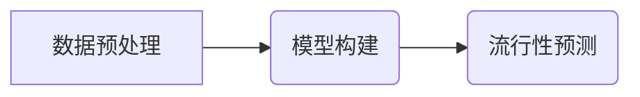

## 1. 背景介绍

### 1.1  产品流行性预测的意义

在当今竞争激烈的市场环境下，准确预测产品的流行性对于企业制定营销策略、优化资源配置、提升市场竞争力至关重要。产品流行性预测可以帮助企业：

* **提前规划生产和库存**: 准确预测产品的需求量，可以帮助企业提前规划生产和库存，避免供不应求或库存积压的情况发生。
* **制定精准的营销策略**: 通过预测产品的流行趋势，企业可以制定更有针对性的营销策略，例如选择合适的广告投放渠道、设计更吸引人的产品包装等。
* **优化产品设计**:  预测产品的流行趋势可以帮助企业了解用户的喜好和需求，从而优化产品设计，提升产品的市场竞争力。

### 1.2  传统预测方法的局限性

传统的预测方法，例如时间序列分析、回归分析等，往往难以捕捉产品流行性的复杂性和动态性。这些方法通常基于历史数据进行预测，而产品的流行性往往受到多种因素的影响，例如社交媒体的传播、用户口碑、市场竞争等，这些因素难以用传统的预测方法进行建模。

### 1.3 点过程模型的优势

点过程模型是一种强大的统计工具，可以用来描述和预测事件发生的随机模式。在产品流行性预测中，点过程模型可以用来描述用户购买、评论、分享等行为的发生时间和频率，从而更准确地预测产品的流行趋势。与传统预测方法相比，点过程模型具有以下优势：

* **能够捕捉事件发生的随机性和不规则性**: 点过程模型可以描述事件发生的随机时间间隔，以及事件发生的频率随时间的变化趋势。
* **能够考虑多种影响因素**:  点过程模型可以通过引入协变量来考虑多种影响因素，例如用户特征、产品特征、市场环境等。
* **具有较高的预测精度**:  点过程模型能够更准确地预测事件发生的概率，从而提高预测精度。

## 2. 核心概念与联系

### 2.1  点过程

点过程是指在某个空间或时间范围内随机发生的事件的集合。例如，用户在某个电商平台上购买产品的行为可以看作是一个点过程，每个购买行为都是一个事件，事件发生的时刻就是用户购买产品的时刻。

### 2.2  强度函数

强度函数是点过程模型的核心概念，它描述了事件在某个时刻发生的概率密度。强度函数可以是时间的函数，也可以是其他协变量的函数，例如用户特征、产品特征等。

### 2.3  流行性

产品的流行性可以定义为产品在一段时间内被用户购买、评论、分享等行为的总次数。产品的流行性可以通过点过程模型的强度函数来预测，强度函数值越高，表示产品在该时刻的流行性越高。

### 2.4  概念联系图


## 3. 核心算法原理具体操作步骤

### 3.1  数据预处理

* 收集用户购买、评论、分享等行为数据，包括事件发生的时刻、用户ID、产品ID等信息。
* 对数据进行清洗和整理，例如去除重复数据、处理缺失值等。
* 将数据按照时间顺序排序。

### 3.2  模型构建

* 选择合适的点过程模型，例如泊松过程、霍克斯过程等。
* 根据数据特点和预测目标选择合适的协变量，例如用户特征、产品特征、市场环境等。
* 使用最大似然估计法或贝叶斯方法估计模型参数。

### 3.3  流行性预测

* 使用估计的模型参数计算强度函数。
* 根据强度函数预测未来一段时间内产品流行性。

### 3.4  算法流程图



## 4. 数学模型和公式详细讲解举例说明

### 4.1  泊松过程

泊松过程是最简单的点过程模型，它假设事件发生的概率在时间上是恒定的。泊松过程的强度函数为：

$$
\lambda(t) = \lambda
$$

其中，$\lambda$ 表示事件发生的平均速率。

**举例说明:**

假设某个电商平台上用户购买产品的行为服从泊松过程，平均每小时有 10 个用户购买产品。那么，该泊松过程的强度函数为：

$$
\lambda(t) = 10
$$

这意味着，在任何时刻，用户购买产品的概率密度都是 10。

### 4.2  霍克斯过程

霍克斯过程是一种自激点过程模型，它假设事件的发生会增加未来事件发生的概率。霍克斯过程的强度函数为：

$$
\lambda(t) = \mu + \sum_{t_i < t} \alpha \exp(-\beta(t - t_i))
$$

其中，$\mu$ 表示事件发生的背景速率，$\alpha$ 表示事件的自激强度，$\beta$ 表示自激衰减速率，$t_i$ 表示过去事件发生的时刻。

**举例说明:**

假设某个社交媒体平台上用户转发帖子的行为服从霍克斯过程，背景转发速率为每小时 5 次，自激强度为 0.5，自激衰减速率为每小时 0.1。如果在过去一小时内有 2 个用户转发了帖子，那么当前时刻用户转发帖子的强度函数为：

$$
\lambda(t) = 5 + 0.5 \exp(-0.1(t - t_1)) + 0.5 \exp(-0.1(t - t_2))
$$

其中，$t_1$ 和 $t_2$ 分别表示过去两个用户转发帖子的时刻。

## 5. 项目实践：代码实例和详细解释说明

```python
import numpy as np
from scipy.optimize import minimize

# 定义霍克斯过程的强度函数
def hawkes_intensity(params, history, t):
    mu, alpha, beta = params
    intensity = mu
    for ti in history:
        intensity += alpha * np.exp(-beta * (t - ti))
    return intensity

# 定义负对数似然函数
def negative_log_likelihood(params, history):
    T = history[-1]
    n = len(history)
    intensity = lambda t: hawkes_intensity(params, history, t)
    integral, _ = quad(intensity, 0, T)
    ll = n * np.log(mu) - integral
    for i in range(1, n):
        ll -= np.log(intensity(history[i]))
    return -ll

# 加载数据
history = np.array([1, 3, 5, 8, 10])

# 估计模型参数
initial_params = [1, 0.5, 0.1]
result = minimize(negative_log_likelihood, initial_params, args=(history,))
mu, alpha, beta = result.x

# 预测未来一段时间内产品的流行性
t_future = np.arange(11, 21)
intensity_future = hawkes_intensity([mu, alpha, beta], history, t_future)
popularity_forecast = np.cumsum(intensity_future)

# 打印结果
print("Estimated parameters:", mu, alpha, beta)
print("Popularity forecast:", popularity_forecast)
```

**代码解释：**

* 首先，定义了霍克斯过程的强度函数 `hawkes_intensity()`，它接受模型参数、历史事件数据和当前时刻作为输入，返回当前时刻的强度值。
* 然后，定义了负对数似然函数 `negative_log_likelihood()`，它接受模型参数和历史事件数据作为输入，返回负对数似然值。负对数似然函数用于衡量模型参数与观测数据的拟合程度，拟合程度越高，负对数似然值越小。
* 接着，加载了历史事件数据 `history`。
* 使用 `minimize()` 函数最小化负对数似然函数，从而估计模型参数 `mu`、`alpha` 和 `beta`。
* 最后，使用估计的模型参数计算未来一段时间内产品的流行性 `popularity_forecast`。

## 6. 实际应用场景

* **电商平台**: 预测商品的销量趋势，帮助平台制定促销策略、优化库存管理。
* **社交媒体**: 预测帖子的传播范围，帮助平台识别热门话题、优化内容推荐。
* **金融市场**: 预测股票价格波动，帮助投资者制定投资策略。

## 7. 工具和资源推荐

* **Python**: 
    * `statsmodels` 包提供了点过程模型的实现，包括泊松过程、霍克斯过程等。
    * `tick` 包提供了点过程模型的模拟和推理工具。
* **R**: 
    * `PtProcess` 包提供了点过程模型的实现，包括泊松过程、霍克斯过程等。
* **书籍**: 
    * "Introduction to the Theory of Point Processes" by Daley and Vere-Jones
    * "Stochastic Processes" by Sheldon Ross

## 8. 总结：未来发展趋势与挑战

### 8.1  未来发展趋势

* **更复杂的点过程模型**: 研究人员正在探索更复杂的点过程模型，例如带有空间结构的点过程模型、非齐次点过程模型等，以更准确地描述和预测事件发生的模式。
* **与深度学习的结合**: 将点过程模型与深度学习技术相结合，可以更有效地提取数据特征、提高预测精度。
* **更广泛的应用领域**: 点过程模型的应用领域将不断扩展，例如医疗诊断、交通预测、网络安全等。

### 8.2  挑战

* **数据质量**: 点过程模型的预测精度 heavily rely on 数据质量，因此需要收集高质量的数据并进行有效的预处理。
* **模型选择**: 选择合适的点过程模型和协变量对于预测精度至关重要，需要根据具体应用场景进行选择。
* **模型解释**: 点过程模型的解释性相对较差，需要开发更易于理解的模型解释方法。


## 9. 附录：常见问题与解答

### 9.1  如何选择合适的点过程模型？

选择点过程模型需要考虑以下因素：

* **事件发生的特征**: 例如，事件是否服从泊松分布、事件之间是否存在自激效应等。
* **数据特点**: 例如，数据的时间跨度、事件发生的频率等。
* **预测目标**: 例如，是预测事件发生的概率还是预测事件发生的次数。

### 9.2  如何评估点过程模型的预测精度？

可以使用以下指标评估点过程模型的预测精度：

* **平均绝对误差 (MAE)**
* **均方根误差 (RMSE)**
* **决定系数 (R-squared)**

### 9.3  如何解释点过程模型的预测结果？

可以分析模型参数的含义，例如强度函数的系数、自激强度等，以及模型预测的趋势，例如事件发生的频率随时间的变化趋势。
