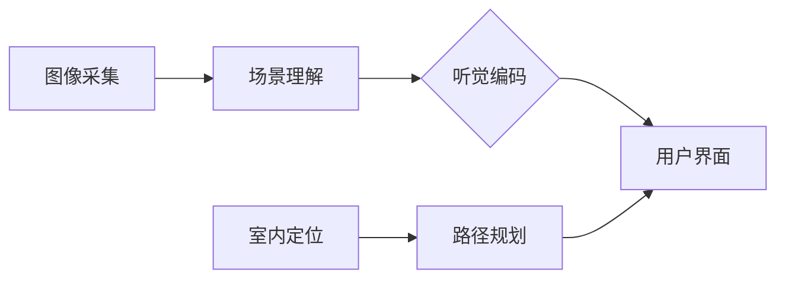

## 1. 背景介绍

### 1.1 视觉障碍人士的出行挑战

全球范围内，数百万视觉障碍人士在日常生活中面临着巨大的出行挑战。传统的导盲方式，如导盲犬和盲杖，虽然在一定程度上提供了帮助，但仍然存在许多局限性。例如，导盲犬需要专业的训练和照顾，成本高昂；盲杖只能探测近距离的障碍物，无法提供远距离的环境信息。

### 1.2 室内导航的特殊需求

室内环境相对于室外环境更加复杂，存在着更多的障碍物、路径变化和人员流动。传统的导航方式在室内环境中往往难以发挥作用。因此，针对视觉障碍人士的室内导盲系统设计成为了一个重要的研究方向。

### 1.3 视觉-听觉转换技术的应用前景

近年来，随着人工智能和传感器技术的快速发展，视觉-听觉转换技术为室内导盲系统的设计提供了新的思路。通过将视觉信息转换为听觉信息，可以帮助视觉障碍人士感知周围环境，实现自主导航。

## 2. 核心概念与联系

### 2.1 视觉-听觉转换

视觉-听觉转换是指将视觉信息转换为听觉信息的过程。该过程通常涉及以下步骤：

* **图像采集:** 使用摄像头等设备采集室内环境的图像信息。
* **场景理解:** 利用计算机视觉技术对图像进行分析，识别场景中的物体、障碍物、路径等信息。
* **听觉编码:** 将识别出的视觉信息转换为相应的听觉信号，例如语音提示、环境音效等。

### 2.2 室内定位

室内定位是指确定用户在室内环境中的位置信息。常用的室内定位技术包括：

* **基于 Wi-Fi 的定位:** 利用 Wi-Fi 信号强度进行定位。
* **基于蓝牙的定位:** 利用蓝牙信号进行定位。
* **基于超宽带 (UWB) 的定位:** 利用 UWB 信号进行高精度定位。

### 2.3 路径规划

路径规划是指根据用户的起始位置和目标位置，规划出一条可行的行走路径。路径规划算法需要考虑障碍物、路径长度、安全性等因素。

### 2.4 系统架构

基于视觉-听觉转换的室内导盲系统通常包含以下模块：



## 3. 核心算法原理具体操作步骤

### 3.1 图像采集

* 使用深度摄像头采集室内环境的 RGB 图像和深度信息。
* 使用广角镜头捕捉更广阔的视野范围。

### 3.2 场景理解

* **目标检测:** 使用深度学习模型识别场景中的物体，例如墙壁、门、家具、行人等。
* **语义分割:** 将图像分割成不同的语义区域，例如地面、墙壁、障碍物等。
* **深度估计:** 利用深度信息估计物体与用户之间的距离。

### 3.3 听觉编码

* **空间音频:** 根据物体的位置和距离，生成具有空间感的音频信号，例如从左侧传来门的声音、从前方传来障碍物的提示音等。
* **语音合成:** 将识别出的物体信息转换为语音提示，例如“前方有障碍物”、“请左转”等。
* **环境音效:** 模拟室内环境的背景音效，例如脚步声、开门声等，增强用户的沉浸感。

## 4. 数学模型和公式详细讲解举例说明

### 4.1 深度估计

深度估计可以使用立体视觉或结构光等方法实现。以立体视觉为例，其数学模型如下：

$$
d = \frac{bf}{x_l - x_r}
$$

其中，$d$ 表示物体与摄像头之间的距离，$b$ 表示两个摄像头之间的距离，$f$ 表示摄像头的焦距，$x_l$ 和 $x_r$ 分别表示物体在左右两个摄像头图像中的水平坐标。

### 4.2 路径规划

路径规划可以使用 Dijkstra 算法或 A* 算法等方法实现。以 A* 算法为例，其核心公式如下：

$$
f(n) = g(n) + h(n)
$$

其中，$f(n)$ 表示节点 $n$ 的总代价，$g(n)$ 表示从起点到节点 $n$ 的实际代价，$h(n)$ 表示从节点 $n$ 到目标节点的估计代价。

## 5. 项目实践：代码实例和详细解释说明

### 5.1 Python 代码示例

```python
import cv2
import numpy as np

# 加载深度学习模型
model = cv2.dnn.readNet("yolov4.weights", "yolov4.cfg")

# 读取摄像头图像
cap = cv2.VideoCapture(0)
ret, frame = cap.read()

# 目标检测
blob = cv2.dnn.blobFromImage(frame, 1/255, (416, 416), (0, 0, 0), True, crop=False)
model.setInput(blob)
outputs = model.forward(model.getUnconnectedOutLayersNames())

# 解析检测结果
boxes = []
confidences = []
classIDs = []
for output in outputs:
    for detection in output:
        scores = detection[5:]
        classID = np.argmax(scores)
        confidence = scores[classID]
        if confidence > 0.5:
            box = detection[0:4] * np.array([frame.shape[1], frame.shape[0], frame.shape[1], frame.shape[0]])
            (centerX, centerY, width, height) = box.astype("int")
            x = int(centerX - (width / 2))
            y = int(centerY - (height / 2))
            boxes.append([x, y, int(width), int(height)])
            confidences.append(float(confidence))
            classIDs.append(classID)

# 绘制检测结果
for i in range(len(boxes)):
    x, y, w, h = boxes[i]
    cv2.rectangle(frame, (x, y), (x + w, y + h), (0, 255, 0), 2)
    text = "{}: {:.4f}".format(classNames[classIDs[i]], confidences[i])
    cv2.putText(frame, text, (x, y - 5), cv2.FONT_HERSHEY_SIMPLEX, 0.5, (0, 255, 0), 2)

# 显示结果
cv2.imshow("Object Detection", frame)
cv2.waitKey(0)
```

### 5.2 代码解释

* 该代码使用 OpenCV 库实现目标检测功能。
* 首先，加载 YOLOv4 深度学习模型。
* 然后，读取摄像头图像并进行目标检测。
* 最后，绘制检测结果并显示出来。

## 6. 实际应用场景

### 6.1 室内导航

* 为视觉障碍人士提供室内导航服务，例如在商场、博物馆、医院等场所。
* 帮助用户找到特定的目标位置，例如卫生间、电梯、商店等。

### 6.2 环境感知

* 提醒用户注意周围的障碍物，例如墙壁、家具、行人等。
* 提供环境信息，例如房间大小、光线强度等。

### 6.3 信息获取

* 帮助用户获取周围环境的信息，例如商品价格、展览内容等。
* 提供语音播报服务，例如新闻、天气预报等。

## 7. 工具和资源推荐

### 7.1 OpenCV

OpenCV 是一个开源的计算机视觉库，提供了丰富的图像处理和分析功能。

### 7.2 TensorFlow

TensorFlow 是一个开源的机器学习平台，可以用于构建和训练深度学习模型。

### 7.3 PyTorch

PyTorch 是另一个开源的机器学习平台，也提供了丰富的深度学习功能。

## 8. 总结：未来发展趋势与挑战

### 8.1 未来发展趋势

* **多模态融合:** 将视觉、听觉、触觉等多种感官信息融合，提供更加丰富和准确的环境感知。
* **个性化定制:** 根据用户的个体差异，提供个性化的导航服务。
* **云端协同:** 利用云计算技术，提升系统的计算能力和服务质量。

### 8.2 挑战

* **复杂环境适应性:** 室内环境复杂多变，系统需要具备较强的适应性。
* **实时性要求:** 导航服务需要具备较高的实时性，以确保用户的安全。
* **隐私保护:** 系统需要保护用户的隐私信息，避免泄露。

## 9. 附录：常见问题与解答

### 9.1 视觉-听觉转换的精度如何？

视觉-听觉转换的精度取决于所使用的算法和模型。目前，深度学习技术已经能够实现较高的识别精度，但仍然存在一定的误差。

### 9.2 系统的成本如何？

系统的成本取决于所使用的硬件和软件。目前，一些低成本的解决方案已经出现，但高性能的系统仍然需要较高的成本。

### 9.3 系统的应用范围有多广？

视觉-听觉转换技术可以应用于各种室内场景，例如商场、博物馆、医院、学校等。随着技术的不断发展，其应用范围将会越来越广。
