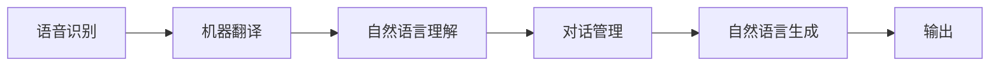

## 1. 背景介绍

### 1.1. 全球化浪潮与语言障碍

随着全球化的不断深入，不同国家和地区之间的交流日益频繁。然而，语言障碍成为了阻碍跨文化沟通和合作的重要因素。传统的翻译工具虽然能够在一定程度上解决语言转换问题，但其效率和准确性仍然存在局限性，尤其是在面对口语、方言、俚语等非标准语言形式时显得力不从心。

### 1.2. 智能对话系统的兴起与机遇

近年来，随着人工智能技术的飞速发展，智能对话系统逐渐成为人机交互的新兴领域。这些系统能够理解自然语言，并根据用户的意图进行相应的回应，为打破语言障碍提供了新的机遇。多语言支持成为了智能对话系统走向实用化和普及化的关键技术之一。

### 1.3. 多语言支持的意义和价值

多语言支持不仅能够促进跨文化交流，还能够在商业、教育、医疗等领域发挥重要作用。例如，多语言客服系统能够为全球用户提供便捷的服务，多语言教育平台能够帮助学生学习不同语言，多语言医疗助手能够为患者提供多语种的医疗咨询和服务。

## 2. 核心概念与联系

### 2.1. 自然语言处理 (NLP)

自然语言处理是人工智能领域的一个重要分支，其目标是让计算机能够理解和处理人类语言。多语言支持的实现离不开自然语言处理技术的支持。

#### 2.1.1. 语音识别

将语音信号转换为文本信息，是多语言支持的第一步。

#### 2.1.2. 机器翻译

将一种语言的文本翻译成另一种语言的文本，是实现跨语言沟通的关键。

#### 2.1.3. 自然语言理解

理解文本的含义，包括语义分析、情感分析、意图识别等。

#### 2.1.4. 自然语言生成

根据语义信息生成自然流畅的文本，用于对话系统的回复。

### 2.2. 多语言模型

多语言模型是指能够处理多种语言的机器学习模型，是实现多语言支持的核心。

#### 2.2.1. 基于统计的机器翻译模型

利用平行语料库进行统计学习，构建翻译模型。

#### 2.2.2. 基于神经网络的机器翻译模型

利用深度学习技术，构建端到端的翻译模型，近年来取得了显著进展。

#### 2.2.3. 跨语言预训练模型

在多种语言的大规模语料库上进行预训练，学习语言的通用特征，可以用于多种下游任务。

### 2.3. 多语言对话系统架构

多语言对话系统通常采用模块化设计，包括语音识别、机器翻译、自然语言理解、对话管理、自然语言生成等模块，各个模块之间相互协作，共同完成多语言对话任务。

## 3. 核心算法原理具体操作步骤

### 3.1. 机器翻译

#### 3.1.1. 统计机器翻译

统计机器翻译基于平行语料库，利用统计方法学习两种语言之间的对应关系。

##### 3.1.1.1. 词对齐

识别两种语言中相互对应的词语。

##### 3.1.1.2. 短语提取

提取两种语言中常用的短语。

##### 3.1.1.3. 翻译模型训练

利用词对齐和短语提取的结果，训练翻译模型。

#### 3.1.2. 神经机器翻译

神经机器翻译利用深度学习技术，构建端到端的翻译模型。

##### 3.1.2.1. 编码器

将源语言文本编码成向量表示。

##### 3.1.2.2. 解码器

将向量表示解码成目标语言文本。

##### 3.1.2.3. 注意力机制

帮助模型关注源语言文本中的关键信息。

### 3.2. 跨语言预训练模型

#### 3.2.1. 掩码语言模型

通过掩盖部分词语，训练模型预测被掩盖的词语，学习语言的上下文信息。

#### 3.2.2. 翻译语言模型

通过将一种语言的文本翻译成另一种语言，训练模型学习语言之间的对应关系。

#### 3.2.3. 多任务学习

将多种语言的任务联合训练，提升模型的泛化能力。

## 4. 数学模型和公式详细讲解举例说明

### 4.1. 统计机器翻译模型

#### 4.1.1. 噪声信道模型

$$
P(e|f) = P(f|e)P(e) / P(f)
$$

其中，$e$ 表示源语言文本，$f$ 表示目标语言文本，$P(e|f)$ 表示在已知目标语言文本的情况下，源语言文本的概率，$P(f|e)$ 表示翻译模型，$P(e)$ 表示源语言文本的概率，$P(f)$ 表示目标语言文本的概率。

#### 4.1.2. 对数线性模型

$$
P(f|e) = exp(\sum_{i=1}^{n} \lambda_i h_i(e,f)) / Z(e)
$$

其中，$h_i(e,f)$ 表示特征函数，$\lambda_i$ 表示特征权重，$Z(e)$ 表示归一化因子。

### 4.2. 神经机器翻译模型

#### 4.2.1. 循环神经网络 (RNN)

$$
h_t = f(h_{t-1}, x_t)
$$

其中，$h_t$ 表示t时刻的隐藏状态，$x_t$ 表示t时刻的输入，$f$ 表示循环神经网络的激活函数。

#### 4.2.2. 长短期记忆网络 (LSTM)

$$
\begin{aligned}
i_t &= \sigma(W_i[h_{t-1}, x_t] + b_i) \\
f_t &= \sigma(W_f[h_{t-1}, x_t] + b_f) \\
o_t &= \sigma(W_o[h_{t-1}, x_t] + b_o) \\
\tilde{c}_t &= tanh(W_c[h_{t-1