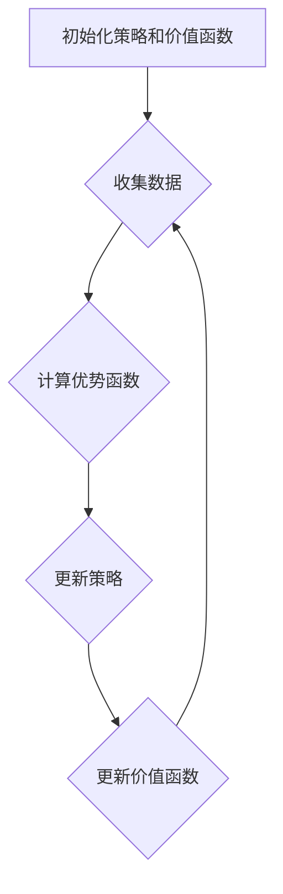

## 1. 背景介绍

### 1.1 大规模语言模型的崛起

近年来，随着计算能力的提升和数据的爆炸式增长，大规模语言模型（LLM）如雨后春笋般涌现，并在自然语言处理领域取得了突破性进展。从 GPT-3 到 BERT，再到 ChatGPT，这些模型展现出了惊人的语言理解和生成能力，为人工智能的发展开辟了新的道路。

### 1.2 强化学习与语言模型的结合

强化学习（RL）是一种通过试错来学习的机器学习方法，其目标是找到一个策略，使得智能体在与环境交互过程中获得最大化的累积奖励。将强化学习应用于语言模型训练，可以进一步提升模型的性能和泛化能力。

### 1.3 近端策略优化：一种高效的强化学习算法

近端策略优化（PPO）是一种高效的强化学习算法，它在策略梯度方法的基础上进行了改进，通过限制策略更新幅度来保证学习过程的稳定性。PPO 算法在实践中取得了良好的效果，被广泛应用于各种强化学习任务，包括机器人控制、游戏 AI 等。

## 2. 核心概念与联系

### 2.1 大规模语言模型

大规模语言模型是指包含数十亿甚至数千亿参数的深度学习模型，它们通过学习海量文本数据来掌握语言的规律和模式。这些模型可以用于各种自然语言处理任务，例如文本生成、机器翻译、问答系统等。

### 2.2 强化学习

强化学习是一种机器学习方法，它通过试错来学习，其目标是找到一个策略，使得智能体在与环境交互过程中获得最大化的累积奖励。强化学习的核心要素包括：

* **智能体（Agent）**:  执行动作并与环境交互的实体。
* **环境（Environment）**:  智能体所处的外部世界。
* **状态（State）**:  描述环境当前状况的信息。
* **动作（Action）**:  智能体可以采取的操作。
* **奖励（Reward）**:  环境对智能体动作的反馈，用于评估动作的好坏。
* **策略（Policy）**:  智能体根据当前状态选择动作的规则。

### 2.3 近端策略优化

近端策略优化（PPO）是一种基于策略梯度的强化学习算法，它通过限制策略更新幅度来保证学习过程的稳定性。PPO 算法的核心思想是：

* 在每次迭代中，计算当前策略与旧策略之间的差异，并限制这种差异的大小。
* 使用 KL 散度来衡量策略之间的差异。
* 通过优化一个目标函数来更新策略，该目标函数包含奖励项和策略差异惩罚项。

## 3. 核心算法原理具体操作步骤

### 3.1 PPO 算法流程

PPO 算法的流程如下：

1. 初始化策略 $\pi_{\theta_0}$ 和价值函数 $V_{\phi_0}$。
2. 循环迭代：
    * **收集数据**: 使用当前策略 $\pi_{\theta}$ 与环境交互，收集状态、动作、奖励等数据。
    * **计算优势函数**: 使用价值函数 $V_{\phi}$ 计算每个状态-动作对的优势函数 $A(s, a)$。
    * **更新策略**: 通过最小化目标函数 $L^{CLIP}(\theta)$ 来更新策略参数 $\theta$。
    * **更新价值函数**: 通过最小化均方误差损失函数来更新价值函数参数 $\phi$。

### 3.2 目标函数

PPO 算法的目标函数为：

$$
L^{CLIP}(\theta) = \mathbb{E}_t \left[ \min \left( r_t(\theta) A_t, \text{clip}(r_t(\theta), 1 - \epsilon, 1 + \epsilon) A_t \right) \right]
$$

其中：

* $r_t(\theta) = \frac{\pi_{\theta}(a_t|s_t)}{\pi_{\theta_{old}}(a_t|s_t)}$ 是新旧策略的概率比。
* $A_t$ 是状态-动作对 $(s_t, a_t)$ 的优势函数。
* $\epsilon$ 是一个超参数，用于控制策略更新幅度。

### 3.3 优势函数

优势函数表示在状态 $s$ 下采取动作 $a$ 比平均水平好多少。它可以表示为：

$$
A(s, a) = Q(s, a) - V(s)
$$

其中：

* $Q(s, a)$ 是状态-动作值函数，表示在状态 $s$ 下采取动作 $a$ 后所能获得的期望累积奖励。
* $V(s)$ 是状态值函数，表示在状态 $s$ 下所能获得的期望累积奖励。

## 4. 数学模型和公式详细讲解举例说明

### 4.1 策略梯度定理

策略梯度定理是强化学习中一个重要的理论基础，它表明可以通过梯度上升来优化策略，使得期望累积奖励最大化。策略梯度可以表示为：

$$
\nabla_{\theta} J(\theta) = \mathbb{E}_{\tau \sim \pi_{\theta}} \left[ \sum_{t=0}^{T-1} \nabla_{\theta} \log \pi_{\theta}(a_t|s_t) R(\tau) \right]
$$

其中：

* $J(\theta)$ 是期望累积奖励。
* $\tau$ 是一个轨迹，表示状态-动作序列 $(s_0, a_0, s_1, a_1, ..., s_{T-1}, a_{T-1})$。
* $R(\tau)$ 是轨迹 $\tau$ 的累积奖励。

### 4.2 KL 散度

KL 散度是衡量两个概率分布之间差异的一种度量方法。对于离散概率分布 $P$ 和 $Q$，它们的 KL 散度可以表示为：

$$
D_{KL}(P||Q) = \sum_{x} P(x) \log \frac{P(x)}{Q(x)}
$$

### 4.3 举例说明

假设我们有一个智能体在玩一个简单的游戏，游戏的目标是在迷宫中找到宝藏。智能体的状态是它在迷宫中的位置，动作是它可以移动的方向（上、下、左、右）。奖励函数定义为：

* 找到宝藏：+1
* 撞到墙壁：-1
* 其他情况：0

我们可以使用 PPO 算法来训练智能体的策略。首先，我们需要定义策略网络和价值网络。策略网络是一个神经网络，它接收状态作为输入，输出每个动作的概率。价值网络也是一个神经网络，它接收状态作为输入，输出状态值。

接下来，我们可以使用 PPO 算法的流程来训练智能体。在每次迭代中，我们使用当前策略与环境交互，收集状态、动作、奖励等数据。然后，我们使用价值网络计算每个状态-动作对的优势函数。最后，我们通过最小化目标函数来更新策略网络和价值网络的参数。

## 5. 项目实践：代码实例和详细解释说明

### 5.1 环境搭建

首先，我们需要搭建一个 Python 环境，并安装相关的库，例如 TensorFlow 或 PyTorch。

```python
pip install tensorflow
```

### 5.2 代码实现

以下是一个使用 TensorFlow 实现 PPO 算法的简单示例：

```python
import tensorflow as tf

class PPOAgent:
    def __init__(self, state_dim, action_dim, learning_rate, epsilon, gamma, lam):
        self.state_dim = state_dim
        self.action_dim = action_dim
        self.learning_rate = learning_rate
        self.epsilon = epsilon
        self.gamma = gamma
        self.lam = lam

        self.policy_net = self._build_policy_net()
        self.value_net = self._build_value_net()
        self.optimizer = tf.keras.optimizers.Adam(learning_rate=self.learning_rate)

    def _build_policy_net(self):
        # 定义策略网络
        inputs = tf.keras.Input(shape=(self.state_dim,))
        x = tf.keras.layers.Dense(64, activation='relu')(inputs)
        x = tf.keras.layers.Dense(64, activation='relu')(x)
        outputs = tf.keras.layers.Dense(self.action_dim, activation='softmax')(x)
        return tf.keras.Model(inputs=inputs, outputs=outputs)

    def _build_value_net(self):
        # 定义价值网络
        inputs = tf.keras.Input(shape=(self.state_dim,))
        x = tf.keras.layers.Dense(64, activation='relu')(inputs)
        x = tf.keras.layers.Dense(64, activation='relu')(x)
        outputs = tf.keras.layers.Dense(1)(x)
        return tf.keras.Model(inputs=inputs, outputs=outputs)

    def choose_action(self, state):
        # 选择动作
        probs = self.policy_net(state[None, :])
        action = tf.random.categorical(probs, num_samples=1)[0, 0]
        return action

    def train(self, states, actions, rewards, next_states, dones):
        # 计算优势函数
        values = self.value_net(states)
        next_values = self.value_net(next_states)
        td_targets = rewards + self.gamma * next_values * (1 - dones)
        advantages = td_targets - values

        # 更新策略网络
        with tf.GradientTape() as tape:
            probs = self.policy_net(states)
            old_probs = tf.stop_gradient(probs)
            action_probs = tf.reduce_sum(probs * tf.one_hot(actions, self.action_dim), axis=1)
            old_action_probs = tf.stop_gradient(action_probs)
            ratio = action_probs / old_action_probs
            clipped_ratio = tf.clip_by_value(ratio, 1 - self.epsilon, 1 + self.epsilon)
            loss = -tf.reduce_mean(tf.minimum(ratio * advantages, clipped_ratio * advantages))
        grads = tape.gradient(loss, self.policy_net.trainable_variables)
        self.optimizer.apply_gradients(zip(grads, self.policy_net.trainable_variables))

        # 更新价值网络
        with tf.GradientTape() as tape:
            values = self.value_net(states)
            loss = tf.reduce_mean(tf.square(td_targets - values))
        grads = tape.gradient(loss, self.value_net.trainable_variables)
        self.optimizer.apply_gradients(zip(grads, self.value_net.trainable_variables))
```

### 5.3 代码解释

* **`PPOAgent` 类**:  该类定义了 PPO 智能体，包括策略网络、价值网络、优化器等。
* **`_build_policy_net` 和 `_build_value_net` 方法**:  用于构建策略网络和价值网络。
* **`choose_action` 方法**:  根据当前状态选择动作。
* **`train` 方法**:  使用收集到的数据训练智能体。
* **`loss`**:  PPO 算法的目标函数。

## 6. 实际应用场景

### 6.1 游戏 AI

PPO 算法可以用于训练游戏 AI，例如 Atari 游戏、围棋、星际争霸等。

### 6.2 机器人控制

PPO 算法可以用于训练机器人控制策略，例如机械臂控制、无人机导航等。

### 6.3 自然语言处理

PPO 算法可以用于训练大规模语言模型，例如文本生成、机器翻译、问答系统等。

## 7. 工具和资源推荐

### 7.1 TensorFlow

TensorFlow 是 Google 开源的机器学习框架，提供了丰富的 API 和工具，可以用于实现 PPO 算法。

### 7.2 PyTorch

PyTorch 是 Facebook 开源的机器学习框架，也提供了丰富的 API 和工具，可以用于实现 PPO 算法。

### 7.3 OpenAI Gym

OpenAI Gym 是一个用于开发和比较强化学习算法的工具包，提供了各种各样的环境，可以用于测试 PPO 算法。

## 8. 总结：未来发展趋势与挑战

### 8.1 未来发展趋势

* **更强大的模型**:  随着计算能力的提升和数据的增长，我们可以训练更大规模的语言模型，从而进一步提升模型的性能和泛化能力。
* **更广泛的应用**:  PPO 算法可以应用于更广泛的领域，例如金融、医疗、教育等。
* **更深入的理解**:  我们需要更深入地理解 PPO 算法的原理和机制，以便更好地改进和优化算法。

### 8.2 挑战

* **数据效率**:  训练大规模语言模型需要大量的计算资源和数据，如何提高数据效率是一个重要的挑战。
* **泛化能力**:  如何保证模型在不同任务和领域上的泛化能力是一个重要的挑战。
* **可解释性**:  如何解释大规模语言模型的决策过程是一个重要的挑战。

## 9. 附录：常见问题与解答

### 9.1 PPO 算法与其他强化学习算法的区别是什么？

PPO 算法是一种基于策略梯度的强化学习算法，它通过限制策略更新幅度来保证学习过程的稳定性。与其他策略梯度方法相比，PPO 算法具有以下优点：

* **更高的数据效率**:  PPO 算法可以更有效地利用数据，从而减少训练时间。
* **更好的稳定性**:  PPO 算法的策略更新幅度受到限制，从而避免了学习过程中的剧烈波动。
* **更易于实现**:  PPO 算法的实现相对简单，易于理解和调试。

### 9.2 如何选择 PPO 算法的超参数？

PPO 算法的超参数包括学习率、折扣因子、KL 散度阈值等。选择合适的超参数对于算法的性能至关重要。以下是一些选择超参数的建议：

* **学习率**:  学习率控制参数更新的幅度，过大的学习率会导致学习过程不稳定，过小的学习率会导致学习速度缓慢。
* **折扣因子**:  折扣因子控制未来奖励的重要性，较大的折扣因子意味着更加重视未来的奖励，较小的折扣因子意味着更加重视当前的奖励。
* **KL 散度阈值**:  KL 散度阈值控制策略更新幅度，较大的 KL 散度阈值意味着允许更大的策略更新，较小的 KL 散度阈值意味着限制策略更新幅度。

### 9.3 如何评估 PPO 算法的性能？

可以使用以下指标来评估 PPO 算法的性能：

* **平均奖励**:  平均奖励是衡量智能体在环境中获得的平均奖励。
* **最大奖励**:  最大奖励是衡量智能体在环境中获得的最大奖励。
* **成功率**:  成功率是衡量智能体完成任务的比例。
* **训练时间**:  训练时间是衡量算法训练所需的时间。


## 10.  Mermaid流程图

