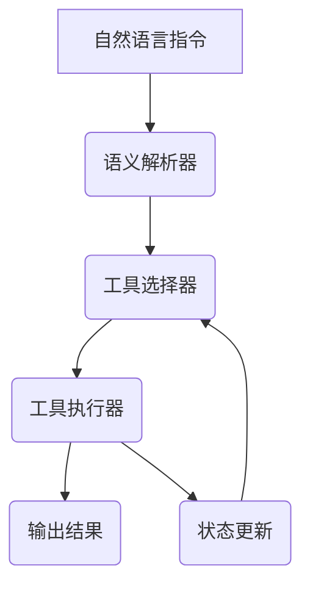

# 大语言模型应用指南：Toolformer

## 1. 背景介绍

### 1.1 大语言模型的兴起

近年来,自然语言处理(Natural Language Processing, NLP)领域取得了长足的进步,很大程度上归功于大型语言模型(Large Language Models, LLMs)的兴起。大语言模型是一种基于深度学习技术训练的巨大神经网络,能够在海量的自然语言数据上学习语言的内在规律和知识,从而获得强大的语言理解和生成能力。

典型的大语言模型包括GPT(Generative Pre-trained Transformer)系列、BERT(Bidirectional Encoder Representations from Transformers)、XLNet等。它们通过自监督预训练的方式在大规模文本语料库上学习,获取了广博的知识和语言理解能力,可以应用于多种自然语言处理任务,如机器翻译、问答系统、文本摘要等。

### 1.2 Toolformer的重要意义

尽管大语言模型展现出了强大的语言能力,但将它们应用于实际场景仍然面临诸多挑战。其中一个关键挑战是,大语言模型缺乏对任务和工具的理解能力,难以直接将语言能力转化为实际操作。

Toolformer(Tool Transformer)正是为解决这一挑战而诞生的新型大语言模型。它不仅具备卓越的语言理解和生成能力,而且能够学习和掌握各种工具的使用方法,从而将语言指令转化为实际操作,大大扩展了大语言模型的应用场景。

本文将全面介绍Toolformer的核心概念、工作原理、应用场景等,为读者揭开Toolformer的神秘面纱,并探讨其未来发展趋势和挑战。

## 2. 核心概念与联系

### 2.1 什么是工具(Tool)

在Toolformer的背景下,工具(Tool)指的是各种可执行的程序、函数或API,它们能够完成特定的任务或操作。工具可以是简单的命令行工具,如`ls`、`grep`等;也可以是复杂的Web API,如天气查询API、机器翻译API等。

工具的关键特征是:

1. **可执行性(Executability)**: 工具是可执行的,能够对输入执行特定的操作或转换,产生输出结果。
2. **输入输出界面(I/O Interface)**: 工具通常接受特定格式的输入,并产生特定格式的输出。
3. **功能单一性(Single Functionality)**: 每个工具通常只负责完成一个特定的功能或任务。

### 2.2 语义解析(Semantic Parsing)

语义解析是将自然语言指令转化为可执行操作的关键步骤。在Toolformer中,语义解析的目标是将用户的自然语言指令解析为对应的工具调用序列。

例如,如果用户输入了"给我查询一下纽约今天的天气"这样的指令,语义解析器需要识别出应该调用"天气查询API"这个工具,并将"纽约"和"今天"作为API的参数。

语义解析是一个具有挑战性的任务,需要同时理解自然语言的语义和工具的功能,并建立二者之间的映射关系。传统的语义解析方法通常依赖于大量的人工标注数据和规则,而Toolformer则尝试通过机器学习的方式自动获取这种映射能力。

### 2.3 工具组合(Tool Composition)

现实世界中的任务往往是复杂的,需要多个工具协同完成。因此,Toolformer不仅需要掌握单个工具的使用方法,还需要学会组合多个工具以完成复杂任务。

例如,如果用户想查询"纽约今天的最高气温是多少,并将结果转换为摄氏度",就需要先调用天气查询API获取纽约今天的天气信息,然后从结果中提取最高温度,最后将其从华氏度转换为摄氏度。这就需要组合"天气查询API"、"数据提取"和"单位转换"三个工具。

工具组合是一个具有挑战性的问题,需要同时考虑工具的功能、输入输出接口、执行顺序等多个因素。Toolformer通过序列决策的方式,学习在每一步选择最优工具并正确地组合多个工具,从而完成复杂任务。

### 2.4 Toolformer与传统大语言模型的区别

相比传统的大语言模型,Toolformer的一个关键区别是能够直接执行各种工具,而不仅仅是生成自然语言文本。这使得Toolformer可以将语言理解能力转化为实际操作,大大扩展了其应用场景。

另一个区别是,Toolformer需要同时学习语言知识和工具知识,并建立二者之间的映射关系。这对模型的学习能力提出了更高的要求,但也使得Toolformer具备了更强的理解和推理能力。

与此同时,Toolformer也继承了大语言模型的优势,如广博的知识储备、强大的语言理解和生成能力等。因此,Toolformer可以被视为大语言模型的一种升级和扩展,它将语言和工具的能力有机结合,开辟了人工智能应用的新领域。

## 3. 核心算法原理具体操作步骤 

### 3.1 Toolformer的总体架构

Toolformer的总体架构如下图所示:

1. **自然语言指令(Natural Language Instruction)**: 用户输入的自然语言指令,描述了需要完成的任务。
2. **语义解析器(Semantic Parser)**: 将自然语言指令解析为对应的工具调用序列。
3. **工具选择器(Tool Selector)**: 根据当前状态选择最佳工具。
4. **工具执行器(Tool Executor)**: 执行选定的工具,产生输出结果。
5. **输出结果(Output Result)**: 完成任务的最终结果。
6. **状态更新(State Update)**: 根据工具执行的结果更新当前状态。

整个过程是一个序列决策的循环,在每一步都需要根据当前状态选择最佳工具,直到完成整个任务。

### 3.2 语义解析器

语义解析器的目标是将自然语言指令解析为对应的工具调用序列。这是一个具有挑战性的任务,需要同时理解自然语言的语义和工具的功能,并建立二者之间的映射关系。

Toolformer采用了基于序列到序列(Sequence-to-Sequence)模型的方法来实现语义解析。具体步骤如下:

1. **编码(Encoding)**: 将自然语言指令和可用工具的描述信息编码为向量表示。
2. **解码(Decoding)**: 使用解码器(Decoder)根据编码后的向量,生成对应的工具调用序列。
3. **训练(Training)**: 在大量的指令-工具调用序列对的监督数据上,使用最大似然估计(Maximum Likelihood Estimation)或其他优化目标,训练序列到序列模型的参数。

在推理阶段,语义解析器将接收用户的自然语言指令和可用工具的描述信息,并输出对应的工具调用序列。

### 3.3 工具选择器

工具选择器的任务是根据当前状态选择最佳工具。这是一个序列决策问题,需要同时考虑工具的功能、输入输出接口、执行顺序等多个因素。

Toolformer采用了基于强化学习(Reinforcement Learning)的方法来训练工具选择器。具体步骤如下:

1. **状态表示(State Representation)**: 将当前的任务状态(包括自然语言指令、已执行的工具及其输出等)编码为向量表示。
2. **策略网络(Policy Network)**: 使用一个深度神经网络作为策略网络,根据状态向量输出每个可选工具的概率分布。
3. **采样(Sampling)**: 根据策略网络输出的概率分布,采样选择一个工具执行。
4. **奖惩(Reward)**: 执行选定的工具,根据任务完成情况给予奖惩反馈。
5. **策略优化(Policy Optimization)**: 使用策略梯度(Policy Gradient)等强化学习算法,优化策略网络的参数,使其能够学习到最优的工具选择策略。

在推理阶段,工具选择器将根据当前状态,选择概率最高的工具执行。

### 3.4 工具执行器

工具执行器的任务是执行选定的工具,并根据工具的输出更新当前状态。

工具执行器需要处理各种不同类型的工具,包括命令行工具、Web API、Python函数等。因此,它需要具备较强的通用性和可扩展性。

Toolformer采用了基于模板(Template-based)的方法来实现工具执行器。具体步骤如下:

1. **工具模板(Tool Template)**: 为每个工具定义一个模板,描述其输入输出接口、执行方式等信息。
2. **参数化(Parameterization)**: 根据语义解析器输出的工具调用序列,将模板中的占位符替换为实际参数。
3. **执行(Execution)**: 执行参数化后的工具模板,获取工具的输出结果。
4. **状态更新(State Update)**: 将工具的输出结果整合到当前状态中,为下一步的工具选择提供信息。

工具执行器的设计能够很好地支持新工具的快速集成,只需为新工具定义相应的模板即可,从而实现了良好的可扩展性。

## 4. 数学模型和公式详细讲解举例说明

### 4.1 序列到序列模型

语义解析器采用了基于序列到序列(Sequence-to-Sequence)模型的方法。序列到序列模型是一种广泛应用于机器翻译、对话系统等自然语言处理任务的模型架构。

在语义解析的场景下,序列到序列模型的输入是自然语言指令,输出是对应的工具调用序列。模型的目标是最大化输出序列的条件概率:

$$P(y_1, y_2, \dots, y_T | x_1, x_2, \dots, x_N)$$

其中$x_1, x_2, \dots, x_N$是输入指令的词序列,而$y_1, y_2, \dots, y_T$是输出的工具调用序列。

序列到序列模型通常由编码器(Encoder)和解码器(Decoder)两部分组成:

1. **编码器(Encoder)**: 将输入序列$x_1, x_2, \dots, x_N$编码为一个向量表示$c$,捕获输入序列的语义信息。
2. **解码器(Decoder)**: 根据编码器的输出$c$和之前生成的输出序列$y_1, y_2, \dots, y_{t-1}$,预测下一个输出$y_t$。

编码器和解码器通常都采用循环神经网络(Recurrent Neural Network, RNN)或transformer等序列模型架构。在训练阶段,模型会在大量的指令-工具调用序列对的监督数据上,使用最大似然估计或其他优化目标,学习模型参数。

序列到序列模型的优点是可以直接从输入到输出进行端到端的学习,无需人工设计复杂的特征工程。但是,它也存在着结构化输出的困难、长距离依赖的捕获能力有限等问题。因此,在语义解析任务中,序列到序列模型通常需要与其他技术(如结构化预测、注意力机制等)相结合,以获得更好的性能。

### 4.2 强化学习

工具选择器采用了基于强化学习(Reinforcement Learning)的方法。强化学习是一种基于环境交互的机器学习范式,其目标是学习一个策略(Policy),使得在环境中采取的行动序列能够最大化累积回报(Cumulative Reward)。

在工具选择的场景下,环境状态是当前的任务状态(包括自然语言指令、已执行的工具及其输出等),行动是选择执行某个工具,而回报则是根据任务完成情况给予的奖惩反馈。

强化学习的核心思想是通过与环境的互动,不断优化策略网络的参数,使其能够学习到最优的行动选择策略。具体来说,工具选择器采用了策略梯度(Policy Gradient)算法,其目标是最大化期望回报:

$$J(\theta)