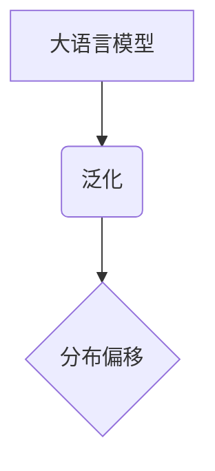

## 1. 背景介绍

### 1.1 大语言模型的崛起

近年来，自然语言处理 (NLP) 领域取得了显著的进步，这得益于深度学习技术的快速发展和计算能力的不断提升。其中，大语言模型 (LLM) 作为 NLP 领域的佼佼者，展现出强大的文本理解和生成能力，并在各种任务中取得了令人瞩目的成果。从机器翻译、文本摘要到对话系统，LLM 的应用范围不断扩大，深刻地影响着人们的生活和工作方式。

### 1.2 冲突的目标与不匹配的泛化

尽管 LLM 取得了巨大成功，但其应用过程中仍然面临着诸多挑战。其中，**冲突的目标**和**不匹配的泛化**是两个突出的问题。

* **冲突的目标**: LLM 在训练过程中通常以最大化训练数据的似然度为目标，这可能导致模型过度拟合训练数据，而难以泛化到未见数据。此外，不同的应用场景对 LLM 的性能要求不同，例如在机器翻译任务中，我们希望模型能够生成流畅自然的译文，而在情感分析任务中，我们则希望模型能够准确识别文本的情感倾向。这些不同的目标之间可能存在冲突，使得难以找到一个适用于所有场景的最优模型。
* **不匹配的泛化**: LLM 在训练数据上表现出色，但在实际应用中却可能出现性能下降的情况。这是因为训练数据和实际应用数据之间存在**分布偏移**，即数据的统计特性存在差异。例如，用于训练 LLM 的文本数据通常来自新闻、书籍等高质量语料库，而实际应用中用户输入的文本可能包含拼写错误、语法错误等噪声。这种数据分布的差异会导致 LLM 难以泛化到实际应用场景。

### 1.3 本文的目的

本文旨在探讨 LLM 应用过程中冲突的目标与不匹配的泛化问题，并提供相应的解决方案和实践指南。我们将从以下几个方面展开讨论：

* 深入分析 LLM 训练目标与应用目标之间的冲突，以及数据分布偏移对模型泛化的影响。
* 介绍解决冲突目标和不匹配泛化问题的常用方法，包括多任务学习、领域自适应、数据增强等。
* 提供 LLM 应用的最佳实践，帮助读者更好地理解和应用 LLM 技术。

## 2. 核心概念与联系

### 2.1 语言模型

**语言模型**是用于估计文本序列概率的统计模型。给定一个文本序列 $w_1, w_2, ..., w_n$，语言模型可以计算出该序列的概率 $P(w_1, w_2, ..., w_n)$。语言模型可以用于各种 NLP 任务，例如：

* **文本生成**: 根据给定的上下文，生成后续的文本序列。
* **机器翻译**: 将一种语言的文本序列翻译成另一种语言的文本序列。
* **语音识别**: 将语音信号转换为文本序列。

### 2.2 大语言模型

**大语言模型 (LLM)** 是指参数量巨大、训练数据规模庞大的语言模型。LLM 通常基于 Transformer 架构，并采用自监督学习的方式进行训练。与传统的语言模型相比，LLM 具有更强的文本理解和生成能力，并在各种 NLP 任务中取得了更好的性能。

### 2.3 泛化

**泛化**是指模型在未见数据上的性能表现。一个具有良好泛化能力的模型能够在训练数据之外的数据集上取得良好的性能。

### 2.4 分布偏移

**分布偏移**是指训练数据和测试数据之间的数据分布存在差异。分布偏移会导致模型难以泛化到测试数据，从而影响模型的性能。

### 2.5 核心概念之间的联系

下图展示了 LLM、泛化、分布偏移之间的联系：



LLM 的目标是实现良好的泛化能力，即在未见数据上取得良好的性能。然而，分布偏移会导致 LLM 难以泛化到测试数据，从而影响模型的性能。

## 3. 核心算法原理具体操作步骤

### 3.1 多任务学习

**多任务学习**是指同时训练多个相关的任务，以提高模型的泛化能力。在 LLM 中，我们可以将不同的 NLP 任务作为不同的任务，并使用多任务学习的方式进行训练。例如，我们可以同时训练 LLM 进行机器翻译、文本摘要和情感分析任务。

**具体操作步骤**:

1. **定义多个任务**: 确定要同时训练的 NLP 任务。
2. **构建多任务模型**: 设计一个能够同时处理多个任务的模型架构。
3. **定义损失函数**: 为每个任务定义相应的损失函数。
4. **联合训练**: 使用所有任务的数据联合训练模型。

### 3.2 领域自适应

**领域自适应**是指将模型从源域迁移到目标域，以提高模型在目标域上的性能。在 LLM 中，我们可以将训练数据视为源域，将实际应用数据视为目标域。

**具体操作步骤**:

1. **获取目标域数据**: 收集目标域的文本数据。
2. **领域对抗训练**: 使用领域对抗训练的方法，使模型学习到领域不变的特征表示。
3. **微调**: 使用目标域数据对模型进行微调。

### 3.3 数据增强

**数据增强**是指通过对现有数据进行变换，生成新的数据，以扩充训练数据集。在 LLM 中，我们可以使用以下数据增强方法：

* **回译**: 将文本翻译成另一种语言，然后再翻译回原始语言。
* **同义词替换**: 使用同义词替换文本中的某些词语。
* **随机插入**: 随机插入一些词语或字符到文本中。

**具体操作步骤**:

1. **选择数据增强方法**: 根据任务需求选择合适的数据增强方法。
2. **生成新数据**: 使用数据增强方法生成新的训练数据。
3. **扩充训练数据集**: 将新数据添加到训练数据集中。

## 4. 数学模型和公式详细讲解举例说明

### 4.1 语言模型的数学模型

语言模型的数学模型可以表示为：

$$
P(w_1, w_2, ..., w_n) = \prod_{i=1}^{n} P(w_i | w_1, w_2, ..., w_{i-1})
$$

其中，$P(w_i | w_1, w_2, ..., w_{i-1})$ 表示在给定上下文 $w_1, w_2, ..., w_{i-1}$ 的情况下，词语 $w_i$ 出现的概率。

### 4.2 Transformer 架构

Transformer 架构是 LLM 中常用的模型架构。Transformer 架构的核心是自注意力机制，它可以捕捉文本序列中不同位置之间的依赖关系。

**自注意力机制的数学模型**:

$$
Attention(Q, K, V) = softmax(\frac{QK^T}{\sqrt{d_k}})V
$$

其中，$Q$、$K$、$V$ 分别表示查询矩阵、键矩阵和值矩阵，$d_k$ 表示键矩阵的维度。

### 4.3 领域对抗训练

领域对抗训练的数学模型可以表示为：

$$
\min_{\theta_f, \theta_c} \mathcal{L}_c(f(x;\theta_f), y) + \lambda \mathcal{L}_d(c(f(x;\theta_f);\theta_c), d)
$$

其中，$\theta_f$ 表示特征提取器的参数，$\theta_c$ 表示领域判别器的参数，$f(x;\theta_f)$ 表示特征提取器，$c(f(x;\theta_f);\theta_c)$ 表示领域判别器，$\mathcal{L}_c$ 表示任务相关的损失函数，$\mathcal{L}_d$ 表示领域判别损失函数，$\lambda$ 表示平衡系数。

## 5. 项目实践：代码实例和详细解释说明

### 5.1 使用 Hugging Face Transformers 库进行 LLM 微调

Hugging Face Transformers 库提供了丰富的 LLM 预训练模型和微调工具。我们可以使用该库轻松地对 LLM 进行微调，以适应特定的任务。

**代码实例**:

```python
from transformers import AutoModelForSequenceClassification, Trainer, TrainingArguments

# 加载预训练模型
model_name = "bert-base-uncased"
model = AutoModelForSequenceClassification.from_pretrained(model_name, num_labels=2)

# 定义训练参数
training_args = TrainingArguments(
    output_dir="./results",
    num_train_epochs=3,
    per_device_train_batch_size=16,
    per_device_eval_batch_size=64,
    warmup_steps=500,
    weight_decay=0.01,
    logging_dir="./logs",
)

# 创建 Trainer 对象
trainer = Trainer(
    model=model,
    args=training_args,
    train_dataset=train_dataset,
    eval_dataset=eval_dataset,
)

# 开始微调
trainer.train()
```

**代码解释**:

* `AutoModelForSequenceClassification` 用于加载预训练的序列分类模型。
* `TrainingArguments` 用于定义训练参数，例如训练轮数、批大小、学习率等。
* `Trainer` 用于创建训练器对象，它负责模型的训练和评估。
* `train_dataset` 和 `eval_dataset` 分别表示训练数据集和评估数据集。

### 5.2 使用 TensorFlow Hub 进行 LLM 部署

TensorFlow Hub 提供了丰富的 LLM 预训练模型，我们可以使用该库轻松地将 LLM 部署到生产环境中。

**代码实例**:

```python
import tensorflow_hub as hub

# 加载预训练模型
model_url = "https://tfhub.dev/google/universal-sentence-encoder/4"
model = hub.load(model_url)

# 对文本进行编码
embeddings = model(["This is a sentence.", "This is another sentence."])

# 打印编码结果
print(embeddings)
```

**代码解释**:

* `hub.load` 用于加载预训练模型。
* `model` 用于对文本进行编码。
* `embeddings` 表示文本的编码结果。

## 6. 实际应用场景

### 6.1 机器翻译

LLM 可以用于机器翻译任务，将一种语言的文本翻译成另一种语言的文本。

**应用案例**:

* Google 翻译
* DeepL 翻译

### 6.2 文本摘要

LLM 可以用于文本摘要任务，将长文本压缩成简短的摘要，保留关键信息。

**应用案例**:

* Scholarcy
* tl;dr

### 6.3 对话系统

LLM 可以用于构建对话系统，例如聊天机器人、虚拟助手等。

**应用案例**:

* ChatGPT
* Google Assistant

### 6.4 代码生成

LLM 可以用于代码生成任务，根据自然语言描述生成代码。

**应用案例**:

* GitHub Copilot
* Tabnine

## 7. 工具和资源推荐

### 7.1 Hugging Face Transformers 库

Hugging Face Transformers 库提供了丰富的 LLM 预训练模型和微调工具，是 LLM 研究和应用的必备工具。

**官方网站**: https://huggingface.co/

### 7.2 TensorFlow Hub

TensorFlow Hub 提供了丰富的 LLM 预训练模型，可以方便地将 LLM 部署到生产环境中。

**官方网站**: https://tfhub.dev/

### 7.3 Papers with Code

Papers with Code 网站收集了最新的 LLM 论文和代码，可以帮助研究者了解 LLM 的最新进展。

**官方网站**: https://paperswithcode.com/

## 8. 总结：未来发展趋势与挑战

### 8.1 未来发展趋势

* **更大规模的模型**: 随着计算能力的不断提升，LLM 的规模将会越来越大，参数量将达到数万亿甚至更高。
* **多模态学习**: LLM 将会融合多种模态的信息，例如文本、图像、视频等，以实现更强大的理解和生成能力。
* **个性化定制**: LLM 将会根据用户的个性化需求进行定制，以提供更精准的服务。

### 8.2 面临的挑战

* **可解释性**: LLM 的决策过程难以解释，这限制了其在某些领域的应用。
* **伦理问题**: LLM 可能会生成带有偏见或歧视性的内容，这需要引起重视和解决。
* **计算资源消耗**: LLM 的训练和部署需要大量的计算资源，这限制了其在资源有限的环境中的应用。

## 9. 附录：常见问题与解答

### 9.1 如何选择合适的 LLM 预训练模型？

选择 LLM 预训练模型时，需要考虑以下因素：

* **任务需求**: 不同的任务需要选择不同的 LLM 预训练模型。例如，机器翻译任务需要选择擅长翻译的模型，而文本摘要任务需要选择擅长概括的模型。
* **模型规模**: 模型规模越大，性能通常越好，但也需要更多的计算资源。
* **训练数据**: 预训练模型的训练数据应该与目标任务的数据集相似。

### 9.2 如何评估 LLM 的性能？

评估 LLM 的性能可以使用以下指标：

* **困惑度**: 困惑度用于衡量语言模型的预测能力，困惑度越低，预测能力越好。
* **BLEU**: BLEU 用于衡量机器翻译的质量，BLEU 值越高，翻译质量越好。
* **ROUGE**: ROUGE 用于衡量文本摘要的质量，ROUGE 值越高，摘要质量越好。

### 9.3 如何解决 LLM 的伦理问题？

解决 LLM 的伦理问题可以采取以下措施：

* **数据清洗**: 清洗训练数据中的偏见和歧视性内容。
* **模型训练**: 在模型训练过程中加入伦理约束，防止模型生成不当内容。
* **人工审核**: 对 LLM 生成的内容进行人工审核，过滤不当内容。
