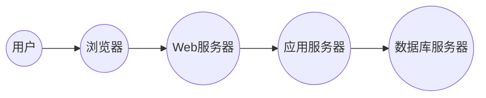

## 1. 背景介绍

### 1.1 婚纱影楼行业现状

随着人们生活水平的提高和对个性化需求的追求，婚纱摄影行业蓬勃发展。传统的婚纱影楼管理模式存在诸多问题，例如：客户信息管理混乱、订单处理效率低下、财务统计不准确等。为了提高影楼的运营效率和客户满意度，开发一套功能完善、易于使用的婚纱影楼管理系统势在必行。

### 1.2 婚纱影楼管理系统概述

婚纱影楼管理系统旨在帮助影楼实现信息化管理，提高工作效率，提升客户体验。系统主要功能包括：

* **客户管理:** 记录客户基本信息、拍摄需求、订单信息、沟通记录等。
* **订单管理:** 创建订单、安排拍摄档期、跟踪订单进度、处理售后服务等。
* **产品管理:** 管理婚纱、礼服、相册、相框等产品信息，包括价格、库存、供应商等。
* **财务管理:** 记录收入、支出、利润等财务数据，生成报表进行财务分析。
* **员工管理:** 管理员工信息、考勤记录、绩效考核等。
* **统计分析:** 提供各种统计报表，帮助影楼了解经营状况，制定营销策略。

### 1.3 系统设计目标

本系统的设计目标是：

* **功能完善:** 涵盖婚纱影楼日常运营的各个环节，满足不同规模影楼的需求。
* **易于使用:** 界面简洁直观，操作方便快捷，即使没有专业IT知识的员工也能轻松上手。
* **安全可靠:** 采用先进的技术手段，保障数据安全和系统稳定性。
* **可扩展性强:** 支持二次开发和功能定制，满足影楼未来发展需求。

## 2. 核心概念与联系

### 2.1 系统架构

本系统采用B/S架构，即浏览器/服务器架构。用户通过浏览器访问系统，服务器负责处理业务逻辑和数据存储。系统架构图如下：



### 2.2 核心模块

系统主要模块包括：

* **客户管理模块:** 负责客户信息的录入、查询、修改、删除等操作。
* **订单管理模块:** 负责订单的创建、修改、删除、查询、统计等操作。
* **产品管理模块:** 负责产品的添加、修改、删除、查询、库存管理等操作。
* **财务管理模块:** 负责财务数据的录入、查询、统计、分析等操作。
* **员工管理模块:** 负责员工信息的添加、修改、删除、查询、考勤管理、绩效考核等操作。
* **统计分析模块:** 负责生成各种统计报表，帮助影楼了解经营状况，制定营销策略。

### 2.3 模块间联系

各个模块之间相互联系，共同完成系统的功能。例如：

* 客户信息可以用于创建订单。
* 订单信息可以用于财务统计。
* 产品信息可以用于订单管理和财务统计。

## 3. 核心算法原理具体操作步骤

### 3.1 订单管理算法

订单管理算法主要包括以下步骤：

1. **创建订单:** 用户选择拍摄套餐、填写客户信息、选择拍摄日期等，系统自动生成订单编号。
2. **安排拍摄档期:** 系统根据订单信息和影楼的拍摄安排，自动分配摄影师、化妆师、助理等人员。
3. **跟踪订单进度:** 系统记录订单的各个环节，例如拍摄、选片、后期制作、取件等，用户可以随时查看订单进度。
4. **处理售后服务:** 用户反馈问题，系统记录并分配相关人员处理，确保客户满意度。

### 3.2 财务统计算法

财务统计算法主要包括以下步骤：

1. **记录收入:** 系统记录每个订单的收入，包括拍摄费用、产品费用等。
2. **记录支出:** 系统记录影楼的各项支出，例如员工工资、房租、水电费等。
3. **计算利润:** 系统根据收入和支出计算利润。
4. **生成报表:** 系统生成各种财务报表，例如利润表、资产负债表、现金流量表等。

## 4. 数学模型和公式详细讲解举例说明

### 4.1 利润计算模型

利润 = 收入 - 支出

**举例说明:**

假设某影楼一个月收入为10万元，支出为6万元，则利润为：

```
利润 = 10万元 - 6万元 = 4万元
```

### 4.2 库存管理模型

库存 = 期初库存 + 入库 - 出库

**举例说明:**

假设某影楼期初库存有100件婚纱，本月入库20件，出库30件，则期末库存为：

```
库存 = 100件 + 20件 - 30件 = 90件
```

## 5. 项目实践：代码实例和详细解释说明

### 5.1 技术选型

* **开发语言:** Java
* **数据库:** MySQL
* **Web框架:** Spring Boot
* **前端框架:** Vue.js

### 5.2 代码实例

**客户信息实体类:**

```java
public class Customer {
    private Long id;
    private String name;
    private String phone;
    // ... other fields
}
```

**订单信息实体类:**

```java
public class Order {
    private Long id;
    private Long customerId;
    private Date shootingDate;
    // ... other fields
}
```

**订单管理接口:**

```java
public interface OrderService {
    Order createOrder(Order order);
    Order getOrderById(Long id);
    List<Order> getAllOrders();
    void updateOrder(Order order);
    void deleteOrder(Long id);
}
```

### 5.3 代码解释说明

以上代码实例展示了系统中部分实体类和接口的定义，实际项目中会有更多的代码文件。

## 6. 实际应用场景

### 6.1 小型婚纱影楼

小型婚纱影楼可以使用本系统进行客户管理、订单管理、产品管理等，提高工作效率，减少人工操作错误。

### 6.2 大型婚纱影楼

大型婚纱影楼可以使用本系统进行财务管理、员工管理、统计分析等，全面掌握影楼的经营状况，制定科学的营销策略。

### 6.3 婚纱摄影工作室

婚纱摄影工作室可以使用本系统进行客户预约、拍摄安排、后期制作等，提高客户满意度，提升品牌形象。

## 7. 总结：未来发展趋势与挑战

### 7.1 未来发展趋势

* **移动化:** 随着移动互联网的发展，婚纱影楼管理系统将更加注重移动端的应用，方便用户随时随地管理业务。
* **智能化:** 人工智能技术将被应用于婚纱影楼管理系统，例如智能推荐、智能客服等，提高系统的智能化水平。
* **数据化:** 婚纱影楼管理系统将更加注重数据的收集和分析，为影楼提供决策支持。

### 7.2 面临的挑战

* **数据安全:** 随着系统数据量的增加，数据安全问题将更加突出。
* **系统性能:** 系统需要处理大量的并发请求，对系统性能提出了更高的要求。
* **用户体验:** 系统需要不断优化用户体验，提高用户满意度。

## 8. 附录：常见问题与解答

### 8.1 如何备份系统数据？

系统支持数据备份功能，用户可以定期备份系统数据，防止数据丢失。

### 8.2 如何升级系统版本？

系统提供版本升级功能，用户可以下载最新版本进行升级，获取新功能和 bug 修复。

### 8.3 如何联系技术支持？

用户可以通过系统提供的联系方式联系技术支持，获取帮助和解决问题。
