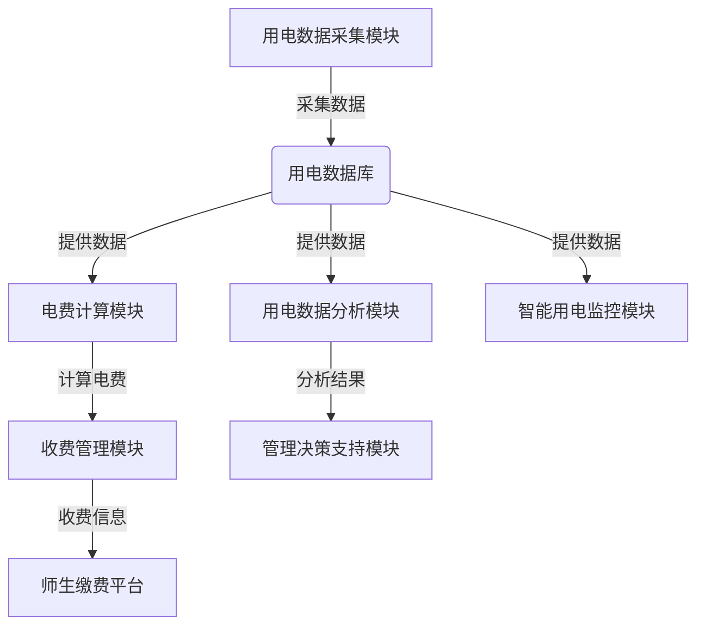

# 学校用电收费管理系统详细设计与具体代码实现

## 1.背景介绍

### 1.1 用电收费的重要性

能源是学校正常运转的关键支撑,而合理的用电收费管理系统对于节约能源、控制成本、提高效率至关重要。学校用电主要涉及教学楼、宿舍、餐厅、实验室等多个场所,用电量大、用户多、收费项目复杂,传统的人工管理模式效率低下、成本高昂且容易出错。因此,构建一套完善的用电收费管理系统势在必行。

### 1.2 现状及问题

目前,许多学校仍采用手工抄录电表数据、人工核算电费等传统方式,存在以下问题:

- 工作量大、人力成本高
- 抄录和计算过程中容易出现失误
- 缺乏数据分析和用电监控功能
- 收费流程低效、透明度不高

这些问题严重影响了用电收费的公平性和效率,亟需一套自动化、智能化的管理系统来加以解决。

### 1.3 系统目标

本文设计的学校用电收费管理系统旨在实现:

- 自动采集用电数据,无需人工抄录
- 精准计算不同用电场所的电费
- 为学校高层提供用电大数据分析
- 为师生提供透明便捷的缴费服务
- 实现智能用电监控和故障预警
- 降低人力和运维成本,提高工作效率

## 2.核心概念与联系

### 2.1 系统架构概览

学校用电收费管理系统由以下几个核心模块组成:



### 2.2 核心概念解释

1. **用电数据采集模块**: 通过物联网技术自动采集各用电场所的用电数据,包括用电量、时间等,并存储到数据库中。

2. **用电数据库**: 存储所有用电相关数据,为后续电费计算、数据分析等提供数据支持。

3. **电费计算模块**: 根据学校的用电政策和不同场所的电价标准,计算出每个用电单元的应缴电费。

4. **收费管理模块**: 汇总各单元的电费数据,生成缴费通知单,并与缴费平台对接。

5. **师生缴费平台**: 为师生提供便捷的电费查询和缴纳渠道,实现缴费流程的在线化和透明化。

6. **用电数据分析模块**: 利用大数据分析技术对历史用电数据进行多维度分析,发现用电规律和问题。

7. **管理决策支持模块**: 根据数据分析结果,为学校高层提供节能改造建议、用电政策优化等决策支持。

8. **智能用电监控模块**: 实时监控学校的用电情况,及时发现异常用电行为并发出预警,防患于未然。

### 2.3 模块关系与数据流

各模块通过数据交换与相互协作,构建了一个闭环的智能用电管理系统。具体的数据流向如上图所示。

## 3.核心算法原理具体操作步骤  

### 3.1 用电数据采集算法

用电数据采集模块的核心是通过物联网技术实现自动化采集,其基本原理和步骤如下:

1. 在各用电场所安装智能电表,智能电表内置传感器和通信模块。

2. 智能电表通过预设的时间间隔(如每小时)自动采集本场所的用电数据,包括用电量、电压、电流等。

3. 采集到的数据通过无线通信网络(如4G/5G/LoRaWAN等)上传至云端服务器。

4. 云端服务器对采集数据进行解析、存储,并通过数据清洗、错误修复等预处理。

5. 处理后的数据存入用电数据库,为后续模块提供数据支持。

该算法的优点是自动化程度高、数据实时性强,但缺点是需要一定的硬件设备投入和无线网络支持。

### 3.2 电费计算算法

电费计算模块的核心是根据学校的用电政策和场所分类,对不同用电单元按不同标准计算电费,算法步骤如下:

1. 从用电数据库获取所有用电单元的用电量数据。

2. 根据学校的用电分类政策,将用电单元划分为不同类别,如教学用电、生活用电等。

3. 对每个类别设置不同的电价标准,例如:
   - 教学用电: 0.5元/度
   - 生活用电(宿舍): 0.8元/度
   - 生活用电(餐厅): 1元/度

4. 对每个用电单元,根据其类别和用电量,计算应缴电费:
   $$电费 = 用电量 \times 电价标准$$

5. 将计算结果汇总到收费管理模块。

该算法的优点是计费标准透明、计算过程自动化,但需要学校制定合理的用电分类政策和电价标准。

### 3.3 用电数据分析算法

用电数据分析模块的核心是利用大数据分析技术,从海量历史用电数据中发现用电规律和问题,算法步骤如下:

1. 从用电数据库获取历史用电数据,包括用电量、时间、场所等维度。

2. 对原始数据进行清洗、转换、规范化等预处理,为后续分析做准备。

3. 应用数据挖掘算法进行关联分析、聚类分析等,发现用电规律:
   - 关联分析可发现不同场所/时段的用电相关性
   - 聚类分析可将用电单元分为高能耗、中能耗、低能耗等类别

4. 应用统计学习算法进行异常检测:
   - 构建正常用电模型,检测异常用电行为
   - 可发现异常高能耗、异常负荷等情况

5. 将分析结果呈现为可视化报告,为管理决策提供支持。

该算法的优点是可深入挖掘数据价值,发现问题根源,缺点是需要大数据处理能力和专业的数据分析人员。

### 3.4 智能用电监控算法  

智能用电监控模块的核心是实时监测用电数据,及时发现异常情况并发出预警,算法步骤如下:

1. 从用电数据库获取实时用电数据流。

2. 基于机器学习算法构建正常用电模型,包括:
   - 场所用电量模型:正常范围的用电量
   - 负荷模型:正常范围的负荷水平
   - 电压电流模型:正常范围的电压电流值
   
   模型可通过历史数据训练获得,也可由专家经验设定。

3. 对实时用电数据进行在线检测:
   - 用电量异常检测: $用电量 > 上限阈值$或$用电量 < 下限阈值$时报警  
   - 负荷异常检测: $负荷值 > 上限阈值$时报警
   - 电压电流异常检测: $电压/电流 > 上限阈值$或$电压/电流 < 下限阈值$时报警

4. 一旦检测到异常,立即通过短信、邮件等方式向管理员发出预警信息。

5. 管理员可根据预警快速介入,排查原因并采取应对措施。

该算法的优点是实时性强、自动化程度高,可及时发现隐患,缺点是需要构建准确的异常检测模型。

## 4.数学模型和公式详细讲解举例说明

在用电收费管理系统中,数学模型和公式主要应用于电费计算和异常检测两个环节。

### 4.1 电费计算模型

电费计算的基本公式为:

$$电费 = 用电量 \times 电价标准$$

其中,用电量为实际使用的电量(如千瓦时),电价标准为学校制定的不同场所的电价(如元/千瓦时)。

例如,某教学楼本月使用电量为5000千瓦时,教学用电的电价标准为0.5元/千瓦时,则该楼本月应缴电费为:

$$电费 = 5000 \times 0.5 = 2500 (元)$$

对于分阶梯电价的情况,计算公式可扩展为:

$$电费 = 用电量_1 \times 电价_1 + 用电量_2 \times 电价_2 + \cdots + 用电量_n \times 电价_n$$

其中$用电量_i$为第i个阶梯的用电量,$电价_i$为对应的电价标准。

### 4.2 异常检测模型

用电异常检测可分为以下几种情况:

**1. 用电量异常检测**

设定正常用电量区间为$[Q_{min}, Q_{max}]$,当实时用电量$Q$超出此区间时,即:

$$Q > Q_{max}\ 或\ Q < Q_{min}$$

则判定为异常用电,发出预警。

**2. 负荷异常检测**

设定正常负荷上限为$L_{max}$,当实时负荷$L$超过此上限时,即:

$$L > L_{max}$$

则判定为过载异常,发出预警。

**3. 电压电流异常检测**

设定电压正常区间为$[V_{min}, V_{max}]$,电流正常区间为$[I_{min}, I_{max}]$,当实时电压$V$或电流$I$超出对应区间时,即:

$$V > V_{max}\ 或\ V < V_{min}\\
I > I_{max}\ 或\ I < I_{min}$$

则判定为电压电流异常,发出预警。

以上模型的参数阈值可通过历史数据分析或专家经验设定。实际应用中,还可融合其他特征(如温度、时间等),构建更加精准的异常检测模型。

## 4.项目实践:代码实例和详细解释说明

为了更好地理解系统的实现细节,下面给出部分核心模块的代码示例及解释说明。

### 4.1 用电数据采集模块

该模块的主要功能是从物联网设备(如智能电表)采集实时用电数据,并存储到数据库中。以Python的Paho MQTT库为例,代码如下:

```python
import paho.mqtt.client as mqtt
import sqlite3

# MQTT代理服务器地址
broker_address = "broker.example.com"

# 连接到MQTT代理服务器
client = mqtt.Client()
client.connect(broker_address)

# SQLite数据库连接
conn = sqlite3.connect("energy_data.db")
c = conn.cursor()

# 创建表格(如果不存在)
c.execute('''CREATE TABLE IF NOT EXISTS energy_data
             (timestamp TEXT, location TEXT, energy_consumption REAL)''')

# 当收到MQTT消息时的回调函数
def on_message(client, userdata, msg):
    # 解析消息内容
    payload = msg.payload.decode()
    data = payload.split(",")
    timestamp, location, energy_consumption = data

    # 存储到数据库
    c.execute("INSERT INTO energy_data VALUES (?, ?, ?)",
              (timestamp, location, energy_consumption))
    conn.commit()
    print(f"Received data: {timestamp}, {location}, {energy_consumption}")

# 订阅MQTT主题
client.subscribe("energy/data")
client.on_message = on_message

# 保持连接并处理消息
client.loop_forever()
```

解释:

1. 导入相关库,连接MQTT代理服务器和SQLite数据库。
2. 创建数据表`energy_data`用于存储用电数据,包括时间戳、场所和用电量。
3. 定义`on_message`函数作为MQTT消息的回调处理函数,当收到数据时自动触发。
4. 在回调函数中解析收到的数据,并将其存储到SQLite数据库中。
5. 订阅MQTT主题`energy/data`,接收物联网设备发来的用电数据。
6. 保持MQTT连接,持续接收和处理数据。

该模块实现了实时采集数据并持久化存储的功能,为后续电费计算和数据分析奠定基础。

### 4.2 电费计算模块

该模块根据用电数据和学校制定的电价策略,计算各用电单元应缴