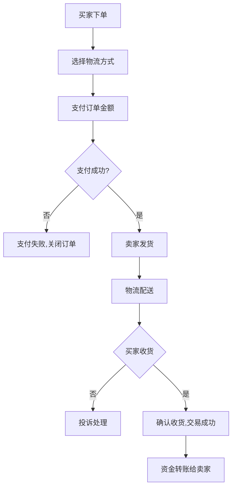

# 学生二手物品交易系统详细设计与具体代码实现

## 1. 背景介绍

在校园生活中，学生们经常会有一些闲置物品需要出售或寻求二手物品购买。传统的线下交易方式效率低下,缺乏统一的交易平台。因此,开发一个二手物品交易系统可以为学生提供方便、安全、高效的交易渠道,促进校园资源的合理利用和循环利用。

### 1.1 现状与问题

1. **信息不对称** - 买卖双方难以获取准确的物品信息和交易信息,增加交易风险。
2. **交易效率低下** - 线下交易往往效率低下,时间和空间受限。
3. **缺乏交易保障** - 无法保证交易安全,可能存在欺诈行为。

### 1.2 系统目标

1. **提高交易效率** - 提供统一的网上交易平台,方便学生发布和查找闲置物品信息。
2. **增强信息透明度** - 物品信息和交易过程公开透明,降低信息不对称风险。
3. **保证交易安全** - 提供安全的支付和物流系统,防止交易纠纷和欺诈行为。
4. **促进资源循环利用** - 闲置物品得到合理利用,减少资源浪费。

## 2. 核心概念与联系

### 2.1 用户系统

系统主要包括买家用户和卖家用户两种角色。用户需要注册并登录后才能使用系统的各项功能。

### 2.2 商品管理

用户可以发布自己的闲置物品,包括上传图片、填写物品详情等。同时可以浏览和搜索其他用户发布的物品信息。

### 2.3 交易系统

交易系统负责处理用户的购买请求,包括选择物流方式、在线支付等。同时记录交易状态,保证交易安全。

### 2.4 系统架构

整个系统采用 B/S 架构,用户通过浏览器访问网站。后端由 Web 服务器、应用服务器和数据库服务器组成。前端使用 HTML、CSS 和 JavaScript 开发,后端使用 Java 等编程语言开发。

## 3. 核心算法原理与具体操作步骤

### 3.1 商品搜索算法

#### 3.1.1 倒排索引

为提高搜索效率,系统采用倒排索引技术建立索引。具体步骤如下:

1. **分词** - 将商品标题和描述按空格或其他分隔符分割成单词。
2. **计算词频** - 统计每个单词在所有商品中出现的次数,作为词频。
3. **创建倒排索引** - 以单词为键,保存包含该单词的所有商品ID列表。
4. **存储索引** - 将创建的倒排索引存储在数据库或缓存中。

搜索时,将查询字符串分词,查找倒排索引中对应的商品ID列表,取交集作为搜索结果。

#### 3.1.2 相关性排序

为提高搜索相关性,可以引入 TF-IDF 算法对结果进行排序:

$$
\text{score}(d,q) = \sum\limits_{t\in q} \text{tf}(t,d) \times \text{idf}(t)
$$

其中:

- $\text{tf}(t,d)$ 表示词项 $t$ 在商品 $d$ 中的词频
- $\text{idf}(t) = \log\frac{N}{n_t}$ 表示词项 $t$ 的逆文档频率,$N$ 为总文档数,$n_t$ 为包含 $t$ 的文档数

将所有结果商品按 $\text{score}(d,q)$ 降序排列,得到最终排序结果。

### 3.2 交易流程

交易流程是系统的核心部分,需要保证安全性和可靠性。具体流程如下:



1. **下单** - 买家在商品详情页下单,进入选择物流环节。
2. **选择物流** - 买家选择物流方式(快递或自提),确认运费。
3. **支付订单** - 调用第三方支付平台,买家支付订单总额(含运费)。
4. **支付结果处理** - 若支付成功,通知卖家发货;若失败,关闭订单。
5. **卖家发货** - 卖家通过物流公司发货,更新物流信息。
6. **物流配送** - 物流公司将商品配送至买家收货地址。
7. **确认收货** - 买家收到商品后确认收货,交易成功,资金转账给卖家。若有问题,可投诉处理。

### 3.3 信用评分系统

为保证交易安全,系统引入信用评分机制,对用户行为进行评分:

- 初始分数为 80 分
- 好评 +5 分,中评 +2 分,差评 -10 分
- 违规行为一次扣 20 分
- 达到 100 分时,可以获得一些小礼品或优惠
- 分数低于 60 分时,账号将被冻结,需重新申诉

信用评分的计算使用加权平均算法:

$$
\text{score}_\text{new} = \text{score}_\text{old} \times \alpha + \text{score}_\text{new} \times (1-\alpha)
$$

其中 $\alpha$ 为平滑系数,通常取 $0.9$。这样可以避免评分剧烈波动。

## 4. 数学模型和公式详细讲解举例说明  

### 4.1 TF-IDF 算法

TF-IDF(Term Frequency-Inverse Document Frequency)是一种用于信息检索的常用加权技术,用于评估一个词对于一个文档集或一个语料库中的其他文档的重要程度。

这里我们将其应用于商品搜索场景,对查询和商品描述进行权重计算,从而判断商品与查询的相关程度。假设有一个商品集合 $D$,包含 $N$ 个商品文档 $\{d_1, d_2, \ldots, d_N\}$。对于词项 $t$ 和文档 $d$,TF-IDF 公式为:

$$
\text{tfidf}(t, d, D) = \text{tf}(t, d) \times \text{idf}(t, D)
$$

其中:

1. **词频 TF(Term Frequency)** 
   
   $\text{tf}(t, d)$ 表示词项 $t$ 在文档 $d$ 中出现的次数。最简单的计算方法是:

   $$
   \text{tf}(t, d) = \text{count}(t, d)
   $$

   也可以使用其他归一化方法,如:

   $$
   \text{tf}(t, d) = \frac{\text{count}(t, d)}{\max\limits_{t'\in d}\text{count}(t', d)}
   $$

2. **逆文档频率 IDF(Inverse Document Frequency)**

   $\text{idf}(t, D)$ 表示词项 $t$ 的逆文档频率,用于度量 $t$ 的稀有程度。计算公式为:

   $$
   \text{idf}(t, D) = \log \frac{N}{|\{d\in D: t\in d\}|}
   $$

   其中分母为包含词项 $t$ 的文档数量。IDF 的值越大,表示词项越稀有,对查询结果的判断越有影响力。

最终,我们可以计算查询 $q$ 和商品文档 $d$ 的相似度得分:

$$
\text{score}(q, d) = \sum\limits_{t\in q} \text{tfidf}(t, q) \times \text{tfidf}(t, d)
$$

将所有候选商品按得分降序排列,即可获得与查询最相关的结果。

### 4.2 加权移动平均算法

在计算用户信用评分时,我们使用了加权移动平均算法,用于平滑评分曲线,避免分数剧烈波动。算法的计算公式为:

$$
\text{score}_\text{new} = \text{score}_\text{old} \times \alpha + \text{score}_\text{new} \times (1-\alpha)
$$

其中:

- $\text{score}_\text{old}$ 为上一次的评分值
- $\text{score}_\text{new}$ 为本次新增的评分值
- $\alpha$ 为平滑系数,取值区间 $[0, 1]$,通常取 $0.9$

加权移动平均算法可以看作是对新旧评分值进行加权求和的过程。$\alpha$ 值越大,表示越相信历史评分值;$\alpha$ 值越小,表示越相信新的评分值。通过对 $\alpha$ 的合理设置,可以有效控制评分曲线的平滑程度。

例如,假设一个用户的初始评分为 80 分,连续得到 3 个好评,每次 +5 分。如果不加平滑,评分曲线将是:

```
80 -> 85 -> 90 -> 95
```

如果使用加权移动平均算法,评分曲线将变为:

```
80 -> 83 -> 86.7 -> 90.03
```

可以看到,评分曲线更加平滑,没有出现剧烈波动。这样可以避免个别极端值对评分产生过大影响,更加合理地反映用户的综合表现。

## 5. 项目实践:代码实例和详细解释说明

### 5.1 系统架构

我们使用 Java 语言开发整个系统,采用 Spring Boot 框架快速构建应用程序。项目使用 Maven 进行依赖管理,主要依赖如下:

- `spring-boot-starter-web` - 提供 Web 开发支持
- `spring-boot-starter-data-jpa` - 集成 JPA 持久层框架
- `mysql-connector-java` - MySQL 数据库驱动
- `lombok` - 简化 Java 代码编写
- `guava` - Google 开发的工具库,提供高效数据结构和算法

项目目录结构如下:

```
src
├── main
│   ├── java
│   │   └── com
│   │       └── example
│   │           └── secondhandtrade
│   │               ├── config
│   │               ├── controller
│   │               ├── dto
│   │               ├── entity
│   │               ├── repository
│   │               ├── search
│   │               ├── service
│   │               │   └── impl
│   │               └── util
│   └── resources
│       ├── static
│       └── templates
└── test
    └── java
        └── com
            └── example
                └── secondhandtrade
```

- `config` - 存放系统配置相关类
- `controller` - 控制器,处理HTTP请求
- `dto` - 数据传输对象,用于展示层和服务层之间的数据传递
- `entity` - 实体类,用于数据持久化
- `repository` - 存储库接口,用于数据访问
- `search` - 搜索相关模块,如倒排索引等
- `service` - 服务接口和实现类,封装业务逻辑
- `util` - 工具类
- `static` - 存放静态资源,如CSS、JS等
- `templates` - 存放模板文件,如HTML等

### 5.2 数据模型

系统的主要数据模型包括:

- `User` - 用户模型,包括用户ID、用户名、密码、邮箱等字段
- `Product` - 商品模型,包括商品ID、标题、描述、价格、图片等字段
- `Order` - 订单模型,包括订单ID、买家ID、卖家ID、商品ID、订单状态等字段
- `Delivery` - 物流模型,包括物流单号、物流公司、收货地址等字段
- `Review` - 评论模型,包括评论ID、订单ID、评分、评论内容等字段

这些模型使用 JPA 注解进行映射,例如:

```java
@Entity
@Table(name = "user")
@Data
public class User {
    @Id
    @GeneratedValue(strategy = GenerationType.IDENTITY)
    private Long id;

    @Column(nullable = false, unique = true)
    private String username;

    @Column(nullable = false)
    private String password;

    @Column(nullable = false, unique = true)
    private String email;

    @Column(nullable = false)
    private Integer credit = 80; // 默认信用分为80分

    // 其他字段...
}
```

### 5.3 索引和搜索

我们使