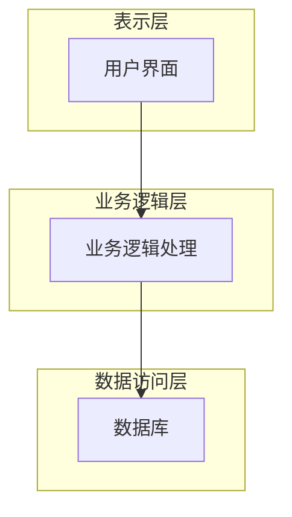

## 1. 背景介绍

### 1.1 学生公寓管理的现状与挑战

随着高校规模的不断扩大，学生公寓管理面临着诸多挑战：

* **信息管理分散化:** 传统的人工管理方式效率低下，信息难以共享，容易造成数据不一致和管理混乱。
* **服务质量难以提升:** 学生的住宿需求日益多样化，人工服务难以满足个性化需求，服务质量难以提升。
* **安全隐患:** 传统的门禁系统安全系数低，难以有效保障学生的人身和财产安全。

### 1.2 学生公寓管理系统的意义

为了解决上述问题，开发一套高效、便捷、安全的學生公寓管理系统势在必行。该系统可以实现：

* **信息化管理:** 将学生信息、宿舍信息、费用信息等进行集中管理，提高管理效率和数据准确性。
* **提升服务质量:** 提供在线报修、缴费、信息查询等功能，满足学生多样化的住宿需求，提升服务质量。
* **加强安全保障:**  采用智能门禁系统，加强宿舍安全管理，保障学生的人身和财产安全。

## 2. 核心概念与联系

### 2.1 系统用户角色

系统主要包含以下用户角色：

* **学生:**  可以进行入住登记、退宿申请、报修、缴费、信息查询等操作。
* **宿管员:**  负责学生入住、退宿、调宿等管理工作，以及宿舍卫生检查、安全巡查等工作。
* **系统管理员:** 负责系统维护、用户管理、权限管理等工作。

### 2.2 系统功能模块

系统主要包含以下功能模块：

* **学生管理模块:** 包括学生信息管理、入住登记、退宿申请、调宿管理等功能。
* **宿舍管理模块:** 包括宿舍信息管理、房间分配、卫生检查、安全巡查等功能。
* **费用管理模块:** 包括住宿费、水电费、网络费等费用管理功能。
* **报修管理模块:** 包括报修登记、维修处理、维修记录等功能。
* **门禁管理模块:** 包括门禁卡管理、门禁记录查询等功能。
* **系统管理模块:** 包括用户管理、权限管理、系统日志等功能。

### 2.3 系统架构

系统采用B/S架构，主要分为三层：

* **表示层:** 负责用户界面展示，与用户进行交互。
* **业务逻辑层:** 负责处理业务逻辑，实现系统功能。
* **数据访问层:** 负责与数据库进行交互，进行数据存储和读取。



## 3. 核心算法原理具体操作步骤

### 3.1 学生入住登记

1. 学生提交入住申请，填写个人信息和入住需求。
2. 宿管员审核学生信息，分配宿舍房间。
3. 学生缴纳住宿费，领取门禁卡。
4. 系统记录学生入住信息，更新宿舍房间状态。

### 3.2 宿舍调换

1. 学生提交调宿申请，填写调宿原因和目标宿舍。
2. 宿管员审核调宿申请，根据宿舍情况进行调配。
3. 系统更新学生宿舍信息，更新宿舍房间状态。

### 3.3 报修处理

1. 学生提交报修申请，填写报修内容和联系方式。
2. 宿管员查看报修信息，安排维修人员进行处理。
3. 维修人员完成维修，记录维修情况。
4. 系统更新报修状态，记录维修信息。

## 4. 数学模型和公式详细讲解举例说明

本系统不涉及复杂的数学模型和公式。

## 5. 项目实践：代码实例和详细解释说明

### 5.1 技术选型

* 开发语言: Java
* 数据库: MySQL
* Web框架: Spring Boot
* 前端框架: Vue.js

### 5.2 代码示例

#### 5.2.1 学生实体类

```java
public class Student {

    private Long id;
    private String name;
    private String gender;
    private String idCard;
    private String phone;
    private Long dormitoryId;

    // getter and setter methods
}
```

#### 5.2.2 学生入住登记接口

```java
@PostMapping("/students")
public ResponseEntity<Student> checkIn(@RequestBody Student student) {
    // 校验学生信息
    // 分配宿舍房间
    // 生成门禁卡
    // 保存学生信息
    return ResponseEntity.ok(student);
}
```

## 6. 实际应用场景

### 6.1 高校学生公寓

学生公寓管理系统可以帮助高校实现学生公寓的信息化管理，提高管理效率，提升服务质量，加强安全保障。

### 6.2 企业员工宿舍

学生公寓管理系统可以应用于企业员工宿舍管理，实现员工住宿信息管理、费用管理、报修管理等功能。

## 7. 工具和资源推荐

### 7.1 开发工具

* IntelliJ IDEA
* Eclipse

### 7.2 数据库工具

* MySQL Workbench
* Navicat

### 7.3 学习资源

* Spring Boot官方文档
* Vue.js官方文档

## 8. 总结：未来发展趋势与挑战

### 8.1 未来发展趋势

* **智能化:**  引入人工智能技术，实现智能门禁、智能安防等功能，提高宿舍安全性和管理效率。
* **移动化:**  开发移动端应用，方便学生进行住宿服务操作，提升用户体验。
* **数据化:**  收集学生住宿数据，进行数据分析，为宿舍管理提供决策支持。

### 8.2 面临的挑战

* **数据安全:**  保障学生个人信息和宿舍信息安全。
* **系统稳定性:**  保证系统稳定运行，避免系统故障。
* **用户体验:**  不断优化系统功能，提升用户体验。

## 9. 附录：常见问题与解答

### 9.1 如何申请入住？

学生可以通过学生公寓管理系统在线提交入住申请，填写个人信息和入住需求。

### 9.2 如何报修？

学生可以通过学生公寓管理系统在线提交报修申请，填写报修内容和联系方式。

### 9.3 如何缴纳住宿费？

学生可以通过学生公寓管理系统在线缴纳住宿费，支持多种支付方式。
