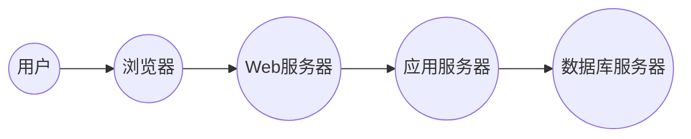

## 1. 背景介绍

### 1.1 学生行为管理的现状与挑战

在现代教育体系中，学生行为管理是学校教育工作的重要组成部分。传统的学生行为管理模式主要依赖于教师的观察和记录，存在着效率低下、主观性强、数据统计困难等问题。随着信息技术的快速发展，利用信息化手段构建学生日常行为评分管理系统，实现对学生行为的全面、客观、高效的评价和管理，已成为教育领域的重要趋势。

### 1.2 系统建设目标

学生日常行为评分管理系统的建设目标主要包括以下几个方面：

* **全面记录学生行为**:  系统应能够全面记录学生的课堂表现、课外活动、宿舍生活等方面的行为数据，为学生行为评价提供客观依据。
* **客观公正的评分**: 系统应采用科学合理的评分算法，避免主观因素的影响，确保评分的客观公正。
* **高效便捷的管理**: 系统应提供便捷的操作界面和数据分析功能，提高教师工作效率，减轻工作负担。
* **促进学生全面发展**: 系统应能够帮助学生了解自身行为表现，促进学生自我反思和改进，从而促进学生的全面发展。

## 2. 核心概念与联系

### 2.1 系统核心概念

* **学生**: 指接受教育的个体，是系统服务的主要对象。
* **行为**: 指学生在学习、生活等方面的具体表现，是系统记录和评价的核心内容。
* **评分规则**: 指对不同行为进行评分的标准，是系统实现客观公正评分的关键。
* **积分**: 指学生根据行为表现获得的奖励或惩罚，是系统激励学生积极行为的重要手段。
* **评价**: 指对学生行为的综合评估，是系统反映学生整体表现的重要依据。

### 2.2 概念间联系

学生的行为是系统记录和评价的核心内容，评分规则是系统实现客观公正评分的关键，积分是系统激励学生积极行为的重要手段，评价是对学生行为的综合评估。这些概念之间相互联系，共同构成了学生日常行为评分管理系统的核心框架。

## 3. 核心算法原理具体操作步骤

### 3.1 评分规则设计

评分规则的设计是系统实现客观公正评分的关键。评分规则应根据学校的实际情况和教育理念进行制定，并充分考虑学生的年龄特点和行为表现。

评分规则的设计可以采用以下步骤：

1. **确定评分指标**:  根据学校的教育目标和学生发展需求，确定需要评价的行为指标。
2. **制定评分标准**:  对每个评分指标制定具体的评分标准，明确不同行为表现对应的分数。
3. **设置权重**:  根据不同评分指标的重要性，设置不同的权重，以反映各指标在综合评价中的占比。

### 3.2 积分计算

积分计算是系统激励学生积极行为的重要手段。积分计算可以采用以下公式：

```
积分 = Σ (行为得分 × 权重)
```

其中，行为得分是指学生在某个行为指标上的得分，权重是指该指标的权重。

### 3.3 评价生成

评价生成是对学生行为的综合评估。评价生成可以采用以下步骤：

1. **计算总积分**:  将学生在所有行为指标上的积分进行加权求和，得到学生的总积分。
2. **等级划分**:  根据总积分的大小，将学生划分为不同的等级，例如优秀、良好、合格、不合格等。
3. **生成评语**:  根据学生的等级和具体行为表现，生成个性化的评语，帮助学生了解自身优缺点，促进学生自我反思和改进。

## 4. 数学模型和公式详细讲解举例说明

### 4.1 加权平均模型

加权平均模型是评分规则设计中常用的数学模型。该模型的公式如下：

```
总得分 = Σ (指标得分 × 权重) / Σ 权重
```

其中，指标得分是指学生在某个指标上的得分，权重是指该指标的权重。

**举例说明**:

假设某学校的学生日常行为评分指标包括课堂表现、课外活动、宿舍生活三个方面，其权重分别为0.5、0.3、0.2。某学生的课堂表现得分为80分，课外活动得分为90分，宿舍生活得分为70分。则该学生的总得分计算如下：

```
总得分 = (80 × 0.5 + 90 × 0.3 + 70 × 0.2) / (0.5 + 0.3 + 0.2) = 81 分
```

### 4.2 层次分析法

层次分析法是一种常用的决策方法，可以用于确定评分指标的权重。该方法的基本思想是将问题分解成若干个层次，然后通过两两比较的方式确定各层次因素的相对重要性，最终计算出各因素的权重。

**举例说明**:

假设某学校需要确定学生日常行为评分指标的权重，可以采用层次分析法进行分析。首先将问题分解为三个层次：目标层、准则层、方案层。目标层是指学生日常行为评分，准则层是指课堂表现、课外活动、宿舍生活三个方面，方案层是指具体的评分指标。

然后通过两两比较的方式确定各层次因素的相对重要性，例如课堂表现相对于课外活动的重要性，课外活动相对于宿舍生活的重要性等。最终计算出各因素的权重，例如课堂表现的权重为0.5，课外活动的权重为0.3，宿舍生活的权重为0.2。

## 5. 项目实践：代码实例和详细解释说明

### 5.1 系统架构

学生日常行为评分管理系统可以采用B/S架构，即浏览器/服务器架构。系统架构图如下：



### 5.2 数据库设计

系统数据库设计可以采用关系型数据库，例如MySQL、Oracle等。数据库表设计如下：

| 表名 | 字段 | 数据类型 | 说明 |
|---|---|---|---|
| 学生表 | 学号 | VARCHAR(20) | 学生的唯一标识 |
| | 姓名 | VARCHAR(50) | 学生的姓名 |
| | 班级 | VARCHAR(50) | 学生所在的班级 |
| 行为表 | 行为ID | INT | 行为的唯一标识 |
| | 行为名称 | VARCHAR(100) | 行为的名称 |
| | 行为类别 | VARCHAR(50) | 行为的类别，例如课堂表现、课外活动、宿舍生活等 |
| | 评分标准 | TEXT | 行为的评分标准 |
| 评分记录表 | 记录ID | INT | 评分记录的唯一标识 |
| | 学号 | VARCHAR(20) | 学生的学号 |
| | 行为ID | INT | 行为的ID |
| | 评分日期 | DATE | 评分的日期 |
| | 得分 | INT | 学生在该行为上的得分 |

### 5.3 代码实例

以下是一个简单的评分记录添加功能的代码示例：

```python
import mysql.connector

# 数据库连接配置
config = {
  'user': 'root',
  'password': 'password',
  'host': 'localhost',
  'database': 'student_behavior'
}

# 连接数据库
cnx = mysql.connector.connect(**config)
cursor = cnx.cursor()

# 获取用户输入
student_id = input("请输入学生学号: ")
behavior_id = int(input("请输入行为ID: "))
score = int(input("请输入得分: "))

# 添加评分记录
add_record = ("INSERT INTO 评分记录表 (学号, 行为ID, 评分日期, 得分) "
               "VALUES (%s, %s, CURDATE(), %s)")
data_record = (student_id, behavior_id, score)
cursor.execute(add_record, data_record)

# 提交更改
cnx.commit()

# 关闭连接
cursor.close()
cnx.close()

print("评分记录添加成功！")
```

## 6. 实际应用场景

学生日常行为评分管理系统可以应用于各种教育场景，例如：

* **课堂教学**:  教师可以使用系统记录学生的课堂表现，例如课堂参与度、作业完成情况等，并根据评分规则进行评分，生成课堂评价。
* **课外活动**:  学校可以使用系统记录学生参与课外活动的情况，例如社团活动、志愿服务等，并根据评分规则进行评分，生成课外活动评价。
* **宿舍管理**:  宿舍管理员可以使用系统记录学生的宿舍生活情况，例如卫生情况、纪律情况等，并根据评分规则进行评分，生成宿舍评价。
* **学生评优**:  学校可以使用系统对学生的综合表现进行评价，例如学习成绩、行为表现等，并根据评优标准评选优秀学生。

## 7. 工具和资源推荐

### 7.1 开发工具

* **Python**:  Python是一种易于学习和使用的编程语言，适用于开发Web应用程序和数据分析工具。
* **MySQL**:  MySQL是一种流行的开源关系型数据库管理系统，适用于存储和管理系统数据。
* **Django**:  Django是一个基于Python的Web框架，可以简化Web应用程序的开发。

### 7.2 学习资源

* **Python官方文档**:  https://www.python.org/doc/
* **MySQL官方文档**:  https://dev.mysql.com/doc/
* **Django官方文档**:  https://docs.djangoproject.com/en/4.1/

## 8. 总结：未来发展趋势与挑战

### 8.1 未来发展趋势

* **人工智能技术应用**:  未来，人工智能技术将更多地应用于学生日常行为评分管理系统，例如利用机器学习算法自动识别学生行为，进行评分和评价。
* **大数据分析**:  系统将收集和分析学生的各种行为数据，例如学习数据、社交数据、生活数据等，为学生提供个性化的教育服务。
* **移动互联网应用**:  系统将更多地采用移动互联网技术，方便教师和学生随时随地进行行为记录和评价。

### 8.2 面临的挑战

* **数据安全和隐私保护**:  系统需要妥善保管学生的个人信息和行为数据，防止数据泄露和滥用。
* **评分规则的科学性和公正性**:  系统需要不断优化评分规则，确保评分的科学性和公正性，避免主观因素的影响。
* **系统推广和应用**:  系统需要得到学校和教师的认可和支持，才能真正发挥作用，促进学生全面发展。

## 9. 附录：常见问题与解答

### 9.1 如何保证评分的客观公正？

系统可以通过以下方式保证评分的客观公正：

* 采用科学合理的评分规则，避免主观因素的影响。
* 使用多维度数据进行评价，例如课堂表现、课外活动、宿舍生活等。
* 定期对评分规则进行评估和调整，确保其科学性和公正性。

### 9.2 如何保护学生的数据安全和隐私？

系统可以通过以下方式保护学生的数据安全和隐私：

* 采用严格的数据加密技术，保护学生个人信息和行为数据。
* 制定严格的数据访问权限管理制度，限制数据访问范围。
* 定期进行安全漏洞扫描和修复，确保系统安全可靠。
