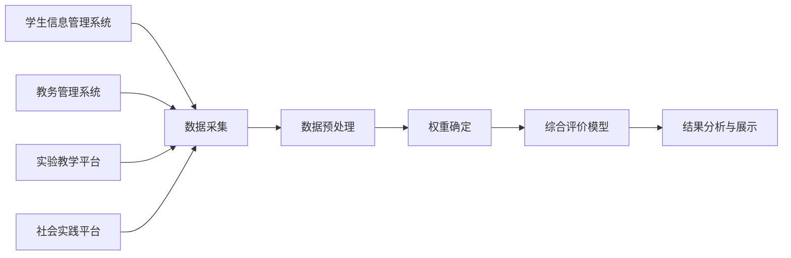

## 1. 背景介绍

### 1.1 教育评价体系的现状与挑战

传统的学生评价体系主要依赖于考试成绩，这种单一化的评价方式难以全面反映学生的综合素质。随着教育改革的不断深入，对学生综合素质的评价越来越受到重视，如何构建科学、合理的综合评价体系成为亟待解决的问题。

### 1.2 学生综合评价系统的意义

学生综合评价系统旨在打破传统的评价模式，建立多元化的评价指标体系，全面、客观、公正地评价学生的学习能力、实践能力、创新能力、社会责任感等方面，为学生个性化发展提供参考依据，促进学生全面发展。

## 2. 核心概念与联系

### 2.1 评价指标体系

#### 2.1.1 学业成绩

* 平时成绩：课堂表现、作业完成情况、单元测试成绩等
* 期中期末成绩
* 竞赛成绩

#### 2.1.2 实践能力

* 实验操作能力
* 项目设计与实施能力
* 社会实践参与情况

#### 2.1.3 创新能力

* 提出问题、分析问题、解决问题的能力
* 创新思维和实践能力
* 科研项目参与情况

#### 2.1.4 社会责任感

* 公民意识
* 道德品质
* 志愿服务参与情况

### 2.2 评价主体

* 教师
* 学生
* 家长

### 2.3 评价方式

* 定量评价：考试成绩、量化指标等
* 定性评价：教师评语、学生自评、家长评价等

### 2.4 评价结果应用

* 学生个体发展分析
* 教学改进
* 人才选拔

## 3. 核心算法原理具体操作步骤

### 3.1 数据采集与预处理

#### 3.1.1 数据来源

* 学生信息管理系统
* 教务管理系统
* 实验教学平台
* 社会实践平台

#### 3.1.2 数据清洗

* 去除重复数据
* 缺失值处理
* 数据格式转换

### 3.2 权重确定

#### 3.2.1 层次分析法

* 构建评价指标体系层次结构
* 构造判断矩阵
* 计算权重向量

#### 3.2.2 熵权法

* 计算指标信息熵
* 计算指标权重

### 3.3 综合评价模型

#### 3.3.1 加权平均法

$$
Score = \sum_{i=1}^{n} w_i \times x_i
$$

其中：
* $Score$ 表示综合评分
* $w_i$ 表示第 $i$ 个指标的权重
* $x_i$ 表示第 $i$ 个指标的得分

#### 3.3.2 模糊综合评价法

* 建立评价因素集和评语集
* 确定隶属度函数
* 进行模糊运算

### 3.4 结果分析与展示

* 学生综合素质雷达图
* 学生个体发展分析报告
* 教学质量分析报告

## 4. 数学模型和公式详细讲解举例说明

### 4.1 层次分析法权重计算

以“学业成绩”指标为例，构建判断矩阵如下：

| 指标 | 平时成绩 | 期中期末成绩 | 竞赛成绩 |
|---|---|---|---|
| 平时成绩 | 1 | 3 | 5 |
| 期中期末成绩 | 1/3 | 1 | 3 |
| 竞赛成绩 | 1/5 | 1/3 | 1 |

计算权重向量：

```python
import numpy as np

# 构造判断矩阵
A = np.array([[1, 3, 5],
              [1/3, 1, 3],
              [1/5, 1/3, 1]])

# 计算权重向量
w = np.linalg.eig(A)[1][:, 0]
w = w / np.sum(w)

# 输出权重向量
print(w)
```

### 4.2 加权平均法综合评分计算

假设某学生的各项指标得分如下：

| 指标 | 得分 | 权重 |
|---|---|---|
| 平时成绩 | 85 | 0.4 |
| 期中期末成绩 | 90 | 0.3 |
| 竞赛成绩 | 95 | 0.1 |
| 实验操作能力 | 80 | 0.1 |
| 创新思维能力 | 90 | 0.1 |

则该学生的综合评分为：

```python
score = 0.4 * 85 + 0.3 * 90 + 0.1 * 95 + 0.1 * 80 + 0.1 * 90
print(score)
```

## 5. 项目实践：代码实例和详细解释说明

### 5.1 系统架构设计



### 5.2 代码实现

#### 5.2.1 数据预处理

```python
import pandas as pd

# 读取数据
data = pd.read_csv('student_data.csv')

# 去除重复数据
data.drop_duplicates(inplace=True)

# 缺失值处理
data.fillna(method='ffill', inplace=True)

# 数据格式转换
data['score'] = data['score'].astype(float)
```

#### 5.2.2 权重确定

```python
import numpy as np

# 构造判断矩阵
A = np.array([[1, 3, 5],
              [1/3, 1, 3],
              [1/5, 1/3, 1]])

# 计算权重向量
w = np.linalg.eig(A)[1][:, 0]
w = w / np.sum(w)
```

#### 5.2.3 综合评价模型

```python
# 加权平均法
def weighted_average(data, weights):
    scores = []
    for i in range(len(data)):
        score = 0
        for j in range(len(weights)):
            score += data.iloc[i, j] * weights[j]
        scores.append(score)
    return scores

# 计算综合评分
scores = weighted_average(data[['平时成绩', '期中期末成绩', '竞赛成绩']], w)
data['综合评分'] = scores
```

## 6. 实际应用场景

### 6.1 学生个体发展分析

* 帮助学生了解自身优势和不足
* 制定个性化学习计划
* 提升学习效率

### 6.2 教学改进

* 评估教学效果
* 优化教学内容和方法
* 促进教师专业发展

### 6.3 人才选拔

* 为高校招生提供参考
* 为企业招聘提供依据

## 7. 总结：未来发展趋势与挑战

### 7.1 大数据驱动

* 利用大数据技术分析学生学习行为数据
* 构建更加精准的评价模型

### 7.2 人工智能赋能

* 利用人工智能技术实现自动化评价
* 提升评价效率和客观性

### 7.3 个性化评价

* 针对不同学生特点制定个性化评价方案
* 促进学生个性化发展

## 8. 附录：常见问题与解答

### 8.1 如何确定评价指标权重？

可以使用层次分析法、熵权法等方法确定评价指标权重。

### 8.2 如何保证评价结果的客观公正？

* 建立科学合理的评价指标体系
* 选择合适的评价方法
* 规范评价流程
* 加强监督管理

### 8.3 如何将评价结果应用于教学实践？

* 将评价结果反馈给学生，帮助学生了解自身优势和不足，制定个性化学习计划
* 将评价结果用于教学改进，优化教学内容和方法，促进教师专业发展
