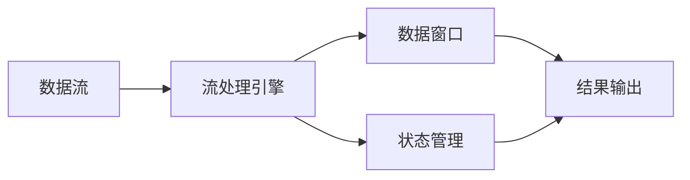

## 1. 背景介绍

### 1.1. 引言

在当今的信息时代，数据如同血液般驱动着各个行业的发展。实时数据处理，作为数据处理领域的重要分支，其重要性日益凸显。从金融交易到社交媒体分析，从物联网设备监控到网络安全防御，实时数据处理技术正在深刻地改变着我们的生活。

### 1.2. 实时数据处理的定义

实时数据处理是指在数据产生后，立即对其进行分析和处理，并在极短时间内生成结果，以满足实时性要求的应用场景。与传统的批处理方式相比，实时数据处理具有以下显著特点：

*   **低延迟:** 数据处理延迟极低，通常在毫秒或秒级别。
*   **高吞吐:** 能够处理海量数据，满足高并发需求。
*   **持续性:** 数据处理过程持续进行，无间断地提供最新的分析结果。

### 1.3. 实时数据处理的应用场景

实时数据处理技术广泛应用于各个领域，包括但不限于：

*   **金融领域:** 实时欺诈检测、高频交易、风险管理等。
*   **社交媒体:** 实时情感分析、热点话题追踪、用户行为分析等。
*   **物联网:** 设备状态监控、异常检测、预测性维护等。
*   **网络安全:** 入侵检测、恶意流量分析、安全事件响应等。

## 2. 核心概念与联系

### 2.1. 数据流

数据流是指连续不断产生的数据序列，例如传感器数据、交易记录、用户行为数据等。实时数据处理系统需要高效地采集、传输和处理这些数据流。

### 2.2. 流处理引擎

流处理引擎是实时数据处理系统的核心组件，负责接收数据流、执行数据处理逻辑并生成结果。常见的流处理引擎包括 Apache Flink、Apache Spark Streaming、Apache Kafka Streams 等。

### 2.3. 数据窗口

数据窗口是指将无限数据流划分为有限数据集的机制，例如时间窗口、计数窗口等。通过数据窗口，可以对数据流进行分段处理，从而降低处理难度。

### 2.4. 状态管理

状态管理是指在实时数据处理过程中，保存和更新中间计算结果的机制。状态管理对于处理需要跨多个数据窗口进行聚合或关联操作的场景至关重要。

### 2.5. 核心概念之间的联系



## 3. 核心算法原理具体操作步骤

### 3.1. 数据采集

实时数据处理系统需要高效地采集数据流，常见的采集方式包括：

*   **消息队列:** 使用 Kafka、RabbitMQ 等消息队列系统接收数据流。
*   **日志采集:** 使用 Flume、Logstash 等工具采集日志数据。
*   **数据库变更捕获:** 使用 Debezium 等工具捕获数据库变更数据。

### 3.2. 数据处理

流处理引擎接收数据流后，根据预定义的处理逻辑进行处理，常见的处理操作包括：

*   **过滤:** 筛选符合特定条件的数据。
*   **转换:** 对数据进行格式转换或字段提取。
*   **聚合:** 对数据进行分组统计，例如计算总和、平均值等。
*   **关联:** 将多个数据流关联起来，例如根据用户 ID 关联用户行为数据和交易数据。

### 3.3. 结果输出

实时数据处理系统将处理结果输出到目标存储系统，例如数据库、数据仓库、消息队列等。

### 3.4. 具体操作步骤示例

以下是一个简单的实时数据处理示例，演示了如何使用 Apache Flink 处理用户点击流数据：

1.  **定义数据源:** 从 Kafka topic 中读取用户点击流数据。
2.  **定义处理逻辑:** 统计每个用户在过去 1 分钟内的点击次数。
3.  **定义结果输出:** 将统计结果写入到数据库中。

```java
// 定义数据源
DataStream<ClickEvent> clickStream = env.addSource(new FlinkKafkaConsumer<>(
    "click_events",
    new ClickEventSchema(),
    properties));

// 定义处理逻辑
DataStream<ClickCount> clickCountStream = clickStream
    .keyBy(ClickEvent::getUserId)
    .timeWindow(Time.minutes(1))
    .sum("clickCount");

// 定义结果输出
clickCountStream.addSink(new JdbcSink<>(
    "INSERT INTO click_counts (user_id, click_count) VALUES (?, ?)",
    (ps, clickCount) -> {
        ps.setInt(1, clickCount.getUserId());
        ps.setLong(2, clickCount.getClickCount());
    },
    JdbcExecutionOptions.builder()
        .withBatchSize(1000)
        .withBatchIntervalMs(1000)
        .build()));
```

## 4. 数学模型和公式详细讲解举例说明

### 4.1. 时间衰减函数

在实时数据处理中，为了反映数据的时效性，通常会使用时间衰减函数对数据进行加权处理。常见的时间衰减函数包括指数衰减函数、线性衰减函数等。

**指数衰减函数:**

$$
w(t) = e^{-\lambda t}
$$

其中，$t$ 表示时间间隔，$\lambda$ 表示衰减系数。

**线性衰减函数:**

$$
w(t) = 1 - \frac{t}{T}
$$

其中，$T$ 表示时间窗口长度。

### 4.2. 滑动窗口

滑动窗口是一种常用的数据窗口机制，它定义了一个固定长度的时间窗口，并随着时间推移不断向前滑动。滑动窗口可以用于计算一段时间内的统计指标，例如移动平均值、指数移动平均值等。

**移动平均值:**

$$
MA_t = \frac{1}{n} \sum_{i=t-n+1}^{t} x_i
$$

其中，$x_i$ 表示时间序列数据，$n$ 表示滑动窗口长度。

**指数移动平均值:**

$$
EMA_t = \alpha x_t + (1 - \alpha) EMA_{t-1}
$$

其中，$\alpha$ 表示平滑系数，$EMA_{t-1}$ 表示上一时刻的指数移动平均值。

### 4.3. 举例说明

假设我们有一个用户点击流数据，每条数据包含用户 ID、点击时间和点击次数。我们想要计算每个用户在过去 1 小时内的平均点击次数，并使用指数衰减函数对数据进行加权处理，衰减系数为 0.5。

```java
// 定义数据源
DataStream<ClickEvent> clickStream = env.addSource(...);

// 定义处理逻辑
DataStream<ClickAverage> clickAverageStream = clickStream
    .keyBy(ClickEvent::getUserId)
    .timeWindow(Time.hours(1), Time.minutes(1)) // 滑动窗口，长度 1 小时，滑动间隔 1 分钟
    .apply(new WindowFunction<ClickEvent, ClickAverage, Integer, TimeWindow>() {
        @Override
        public void apply(Integer userId, TimeWindow window, Iterable<ClickEvent> input, Collector<ClickAverage> out) throws Exception {
            long currentTime = System.currentTimeMillis();
            double sum = 0;
            double weightSum = 0;
            for (ClickEvent event : input) {
                long timeDiff = currentTime - event.getTimestamp();
                double weight = Math.exp(-0.5 * timeDiff / 1000 / 60 / 60); // 指数衰减函数
                sum += event.getClickCount() * weight;
                weightSum += weight;
            }
            out.collect(new ClickAverage(userId, sum / weightSum));
        }
    });

// 定义结果输出
clickAverageStream.addSink(...);
```

## 5. 项目实践：代码实例和详细解释说明

### 5.1. 代码实例

以下是一个使用 Apache Flink 实现实时欺诈检测的代码示例：

```java
// 定义数据源
DataStream<Transaction> transactionStream = env.addSource(new FlinkKafkaConsumer<>(
    "transactions",
    new TransactionSchema(),
    properties));

// 定义处理逻辑
DataStream<Alert> alertStream = transactionStream
    .keyBy(Transaction::getUserId)
    .process(new KeyedProcessFunction<Integer, Transaction, Alert>() {
        private ValueState<Double> previousAmountState;

        @Override
        public void open(Configuration parameters) throws Exception {
            previousAmountState = getRuntimeContext().getState(
                new ValueStateDescriptor<>("previousAmount", Double.class));
        }

        @Override
        public void processElement(Transaction transaction, Context ctx, Collector<Alert> out) throws Exception {
            Double previousAmount = previousAmountState.value();
            if (previousAmount != null && transaction.getAmount() > previousAmount * 2) {
                out.collect(new Alert(transaction.getUserId(), transaction.getTransactionId(), "Possible fraud"));
            }
            previousAmountState.update(transaction.getAmount());
        }
    });

// 定义结果输出
alertStream.addSink(new FlinkKafkaProducer<>(
    "alerts",
    new AlertSchema(),
    properties));
```

### 5.2. 详细解释说明

该代码示例实现了以下功能：

1.  **定义数据源:** 从 Kafka topic 中读取交易数据。
2.  **定义处理逻辑:** 使用 KeyedProcessFunction 对每个用户进行处理。
3.  **状态管理:** 使用 ValueState 保存每个用户的上一次交易金额。
4.  **欺诈检测逻辑:** 如果当前交易金额大于上一次交易金额的两倍，则生成告警信息。
5.  **定义结果输出:** 将告警信息写入到 Kafka topic 中。

## 6. 实际应用场景

### 6.1. 金融领域

*   **实时欺诈检测:** 通过分析交易数据流，实时识别可疑交易，防止欺诈行为发生。
*   **高频交易:** 利用低延迟的数据处理能力，捕捉市场瞬息万变的交易机会。
*   **风险管理:** 实时监控市场风险指标，及时调整投资策略。

### 6.2. 社交媒体

*   **实时情感分析:** 分析用户发布的文本内容，实时了解用户情绪变化。
*   **热点话题追踪:** 监测社交媒体上的热门话题，及时掌握舆情动态。
*   **用户行为分析:** 分析用户行为数据，实时了解用户兴趣和偏好。

### 6.3. 物联网

*   **设备状态监控:** 实时采集设备运行数据，监测设备状态变化。
*   **异常检测:** 通过分析设备数据流，识别设备异常行为。
*   **预测性维护:** 利用历史数据和实时数据，预测设备故障，提前进行维护。

## 7. 工具和资源推荐

### 7.1. 流处理引擎

*   **Apache Flink:** 低延迟、高吞吐的分布式流处理引擎。
*   **Apache Spark Streaming:** 基于 Spark 的微批处理流处理引擎。
*   **Apache Kafka Streams:** 基于 Kafka 的轻量级流处理引擎。

### 7.2. 数据存储

*   **Apache Kafka:** 高吞吐、低延迟的分布式消息队列系统。
*   **Apache Cassandra:** 高可用、可扩展的 NoSQL 数据库。
*   **Elasticsearch:** 分布式搜索和分析引擎。

### 7.3. 数据可视化

*   **Grafana:** 开源的数据可视化平台。
*   **Kibana:** Elasticsearch 的数据可视化工具。

## 8. 总结：未来发展趋势与挑战

### 8.1. 未来发展趋势

*   **人工智能与实时数据处理融合:** 将人工智能技术应用于实时数据分析，实现更智能的决策支持。
*   **边缘计算与实时数据处理结合:** 将实时数据处理能力扩展到边缘设备，实现更低延迟的应用场景。
*   **实时数据处理平台化:** 构建统一的实时数据处理平台，简化开发和部署流程。

### 8.2. 面临的挑战

*   **数据质量:** 实时数据处理需要处理大量数据，数据质量问题会直接影响分析结果的准确性。
*   **系统复杂性:** 实时数据处理系统涉及多个组件，系统架构复杂，运维难度较大。
*   **成本控制:** 实时数据处理需要高性能硬件和软件，成本较高。

## 9. 附录：常见问题与解答

### 9.1. 实时数据处理和批处理的区别是什么？

实时数据处理和批处理的主要区别在于数据处理的延迟和频率。实时数据处理的延迟极低，通常在毫秒或秒级别，数据处理频率很高，可以持续不断地处理数据。批处理的延迟较高，通常在分钟、小时或天级别，数据处理频率较低，通常以批次的方式处理数据。

### 9.2. 如何选择合适的流处理引擎？

选择合适的流处理引擎需要考虑以下因素：

*   **延迟要求:** 不同的流处理引擎具有不同的延迟特性，需要根据应用场景的延迟要求选择合适的引擎。
*   **吞吐量需求:** 不同的流处理引擎具有不同的吞吐量能力，需要根据应用场景的吞吐量需求选择合适的引擎。
*   **编程模型:** 不同的流处理引擎提供不同的编程模型，需要根据开发团队的技术栈选择合适的引擎。

### 9.3. 如何保证实时数据处理系统的可靠性？

保证实时数据处理系统的可靠性可以采取以下措施：

*   **数据备份:** 定期备份数据，防止数据丢失。
*   **故障转移:** 部署多个节点，实现故障自动转移。
*   **监控报警:** 实时监控系统运行状态，及时发现和处理故障。
