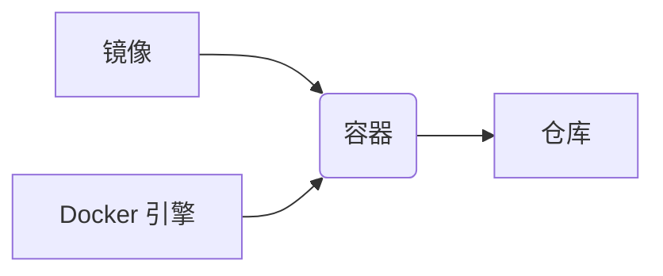

## 1. 背景介绍

### 1.1 虚拟化技术演进

在计算机技术的发展历程中，虚拟化技术一直扮演着重要的角色。从早期的物理机时代，到虚拟机技术的兴起，再到如今容器技术的蓬勃发展，虚拟化技术经历了不断的演进和革新。容器技术的出现，为软件开发和部署带来了革命性的变化，极大地提高了资源利用率、应用可移植性和运维效率。

### 1.2 容器技术的优势

容器技术相比于传统的虚拟机技术，具有以下显著优势：

* **轻量级**: 容器不需要模拟完整的操作系统，只需要打包应用程序及其依赖库，因此镜像体积更小，启动速度更快。
* **高资源利用率**: 容器共享操作系统内核，可以更加充分地利用系统资源，提高资源利用率。
* **可移植性强**: 容器镜像可以在不同的平台和环境中运行，不受底层基础设施的限制，提高了应用的可移植性。
* **易于部署和管理**: 容器技术提供了丰富的工具和平台，可以简化应用程序的部署和管理，提高运维效率。

### 1.3 容器技术的应用场景

容器技术广泛应用于各种场景，例如：

* **Web 应用**: 容器可以将 Web 应用及其依赖库打包成镜像，方便部署和扩展。
* **微服务**: 容器可以将微服务及其依赖库打包成镜像，方便部署和管理。
* **数据分析**: 容器可以将数据分析工具及其依赖库打包成镜像，方便部署和运行。
* **机器学习**: 容器可以将机器学习模型及其依赖库打包成镜像，方便部署和训练。


## 2. 核心概念与联系

### 2.1 镜像 (Image)

镜像是一个轻量级、独立、可执行的软件包，包含了运行应用程序所需的所有内容，包括代码、运行时、库、环境变量和配置文件。

### 2.2 容器 (Container)

容器是镜像的运行实例，是一个隔离的运行环境，可以运行应用程序及其依赖库。

### 2.3 仓库 (Registry)

仓库是存储镜像的地方，可以是公共仓库，例如 Docker Hub，也可以是私有仓库。

### 2.4  Docker 引擎 (Docker Engine)

Docker 引擎是创建、运行和管理容器的核心组件，它提供了 API 和 CLI，可以与 Docker 守护进程进行交互。

### 2.5 核心概念之间的联系

镜像、容器、仓库和 Docker 引擎之间的关系可以用下图表示：



## 3. 核心算法原理具体操作步骤

### 3.1 容器的创建过程

容器的创建过程主要包括以下步骤：

1. **从仓库拉取镜像**: Docker 引擎从仓库拉取指定的镜像。
2. **创建容器**: Docker 引擎创建一个新的容器实例，并将镜像加载到容器中。
3. **启动容器**: Docker 引擎启动容器，并执行镜像中定义的命令。

### 3.2 容器的隔离机制

容器的隔离机制主要依靠 Linux 内核的命名空间 (namespace) 和控制组 (cgroup) 技术。

* **命名空间**: 命名空间可以隔离进程的视图，例如 PID 命名空间、网络命名空间、挂载命名空间等。
* **控制组**: 控制组可以限制进程对资源的使用，例如 CPU、内存、IO 等。

### 3.3 容器的网络通信

容器可以通过以下几种方式进行网络通信：

* **桥接网络**: 容器连接到 Docker 创建的虚拟网桥，可以通过网桥与其他容器或主机进行通信。
* **主机网络**: 容器直接使用主机的网络栈，可以使用主机的 IP 地址进行通信。
* **自定义网络**: 用户可以创建自定义网络，并将容器连接到自定义网络中。

## 4. 数学模型和公式详细讲解举例说明

容器技术本身并不涉及复杂的数学模型和公式，其核心原理是基于 Linux 内核的命名空间和控制组技术。

## 5. 项目实践：代码实例和详细解释说明

### 5.1 Dockerfile 编写

```dockerfile
FROM python:3.9

WORKDIR /app

COPY requirements.txt .
RUN pip install -r requirements.txt

COPY . .

CMD ["python", "app.py"]
```

**解释说明**:

* `FROM python:3.9`: 指定基础镜像为 Python 3.9。
* `WORKDIR /app`: 设置工作目录为 `/app`。
* `COPY requirements.txt .`: 将 `requirements.txt` 文件复制到工作目录。
* `RUN pip install -r requirements.txt`: 安装依赖库。
* `COPY . .`: 将当前目录的所有文件复制到工作目录。
* `CMD ["python", "app.py"]`: 指定容器启动时执行的命令。

### 5.2 构建镜像

```bash
docker build -t my-app .
```

**解释说明**:

* `docker build`: 构建镜像。
* `-t my-app`: 指定镜像名称为 `my-app`。
* `.`: 指定 Dockerfile 所在的目录。

### 5.3 运行容器

```bash
docker run -d -p 8000:8000 my-app
```

**解释说明**:

* `docker run`: 运行容器。
* `-d`: 后台运行容器。
* `-p 8000:8000`: 将容器的 8000 端口映射到主机的 8000 端口。
* `my-app`: 指定镜像名称。

## 6. 实际应用场景

### 6.1 Web 应用部署

容器可以将 Web 应用及其依赖库打包成镜像，方便部署和扩展。例如，可以使用 Docker 部署 Nginx、Apache、Django、Flask 等 Web 应用。

### 6.2 微服务架构

容器可以将微服务及其依赖库打包成镜像，方便部署和管理。例如，可以使用 Docker 部署 Spring Boot、Node.js、Go 等微服务。

### 6.3 DevOps 自动化

容器可以与 DevOps 工具集成，实现自动化构建、测试和部署。例如，可以使用 Jenkins、GitLab CI/CD 等工具实现容器化应用的持续集成和持续交付。

## 7. 工具和资源推荐

### 7.1 Docker

Docker 是最流行的容器引擎之一，提供了丰富的工具和平台，可以简化应用程序的部署和管理。

### 7.2 Kubernetes

Kubernetes 是一个开源的容器编排平台，可以自动化容器的部署、扩展和管理。

### 7.3 Docker Hub

Docker Hub 是 Docker 官方的镜像仓库，提供了大量的公共镜像。

## 8. 总结：未来发展趋势与挑战

### 8.1 未来发展趋势

* **Serverless**: 容器技术将与 Serverless 计算更加紧密地结合，提供更加灵活和高效的应用部署方式。
* **边缘计算**: 容器技术将更加广泛地应用于边缘计算场景，例如物联网、智能家居等。
* **安全性**: 容器安全将成为更加重要的关注点，需要不断提升容器的安全性和可靠性。

### 8.2 挑战

* **复杂性**: 容器技术本身具有一定的复杂性，需要一定的学习成本。
* **安全性**: 容器安全是一个重要的挑战，需要不断提升容器的安全性和可靠性。
* **标准化**: 容器技术标准化程度还不够高，需要进一步推动标准化工作。

## 9. 附录：常见问题与解答

### 9.1 容器和虚拟机的区别是什么？

容器和虚拟机都是虚拟化技术，但它们之间存在一些区别：

* 容器共享操作系统内核，而虚拟机拥有自己的操作系统内核。
* 容器更加轻量级，启动速度更快，而虚拟机更加重量级，启动速度较慢。
* 容器更加灵活，可以更加方便地进行扩展和管理，而虚拟机更加笨重，扩展和管理比较麻烦。

### 9.2 如何选择合适的容器引擎？

目前市面上主流的容器引擎有 Docker、rkt、LXC/LXD 等，选择合适的容器引擎需要考虑以下因素：

* **成熟度**: 选择成熟度较高的容器引擎，可以获得更好的稳定性和可靠性。
* **生态系统**: 选择生态系统完善的容器引擎，可以获得更多的工具和资源支持。
* **性能**: 选择性能优异的容器引擎，可以提高应用的运行效率。

### 9.3 如何保障容器的安全性？

保障容器的安全性需要采取多方面的措施，例如：

* **使用安全的镜像**: 选择来自可信 sources 的镜像，并及时更新镜像。
* **限制容器的权限**: 使用最小权限原则，限制容器的权限，防止容器越权访问系统资源。
* **监控容器的运行状态**: 实时监控容器的运行状态，及时发现异常情况并采取措施。
* **使用安全工具**: 使用安全工具扫描容器镜像，发现潜在的安全漏洞。
