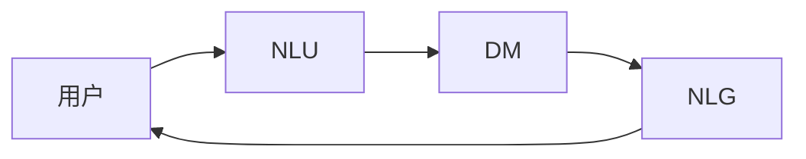

## 1. 背景介绍

### 1.1 对话系统的发展历程

对话系统，又称聊天机器人 (Chatbots)，是模拟人类对话的计算机程序。从早期的基于规则的系统到如今基于深度学习的智能体，对话系统经历了漫长的发展历程。

* **第一阶段：基于规则的系统 (1960s - 1990s)**

  早期的对话系统主要基于预先定义的规则和模板。例如，ELIZA (1966) 是一个模拟心理治疗师的程序，通过模式匹配和关键词识别来生成回复。这些系统只能处理有限的对话场景，缺乏灵活性。

* **第二阶段：统计对话系统 (1990s - 2010s)**

  随着统计机器学习的兴起，对话系统开始采用统计模型来学习对话模式。例如，隐马尔可夫模型 (HMM) 和条件随机场 (CRF) 被广泛应用于对话状态跟踪和意图识别。这些系统能够处理更复杂的对话场景，但仍然依赖于大量人工标注的数据。

* **第三阶段：深度学习驱动的对话系统 (2010s - 至今)**

  近年来，深度学习技术的突破为对话系统带来了革命性的变化。基于深度神经网络的对话系统能够从海量数据中自动学习对话模式，并生成更自然、更流畅的回复。例如，Seq2Seq 模型和 Transformer 模型被广泛应用于对话生成任务。

### 1.2 对话系统的应用场景

对话系统在各个领域都有广泛的应用，包括：

* **客户服务：** 自动化客服机器人可以回答常见问题，提供产品信息，并解决简单的客户问题。
* **个人助理：** 智能助理可以帮助用户管理日程安排、发送消息、查找信息等。
* **教育：** 对话式学习系统可以提供个性化的学习内容和互动式学习体验。
* **娱乐：** 聊天机器人可以与用户进行闲聊、玩游戏、讲故事等。

### 1.3 对话系统的分类

对话系统可以根据其功能和技术特点进行分类：

* **任务型对话系统：** 旨在完成特定任务，例如订票、订餐、查询信息等。
* **问答型对话系统：** 旨在回答用户提出的问题，例如百科知识问答、技术支持问答等。
* **闲聊型对话系统：** 旨在与用户进行开放式的对话，例如聊天、讲故事等。

## 2. 核心概念与联系

### 2.1 对话系统的基本组成部分

一个典型的对话系统通常包含以下几个核心组件：

* **自然语言理解 (NLU)：** 负责将用户输入的自然语言文本转换成机器可理解的语义表示。
* **对话管理 (DM)：** 负责维护对话状态，跟踪对话历史，并根据对话上下文选择合适的对话策略。
* **自然语言生成 (NLG)：** 负责将机器生成的语义表示转换成自然语言文本输出。

### 2.2 核心概念之间的联系

NLU、DM 和 NLG 三个组件相互协作，共同完成对话任务。NLU 负责理解用户输入，DM 负责根据对话上下文做出决策，NLG 负责生成自然语言回复。



## 3. 核心算法原理具体操作步骤

### 3.1 自然语言理解 (NLU)

NLU 的任务是将用户输入的自然语言文本转换成机器可理解的语义表示。常见的 NLU 任务包括：

* **分词：** 将文本分割成单个词语。
* **词性标注：** 识别每个词语的词性，例如名词、动词、形容词等。
* **命名实体识别：** 识别文本中的人名、地名、机构名等实体。
* **意图识别：** 识别用户意图，例如查询信息、订购商品、寻求帮助等。
* **槽位填充：** 提取用户意图相关的关键信息，例如时间、地点、人物等。

#### 3.1.1 基于规则的 NLU

基于规则的 NLU 方法通过预先定义的规则和模板来识别用户意图和槽位信息。例如，可以使用正则表达式来匹配特定模式的文本。

#### 3.1.2 基于统计机器学习的 NLU

基于统计机器学习的 NLU 方法使用统计模型来学习文本特征和语义表示之间的映射关系。例如，可以使用支持向量机 (SVM) 或条件随机场 (CRF) 来进行意图识别和槽位填充。

#### 3.1.3 基于深度学习的 NLU

基于深度学习的 NLU 方法使用深度神经网络来学习文本特征和语义表示之间的映射关系。例如，可以使用卷积神经网络 (CNN) 或循环神经网络 (RNN) 来进行意图识别和槽位填充。

### 3.2 对话管理 (DM)

DM 的任务是维护对话状态，跟踪对话历史，并根据对话上下文选择合适的对话策略。常见的 DM 技术包括：

* **基于规则的 DM：** 使用预先定义的规则来控制对话流程。
* **基于状态机的 DM：** 使用有限状态机来表示对话状态和状态转移。
* **基于框架的 DM：** 使用框架来表示对话任务和槽位信息。
* **基于强化学习的 DM：** 使用强化学习算法来学习最优对话策略。

### 3.3 自然语言生成 (NLG)

NLG 的任务是将机器生成的语义表示转换成自然语言文本输出。常见的 NLG 技术包括：

* **基于模板的 NLG：** 使用预先定义的模板来生成文本。
* **基于语法规则的 NLG：** 使用语法规则来生成语法正确的文本。
* **基于统计机器学习的 NLG：** 使用统计模型来学习文本特征和语义表示之间的映射关系。
* **基于深度学习的 NLG：** 使用深度神经网络来学习文本特征和语义表示之间的映射关系。

## 4. 数学模型和公式详细讲解举例说明

### 4.1 朴素贝叶斯分类器

朴素贝叶斯分类器是一种基于贝叶斯定理的概率分类器。它假设特征之间相互独立，并使用条件概率来计算样本属于某个类别的概率。

**公式：**

$$P(C_k|x) = \frac{P(C_k)P(x|C_k)}{P(x)}$$

其中：

* $P(C_k|x)$ 表示样本 $x$ 属于类别 $C_k$ 的概率。
* $P(C_k)$ 表示类别 $C_k$ 的先验概率。
* $P(x|C_k)$ 表示在类别 $C_k$ 下，样本 $x$ 出现的概率。
* $P(x)$ 表示样本 $x$ 出现的概率。

**举例说明：**

假设要构建一个垃圾邮件分类器，可以使用朴素贝叶斯分类器来判断一封邮件是否是垃圾邮件。可以使用邮件的词语作为特征，并使用已知的垃圾邮件和非垃圾邮件数据集来训练分类器。

### 4.2 隐马尔可夫模型 (HMM)

隐马尔可夫模型是一种统计模型，用于描述一个系统在不同状态之间转换的概率。它假设系统的状态是隐藏的，只能通过观察到的序列来推断。

**公式：**

$$P(O,Q|\lambda) = \prod_{t=1}^T P(O_t|Q_t,\lambda)P(Q_t|Q_{t-1},\lambda)$$

其中：

* $O$ 表示观察到的序列。
* $Q$ 表示隐藏的状态序列。
* $\lambda$ 表示模型参数，包括状态转移概率矩阵 $A$、观察概率矩阵 $B$ 和初始状态概率向量 $\pi$。

**举例说明：**

假设要构建一个语音识别系统，可以使用 HMM 来描述语音信号在不同音素之间的转换。可以使用语音信号的声学特征作为观察值，并使用已知的语音数据集来训练 HMM 模型。

## 5. 项目实践：代码实例和详细解释说明

### 5.1 基于规则的对话系统

```python
# 定义规则
rules = {
    "greeting": ["你好", "您好", "早上好"],
    "goodbye": ["再见", "拜拜", "回头见"],
    "query_weather": ["今天天气怎么样", "北京的天气预报"],
}

# 定义回复模板
responses = {
    "greeting": "您好！",
    "goodbye": "再见！",
    "query_weather": "今天北京天气晴朗，最高温度 25 度。",
}

# 处理用户输入
def process_input(user_input):
    # 匹配规则
    for intent, patterns in rules.items():
        for pattern in patterns:
            if pattern in user_input:
                return intent

    # 未匹配到规则
    return "unknown"

# 生成回复
def generate_response(intent):
    # 根据意图选择回复模板
    if intent in responses:
        return responses[intent]

    # 未找到回复模板
    return "我不明白您的意思。"

# 主函数
def main():
    while True:
        # 获取用户输入
        user_input = input("请输入：")

        # 处理用户输入
        intent = process_input(user_input)

        # 生成回复
        response = generate_response(intent)

        # 输出回复
        print(response)

if __name__ == "__main__":
    main()
```

**代码解释：**

* `rules` 字典定义了对话系统的规则，每个规则对应一个意图和一组匹配模式。
* `responses` 字典定义了对话系统的回复模板，每个意图对应一个回复模板。
* `process_input()` 函数根据规则匹配用户输入的意图。
* `generate_response()` 函数根据意图选择回复模板。
* `main()` 函数实现了对话系统的循环逻辑。

### 5.2 基于 Rasa 的任务型对话系统

Rasa 是一个开源的对话系统框架，支持构建任务型对话系统和闲聊型对话系统。

**安装 Rasa：**

```
pip install rasa
```

**创建 Rasa 项目：**

```
rasa init
```

**定义对话故事：**

```
## story1
* greet
    - utter_greet
* request_restaurant
    - utter_ask_location
* inform{"location": "北京"}
    - utter_recommend_restaurant
* thank
    - utter_goodbye

## story2
* greet
    - utter_greet
* query_weather
    - utter_ask_location
* inform{"location": "上海"}
    - utter_tell_weather
* thank
    - utter_goodbye
```

**定义领域文件：**

```yaml
version: "2.0"

nlu:
- intent: greet
  examples: |
    - 嗨
    - 你好
    - 早上好

- intent: request_restaurant
  examples: |
    - 我想找一家餐厅
    - 推荐一家餐厅
    - 我饿了

- intent: query_weather
  examples: |
    - 今天天气怎么样
    - 天气预报

- intent: thank
  examples: |
    - 谢谢
    - 感谢

- intent: goodbye
  examples: |
    - 再见
    - 拜拜

slots:
  location:
    type: text

responses:
  utter_greet:
  - text: "您好！"

  utter_ask_location:
  - text: "您想在哪里找餐厅？"

  utter_recommend_restaurant:
  - text: "在 {location}，我推荐您去海底捞。"

  utter_tell_weather:
  - text: "今天 {location} 天气晴朗，最高温度 25 度。"

  utter_goodbye:
  - text: "再见！"
```

**训练模型：**

```
rasa train
```

**启动对话系统：**

```
rasa shell
```

## 6. 实际应用场景

### 6.1 客户服务

对话系统可以用于自动化客户服务，例如：

* 回答常见问题
* 提供产品信息
* 解决简单的客户问题

### 6.2 个人助理

对话系统可以用于构建个人助理，例如：

* 管理日程安排
* 发送消息
* 查找信息

### 6.3 教育

对话系统可以用于创建对话式学习系统，例如：

* 提供个性化的学习内容
* 提供互动式学习体验

### 6.4 娱乐

对话系统可以用于娱乐目的，例如：

* 与用户进行闲聊
* 玩游戏
* 讲故事

## 7. 工具和资源推荐

### 7.1 对话系统框架

* Rasa
* Dialogflow
* Microsoft Bot Framework

### 7.2 自然语言处理工具

* NLTK
* SpaCy
* Stanford CoreNLP

### 7.3 数据集

* Cornell Conversational Corpus
* Ubuntu Dialogue Corpus
* MultiWOZ

## 8. 总结：未来发展趋势与挑战

### 8.1 未来发展趋势

* **个性化：** 对话系统将更加个性化，能够根据用户的兴趣和偏好提供定制化的服务。
* **多模态：** 对话系统将支持多模态交互，例如语音、图像、视频等。
* **情感智能：** 对话系统将能够理解和回应用户的情感。
* **知识融合：** 对话系统将能够融合来自不同来源的知识，提供更全面、更准确的信息。

### 8.2 挑战

* **自然语言理解：** 自然语言的复杂性和歧义性仍然是对话系统面临的重大挑战。
* **对话管理：** 如何有效地管理对话状态和对话策略仍然是一个难题。
* **数据稀疏性：** 训练高质量的对话系统需要大量的标注数据，而数据稀疏性是一个普遍问题。
* **伦理和社会影响：** 对话系统的应用也引发了一些伦理和社会问题，例如隐私、偏见、失业等。

## 9. 附录：常见问题与解答

### 9.1 如何评估对话系统的性能？

对话系统的性能评估指标包括：

* **任务完成率：** 对话系统成功完成任务的比例。
* **对话轮数：** 完成任务所需的对话轮数。
* **用户满意度：** 用户对对话系统服务的满意程度。

### 9.2 如何提高对话系统的鲁棒性？

提高对话系统鲁棒性的方法包括：

* **数据增强：** 通过数据增强技术增加训练数据的数量和多样性。
* **对抗训练：** 使用对抗样本对模型进行训练，提高模型对噪声和攻击的抵抗能力。
* **错误分析：** 分析对话系统的错误案例，找出模型的弱点并进行改进。

### 9.3 如何处理对话中的不确定性？

处理对话中不确定性的方法包括：

* **置信度估计：** 对模型预测结果的置信度进行估计，并根据置信度选择合适的对话策略。
* **主动学习：** 通过主动学习算法选择最具信息量的样本进行标注，提高模型的准确性。
* **用户反馈：** 收集用户反馈，并根据反馈对模型进行调整。
