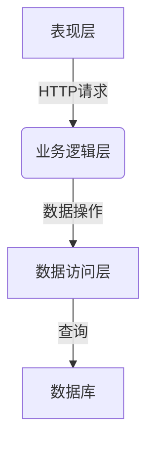

# 小型企业办公耗材库存管理软件的设计与实现

## 1.背景介绍

### 1.1 办公耗材库存管理的重要性

在任何规模的企业中，办公耗材都是必不可少的消耗品。从复印纸到打印机墨盒,再到笔和订书钉,这些日常办公用品的供应和管理对于确保企业的正常运营至关重要。缺乏有效的库存管理系统,可能会导致供应短缺、浪费资金或库存积压等问题。

### 1.2 小型企业面临的挑战

对于小型企业而言,实施一个完整的企业资源计划(ERP)系统可能会造成过度投资和复杂度。然而,仍然需要一个简单、实用且经济高效的解决方案来管理办公耗材的库存。这种解决方案需要满足小型企业的特定需求,例如易于使用、低成本和可扩展性。

### 1.3 现有解决方案的局限性

当前市场上存在一些商业库存管理软件,但它们通常针对大型企业,功能过于庞大和复杂,且价格昂贵。另一些开源解决方案则缺乏针对性,无法满足小型企业的特定需求。因此,开发一款专门为小型企业量身定制的办公耗材库存管理软件变得迫在眉睫。

## 2.核心概念与联系

### 2.1 库存管理的基本概念

库存管理是指对原材料、在制品和产成品等物资的计划、组织、指导和控制,以满足企业生产经营需要。它包括以下几个关键概念:

1. **库存控制 (Inventory Control)**: 通过制定适当的政策和程序,确保库存处于适当的水平,既不过多导致资金占用,也不过少影响生产或服务。
2. **经济订货量 (Economic Order Quantity, EOQ)**: 在一定时间内,使总成本(订购成本+库存成本)最小化时所订购的最佳数量。
3. **安全库存 (Safety Stock)**: 为防止因供应延迟或需求突然增加而导致缺货,企业必须保有一定数量的安全库存。
4. **ABC分类 (ABC Classification)**: 根据物资的重要程度和价值,将其划分为A、B、C三类,对不同类别采取不同的管理策略。

### 2.2 办公耗材库存管理的特殊性

虽然办公耗材库存管理遵循通用的库存管理原则,但也有其特殊之处:

1. **物品种类多样**: 从笔到打印机耗材,种类繁多,需要进行合理分类管理。
2. **消耗速度不均匀**: 不同物品的消耗速度差异较大,需要根据历史数据预测合理库存水平。
3. **采购周期较短**: 与原材料采购不同,办公耗材的采购周期通常较短,需要及时补货。
4. **存储空间有限**: 小型企业的存储空间往往有限,需要精细化管理,避免库存积压。

### 2.3 系统设计的关键要素

为满足上述需求,系统设计需要考虑以下关键要素:

1. **用户友好的界面**: 简单直观的操作界面,降低使用门槛。
2. **灵活的分类管理**: 支持自定义分类,方便对多种物品进行管理。 
3. **库存监控与预警**: 实时监控库存水平,并在接近安全线时发出预警。
4. **智能补货决策支持**: 根据历史数据、消耗趋势等,提供补货建议。
5. **报表统计分析**: 生成各类报表,支持决策分析。
6. **多用户权限管理**: 支持多用户、角色和权限管理。

## 3.核心算法原理具体操作步骤

### 3.1 经济订货量 (EOQ) 模型

经济订货量模型是库存管理中一个基础理论模型,旨在确定每次订货的最优数量,使总成本最小化。对于办公耗材库存管理,EOQ模型可以为采购决策提供依据。

EOQ模型的数学表达式为:

$$EOQ = \sqrt{\frac{2DC_o}{C_c}}$$

其中:
- $D$ 为一年内的需求量(单位)
- $C_o$ 为每次订货的固定成本(如运费、人工等)
- $C_c$ 为每单位的存货成本(如保管费、资金占用成本等)

算法步骤:

1. 收集过去一年的需求量数据,计算年需求量 $D$。
2. 估算每次订货的固定成本 $C_o$。
3. 估算每单位存货的年成本 $C_c$。
4. 将数据代入EOQ公式,计算出经济订货量。
5. 根据经济订货量,确定何时发出订单。

### 3.2 ABC分类与库存管控

ABC分类有助于对不同重要程度的物资采取差异化的管理策略,从而提高效率。办公耗材的ABC分类可以基于以下指标:

- 年度使用量
- 年度使用金额
- 重要程度或紧急程度

算法步骤:

1. 收集每种物品的年度使用量和金额数据。
2. 按使用量或金额从高到低排序。
3. 将约20%的物品划分为A类,约30%为B类,其余为C类。
4. 也可根据物品的重要性手动调整分类。
5. 对A类物品,实施严格的库存控制,保持较高安全库存;对C类,采取简化的管理方式。

### 3.3 需求预测与补货决策

准确预测未来需求是制定合理补货策略的关键。可采用移动平均、指数平滑等时间序列预测方法。

**移动平均法**:

$$F_{t+1} = \frac{A_t + A_{t-1} + \cdots + A_{t-n+1}}{n}$$

其中 $F_{t+1}$ 为下期预测值, $A_t$ 为实际值, $n$ 为平均期数。

**指数平滑法**:

$$F_{t+1} = \alpha A_t + (1-\alpha)F_t$$

其中 $\alpha$ 为平滑常数 $(0<\alpha<1)$,决定了新数据对预测值的影响程度。

根据预测值并考虑安全库存,可确定合理的补货时间和数量。

### 3.4 其他算法

除上述核心算法外,系统中还可能涉及其他算法:

- **多标准决策算法**: 用于库存分类时综合多个指标进行评估。
- **关联规则挖掘算法**: 发现物品之间的关联性,为订货和摆放提供建议。
- **查找算法**: 快速查找特定物品的库存信息。
- **排序算法**: 按不同标准对物品进行排序,生成报表等。

## 4.数学模型和公式详细讲解举例说明

本节将对前面提到的一些重要公式和模型进行详细讲解,并给出具体的计算示例。

### 4.1 经济订货量 (EOQ) 模型

回顾一下EOQ模型的公式:

$$EOQ = \sqrt{\frac{2DC_o}{C_c}}$$

其中:
- $D$ 为一年内的需求量(单位)  
- $C_o$ 为每次订货的固定成本(如运费、人工等)
- $C_c$ 为每单位的存货成本(如保管费、资金占用成本等)

**示例**:
某公司一年需要10000个记号笔,每次订货固定成本为50元,每个记号笔的年存货成本为0.5元。计算该公司的经济订货量。

给定:
- $D = 10000$
- $C_o = 50$
- $C_c = 0.5$

代入EOQ公式:

$$
\begin{aligned}
EOQ &= \sqrt{\frac{2 \times 10000 \times 50}{0.5}} \\
    &= \sqrt{1000000} \\
    &= 1000
\end{aligned}
$$

因此,该公司每次应订购1000个记号笔,以达到最小总成本。

### 4.2 移动平均法

移动平均法用于根据过去几期的实际值,预测未来一期的需求量。其公式为:

$$F_{t+1} = \frac{A_t + A_{t-1} + \cdots + A_{t-n+1}}{n}$$

其中 $F_{t+1}$ 为下期预测值, $A_t$ 为实际值, $n$ 为平均期数。

**示例**:
使用3期移动平均法预测下期的复印纸需求量。过去4期的实际需求量分别为:1200、1300、1150、1280份。

给定:
- $n = 3$ (3期移动平均)
- 过去4期实际需求量: 1200、1300、1150、1280

计算最近3期的移动平均值:

$$F_4 = \frac{1300 + 1150 + 1280}{3} = 1243$$

因此,下期(第5期)的预测需求量为1243份复印纸。

### 4.3 指数平滑法

指数平滑法也是一种常用的时间序列预测方法,公式如下:

$$F_{t+1} = \alpha A_t + (1-\alpha)F_t$$

其中 $\alpha$ 为平滑常数 $(0<\alpha<1)$,决定了新数据对预测值的影响程度。$\alpha$ 值越大,新数据的权重越高。

**示例**:
使用指数平滑法预测下期的笔记本电脑需求量,已知上期实际需求量为25台,上期预测值为30台,取 $\alpha=0.3$。

给定:
- $\alpha = 0.3$
- $A_{t-1} = 25$ (上期实际需求量)
- $F_{t-1} = 30$ (上期预测值)

代入公式:

$$
\begin{aligned}
F_t &= 0.3 \times 25 + (1 - 0.3) \times 30 \\
    &= 7.5 + 21 \\
    &= 28.5
\end{aligned}
$$

因此,下期的预测需求量为28.5台笔记本电脑。

通过上述公式和示例,我们可以更好地理解经济订货量模型、移动平均法和指数平滑法的工作原理,为实际应用做好准备。

## 5.项目实践:代码实例和详细解释说明

在本节中,我们将通过具体的代码示例,展示如何在实际项目中实现办公耗材库存管理系统的核心功能。

### 5.1 系统架构

我们将采用经典的三层架构(表现层、业务逻辑层、数据访问层)设计该系统。下图展示了系统的整体架构:

其中:

- **表现层**: 负责与用户交互,接收用户请求并显示结果,通常采用Web界面或移动APP等方式实现。
- **业务逻辑层**: 处理具体的业务逻辑,如库存计算、订单管理等,是系统的核心部分。
- **数据访问层**: 负责与数据库进行交互,执行增删改查等操作。
- **数据库**: 存储系统所需的各种数据,如物品信息、库存记录、订单记录等。

### 5.2 数据模型

在开发之前,我们需要设计系统的数据模型。以下是一些核心表的结构:

**物品表 (items)**:

| 字段名 | 类型 | 描述 |
|--------|------|------|
| item_id | INT | 物品ID (主键) |
| name | VARCHAR(100) | 物品名称 |
| category | VARCHAR(50) | 物品类别 |
| unit | VARCHAR(20) | 计量单位 |
| unit_cost | DECIMAL(10,2) | 单位成本 |
| abc_class | CHAR(1) | ABC分类 |

**库存表 (inventory)**:

| 字段名 | 类型 | 描述 |
|--------|------|------|
| item_id | INT | 物品ID (外键) |
| quantity | INT | 库存数量 |
| reorder_level | INT | 重新订购水平 |
| safety_stock | INT | 安全库存量 |

**订单表 (orders)**:

| 字段名 | 类型 | 描述 |
|--------|------|------|
| order_id | INT | 订单ID (主键) |
| item_id | INT | 物品ID (外键) |
| quantity | INT | 订购数量 |
| order_date | DATE | 订购日期 |
| received_date | DATE | 收货日期 |

### 5.3 业务逻辑层