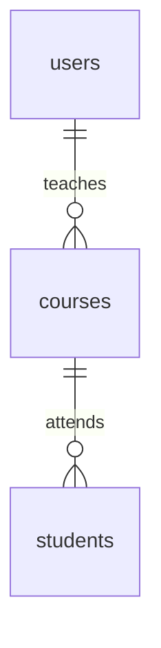

## 1. 背景介绍

### 1.1 教育信息化的浪潮与挑战

随着信息技术的飞速发展，教育领域正在经历一场深刻的变革，信息化已成为推动教育改革和发展的重要引擎。教育信息化要求将信息技术深度融入教育教学的各个环节，以提高教学效率、提升教育质量。

然而，教育信息化也面临着诸多挑战，其中之一便是信息系统的建设和应用。传统的教育信息系统往往功能单一、操作繁琐，难以满足学校日益增长的信息化需求。

### 1.2 小型课程信息管理系统的意义

小型课程信息管理系统应运而生，旨在解决上述问题。这类系统专注于课程信息的管理，以简洁、易用、高效为目标，为教师和学生提供便捷的课程信息查询、管理和互动平台。

小型课程信息管理系统具有以下意义：

* **提高教学效率:**  教师可以更方便地发布课程公告、上传教学资料、管理学生信息，从而节省时间，专注于教学。
* **促进学生学习:** 学生可以随时随地获取课程信息、参与课程讨论、提交作业，提高学习的积极性和主动性。
* **加强家校沟通:** 家长可以通过系统了解孩子的学习情况，与教师进行沟通交流，共同促进孩子的成长。

## 2. 核心概念与联系

### 2.1 系统用户角色

小型课程信息管理系统主要涉及以下用户角色：

* **管理员:** 负责系统维护、用户管理、权限控制等工作。
* **教师:** 负责发布课程信息、管理学生、批改作业等工作。
* **学生:** 负责查看课程信息、参与课程讨论、提交作业等工作。

### 2.2 课程信息

课程信息是系统的核心数据，包括课程名称、课程介绍、授课教师、上课时间、上课地点、课程资料等。

### 2.3 用户权限

不同用户角色拥有不同的系统权限，例如：

* 管理员拥有所有权限。
* 教师可以管理自己教授的课程信息，但不能修改其他教师的课程信息。
* 学生只能查看课程信息，不能修改课程信息。

## 3. 核心算法原理具体操作步骤

### 3.1 用户登录认证

系统采用用户名和密码的方式进行用户登录认证。

1. 用户输入用户名和密码。
2. 系统校验用户名和密码是否匹配。
3. 如果匹配，则登录成功，跳转到用户首页。
4. 如果不匹配，则登录失败，提示用户重新输入。

### 3.2 课程信息管理

教师可以通过系统添加、修改、删除课程信息。

1. 教师选择“课程管理”功能。
2. 教师输入课程信息，例如课程名称、课程介绍、上课时间等。
3. 系统保存课程信息。

### 3.3 学生信息管理

教师可以通过系统添加、修改、删除学生信息。

1. 教师选择“学生管理”功能。
2. 教师输入学生信息，例如学生姓名、学号、联系方式等。
3. 系统保存学生信息。

## 4. 数学模型和公式详细讲解举例说明

### 4.1 数据库设计

系统采用关系型数据库来存储数据，数据库表结构如下：

**用户表 (users)**

| 字段 | 类型 | 说明 |
|---|---|---|
| id | int | 用户ID |
| username | varchar(255) | 用户名 |
| password | varchar(255) | 密码 |
| role | varchar(255) | 用户角色 |

**课程表 (courses)**

| 字段 | 类型 | 说明 |
|---|---|---|
| id | int | 课程ID |
| name | varchar(255) | 课程名称 |
| description | text | 课程介绍 |
| teacher_id | int | 授课教师ID |
| start_time | datetime | 上课时间 |
| end_time | datetime | 下课时间 |
| location | varchar(255) | 上课地点 |

**学生表 (students)**

| 字段 | 类型 | 说明 |
|---|---|---|
| id | int | 学生ID |
| name | varchar(255) | 学生姓名 |
| student_id | varchar(255) | 学号 |
| contact | varchar(255) | 联系方式 |

### 4.2 关系图



## 5. 项目实践：代码实例和详细解释说明

### 5.1 开发环境

* 操作系统: Windows 10
* 开发语言: Python 3.8
* Web框架: Django 3.2
* 数据库: MySQL 8.0

### 5.2 代码实例

```python
# models.py

from django.db import models

class User(models.Model):
    username = models.CharField(max_length=255, unique=True)
    password = models.CharField(max_length=255)
    role = models.CharField(max_length=255)

class Course(models.Model):
    name = models.CharField(max_length=255)
    description = models.TextField()
    teacher = models.ForeignKey(User, on_delete=models.CASCADE)
    start_time = models.DateTimeField()
    end_time = models.DateTimeField()
    location = models.CharField(max_length=255)

class Student(models.Model):
    name = models.CharField(max_length=255)
    student_id = models.CharField(max_length=255, unique=True)
    contact = models.CharField(max_length=255)
    courses = models.ManyToManyField(Course)
```

### 5.3 代码解释

* `models.py` 文件定义了系统的数据模型，包括用户模型、课程模型和学生模型。
* `User` 模型表示用户，包含用户名、密码和角色属性。
* `Course` 模型表示课程，包含课程名称、课程介绍、授课教师、上课时间、下课时间和上课地点属性。
* `Student` 模型表示学生，包含学生姓名、学号、联系方式和所选课程属性。

## 6. 实际应用场景

### 6.1 高校课程管理

高校可以使用小型课程信息管理系统来管理大量的课程信息和学生信息，提高教学管理效率。

### 6.2 培训机构课程管理

培训机构可以使用小型课程信息管理系统来管理培训课程信息和学员信息，方便学员报名和学习。

### 6.3 企业内部培训管理

企业可以使用小型课程信息管理系统来管理内部培训课程信息和员工信息，提高员工培训效率。

## 7. 工具和资源推荐

### 7.1 Django

Django 是一个高级 Python Web 框架，可以帮助开发者快速构建 Web 应用。

### 7.2 MySQL

MySQL 是一个流行的关系型数据库管理系统，可以用于存储系统数据。

### 7.3 Bootstrap

Bootstrap 是一个流行的前端框架，可以帮助开发者快速构建美观易用的 Web 页面。

## 8. 总结：未来发展趋势与挑战

### 8.1 人工智能与教育的融合

未来，人工智能技术将更加深入地融入教育领域，例如智能教学助手、个性化学习推荐等。

### 8.2 数据安全与隐私保护

随着教育信息化的发展，数据安全和隐私保护将变得越来越重要。

### 8.3 系统的持续优化

小型课程信息管理系统需要不断优化，以满足学校和学生不断变化的需求。

## 9. 附录：常见问题与解答

### 9.1 如何添加新课程？

教师登录系统后，选择“课程管理”功能，然后输入课程信息即可添加新课程。

### 9.2 如何修改学生信息？

教师登录系统后，选择“学生管理”功能，然后找到要修改的学生信息，进行修改即可。

### 9.3 如何重置密码？

请联系系统管理员进行密码重置。
