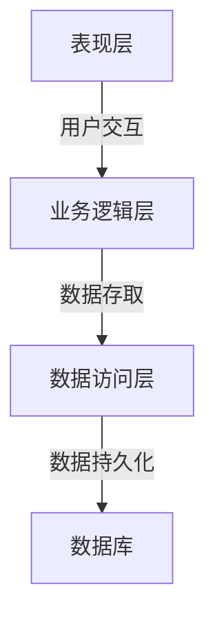
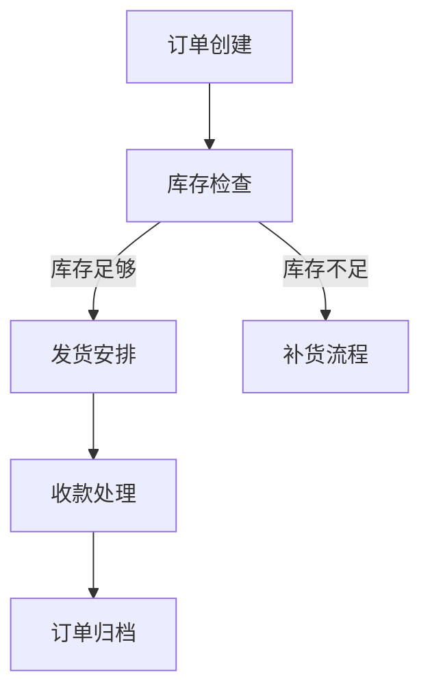
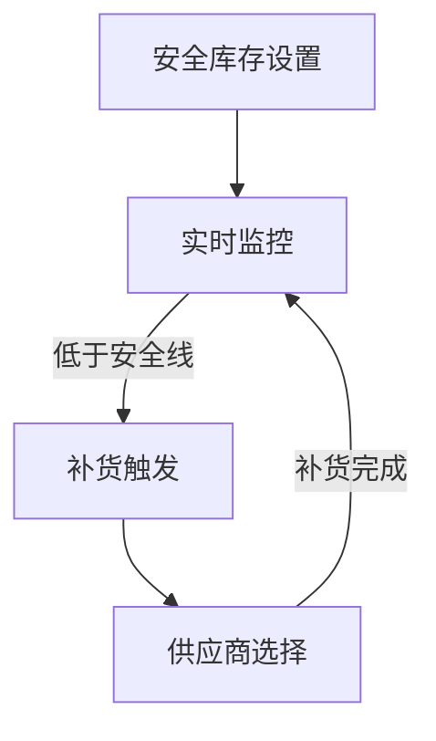
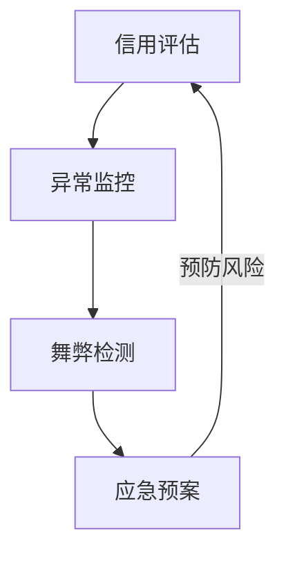

# 布匹出口管理系统详细设计与具体代码实现

## 1. 背景介绍

### 1.1 布匹出口行业概况

布匹出口是一个古老而又充满活力的行业。自古以来,丝绸之路就是联通东西方文化交流的重要纽带。如今,随着全球化进程的加快,布匹出口贸易仍然扮演着重要角色,为世界各地的消费者提供优质的纺织品。

### 1.2 传统布匹出口管理存在的问题

然而,传统的布匹出口管理存在诸多痛点和挑战:

- 手工操作繁琐,容易出错
- 数据分散,缺乏集中管理
- 沟通成本高,效率低下
- 缺乏实时监控,盲区较多

为解决这些问题,迫切需要一套高效、智能的布匹出口管理系统来优化整个流程。

### 1.3 布匹出口管理系统的作用

一个完善的布匹出口管理系统可以带来诸多好处:

- 提高工作效率,降低人工成本
- 实现数据集中管理,提高透明度
- 优化沟通协作,提升客户体验
- 实时监控订单状态,风险可控

因此,构建一套先进的布匹出口管理系统对于提升企业竞争力至关重要。

## 2. 核心概念与联系  

### 2.1 系统架构

布匹出口管理系统采用经典的三层架构,包括:

1. **表现层(Presentation Layer)**: 提供界面与用户交互
2. **业务逻辑层(Business Logic Layer)**: 处理系统核心逻辑
3. **数据访问层(Data Access Layer)**: 负责数据持久化



三层架构的优势在于低耦合,高内聚,有利于分工协作和功能扩展。

### 2.2 核心概念

- **订单(Order)**: 布匹出口业务的核心,包含客户信息、货物明细等关键数据。
- **发货(Shipment)**: 订单发货环节,涉及货运、物流等流程。
- **收款(Payment)**: 订单收款环节,与财务系统对接。
- **库存(Inventory)**: 管理布匹原材料和成品的库存。
- **供应商(Supplier)**: 提供布匹原材料的上游供应商。
- **客户(Customer)**: 下单购买布匹产品的客户。

这些概念相互关联,共同构建了布匹出口的完整业务流程。

## 3. 核心算法原理具体操作步骤

### 3.1 订单处理算法

订单处理是整个系统的核心环节,包括以下主要步骤:

1. **订单创建**: 客户端提交订单信息,服务端进行数据校验,生成新订单。
2. **库存检查**: 检查订单所需原材料的库存量,如库存不足则发起补货流程。
3. **发货安排**: 根据订单要求安排发货计划,包括运力调配、物流路线规划等。
4. **收款处理**: 发货完成后,与客户确认无误,按约定的付款条件进行收款。
5. **订单归档**: 订单处理完成后,对订单数据进行归档,用于后续查询和分析。



### 3.2 库存管理算法

合理的库存管理对于控制成本、保证交付至关重要。主要步骤包括:

1. **安全库存设置**: 根据历史数据、市场预测等因素,设置每种原材料的安全库存量。
2. **实时监控**: 对原材料和成品的出入库进行实时监控。
3. **补货触发**: 当库存量低于安全线时,自动触发补货流程。
4. **供应商选择**: 根据供货周期、价格等因素,从合格供应商中选择最优方案。



### 3.3 风险控制算法

布匹出口存在诸多风险,需要有针对性的控制措施:

1. **信用评估**: 对客户和供应商进行信用评级,降低违约风险。
2. **异常监控**: 实时监控订单状态,对异常情况及时预警并采取应对措施。
3. **舞弊检测**: 基于历史数据,利用机器学习算法检测潜在舞弊行为。
4. **应急预案**: 制定各类风险应急预案,确保突发情况可以得到妥善处置。



通过以上三种核心算法,可以有效管控布匹出口业务的主要环节,确保高效、安全地运营。

## 4. 数学模型和公式详细讲解举例说明

在布匹出口管理系统中,有多个环节需要借助数学模型和公式进行优化计算,下面将详细介绍其中的几个关键模型。

### 4.1 需求预测模型

为了实现精准的库存管理,需要对未来的需求进行准确预测。常用的需求预测模型有:

1. **移动平均模型**:

$$
F_{t+1} = \alpha D_t + (1 - \alpha) F_t
$$

其中 $F_{t+1}$ 为 $t+1$ 时刻的需求预测值,  $D_t$ 为 $t$ 时刻的实际需求量, $\alpha$ 为平滑系数。

2. **指数平滑模型**:

$$
F_{t+1} = \alpha D_t + (1 - \alpha)F_t \\
T_{t+1} = \beta(F_{t+1} - F_t) + (1 - \beta)T_t
$$

其中 $T_{t+1}$ 为 $t+1$ 时刻的趋势估计值, $\beta$ 为趋势平滑系数。

3. **季节性模型**:

$$
F_{t+m} = \alpha \frac{D_t}{S_{t-L}} + (1 - \alpha)(F_{t+m-1} + T_{t+m-1})\\
S_{t} = \gamma \frac{D_t}{F_t} + (1 - \gamma)S_{t-L}
$$

其中 $m$ 为季节周期长度, $L=m$ 时为完全季节模型, $S_t$ 为季节指数, $\gamma$ 为季节平滑系数。

通过选择合适的模型并优化参数,可以较为准确地预测未来的需求量,为库存管控提供依据。

### 4.2 运输路径优化模型

为了降低运输成本,提高配送效率,需要对货运路径进行优化。这可以使用**旅行商问题(TSP)**模型来描述:

已知 $n$ 个城市,城市 $i$ 和城市 $j$ 之间的距离为 $d_{ij}$,求经过所有城市且回到起点的最短闭合路径。

该问题可以用整数线性规划模型表示:

$$
\begin{aligned}
\min \quad & \sum_{i=1}^{n}\sum_{j=1}^{n} d_{ij}x_{ij}\\
\text{s.t.} \quad & \sum_{i=1}^{n}x_{ij} = 1, \quad \forall j \in \{1, \ldots, n\}\\
             & \sum_{j=1}^{n}x_{ij} = 1, \quad \forall i \in \{1, \ldots, n\}\\
             & \sum_{i \in S}\sum_{j \in S}x_{ij} \leq |S| - 1, \quad \forall S \subset \{1, \ldots, n\}, S \neq \emptyset\\
             & x_{ij} \in \{0, 1\}, \quad \forall i, j \in \{1, \ldots, n\}
\end{aligned}
$$

其中决策变量 $x_{ij}$ 表示从城市 $i$ 到城市 $j$ 的路径是否被选择。

对于大规模的实例,由于 TSP 属于 NP 难问题,需要借助启发式算法(如遗传算法、蚁群算法等)来求解。

通过合理规划运输路线,可以大幅降低整体物流成本。

### 4.3 供应商选择模型

在补货环节,需要在多个供应商中选择最优方案。这可以构建为一个**多目标优化问题**:

$$
\begin{aligned}
\min \quad & f_1(x), f_2(x), \ldots, f_m(x)\\
\text{s.t.} \quad & g_i(x) \leq 0, \quad i = 1, \ldots, p\\
            & h_j(x) = 0, \quad j = 1, \ldots, q\\
            & x \in X
\end{aligned}
$$

其中目标函数 $f_1(x), \ldots, f_m(x)$ 可以表示供应商的价格、交货周期、信用等指标,约束条件 $g_i(x)$ 和 $h_j(x)$ 表示对供应量、质量等的硬性要求。

由于目标存在多个且可能相互矛盾,因此需要借助**多目标优化算法**求解,如:

- 主次序法: 将多个目标排序,先优化主要目标,次要目标作为约束。
- 加权法: 给每个目标赋予权重,将多目标问题转化为单目标优化。
- 非支配排序遗传算法(NSGA): 借助遗传算法的思想,逐步向最优前沿面靠拢。

通过数学建模分析,可以权衡各种因素,选择最优的供应商组合。

以上仅是布匹出口管理系统中应用的部分数学模型,实际情况中还有更多模型需要建立和应用,以科学、高效地指导业务决策。

## 5. 项目实践:代码实例和详细解释说明

为了更好地展示系统的具体实现,下面将给出一些核心模块的代码实例并进行详细说明。

### 5.1 订单管理模块

订单管理模块负责处理订单的创建、修改、查询等操作,是整个系统的核心部分。

#### 5.1.1 订单创建

```python
from order import Order
from customer import Customer

def create_order(customer_id, items):
    """
    创建新订单
    
    Args:
        customer_id (int): 客户ID
        items (list): 订单商品清单,[(product_id, quantity)]
        
    Returns:
        Order: 新创建的订单对象
    """
    customer = Customer.get(customer_id)
    if not customer:
        raise ValueError(f"客户ID {customer_id} 不存在")
    
    order = Order()
    order.customer = customer
    order.items = items
    order.status = "PENDING"
    order.save()
    
    return order
```

上面的 `create_order` 函数首先会检查客户 ID 的合法性,然后创建一个新的 `Order` 对象,设置相关属性并保存到数据库中。

#### 5.1.2 订单状态更新

```python
from inventory import check_inventory

def update_order_status(order):
    """
    更新订单状态
    
    Args:
        order (Order): 待更新的订单对象
        
    Returns:
        str: 更新后的订单状态
    """
    if order.status == "PENDING":
        # 检查库存
        inventory_ok = check_inventory(order.items)
        if inventory_ok:
            order.status = "CONFIRMED"
        else:
            order.status = "INVENTORY_SHORTAGE"
    elif order.status == "CONFIRMED":
        # 安排发货
        shipment = arrange_shipment(order)
        if shipment:
            order.status = "SHIPPED"
            order.shipment = shipment
    # 处理其他状态...
            
    order.save()
    return order.status
```

`update_order_status` 函数根据订单的当前状态,执行相应的操作(如检查库存、安排发货等),并更新订单状态。这个函数展示了订单流程的核心逻辑。

#### 5.1.3 订单查询

```python
from order import Order
from datetime import datetime

def list_orders(start_date=None, end_date=None, status=None):
    """
    查询订单列表
    
    Args:
        start_date (datetime): 起始日期
        end_date (datetime): 结束日期
        status (str): 订单状