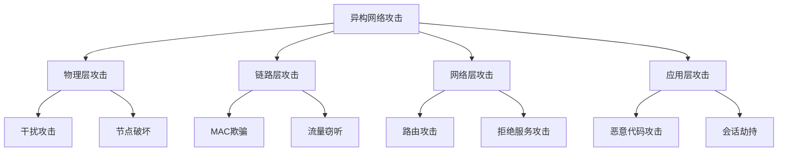

# 异构无线网络能效和安全优化研究

## 1.背景介绍

### 1.1 无线网络的发展历程

无线通信技术的发展经历了从1G到5G的演进过程,每一代技术都带来了更高的传输速率、更低的时延和更大的系统容量。随着物联网(IoT)和智能城市等新兴应用的兴起,对无线网络的需求也在不断增长。然而,无线网络的能耗和安全问题也随之凸显出来,成为制约其发展的主要瓶颈。

### 1.2 异构网络的概念

为了应对这一挑战,异构网络(Heterogeneous Network,HetNet)的概念应运而生。异构网络是指在传统的宏蜂窝网络之上,部署多种不同类型的小型低功率节点(如微蜂窝、蜂窝基站、中继器、射频节点等),从而提高网络容量、覆盖范围和能源效率。

### 1.3 能效和安全问题

然而,异构网络也面临着一些新的挑战,其中最为突出的是能效和安全问题。由于异构网络中存在大量的小型节点,如果不能有效管理和优化,将会导致能源的大量浪费。同时,异构网络的开放性和异构性也增加了安全风险,如何确保数据的机密性、完整性和可用性,是一个亟待解决的问题。

## 2.核心概念与联系 

### 2.1 异构网络架构

异构网络的基本架构包括三个层次:

1. 宏蜂窝网络层
2. 小型低功率节点层
3. 用户终端层

其中,宏蜂窝网络层提供了广域覆盖和控制管理,小型低功率节点层提高了局部区域的容量和覆盖,用户终端层则是最终的服务对象。

### 2.2 异构网络关键技术

异构网络的关键技术包括:

- 异构网络部署与优化
- 异构网络接入与移动性管理
- 异构网络资源管理与调度
- 异构网络能效优化
- 异构网络安全保障

其中,能效优化和安全保障是本文的重点关注领域。

### 2.3 能效优化与安全保障的关联

能效优化和安全保障在异构网络中存在一定的关联性。合理的能效优化策略不仅可以降低能耗,还可以减少不必要的信号传播,从而降低被攻击的风险。同时,安全防护措施也会影响系统的能耗表现。因此,在异构网络中,需要在能效和安全之间寻求一个平衡点。

## 3.核心算法原理具体操作步骤

### 3.1 异构网络能效优化算法

#### 3.1.1 基于负载的节点睡眠控制算法

这是一种基于网络流量负载的分布式节点睡眠控制算法。其基本思想是:在低负载时关闭部分节点以节省能源,而在高负载时唤醒更多节点以满足服务需求。算法的具体步骤如下:

1. 收集全网节点的实时负载信息
2. 根据预设的阈值,将节点划分为高负载、中负载和低负载三种状态
3. 对于低负载节点,关闭一部分以节省能源,同时确保其他节点可以接手其服务
4. 对于高负载节点,唤醒相邻的睡眠节点,以分担其负载压力
5. 中负载节点维持正常工作状态

该算法的优点是分布式实现、响应迅速、节能效果显著。缺点是可能引起频繁的节点状态切换,增加了控制开销。

#### 3.1.2 基于覆盖感知的节点部署优化算法

这种算法旨在优化异构网络中小型节点的部署位置,从而最大限度地提高能效。算法步骤如下:

1. 收集全网节点的地理位置信息
2. 构建节点覆盖冲突图,表示节点之间的覆盖冲突关系
3. 在覆盖冲突图上执行节点去重算法,移除冗余节点
4. 基于去重后的节点集合,重新规划节点的部署位置
5. 将优化后的部署方案下发执行

该算法的优点是可以有效避免节点覆盖范围的重叠浪费,缺点是需要全局信息,计算复杂度较高。

### 3.2 异构网络安全防护算法

#### 3.2.1 基于行为建模的入侵检测算法

这种算法通过建立异构网络中各类节点和用户终端的正常行为模型,对异常行为实施检测和阻断,从而提高网络的安全性。算法步骤如下:

1. 收集异构网络中各个实体(节点、终端等)的历史行为数据
2. 使用机器学习算法(如聚类、HMM等)对行为数据进行建模,得到正常行为模型
3. 实时监测各实体的行为,与正常模型进行比对
4. 对于偏离正常模型的行为,标记为可疑行为,并执行相应的防御策略

该算法的优点是可以自适应地检测未知威胁,缺点是需要大量的历史数据支持,对数据质量要求较高。

#### 3.2.2 基于虚拟隔离的恶意流量检测与阻断算法

这种算法通过构建软件定义网络(SDN)和网络函数虚拟化(NFV)等技术,实现对恶意流量的高效检测和隔离。算法步骤如下:

1. 在异构网络中部署流量监测功能,捕获全网流量样本
2. 使用机器学习等方法从流量样本中检测出恶意流量特征
3. 通过SDN控制器下发流表规则,将恶意流量重定向到虚拟化的检测环境
4. 在检测环境中深入分析恶意流量,确定其威胁级别
5. 对于高危恶意流量,通过SDN直接将其阻断在边缘

该算法的优点是可以灵活部署和调度检测功能,有效隔离恶意流量的危害。缺点是需要SDN和NFV等新型网络架构的支持。

## 4.数学模型和公式详细讲解举例说明

### 4.1 异构网络能效建模

我们可以将异构网络系统的总能耗建模为以下公式:

$$E_{total} = \sum_{i \in M}E_i^m + \sum_{j \in S}E_j^s + \sum_{k \in U}E_k^u$$

其中:
- $E_{total}$表示系统总能耗
- $M$表示宏蜂窝基站集合
- $S$表示小型节点集合 
- $U$表示用户终端集合
- $E_i^m$表示第i个宏基站的能耗
- $E_j^s$表示第j个小型节点的能耗
- $E_k^u$表示第k个用户终端的能耗

对于宏基站的能耗$E_i^m$,可以进一步建模为:

$$E_i^m = P_i^0 + \Delta_p P_i^{TX}(\rho_i)$$

其中:
- $P_i^0$表示基站的静态功耗
- $\Delta_p$表示功率放大器的效率系数
- $P_i^{TX}(\rho_i)$表示基站发射功率,是流量负载$\rho_i$的函数

而对于小型节点,由于其发射功率较低,能耗模型可以简化为:

$$E_j^s = \begin{cases}
P_j^{ON}, & \text{节点开启} \\
0, & \text{节点睡眠}
\end{cases}$$

其中$P_j^{ON}$表示小型节点的工作功耗。

用户终端的能耗$E_k^u$主要取决于发射功率和编码率等因素,这里不再赘述。

通过以上建模,我们可以对异构网络系统的总能耗进行量化分析,为节能优化提供理论基础。

### 4.2 网络安全威胁建模

我们使用攻击树(Attack Tree)的方法对网络安全威胁进行建模。攻击树是一种图形化的表示方法,将攻击目标表示为树根节点,将不同的攻击路径表示为子节点。

例如,针对异构网络的攻击树可以建模如下:



通过攻击树模型,我们可以清晰地展示异构网络面临的各种威胁,并针对不同的攻击路径制定相应的防御策略。

此外,我们还可以使用贝叶斯网络等概率图模型对网络攻击的发生概率进行量化建模,为安全防护提供决策支持。

## 4.项目实践:代码实例和详细解释说明

### 4.1 异构网络能效优化实例

以下是一个基于Python实现的异构网络节点睡眠控制算法示例:

```python
import networkx as nx
import random

# 定义网络拓扑
G = nx.Graph()
nodes = ['A', 'B', 'C', 'D', 'E', 'F', 'G']
edges = [('A', 'B'), ('A', 'C'), ('B', 'D'), ('C', 'D'), ('C', 'E'), ('D', 'F'), ('E', 'G')]
G.add_nodes_from(nodes)
G.add_edges_from(edges)

# 定义节点负载
node_loads = {'A': 0.8, 'B': 0.2, 'C': 0.6, 'D': 0.9, 'E': 0.3, 'F': 0.7, 'G': 0.1}

# 定义高低负载阈值
high_threshold = 0.8
low_threshold = 0.3

# 节点睡眠控制算法
def sleep_control(G, node_loads, high_threshold, low_threshold):
    active_nodes = set(G.nodes())
    sleep_nodes = set()

    # 处理高负载节点
    for node, load in node_loads.items():
        if load > high_threshold:
            neighbors = set(G.neighbors(node))
            for n in neighbors:
                if n in sleep_nodes:
                    sleep_nodes.remove(n)
                    active_nodes.add(n)
                    print(f"唤醒节点 {n} 以分担 {node} 的负载")

    # 处理低负载节点
    for node, load in node_loads.items():
        if load < low_threshold:
            neighbors = set(G.neighbors(node))
            covered_neighbors = neighbors.intersection(active_nodes)
            if len(covered_neighbors) > 0:
                active_nodes.remove(node)
                sleep_nodes.add(node)
                print(f"节点 {node} 进入睡眠模式,其负载由 {covered_neighbors} 接手")

    print("最终活跃节点集合:", active_nodes)
    print("最终睡眠节点集合:", sleep_nodes)

# 执行算法
sleep_control(G, node_loads, high_threshold, low_threshold)
```

上述代码首先定义了一个简单的网络拓扑,以及每个节点的负载情况。然后实现了一个`sleep_control`函数,根据高低负载阈值,决定哪些节点需要睡眠、哪些节点需要保持活跃。

该算法的核心思想是:对于高负载节点,唤醒其相邻的睡眠节点以分担负载;对于低负载节点,如果其邻居节点可以覆盖其服务范围,则将其置为睡眠状态以节省能源。

执行结果如下:

```
唤醒节点 C 以分担 D 的负载
节点 B 进入睡眠模式,其负载由 {'A', 'D'} 接手
节点 G 进入睡眠模式,其负载由 {'E'} 接手
最终活跃节点集合: {'A', 'C', 'D', 'E', 'F'}
最终睡眠节点集合: {'B', 'G'}
```

可以看到,算法成功地将低负载节点B和G置为睡眠状态,同时唤醒节点C以支持高负载节点D,从而达到了节能的目的。

### 4.2 异构网络安全防护实例

以下是一个基于Python实现的异构网络入侵检测算法示例:

```python
import