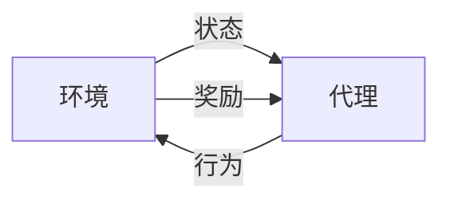

# 强化学习 原理与代码实例讲解

## 1.背景介绍

### 1.1 什么是强化学习？

强化学习(Reinforcement Learning, RL)是机器学习的一个重要分支,它研究如何基于与环境的交互来学习决策,以获得最大的累积奖励。与监督学习不同,强化学习没有给定的输入-输出示例对,代理(Agent)必须通过试错来学习哪些行为会获得最佳结果。

强化学习的关键思想是利用反馈信号(奖励或惩罚)来指导代理朝着目标前进。代理与环境交互,根据当前状态采取行动,然后接收到新的状态和相应的奖励信号。目标是学习一个策略(policy),使代理能够在长期获得最大的累积奖励。

### 1.2 强化学习的应用

强化学习在诸多领域有广泛的应用,包括:

- 机器人控制
- 游戏AI
- 自动驾驶
- 资源管理
- 金融交易
- 网络路由
- 自然语言处理

任何需要基于经验进行顺序决策的问题,都可以使用强化学习方法来解决。

## 2.核心概念与联系  

### 2.1 强化学习中的主要元素

强化学习系统由以下几个核心元素组成:

1. **环境(Environment)**:代理与之交互的外部世界。环境会根据代理的行为转换到新的状态,并返回相应的奖励信号。

2. **状态(State)**:环境在某个时间点的具体情况。状态通常是一个向量,包含了描述当前环境的所有相关信息。

3. **代理(Agent)**:做出决策并与环境交互的学习者。代理的目标是学习一个能够最大化累积奖励的策略。

4. **行为(Action)**:代理在特定状态下可以采取的动作。行为会导致环境转移到新的状态。

5. **奖励(Reward)**:环境对代理行为的反馈信号。奖励可以是正值(获得奖励)或负值(受到惩罚)。代理的目标是最大化长期累积奖励。

6. **策略(Policy)**:代理根据当前状态选择行为的规则或映射函数。学习过程就是优化这个策略,使其获得最大的累积奖励。

这些元素相互作用,形成了强化学习问题的基本框架,如下图所示:

### 2.2 强化学习的类型

根据代理对环境的可观测程度,强化学习可分为以下几种类型:

1. **完全可观测环境(Full Observable Environment)**:代理可以完全观测到环境的状态。

2. **部分可观测环境(Partially Observable Environment)**:代理只能观测到环境状态的一部分信息,需要基于过去的观测序列来估计隐藏的状态。

3. **单程序任务(Episodic Task)**:问题被分成多个离散的情节或回合。每个情节从初始状态开始,直到达到终止状态结束。

4. **持续任务(Continuing Task)**:代理在同一个环境中无限期地交互。

不同类型的强化学习问题需要采用不同的算法和技术。本文将重点介绍完全可观测环境下的单程序任务。

## 3.核心算法原理具体操作步骤

强化学习算法通过探索和利用的权衡来学习最优策略。探索意味着代理尝试新的行为以获取更多经验,而利用则是利用已有的知识获取最大化的当前奖励。算法需要在这两者之间达到适当的平衡。

以下是一些核心的强化学习算法,我们将逐一介绍它们的原理和操作步骤。

### 3.1 动态规划方法

#### 3.1.1 策略迭代(Policy Iteration)

策略迭代算法包含两个核心步骤:策略评估和策略改进。

**策略评估**:对于给定的策略$\pi$,计算其价值函数$V^\pi$或$Q^\pi$。这个过程通过反复应用贝尔曼方程来进行。

对于状态价值函数$V^\pi(s)$,贝尔曼方程为:

$$V^\pi(s) = \mathbb{E}_\pi[R_{t+1} + \gamma V^\pi(S_{t+1}) | S_t = s]$$

其中$R_{t+1}$是立即奖励,$\gamma$是折现因子,用于权衡当前和未来奖励的重要性。$S_{t+1}$是根据策略$\pi$和状态转移概率从$S_t$转移而来的下一个状态。

对于行为价值函数$Q^\pi(s,a)$,贝尔曼方程为:

$$Q^\pi(s,a) = \mathbb{E}_\pi[R_{t+1} + \gamma \sum_{s'} P_{ss'}^a Q^\pi(s',\pi(s')) | S_t=s, A_t=a]$$

其中$P_{ss'}^a$是在状态$s$采取行为$a$后转移到状态$s'$的概率。

**策略改进**:对于每个状态$s$,选择一个行为$a$使得$Q^\pi(s,a)$最大化,从而得到一个新的更优的策略$\pi'$。

$$\pi'(s) = \arg\max_a Q^\pi(s,a)$$

重复上述两个步骤,直到策略收敛到最优策略$\pi^*$。这个算法虽然有理论保证,但是当状态空间很大时,计算代价会变得昂贵。

#### 3.1.2 价值迭代(Value Iteration)

价值迭代算法直接学习最优价值函数$V^*(s)$或$Q^*(s,a)$,而不是显式地学习策略。

对于$V^*(s)$,贝尔曼最优方程为:

$$V^*(s) = \max_a \mathbb{E}[R_{t+1} + \gamma V^*(S_{t+1}) | S_t=s, A_t=a]$$

对于$Q^*(s,a)$,贝尔曼最优方程为:

$$Q^*(s,a) = \mathbb{E}[R_{t+1} + \gamma \max_{a'} Q^*(S_{t+1}, a') | S_t=s, A_t=a]$$

通过反复应用这些方程,直到价值函数收敛。最终,我们可以从$Q^*(s,a)$中恢复出最优策略:

$$\pi^*(s) = \arg\max_a Q^*(s,a)$$

价值迭代相比策略迭代更加通用,因为它不需要知道状态转移概率模型。但它也存在计算开销较大的问题。

### 3.2 时序差分学习

时序差分(Temporal Difference, TD)学习是一种基于采样的强化学习算法,它结合了动态规划的思想和蒙特卡罗方法的采样技术。与动态规划相比,TD学习无需知道环境的完整模型,可以直接从经验中学习。

#### 3.2.1 Sarsa算法

Sarsa是基于在线TD学习的一种经典算法,它同时学习状态-行为价值函数$Q(s,a)$和策略$\pi$。算法步骤如下:

1. 初始化$Q(s,a)$,对所有$s,a$赋予任意值。
2. 选择初始状态$S_0$,并根据策略$\pi$选择行为$A_0$。
3. 对于每个时间步$t$:
    - 执行行为$A_t$,观测奖励$R_{t+1}$和下一状态$S_{t+1}$。
    - 根据策略$\pi$选择下一行为$A_{t+1}$。
    - 更新$Q(S_t,A_t)$:
        $$Q(S_t, A_t) \leftarrow Q(S_t, A_t) + \alpha[R_{t+1} + \gamma Q(S_{t+1}, A_{t+1}) - Q(S_t, A_t)]$$
        其中$\alpha$是学习率,$\gamma$是折现因子。
    - $S_t \leftarrow S_{t+1}, A_t \leftarrow A_{t+1}$。
4. 重复步骤3,直到收敛或达到最大迭代次数。

Sarsa算法评估的是当前策略$\pi$下的$Q^\pi(s,a)$。如果我们想学习最优策略,可以采用$\epsilon$-贪婪策略,在一定概率下选择最优行为,以引入探索。

#### 3.2.2 Q-Learning

Q-Learning是另一种流行的TD学习算法,它直接学习最优行为价值函数$Q^*(s,a)$,而不需要显式地学习策略。算法步骤与Sarsa类似,但更新规则略有不同:

$$Q(S_t, A_t) \leftarrow Q(S_t, A_t) + \alpha[R_{t+1} + \gamma \max_a Q(S_{t+1}, a) - Q(S_t, A_t)]$$

可以看到,Q-Learning使用了$\max_a Q(S_{t+1}, a)$而不是$Q(S_{t+1}, A_{t+1})$。这意味着它总是选择下一状态的最优行为,而不是按照当前策略选择。

Q-Learning算法在理论上被证明能够收敛到最优行为价值函数$Q^*(s,a)$,从而可以得到最优策略$\pi^*(s) = \arg\max_a Q^*(s,a)$。

### 3.3 策略梯度算法

策略梯度(Policy Gradient)算法是另一类强化学习算法,它直接对策略$\pi_\theta(a|s)$进行参数化,然后通过梯度上升来优化策略参数$\theta$,使得累积奖励最大化。

策略梯度算法的目标是最大化期望的累积奖励:

$$J(\theta) = \mathbb{E}_{\tau \sim \pi_\theta}[\sum_{t=0}^\infty \gamma^t r(s_t, a_t)]$$

其中$\tau = (s_0, a_0, s_1, a_1, ...)$是由策略$\pi_\theta$生成的轨迹序列。

根据策略梯度定理,我们可以计算目标函数$J(\theta)$关于策略参数$\theta$的梯度:

$$\nabla_\theta J(\theta) = \mathbb{E}_{\tau \sim \pi_\theta}\left[\sum_{t=0}^\infty \nabla_\theta \log \pi_\theta(a_t|s_t)Q^{\pi_\theta}(s_t, a_t)\right]$$

然后使用梯度上升法更新策略参数:

$$\theta \leftarrow \theta + \alpha \nabla_\theta J(\theta)$$

其中$\alpha$是学习率。

策略梯度算法的一个关键挑战是如何估计$Q^{\pi_\theta}(s_t, a_t)$。常见的方法包括:

1. **基于值函数的方法**:同时学习状态价值函数$V^{\pi_\theta}(s)$或行为价值函数$Q^{\pi_\theta}(s,a)$,并将其代入梯度公式。这种方法被称为Actor-Critic算法。

2. **蒙特卡罗策略梯度**:使用采样轨迹上的累积奖励来无偏估计$Q^{\pi_\theta}(s_t, a_t)$。

3. **时序差分策略梯度**:使用时序差分误差来估计优势函数(Advantage Function),从而估计$Q^{\pi_\theta}(s_t, a_t)$。

策略梯度算法的优点是可以直接优化策略,适用于连续动作空间和随机环境。但它也存在收敛慢、样本效率低等问题。

### 3.4 值函数近似

在实际应用中,状态空间和行为空间往往非常大,使得表格形式的值函数存储和计算变得不可行。这时我们需要使用函数近似技术来估计值函数。

常见的值函数近似方法包括:

1. **线性函数近似**:使用特征向量$\phi(s)$或$\phi(s,a)$和权重向量$\theta$来近似值函数,例如$V(s) \approx \theta^\top \phi(s)$或$Q(s,a) \approx \theta^\top \phi(s,a)$。

2. **神经网络函数近似**:使用神经网络来拟合值函数,输入是状态$s$或状态-行为对$(s,a)$,输出是估计的值函数。这种方法被称为深度强化学习(Deep Reinforcement Learning)。

使用函数近似后,我们需要采用不同的算法来优化值函数的参数。常见的算法包括半梯度TD学习、最小二乘TD学习、残差最小化等。

## 4.数学模型和公式详细讲解举例说明

在强化学习中,有许多重要的数