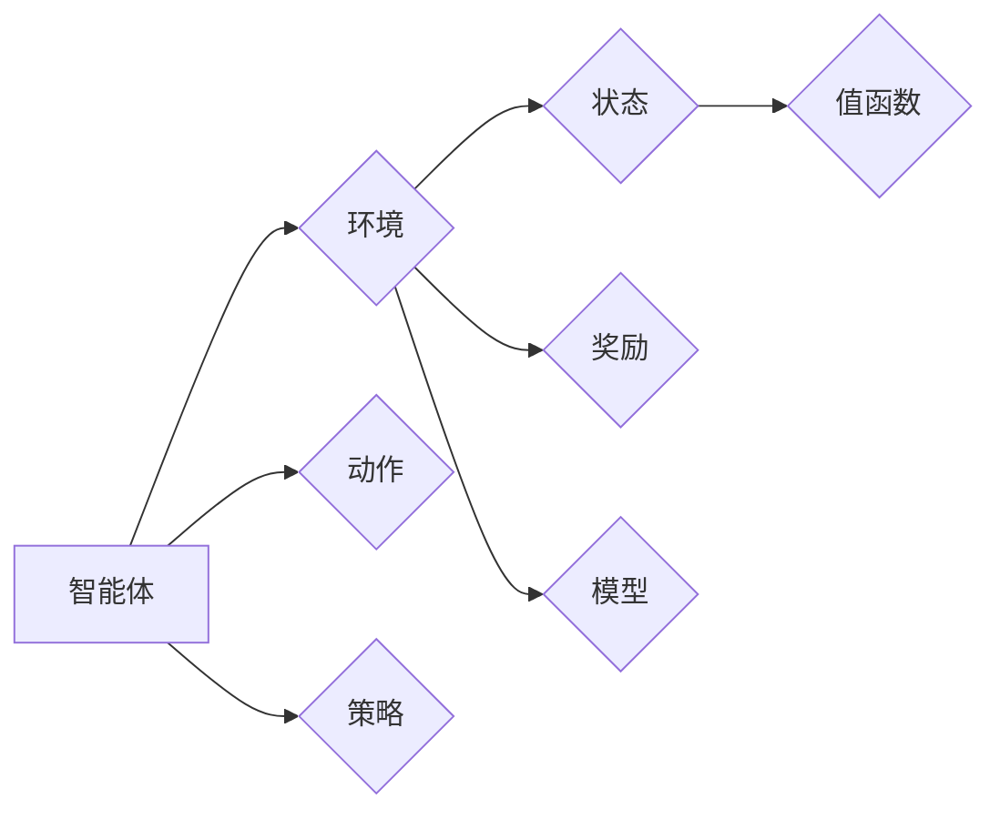

# 强化学习入门：迈向智能决策的第一步

作者：禅与计算机程序设计艺术

## 1. 背景介绍

### 1.1 什么是强化学习？

强化学习 (Reinforcement Learning, RL) 是一种机器学习范式，它使智能体 (agent) 能够通过与环境交互学习最优行为策略。与监督学习不同，强化学习不依赖于预先标记的数据集，而是通过试错和奖励机制来学习。智能体在环境中执行动作，并根据动作的结果获得奖励或惩罚，从而逐步优化其策略以最大化累积奖励。

### 1.2 强化学习的应用领域

强化学习已在各个领域取得了显著成果，例如：

* **游戏**:  AlphaGo, AlphaStar 等游戏AI战胜了人类世界冠军。
* **机器人控制**:  机器人可以学习行走、抓取物体等复杂任务。
* **资源管理**:  优化数据中心资源分配、交通信号灯控制等。
* **医疗**:  个性化治疗方案制定、药物研发等。
* **金融**:  投资组合优化、风险管理等。

### 1.3 强化学习与其他机器学习范式的区别

* **监督学习**:  需要预先标记的数据集，学习从输入到输出的映射关系。
* **无监督学习**:  从无标签数据中学习数据结构和模式。
* **强化学习**:  通过与环境交互学习最优行为策略，不需要预先标记的数据集。

## 2. 核心概念与联系

### 2.1 智能体 (Agent)

智能体是强化学习中的核心组成部分，它负责感知环境状态、选择动作并接收奖励。

### 2.2 环境 (Environment)

环境是智能体与之交互的外部世界，它可以是模拟环境或真实世界。

### 2.3 状态 (State)

状态描述了环境在特定时刻的状况，例如游戏中的棋盘布局、机器人的位置和速度等。

### 2.4 动作 (Action)

动作是智能体在环境中执行的行为，例如游戏中的落子、机器人的移动方向等。

### 2.5 奖励 (Reward)

奖励是智能体执行动作后从环境中获得的反馈，它可以是正值 (奖励) 或负值 (惩罚)。

### 2.6 策略 (Policy)

策略是智能体根据当前状态选择动作的规则，它可以是确定性策略 (根据状态直接确定动作) 或随机性策略 (根据状态以一定概率选择动作)。

### 2.7 值函数 (Value Function)

值函数用于评估状态或状态-动作对的长期价值，它表示从当前状态或状态-动作对出发，遵循特定策略所能获得的累积奖励的期望值。

### 2.8 模型 (Model)

模型是对环境的抽象表示，它可以预测环境对智能体动作的响应，例如状态转移概率和奖励函数。

### 2.9 核心概念联系图



## 3. 核心算法原理具体操作步骤

### 3.1 基于值的强化学习

#### 3.1.1 Q-learning 算法

Q-learning 是一种基于值的强化学习算法，它通过学习状态-动作值函数 (Q 函数) 来优化策略。Q 函数表示在特定状态下执行特定动作所能获得的长期价值。

**算法步骤**:

1. 初始化 Q 函数，通常为全 0 矩阵。
2. 循环执行以下步骤直至收敛:
    * 观察当前状态 $s$。
    * 根据当前策略选择动作 $a$。
    * 执行动作 $a$，并观察新的状态 $s'$ 和奖励 $r$。
    * 更新 Q 函数:
        $$Q(s, a) \leftarrow Q(s, a) + \alpha [r + \gamma \max_{a'} Q(s', a') - Q(s, a)]$$
        其中，$\alpha$ 是学习率，$\gamma$ 是折扣因子，用于平衡短期奖励和长期奖励。

#### 3.1.2 SARSA 算法

SARSA (State-Action-Reward-State-Action) 算法也是一种基于值的强化学习算法，它与 Q-learning 算法的主要区别在于更新 Q 函数的方式。

**算法步骤**:

1. 初始化 Q 函数，通常为全 0 矩阵。
2. 循环执行以下步骤直至收敛:
    * 观察当前状态 $s$。
    * 根据当前策略选择动作 $a$。
    * 执行动作 $a$，并观察新的状态 $s'$ 和奖励 $r$。
    * 根据当前策略选择新的动作 $a'$。
    * 更新 Q 函数:
        $$Q(s, a) \leftarrow Q(s, a) + \alpha [r + \gamma Q(s', a') - Q(s, a)]$$

### 3.2 基于策略的强化学习

#### 3.2.1 策略梯度算法

策略梯度算法直接优化策略参数，以最大化累积奖励的期望值。

**算法步骤**:

1. 初始化策略参数。
2. 循环执行以下步骤直至收敛:
    * 采样多条轨迹，每条轨迹包含一系列状态、动作和奖励。
    * 计算每条轨迹的累积奖励。
    * 根据累积奖励更新策略参数，以增加高奖励轨迹的概率。

#### 3.2.2 Actor-Critic 算法

Actor-Critic 算法结合了基于值和基于策略的强化学习方法，它使用一个 Actor 网络学习策略，一个 Critic 网络评估状态值函数。

**算法步骤**:

1. 初始化 Actor 网络和 Critic 网络。
2. 循环执行以下步骤直至收敛:
    * 观察当前状态 $s$。
    * 使用 Actor 网络选择动作 $a$。
    * 执行动作 $a$，并观察新的状态 $s'$ 和奖励 $r$。
    * 使用 Critic 网络评估当前状态 $s$ 和新状态 $s'$ 的值函数。
    * 更新 Actor 网络参数，以增加高奖励动作的概率。
    * 更新 Critic 网络参数，以更准确地评估状态值函数。

## 4. 数学模型和公式详细讲解举例说明

### 4.1 马尔可夫决策过程 (Markov Decision Process, MDP)

MDP 是强化学习的数学框架，它描述了智能体与环境交互的过程。

**MDP 五元组**:

* $S$: 状态空间，表示所有可能的状态。
* $A$: 动作空间，表示所有可能的动作。
* $P$: 状态转移概率，$P(s'|s, a)$ 表示在状态 $s$ 执行动作 $a$ 后转移到状态 $s'$ 的概率。
* $R$: 奖励函数，$R(s, a)$ 表示在状态 $s$ 执行动作 $a$ 后获得的奖励。
* $\gamma$: 折扣因子，用于平衡短期奖励和长期奖励。

### 4.2 Bellman 方程

Bellman 方程是强化学习中的核心方程，它建立了状态值函数和动作值函数之间的关系。

**状态值函数**:

$$V(s) = \max_a \sum_{s'} P(s'|s, a) [R(s, a) + \gamma V(s')]$$

**动作值函数**:

$$Q(s, a) = R(s, a) + \gamma \sum_{s'} P(s'|s, a) \max_{a'} Q(s', a')$$

### 4.3 举例说明

假设有一个简单的迷宫环境，智能体需要从起点走到终点。

* 状态空间:  迷宫中的每个格子代表一个状态。
* 动作空间:  智能体可以向上、下、左、右移动。
* 状态转移概率:  取决于迷宫的布局，例如在边界处无法移动。
* 奖励函数:  到达终点获得正奖励，其他情况获得 0 奖励。
* 折扣因子:  通常设置为 0.9 或 0.99，表示更重视长期奖励。

## 5. 项目实践：代码实例和详细解释说明

### 5.1 OpenAI Gym 环境

OpenAI Gym 提供了各种强化学习环境，例如经典控制问题、游戏环境等。

**安装**:

```
pip install gym
```

**使用**:

```python
import gym

# 创建 CartPole-v1 环境
env = gym.make('CartPole-v1')

# 重置环境
observation = env.reset()

# 循环执行以下步骤直至游戏结束:
    # 渲染环境
    env.render()
    # 选择动作
    action = env.action_space.sample()
    # 执行动作
    observation, reward, done, info = env.step(action)
    # 判断游戏是否结束
    if done:
        break

# 关闭环境
env.close()
```

### 5.2 Q-learning 算法实现

```python
import gym
import numpy as np

# 创建 CartPole-v1 环境
env = gym.make('CartPole-v1')

# 定义 Q 函数
Q = np.zeros([env.observation_space.n, env.action_space.n])

# 定义超参数
alpha = 0.1
gamma = 0.99
epsilon = 0.1
episodes = 1000

# 训练 Q 函数
for episode in range(episodes):
    # 重置环境
    state = env.reset()
    done = False
    total_reward = 0
    # 循环执行以下步骤直至游戏结束:
    while not done:
        # 选择动作
        if np.random.uniform(0, 1) < epsilon:
            action = env.action_space.sample()
        else:
            action = np.argmax(Q[state, :])
        # 执行动作
        next_state, reward, done, info = env.step(action)
        # 更新 Q 函数
        Q[state, action] = Q[state, action] + alpha * (reward + gamma * np.max(Q[next_state, :]) - Q[state, action])
        # 更新状态和总奖励
        state = next_state
        total_reward += reward
    # 打印每轮游戏得分
    print('Episode {}: {}'.format(episode, total_reward))

# 测试 Q 函数
state = env.reset()
done = False
total_reward = 0
while not done:
    # 渲染环境
    env.render()
    # 选择动作
    action = np.argmax(Q[state, :])
    # 执行动作
    state, reward, done, info = env.step(action)
    # 更新总奖励
    total_reward += reward
# 打印测试得分
print('Test reward: {}'.format(total_reward))

# 关闭环境
env.close()
```

## 6. 实际应用场景

### 6.1 游戏 AI

强化学习已在游戏 AI 领域取得了巨大成功，例如 AlphaGo, AlphaStar 等游戏 AI 战胜了人类世界冠军。

### 6.2 机器人控制

强化学习可以用于机器人控制，使机器人能够学习行走、抓取物体等复杂任务。

### 6.3 资源管理

强化学习可以用于优化数据中心资源分配、交通信号灯控制等资源管理问题。

### 6.4 医疗

强化学习可以用于个性化治疗方案制定、药物研发等医疗领域。

### 6.5 金融

强化学习可以用于投资组合优化、风险管理等金融领域。

## 7. 工具和资源推荐

### 7.1 OpenAI Gym

OpenAI Gym 提供了各种强化学习环境，例如经典控制问题、游戏环境等。

### 7.2 Ray RLlib

Ray RLlib 是一个用于构建和运行强化学习应用的开源库。

### 7.3 TensorFlow Agents

TensorFlow Agents 是一个用于构建和训练强化学习智能体的 TensorFlow 库。

### 7.4 Stable Baselines3

Stable Baselines3 是一个基于 PyTorch 的强化学习库，提供了各种强化学习算法的实现。

## 8. 总结：未来发展趋势与挑战

### 8.1 未来发展趋势

* **样本效率**:  提高强化学习算法的样本效率，使其能够在更少的数据下学习。
* **泛化能力**:  提高强化学习算法的泛化能力，使其能够适应新的环境和任务。
* **安全性**:  确保强化学习系统的安全性，避免出现意外行为。
* **可解释性**:  提高强化学习系统的可解释性，使其决策过程更加透明。

### 8.2 挑战

* **数据需求**:  强化学习算法通常需要大量的训练数据。
* **环境复杂性**:  真实世界的环境往往非常复杂，难以建模。
* **奖励函数设计**:  设计合适的奖励函数是强化学习成功的关键。
* **安全性**:  强化学习系统的安全性是一个重要问题。

## 9. 附录：常见问题与解答

### 9.1 强化学习和监督学习的区别是什么？

监督学习需要预先标记的数据集，学习从输入到输出的映射关系。强化学习通过与环境交互学习最优行为策略，不需要预先标记的数据集。

### 9.2 强化学习有哪些应用场景？

强化学习已在游戏、机器人控制、资源管理、医疗、金融等领域取得了成功。

### 9.3 强化学习有哪些挑战？

强化学习的挑战包括数据需求、环境复杂性、奖励函数设计和安全性等。
