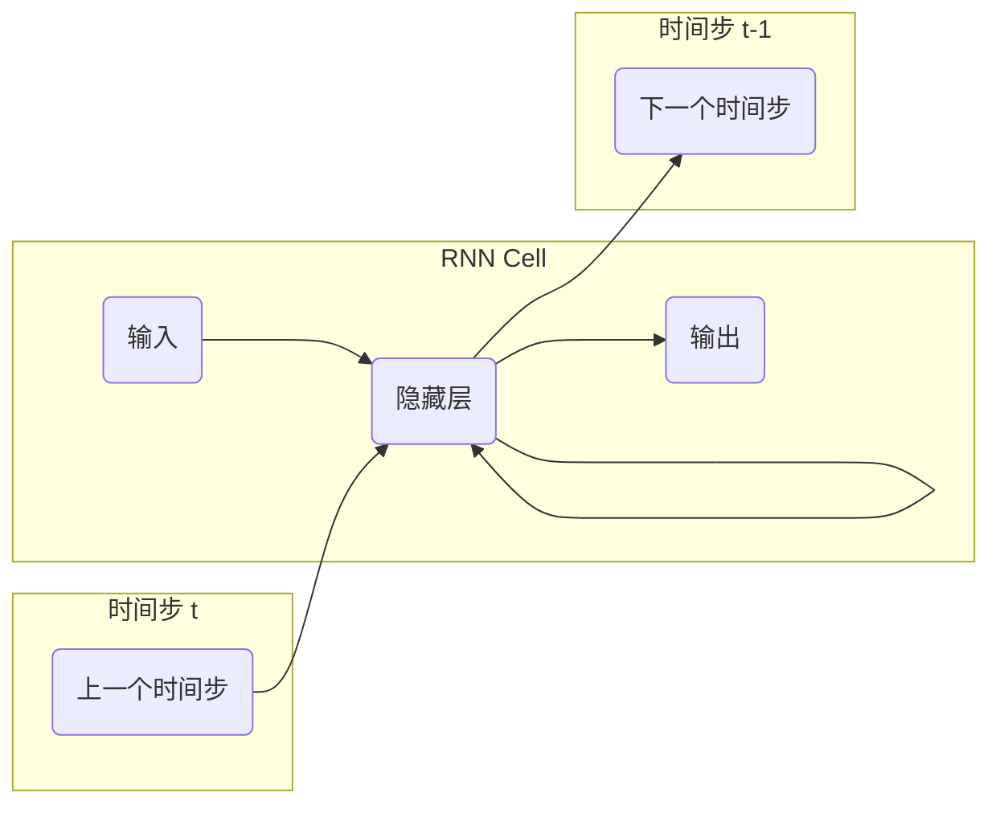

## 1. 背景介绍

### 1.1.  从传统神经网络到循环神经网络

传统的神经网络，例如多层感知机（MLP），在处理序列数据时存在局限性。它们无法捕捉数据中的时间依赖关系，因为每个输入都被视为独立的。为了解决这个问题，循环神经网络（RNN）应运而生。RNN 是一种特殊类型的神经网络，它具有循环连接，允许信息在网络中循环流动，从而能够处理序列数据并捕捉时间依赖关系。

### 1.2.  RNN 的应用领域

RNN 在各种领域都有广泛的应用，包括：

* **自然语言处理 (NLP):**  机器翻译、文本生成、情感分析、语音识别
* **时间序列分析:** 股票预测、天气预报、信号处理
* **机器学习:**  图像字幕生成、视频分析

## 2. 核心概念与联系

### 2.1.  RNN 的基本结构

RNN 的基本结构包括输入层、隐藏层和输出层。与传统神经网络不同的是，RNN 的隐藏层具有循环连接，允许信息在时间步之间传递。



### 2.2.  循环连接与时间依赖性

循环连接是 RNN 的核心特征。它们允许网络记住先前时间步的信息，并将其用于当前时间步的计算。这使得 RNN 能够捕捉数据中的时间依赖关系。

### 2.3.  隐藏状态与记忆

RNN 的隐藏状态充当网络的记忆。在每个时间步，隐藏状态都会更新，以反映当前输入和先前时间步的信息。

## 3. 核心算法原理具体操作步骤

### 3.1.  前向传播

RNN 的前向传播过程包括以下步骤：

1. **初始化隐藏状态：** 在第一个时间步，隐藏状态通常初始化为零向量。
2. **计算当前时间步的隐藏状态：**  隐藏状态的计算公式如下：

    $$h_t = f(W_{xh} x_t + W_{hh} h_{t-1} + b_h)$$

    其中：
    * $h_t$ 是当前时间步的隐藏状态
    * $x_t$ 是当前时间步的输入
    * $h_{t-1}$ 是先前时间步的隐藏状态
    * $W_{xh}$ 是输入到隐藏层的权重矩阵
    * $W_{hh}$ 是隐藏层到隐藏层的权重矩阵
    * $b_h$ 是隐藏层的偏置向量
    * $f$ 是激活函数，例如 tanh 或 sigmoid

3. **计算当前时间步的输出：**  输出的计算公式如下：

    $$y_t = g(W_{hy} h_t + b_y)$$

    其中：
    * $y_t$ 是当前时间步的输出
    * $W_{hy}$ 是隐藏层到输出层的权重矩阵
    * $b_y$ 是输出层的偏置向量
    * $g$ 是激活函数，例如 softmax

### 3.2.  反向传播

RNN 的反向传播过程使用**随时间反向传播算法（BPTT）**来计算梯度。BPTT 算法通过将 RNN 展开为一系列时间步，然后应用标准的反向传播算法来计算梯度。

### 3.3.  梯度消失和梯度爆炸

RNN 训练过程中可能会遇到梯度消失或梯度爆炸问题。梯度消失是指梯度在反向传播过程中变得非常小，导致网络难以学习长期依赖关系。梯度爆炸是指梯度在反向传播过程中变得非常大，导致网络训练不稳定。

## 4. 数学模型和公式详细讲解举例说明

### 4.1.  RNN 的数学模型

RNN 的数学模型可以用以下公式表示：

$$h_t = f(W_{xh} x_t + W_{hh} h_{t-1} + b_h)$$

$$y_t = g(W_{hy} h_t + b_y)$$

### 4.2.  公式中的参数解释

* $x_t$:  当前时间步的输入
* $h_t$:  当前时间步的隐藏状态
* $y_t$:  当前时间步的输出
* $W_{xh}$:  输入到隐藏层的权重矩阵
* $W_{hh}$:  隐藏层到隐藏层的权重矩阵
* $W_{hy}$:  隐藏层到输出层的权重矩阵
* $b_h$:  隐藏层的偏置向量
* $b_y$:  输出层的偏置向量
* $f$:  隐藏层的激活函数
* $g$:  输出层的激活函数

### 4.3.  举例说明

假设我们有一个 RNN，它接收一个单词序列作为输入，并预测下一个单词。输入序列是 "The quick brown fox jumps", 我们希望 RNN 预测下一个单词 "over"。

1. **初始化隐藏状态:**  将隐藏状态 $h_0$ 初始化为零向量。
2. **计算第一个时间步的隐藏状态:**  输入单词是 "The"，使用上述公式计算 $h_1$。
3. **计算第一个时间步的输出:**  使用上述公式计算 $y_1$，它表示预测的下一个单词的概率分布。
4. **重复步骤 2 和 3，直到处理完所有输入单词:**  计算 $h_2$, $y_2$, $h_3$, $y_3$, $h_4$, $y_4$, $h_5$, $y_5$。
5. **预测下一个单词:**  $y_5$ 表示预测的下一个单词的概率分布，选择概率最高的单词作为预测结果。

## 5. 项目实践：代码实例和详细解释说明

### 5.1.  使用 Python 和 TensorFlow 构建 RNN

```python
import tensorflow as tf

# 定义 RNN 模型
model = tf.keras.Sequential([
    tf.keras.layers.SimpleRNN(units=64, return_sequences=True, input_shape=(None, 10)),
    tf.keras.layers.SimpleRNN(units=32),
    tf.keras.layers.Dense(units=1)
])

# 编译模型
model.compile(optimizer='adam', loss='mse')

# 训练模型
model.fit(x_train, y_train, epochs=10)

# 评估模型
loss = model.evaluate(x_test, y_test)

# 使用模型进行预测
predictions = model.predict(x_new)
```

### 5.2.  代码解释

* `tf.keras.layers.SimpleRNN`:  定义一个简单的 RNN 层。
    * `units`:  隐藏单元的数量。
    * `return_sequences`:  是否返回所有时间步的隐藏状态。
    * `input_shape`:  输入数据的形状。
* `tf.keras.layers.Dense`:  定义一个全连接层。
* `model.compile`:  编译模型，指定优化器、损失函数等。
* `model.fit`:  训练模型，指定训练数据、epochs 等。
* `model.evaluate`:  评估模型，计算损失值。
* `model.predict`:  使用模型进行预测。

## 6. 实际应用场景

### 6.1.  机器翻译

RNN 可以用于机器翻译，将一种语言的文本翻译成另一种语言。

### 6.2.  文本生成

RNN 可以用于文本生成，例如生成诗歌、代码、音乐等。

### 6.3.  情感分析

RNN 可以用于情感分析，例如判断一段文本的情感是积极的、消极的还是中性的。

### 6.4.  语音识别

RNN 可以用于语音识别，将语音转换为文本。

## 7. 工具和资源推荐

### 7.1.  TensorFlow

TensorFlow 是一个用于机器学习和深度学习的开源平台。

### 7.2.  Keras

Keras 是一个高级神经网络 API，它运行在 TensorFlow 之上。

### 7.3.  PyTorch

PyTorch 是另一个用于机器学习和深度学习的开源平台。

## 8. 总结：未来发展趋势与挑战

### 8.1.  RNN 的未来发展趋势

* **更复杂的 RNN 架构:**  例如 LSTM、GRU 等。
* **更有效的训练方法:**  例如 Adam、RMSprop 等。
* **与其他技术的结合:**  例如注意力机制、强化学习等。

### 8.2.  RNN 面临的挑战

* **梯度消失和梯度爆炸:**  仍然是 RNN 训练中的难题。
* **计算复杂度:**  RNN 的训练和推理过程计算量较大。
* **数据需求:**  RNN 需要大量的训练数据才能获得良好的性能。

## 9. 附录：常见问题与解答

### 9.1.  什么是 RNN？

RNN 是一种特殊类型的神经网络，它具有循环连接，允许信息在网络中循环流动，从而能够处理序列数据并捕捉时间依赖关系。

### 9.2.  RNN 的应用领域有哪些？

RNN 在自然语言处理、时间序列分析、机器学习等领域都有广泛的应用。

### 9.3.  RNN 的优缺点是什么？

**优点:**

* 能够处理序列数据并捕捉时间依赖关系。
* 在各种任务中取得了良好的性能。

**缺点:**

* 训练过程中可能会遇到梯度消失或梯度爆炸问题。
* 计算复杂度较高。
* 需要大量的训练数据。
