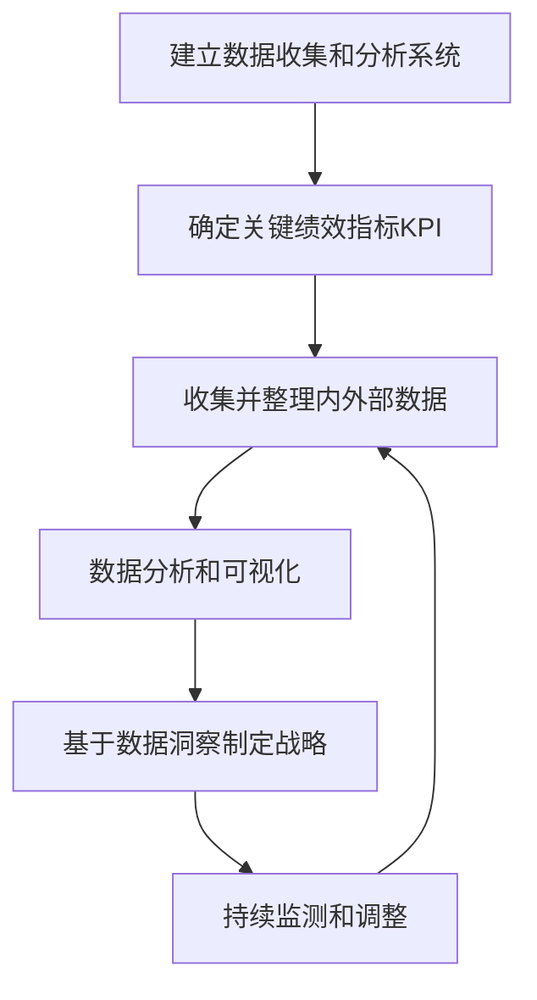
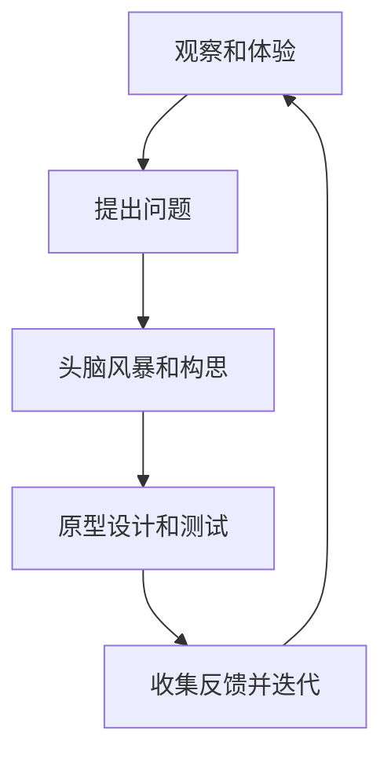
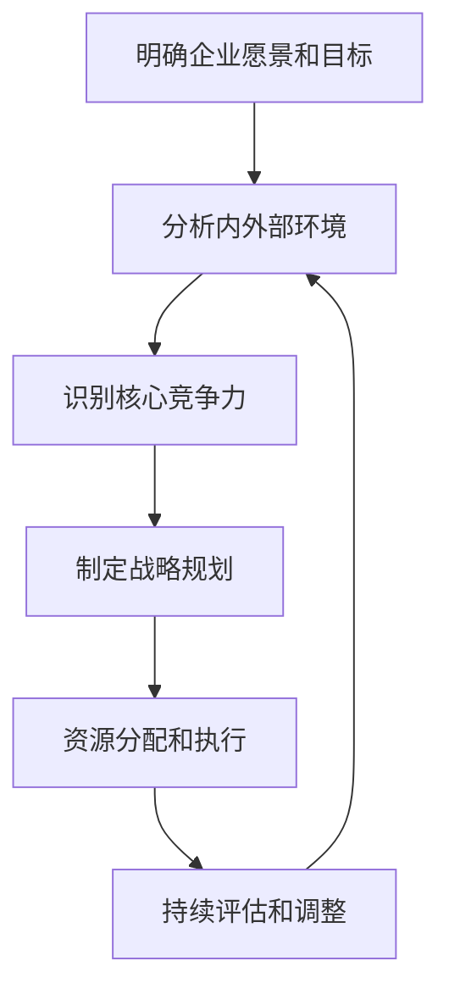

# 怎样培养敏锐的市场洞察力和商业思维

## 1. 背景介绍

### 1.1 市场洞察力和商业思维的重要性

在当今瞬息万变的商业环境中，拥有敏锐的市场洞察力和商业思维是企业赢得竞争优势的关键因素。市场洞察力能够帮助企业深入了解客户需求、行业趋势和竞争格局,从而制定出符合市场实际情况的营销策略和产品路线。同时,良好的商业思维能够促进企业进行前瞻性思考,把握机遇,规避风险,实现可持续发展。

### 1.2 传统企业面临的挑战

许多传统企业由于缺乏市场洞察力和商业思维,导致无法及时应对市场变化,错失商机。他们往往依赖于过去的成功经验,固步自封,忽视了新兴市场的需求和潜力。因此,培养敏锐的市场洞察力和商业思维对于企业的生存和发展至关重要。

## 2. 核心概念与联系

### 2.1 市场洞察力

市场洞察力是指通过收集和分析市场数据,深入理解消费者需求、行业趋势和竞争格局的能力。它包括以下几个关键要素:

1. **消费者洞察**:深入了解消费者的需求、偏好、行为模式和决策过程。
2. **竞争洞察**:全面把握竞争对手的战略、优势、弱点和市场地位。
3. **趋势洞察**:预测行业发展趋势,把握新兴技术和商业模式。

### 2.2 商业思维

商业思维是指具有战略眼光、创新精神和风险意识,能够从商业角度出发进行决策和规划的思维方式。它包括以下几个关键方面:

1. **战略思维**:制定符合企业愿景和目标的长期发展策略。
2. **创新思维**:不断探索新的商业模式、产品和服务,保持竞争优势。
3. **风险意识**:评估潜在风险,制定应对措施,实现风险与收益的平衡。

市场洞察力和商业思维密切相关,相互影响。拥有敏锐的市场洞察力有助于企业制定符合市场实际情况的商业策略,而良好的商业思维则能够帮助企业洞悉市场机遇,引领创新。

## 3. 核心算法原理具体操作步骤

培养敏锐的市场洞察力和商业思维是一个循序渐进的过程,需要采取系统的方法和策略。以下是一些核心的操作步骤:

### 3.1 建立数据驱动的决策机制



1. 建立数据收集和分析系统,确保能够获取全面、准确的市场和业务数据。
2. 确定关键绩效指标(KPI),如销售额、客户满意度、市场份额等,用于衡量企业的运营状况。
3. 收集并整理内部数据(如销售记录、客户反馈)和外部数据(如行业报告、竞争对手信息)。
4. 使用数据分析和可视化工具,发现隐藏的模式和趋势。
5. 基于数据洞察制定战略决策,如产品开发、营销策略、业务拓展等。
6. 持续监测市场变化和绩效指标,及时调整策略。

### 3.2 培养设计思维和同理心



1. 通过观察和亲身体验,深入了解消费者的需求和痛点。
2. 基于观察提出问题,明确需要解决的核心问题。
3. 组织头脑风暴会议,鼓励员工提出创新想法和解决方案。
4. 制作原型,并邀请消费者进行测试,收集反馈。
5. 根据反馈迭代和优化产品或服务,再次测试。

### 3.3 培养系统思维和战略眼光



1. 明确企业的愿景、使命和长期目标。
2. 全面分析内部资源、能力和外部市场环境、竞争格局。
3. 识别企业的核心竞争力,确定差异化优势。
4. 基于分析结果,制定全面的战略规划,包括产品策略、营销策略、运营策略等。
5. 合理分配资源,有效执行战略规划。
6. 持续评估战略执行效果,及时调整策略。

## 4. 数学模型和公式详细讲解举例说明

在培养市场洞察力和商业思维的过程中,数学模型和公式可以为我们提供有力的分析工具。以下是一些常用的模型和公式:

### 4.1 客户生命周期价值模型(CLV)

客户生命周期价值(Customer Lifetime Value, CLV)是衡量一个客户对企业未来收益贡献的指标。它考虑了客户的购买频率、平均消费金额和客户关系的持续时间等因素。CLV模型可以帮助企业确定目标客户群,优化营销投资,提高客户保留率。

CLV的计算公式如下:

$$CLV = \sum_{t=0}^{n} \frac{(Revenue_t - Cost_t)}{(1+r)^t}$$

其中:
- $n$ 是客户关系的持续时间(年)
- $Revenue_t$ 是第 $t$ 年的客户收入
- $Cost_t$ 是第 $t$ 年的客户获取和维护成本
- $r$ 是折现率

通过计算不同客户群的CLV,企业可以确定哪些客户群更有价值,从而制定针对性的营销策略。

### 4.2 市场份额分析模型

市场份额是衡量企业在特定市场中占有率的重要指标。它不仅反映了企业的市场地位,也与企业的盈利能力密切相关。通过分析市场份额,企业可以评估自身的竞争力,制定相应的战略。

常用的市场份额分析模型包括:

1. **相对市场份额模型**:

$$相对市场份额 = \frac{企业市场份额}{最大竞争对手市场份额}$$

相对市场份额大于1表示企业处于领先地位,小于1则处于落后地位。

2. **贡献度分析模型**:

$$贡献度 = \frac{企业销售额}{行业总销售额}$$

贡献度反映了企业在行业中的影响力。

3. **BCG矩阵模型**:

BCG矩阵模型根据相对市场份额和市场增长率,将产品或业务单元划分为四个象限:问号、明星、cash cow和狗。它可以帮助企业制定产品组合策略。

通过综合运用这些模型,企业可以深入了解自身在市场中的地位,制定出符合实际情况的战略。

### 4.3 风险评估模型

在商业决策过程中,风险评估是一个重要环节。通过建立风险评估模型,企业可以识别潜在风险,制定应对措施,实现风险与收益的平衡。

常用的风险评估模型包括:

1. **风险矩阵模型**:

风险矩阵模型通过对风险发生的可能性和影响程度进行评估,将风险划分为高、中、低三个等级,从而确定风险应对优先级。

2. **蒙特卡罗模拟模型**:

蒙特卡罗模拟模型通过重复随机抽样,模拟不同情况下的结果,从而评估风险水平和可能结果的概率分布。

3. **决策树模型**:

决策树模型将决策过程以树形结构进行可视化,每个节点代表一个决策点,通过计算每个分支的期望值,选择风险最小的决策路径。

通过运用这些风险评估模型,企业可以全面识别潜在风险,制定风险缓解策略,降低风险对业务的影响。

## 5. 项目实践:代码实例和详细解释说明

为了更好地理解如何在实践中培养市场洞察力和商业思维,我们将以一个电子商务网站的用户行为分析项目为例,展示相关的代码实现和详细解释。

### 5.1 项目背景

电子商务网站希望通过分析用户的浏览和购买行为,了解用户的偏好和需求,从而优化网站设计和推荐系统,提高用户体验和转化率。

### 5.2 数据收集和预处理

首先,我们需要从网站服务器中收集用户行为数据,包括浏览记录、购买记录、评论等。以下是一个使用Python的示例代码:

```python
import pandas as pd
from datetime import datetime

# 读取浏览记录数据
browsing_data = pd.read_csv('browsing_data.csv')

# 读取购买记录数据
purchase_data = pd.read_csv('purchase_data.csv')

# 合并数据
user_data = pd.merge(browsing_data, purchase_data, on='user_id', how='outer')

# 处理缺失值
user_data = user_data.dropna()

# 转换时间戳
user_data['timestamp'] = user_data['timestamp'].apply(lambda x: datetime.fromtimestamp(x))

# 保存处理后的数据
user_data.to_csv('user_data.csv', index=False)
```

在这段代码中,我们首先读取浏览记录和购买记录数据,然后将它们合并为一个数据框。接下来,我们处理缺失值和时间戳,最终将处理后的数据保存为CSV文件。

### 5.3 用户行为分析

接下来,我们对用户行为数据进行分析,以发现隐藏的模式和趋势。以下是一个使用Python的示例代码:

```python
import pandas as pd
import matplotlib.pyplot as plt
import seaborn as sns

# 读取处理后的用户数据
user_data = pd.read_csv('user_data.csv')

# 计算每个用户的浏览次数和购买次数
user_stats = user_data.groupby('user_id')['event'].value_counts().unstack(fill_value=0)
user_stats = user_stats.rename(columns={'browse': 'browse_count', 'purchase': 'purchase_count'})

# 绘制浏览次数和购买次数的散点图
plt.figure(figsize=(10, 6))
sns.scatterplot(data=user_stats, x='browse_count', y='purchase_count')
plt.xlabel('Browse Count')
plt.ylabel('Purchase Count')
plt.title('User Behavior Analysis')
plt.show()
```

在这段代码中,我们首先读取处理后的用户数据。然后,我们使用Pandas的`groupby`和`value_counts`函数计算每个用户的浏览次数和购买次数。最后,我们使用Seaborn库绘制浏览次数和购买次数的散点图,以直观地展示用户行为模式。

通过分析这些数据和可视化结果,我们可以发现一些有趣的模式,例如:

- 大多数用户只浏览网站,但没有购买记录。
- 一小部分用户既有大量的浏览记录,也有大量的购买记录,可能是网站的忠实客户。
- 另一部分用户虽然浏览次数较少,但购买次数较多,可能是有针对性地浏览和购买。

基于这些发现,我们可以制定相应的营销策略,例如:

- 针对浏览量大但购买量少的用户,优化网站设计和推荐系统,提高转化率。
- 针对忠实客户,提供优惠活动和会员计划,提高客户粘性。
- 针对有针对性浏览和购买的用户,优化搜索和导航功能,提高用户体验。

### 5.4 客户生命周期价值分析

为了进一步了解不同用户群的价值,我们可以计算客户生命周期价值(CLV)。以下是一个使用Python的示例代码:

```python