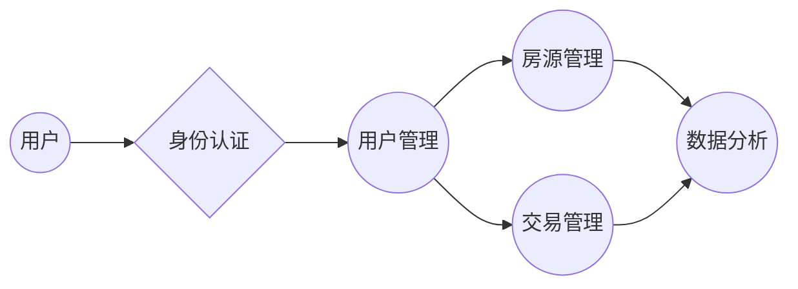

## 1. 背景介绍

### 1.1 房地产行业现状与挑战

随着城市化进程的加速和人民生活水平的提高，房地产业蓬勃发展，成为了国民经济的重要支柱产业。然而，传统的房产管理模式面临着诸多挑战：

* **信息不对称:** 房源信息分散，购房者难以获取全面、真实的房源信息。
* **交易流程繁琐:** 交易环节多，手续复杂，效率低下。
* **数据管理混乱:**  房产信息缺乏统一管理，难以进行有效的数据分析和决策。

### 1.2 房产管理系统的意义

为了应对上述挑战，房产管理系统应运而生。房产管理系统通过信息化手段，实现了房产信息的集中管理、交易流程的优化和数据分析的智能化，为房地产业的健康发展提供了有力支撑。

### 1.3 本文目标

本文旨在介绍房产管理系统的详细设计与具体代码实现，帮助读者深入了解房产管理系统的架构、功能和实现原理，并提供实际的代码案例供参考。

## 2. 核心概念与联系

### 2.1 系统用户角色

房产管理系统涉及多种用户角色，包括：

* **管理员:** 负责系统管理、用户管理、房源管理等。
* **房产经纪人:** 负责发布房源信息、带看房屋、促成交易等。
* **购房者:**  浏览房源信息、预约看房、进行交易等。

### 2.2 核心功能模块

房产管理系统主要包含以下功能模块：

* **用户管理:**  实现用户注册、登录、权限管理等功能。
* **房源管理:**  实现房源信息的发布、编辑、查询、删除等功能。
* **交易管理:**  实现交易流程的管理，包括预约看房、签订合同、支付房款等。
* **数据分析:**  实现房产数据的统计分析，为决策提供支持。

### 2.3 系统架构图



## 3. 核心算法原理具体操作步骤

### 3.1 房源推荐算法

为了帮助购房者快速找到心仪的房产，房产管理系统需要提供房源推荐功能。常见的房源推荐算法包括：

* **基于内容的推荐:**  根据用户历史浏览记录、收藏记录等信息，推荐与其兴趣相似的房源。
* **协同过滤推荐:**  根据其他用户的行为数据，推荐与其行为相似的用户喜欢的房源。
* **混合推荐:**  结合多种推荐算法，提高推荐的准确性和多样性。

### 3.2 房价评估算法

为了帮助用户了解房产的市场价值，房产管理系统需要提供房价评估功能。常见的房价评估算法包括：

* **线性回归模型:**  根据房产的面积、楼层、朝向等特征，建立线性回归模型，预测房价。
* **决策树模型:**  根据房产的各种特征，构建决策树模型，预测房价。
* **神经网络模型:**  利用深度学习技术，构建神经网络模型，预测房价。

### 3.3 操作步骤

1. **数据收集:**  收集房产相关的各种数据，包括房源信息、交易数据、用户行为数据等。
2. **数据预处理:**  对数据进行清洗、转换、特征提取等操作，使其符合算法的要求。
3. **模型训练:**  利用预处理后的数据，训练推荐算法和评估算法。
4. **模型评估:**  评估模型的准确性和效果，并进行参数调整。
5. **模型部署:**  将训练好的模型部署到房产管理系统中，为用户提供服务。

## 4. 数学模型和公式详细讲解举例说明

### 4.1 线性回归模型

线性回归模型是一种常用的预测模型，其基本原理是利用线性函数拟合数据，并预测未来的趋势。

**模型公式:**

$$
y = w_0 + w_1x_1 + w_2x_2 + ... + w_nx_n
$$

其中：

* $y$ 表示预测值。
* $x_1, x_2, ..., x_n$ 表示特征变量。
* $w_0, w_1, w_2, ..., w_n$ 表示模型参数。

**举例说明:**

假设我们要预测一套房产的售价，该房产的面积为 100 平方米，楼层为 10 层，朝向为 南。我们可以利用线性回归模型进行预测：

$$
y = 100000 + 1000 * 100 + 500 * 10 + 200 * 1
$$

其中：

* 100000 表示基础价格。
* 1000 表示面积系数。
* 500 表示楼层系数。
* 200 表示朝向系数。

### 4.2 决策树模型

决策树模型是一种常用的分类和回归模型，其基本原理是根据数据的特征，构建一棵树状结构，并利用该结构进行预测。

**模型构建:**

1. **选择根节点:**  选择信息增益最大的特征作为根节点。
2. **构建子节点:**  根据根节点的特征值，将数据划分到不同的子节点。
3. **递归构建:**  对每个子节点重复步骤 1 和 2，直到所有叶子节点都是纯净的。

**举例说明:**

假设我们要根据房产的面积、楼层、朝向来预测其售价是否高于 100 万。我们可以构建如下的决策树模型：

```
                     面积
                    /   \
                 100  >100
                /  \      \
              楼层  价格  价格
             /   \      |    |
           10   >10   >100  <100
           |    |
         价格  价格
         |    |
        >100  <100
```

## 5. 项目实践：代码实例和详细解释说明

### 5.1 技术选型

* **编程语言:**  Python
* **Web 框架:**  Django
* **数据库:**  MySQL
* **前端框架:**  React

### 5.2 代码实例

#### 5.2.1 用户模型

```python
from django.db import models
from django.contrib.auth.models import AbstractUser

class User(AbstractUser):
    phone = models.CharField(max_length=11, unique=True)
    # ...
```

#### 5.2.2 房源模型

```python
from django.db import models

class Property(models.Model):
    title = models.CharField(max_length=255)
    description = models.TextField()
    price = models.DecimalField(max_digits=10, decimal_places=2)
    area = models.FloatField()
    # ...
```

#### 5.2.3 房源推荐接口

```python
from rest_framework.views import APIView
from rest_framework.response import Response

class PropertyRecommendationView(APIView):
    def get(self, request):
        # ... 获取用户历史浏览记录、收藏记录等信息
        # ... 利用推荐算法生成推荐房源列表
        recommendations = []
        # ...
        return Response(recommendations)
```

## 6. 实际应用场景

### 6.1 房地产中介公司

房产管理系统可以帮助房地产中介公司提高效率、降低成本、提升客户满意度。

* **房源管理:**  集中管理房源信息，方便经纪人快速查找和发布房源。
* **客户管理:**  记录客户信息和需求，方便经纪人跟进客户。
* **交易管理:**  管理交易流程，提高交易效率。

### 6.2 房地产开发商

房产管理系统可以帮助房地产开发商提高项目管理效率、降低营销成本、提升品牌形象。

* **项目管理:**  管理项目进度、成本、质量等信息。
* **营销管理:**  发布项目信息、进行线上推广。
* **客户关系管理:**  管理客户关系，提升客户满意度。

## 7. 总结：未来发展趋势与挑战

### 7.1 未来发展趋势

* **智能化:**  利用人工智能技术，实现房源推荐、房价评估、智能客服等功能。
* **移动化:**  开发移动端应用程序，方便用户随时随地访问系统。
* **数据化:**  利用大数据技术，进行数据分析，为决策提供支持。

### 7.2 面临的挑战

* **数据安全:**  保护用户隐私和数据安全。
* **技术更新:**  及时更新技术，应对市场变化。
* **用户体验:**  提升用户体验，提高用户粘性。

## 8. 附录：常见问题与解答

### 8.1 如何保证房源信息的真实性？

* **严格审核:**  对发布的房源信息进行严格审核，确保信息的真实性。
* **实名认证:**  要求用户进行实名认证，提高信息的可靠性。
* **用户举报:**  鼓励用户举报虚假信息，共同维护平台的健康发展。

### 8.2 如何提高房源推荐的准确性？

* **优化算法:**  不断优化推荐算法，提高推荐的准确性和多样性。
* **数据积累:**  积累更多用户行为数据，为算法提供更丰富的训练数据。
* **个性化推荐:**  根据用户的个性化需求，提供更精准的推荐服务。