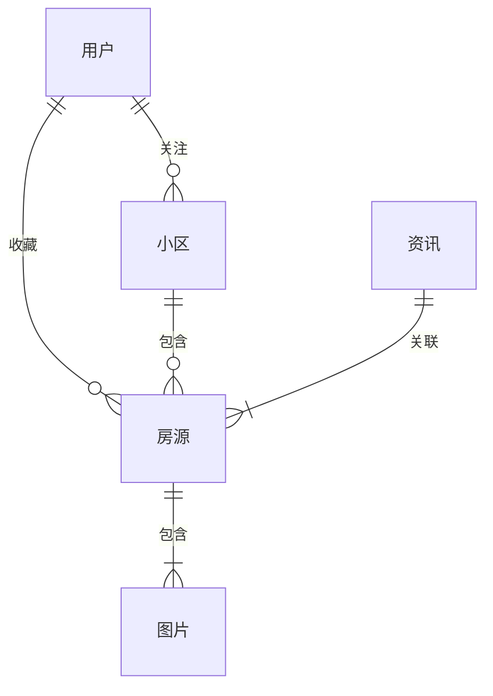

## 1. 背景介绍

### 1.1 房地产行业数字化转型浪潮

近年来，随着互联网技术的飞速发展和移动互联网的普及，各行各业都在积极拥抱数字化转型，房地产行业也不例外。传统房产交易模式存在信息不对称、交易流程繁琐、效率低下等问题，而房产网站的出现，为解决这些问题提供了新的思路和解决方案。

### 1.2 房产网站的功能和价值

房产网站作为连接房产供需双方的桥梁，其核心功能主要包括：

* **房源信息展示:** 提供全面、准确、及时的房源信息，包括房屋类型、面积、价格、地理位置、周边配套等。
* **搜索和筛选:**  用户可根据自身需求，通过关键词、区域、价格区间、房屋类型等条件快速筛选目标房源。
* **在线咨询和预约:**  用户可在线咨询房产经纪人，了解房源详情，并预约看房时间。
* **交易流程管理:**  提供在线签约、支付、过户等交易流程管理功能，简化交易流程，提高交易效率。
* **增值服务:**  一些房产网站还提供房产评估、贷款咨询、装修设计等增值服务，为用户提供一站式房产交易解决方案。

### 1.3 本文目标

本文将以构建一个功能完善、用户体验良好的房产网站为目标，从需求分析、系统设计、代码实现等方面进行详细阐述，并结合实际案例，提供具体的代码示例和解释说明，帮助读者深入理解房产网站的开发流程和技术细节。

## 2. 核心概念与联系

### 2.1 房产网站核心实体

* **用户:**  包括买方、卖方、房产经纪人等。
* **房源:**  指待售或出租的房产信息，包括房屋类型、面积、价格、地理位置、周边配套等属性。
* **小区:**  指多个住宅楼组成的居住区域，具有地理位置、周边配套、物业管理等属性。
* **图片:**  用于展示房源的图片信息。
* **资讯:**  与房地产相关的新闻、政策、市场分析等信息。

### 2.2 实体关系图



## 3. 核心算法原理具体操作步骤

### 3.1 房源信息展示

#### 3.1.1 数据获取

* 从数据库中读取房源信息，包括房屋类型、面积、价格、地理位置、周边配套等属性。
* 从第三方数据源获取房源图片、小区信息、资讯等数据。

#### 3.1.2 数据处理

* 对房源数据进行清洗、筛选、排序等操作，以满足用户不同的搜索需求。
* 对房源图片进行压缩、裁剪等操作，以提高页面加载速度。

#### 3.1.3 页面渲染

* 使用HTML、CSS、JavaScript等技术将房源信息渲染到页面上，并提供友好的用户界面。
* 使用地图API展示房源地理位置和周边配套信息。

### 3.2 房源搜索和筛选

#### 3.2.1 搜索条件解析

* 将用户输入的搜索条件解析成数据库查询语句。
* 支持多种搜索条件组合，例如关键词、区域、价格区间、房屋类型等。

#### 3.2.2 数据库查询

* 使用SQL语句查询数据库，获取符合条件的房源数据。
* 使用索引优化查询效率。

#### 3.2.3 结果排序

* 根据用户选择的排序方式，对查询结果进行排序。
* 支持多种排序方式，例如价格、面积、发布时间等。

### 3.3 在线咨询和预约

#### 3.3.1 在线聊天

* 集成第三方在线聊天工具，例如QQ、微信等。
* 提供实时聊天功能，方便用户与房产经纪人沟通。

#### 3.3.2 预约看房

* 提供在线预约看房功能，用户可选择看房时间和联系方式。
* 将预约信息发送给房产经纪人，并提醒用户看房时间。

## 4. 数学模型和公式详细讲解举例说明

### 4.1 房价预测模型

#### 4.1.1 线性回归模型

线性回归模型是一种常用的房价预测模型，其基本原理是通过拟合历史房价数据，找到房价与影响因素之间的线性关系。

**模型公式:**

$$
y = \beta_0 + \beta_1 x_1 + \beta_2 x_2 + ... + \beta_n x_n + \epsilon
$$

其中：

* $y$ 表示房价
* $x_1, x_2, ..., x_n$ 表示影响房价的因素，例如面积、地理位置、周边配套等
* $\beta_0, \beta_1, \beta_2, ..., \beta_n$ 表示模型参数
* $\epsilon$ 表示误差项

#### 4.1.2 模型训练

使用历史房价数据对线性回归模型进行训练，得到模型参数。

#### 4.1.3 房价预测

使用训练好的模型，根据输入的房屋属性预测房价。

### 4.2 房源推荐模型

#### 4.2.1 协同过滤算法

协同过滤算法是一种常用的推荐算法，其基本原理是根据用户的历史行为数据，找到与目标用户兴趣相似的其他用户，并推荐这些用户喜欢的房源。

#### 4.2.2 基于内容的推荐算法

基于内容的推荐算法是根据房源的属性信息，找到与目标用户感兴趣的房源相似的其他房源，并推荐给用户。

## 5. 项目实践：代码实例和详细解释说明

### 5.1 技术选型

* **后端:** Python + Django
* **数据库:** MySQL
* **前端:** HTML + CSS + JavaScript
* **地图API:** 百度地图API

### 5.2 代码实例

#### 5.2.1 房源模型

```python
from django.db import models

class Property(models.Model):
    title = models.CharField(max_length=255)
    description = models.TextField()
    price = models.DecimalField(max_digits=10, decimal_places=2)
    area = models.IntegerField()
    bedrooms = models.IntegerField()
    bathrooms = models.IntegerField()
    address = models.CharField(max_length=255)
    latitude = models.FloatField()
    longitude = models.FloatField()
    created_at = models.DateTimeField(auto_now_add=True)
    updated_at = models.DateTimeField(auto_now=True)

    def __str__(self):
        return self.title
```

#### 5.2.2 房源搜索视图

```python
from django.shortcuts import render
from .models import Property

def search(request):
    # 获取搜索条件
    keywords = request.GET.get('keywords')
    min_price = request.GET.get('min_price')
    max_price = request.GET.get('max_price')
    min_area = request.GET.get('min_area')
    max_area = request.GET.get('max_area')

    # 构建查询条件
    query = Property.objects.all()
    if keywords:
        query = query.filter(title__icontains=keywords)
    if min_price:
        query = query.filter(price__gte=min_price)
    if max_price:
        query = query.filter(price__lte=max_price)
    if min_area:
        query = query.filter(area__gte=min_area)
    if max_area:
        query = query.filter(area__lte=max_area)

    # 获取查询结果
    properties = query.order_by('-created_at')

    # 渲染页面
    return render(request, 'search.html', {'properties': properties})
```

## 6. 实际应用场景

### 6.1 房地产中介公司

房产中介公司可以使用房产网站展示房源信息、吸引客户、提高交易效率。

### 6.2 房地产开发商

房地产开发商可以使用房产网站推广新楼盘、收集客户信息、进行市场调研。

### 6.3 个人用户

个人用户可以使用房产网站查找房源、了解市场行情、进行房产交易。

## 7. 总结：未来发展趋势与挑战

### 7.1 未来发展趋势

* **VR看房:**  利用VR技术，为用户提供沉浸式看房体验。
* **人工智能:**  利用人工智能技术，实现房价预测、房源推荐等功能。
* **区块链:**  利用区块链技术，保障房产交易的安全性和透明性。

### 7.2 面临的挑战

* **数据安全:**  房产网站存储大量用户敏感信息，需要加强数据安全措施。
* **市场竞争:**  房产网站市场竞争激烈，需要不断创新，提升用户体验。
* **政策监管:**  房产交易涉及多方利益，需要遵守相关政策法规。

## 8. 附录：常见问题与解答

### 8.1 如何提高房产网站的访问速度？

* 使用CDN加速静态资源加载。
* 压缩图片大小。
* 优化数据库查询效率。

### 8.2 如何保障房产网站的数据安全？

* 使用HTTPS协议加密数据传输。
* 定期备份数据。
* 设置访问权限控制。

### 8.3 如何提高房产网站的用户体验？

* 提供简洁、易用的用户界面。
* 提供丰富的房源信息和增值服务。
* 及时解决用户反馈的问题。
