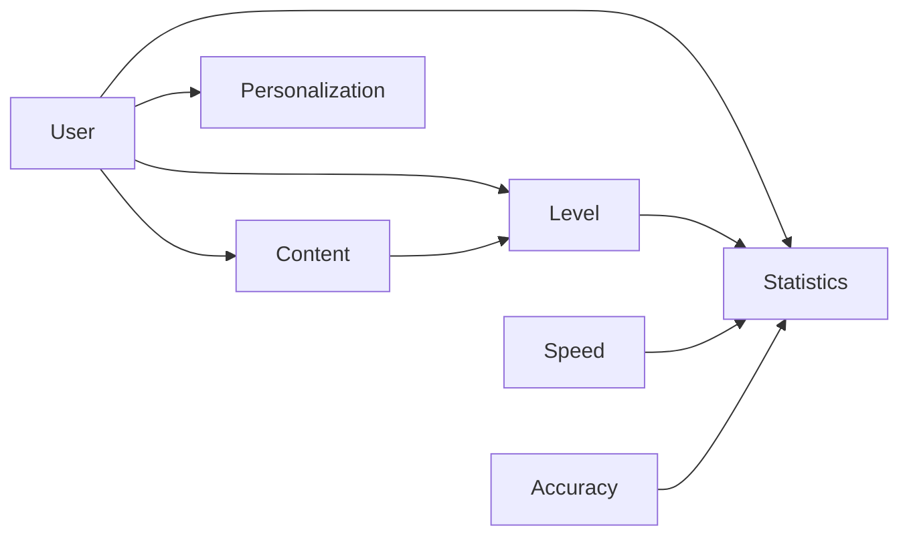

# 打字练习系统详细设计与具体代码实现

## 1. 背景介绍

### 1.1 打字技能的重要性

在当今这个数字化时代,打字技能已经成为一项基本且重要的技能。无论是学生、办公人员还是程序员,高效准确的打字能力都可以极大地提高工作效率和生产力。然而,很多人的打字水平仍然停留在初级阶段,存在着打字速度慢、常常出错等问题。因此,开发一个专门的打字练习系统,帮助用户提高打字水平就显得尤为重要。

### 1.2 现有打字练习软件的不足

目前市面上已经存在一些打字练习软件,但它们大多存在以下缺陷:

- 缺乏个性化设置,无法满足不同用户的需求
- 练习内容单一,缺少多样化的练习模式
- 界面设计单调乏味,缺乏吸引力和趣味性
- 缺少统计分析功能,难以跟踪用户的进步情况

因此,开发一款全新的、功能完善的打字练习系统就成为了一个具有重要意义的课题。

## 2. 核心概念与联系

### 2.1 打字练习系统的核心概念

一个完整的打字练习系统通常包含以下几个核心概念:

- **用户(User)**: 系统的使用者,需要进行打字练习以提高打字水平。
- **练习内容(Content)**: 用于打字练习的文本材料,可以是单词、句子、文章等。
- **难度等级(Level)**: 根据练习内容的长度、复杂程度等因素划分的难度等级。
- **打字速度(Speed)**: 用户每分钟输入的字符数,是衡量打字水平的重要指标之一。
- **准确率(Accuracy)**: 用户输入的字符与练习内容的一致程度,是另一个衡量打字水平的指标。
- **统计数据(Statistics)**: 包括用户的打字速度、准确率、练习时长等数据,用于跟踪用户的进步情况。
- **个性化设置(Personalization)**: 允许用户根据自身需求调整练习内容、难度等级等参数。

### 2.2 核心概念之间的关系

这些核心概念之间存在着密切的关联关系,如下图所示:



- **用户(User)**根据个人需求选择**练习内容(Content)**和**难度等级(Level)**,并进行打字练习。
- **用户(User)**可以根据自身情况进行**个性化设置(Personalization)**,调整练习参数。
- **练习内容(Content)**的长度和复杂程度决定了**难度等级(Level)**。
- 系统根据用户的打字表现计算**打字速度(Speed)**和**准确率(Accuracy)**,并记录到**统计数据(Statistics)**中。
- **难度等级(Level)**也会影响**统计数据(Statistics)**,因为不同难度下用户的表现会有所差异。

通过上述关系,我们可以看出这些核心概念是相互依赖、相互影响的,构成了打字练习系统的基本框架。

## 3. 核心算法原理具体操作步骤

### 3.1 文本内容处理算法

为了能够从各种来源获取练习内容,并对内容进行合理的切分和难度评估,我们需要一个文本内容处理算法。该算法的主要步骤如下:

1. **获取文本内容**:从本地文件、网络资源或用户输入中获取文本内容。
2. **预处理**:对文本内容进行必要的预处理,如去除无关字符、转换编码格式等。
3. **分词**:将文本内容分割成单词或句子等最小单元。
4. **计算难度分值**:根据单词长度、词频、语法复杂度等因素,计算每个单元的难度分值。
5. **划分难度等级**:根据难度分值,将各单元划分到不同的难度等级中。
6. **构建练习内容集**:将同一难度等级的单元组合成练习内容集,供用户选择练习。

### 3.2 打字监控和评分算法

为了实时监控用户的打字过程,并对其打字表现进行评分,我们需要一个打字监控和评分算法。该算法的主要步骤如下:

1. **捕获用户输入**:实时捕获用户通过键盘输入的字符。
2. **与练习内容比对**:将用户输入与当前练习内容进行比对,标记出正确和错误的字符。
3. **计算打字速度**:根据用户输入的字符数和耗时,计算每分钟输入字符数,即打字速度。
4. **计算准确率**:根据正确字符数和总字符数的比值,计算打字准确率。
5. **更新统计数据**:将计算得到的打字速度、准确率等数据更新到用户的统计数据中。
6. **实时反馈**:在用户界面上实时显示打字速度、准确率等数据,并高亮显示错误字符,为用户提供即时反馈。

### 3.3 统计数据分析算法

为了能够有效地跟踪用户的打字进步情况,并提供个性化的练习建议,我们需要一个统计数据分析算法。该算法的主要步骤如下:

1. **获取历史数据**:从数据库或本地存储中获取用户的历史打字统计数据。
2. **数据预处理**:对统计数据进行必要的预处理,如去除异常值、填补缺失值等。
3. **绘制趋势图**:根据时间序列,绘制用户打字速度、准确率等指标的趋势图,直观展示用户的进步情况。
4. **寻找薄弱环节**:分析用户在不同难度等级、不同练习内容上的表现,寻找打字的薄弱环节。
5. **生成练习建议**:根据用户的薄弱环节,为用户生成个性化的练习建议,帮助其有针对性地提高。
6. **持久化存储**:将分析得到的结果持久化存储,为下次分析提供数据支持。

## 4. 数学模型和公式详细讲解举例说明

在打字练习系统中,我们需要使用一些数学模型和公式来量化和评估用户的打字表现。下面将详细介绍其中的两个重要模型和公式。

### 4.1 文本难度评估模型

为了合理地将练习内容划分到不同的难度等级,我们需要一个文本难度评估模型。一种常用的模型是基于词频的TF-IDF模型,它可以量化单词的重要性。

对于一个给定的单词 $w$ 和文本集合 $D$,单词 $w$ 在文本集合 $D$ 中的 TF-IDF 值定义为:

$$\text{TF-IDF}(w, D) = \text{TF}(w, D) \times \text{IDF}(w, D)$$

其中:

- $\text{TF}(w, D)$ 表示单词 $w$ 在文本集合 $D$ 中的词频(Term Frequency),可以用以下公式计算:

$$\text{TF}(w, D) = \frac{\text{count}(w, D)}{\sum_{w' \in D} \text{count}(w', D)}$$

其中 $\text{count}(w, D)$ 表示单词 $w$ 在文本集合 $D$ 中出现的次数。

- $\text{IDF}(w, D)$ 表示单词 $w$ 的逆向文档频率(Inverse Document Frequency),可以用以下公式计算:

$$\text{IDF}(w, D) = \log \frac{|D|}{|\{d \in D: w \in d\}|}$$

其中 $|D|$ 表示文本集合 $D$ 的总文本数,分母表示包含单词 $w$ 的文本数量。

通过计算每个单词的 TF-IDF 值,我们可以量化单词的重要性和难度。一般来说,TF-IDF 值越高,单词越重要且越难。基于单词的 TF-IDF 值,我们可以计算整个文本的难度分值,并将其划分到合适的难度等级。

### 4.2 打字速度和准确率评估

打字速度和准确率是评估用户打字水平的两个重要指标。打字速度通常用每分钟输入的字符数(CPM)来衡量,计算公式如下:

$$\text{CPM} = \frac{\text{count}(c)}{t} \times 60$$

其中 $\text{count}(c)$ 表示用户输入的字符总数,单位是字符; $t$ 表示用户输入所耗时间,单位是秒。

打字准确率则是用户输入的正确字符数与总字符数的比值,计算公式如下:

$$\text{Accuracy} = \frac{\text{count}(c_\text{correct})}{\text{count}(c_\text{total})}$$

其中 $\text{count}(c_\text{correct})$ 表示用户输入的正确字符数,单位是字符; $\text{count}(c_\text{total})$ 表示练习内容的总字符数,单位也是字符。

通过上述公式,我们可以实时计算并显示用户的打字速度和准确率,为用户提供即时反馈。同时,这些数据也将被记录到用户的统计数据中,用于后续的数据分析和评估。

## 5. 项目实践:代码实例和详细解释说明

在前面的章节中,我们介绍了打字练习系统的核心概念、算法原理和数学模型。接下来,我们将通过一个具体的代码实例,演示如何将这些理论知识付诸实践。

我们将使用 Python 编程语言和 PyQt 框架开发一个简单的打字练习系统。这个系统包含以下几个主要模块:

1. **文本内容模块**:负责从文件或网络资源中获取练习内容,并对内容进行预处理和难度评估。
2. **用户界面模块**:提供用户友好的图形界面,用于显示练习内容、监控用户输入、实时反馈打字数据等。
3. **打字监控模块**:实时监控用户的键盘输入,并与练习内容进行比对,计算打字速度和准确率。
4. **统计数据模块**:记录和分析用户的历史打字数据,生成进步趋势图和个性化练习建议。

### 5.1 文本内容模块

我们首先定义一个 `TextContent` 类,用于处理文本内容。

```python
import re
import math
from collections import Counter

class TextContent:
    def __init__(self, text):
        self.text = text
        self.words = self.preprocess(text)
        self.word_difficulties = self.calculate_word_difficulties(self.words)

    def preprocess(self, text):
        # 去除无关字符,转换为小写,分割成单词列表
        text = re.sub(r'[^a-zA-Z\s]', '', text).lower()
        words = text.split()
        return words

    def calculate_word_difficulties(self, words):
        # 计算每个单词的 TF-IDF 值作为难度分值
        word_counts = Counter(words)
        total_words = len(words)
        word_difficulties = {}

        for word, count in word_counts.items():
            tf = count / total_words
            idf = math.log(total_words / (1 + word_counts[word]))
            tfidf = tf * idf
            word_difficulties[word] = tfidf

        return word_difficulties

    def get_content_by_level(self, level):
        # 根据难度等级获取对应的练习内容
        level_words = [word for word, difficulty in self.word_difficulties.items()
                       if difficulty >= level * 0.25 and difficulty < (level + 1) * 0.25]
        content = ' '.join(level_words)
        return content
```

在这个类中,我们首先通过 `preprocess` 方法对原始文本进行预处理,去除无关字符、转换为小写,并将其分割成单词列表。

接下来,`calculate_word_difficulties` 方法根据 TF-IDF 模型计算每个单词的难度分值。我们使用 `collections.Counter` 统计每个单词的词频,然后根据公式计算 TF-IDF 值。计算结果存储在 `word_difficulties` 字典中,其中键是单词,值是对应的难度分值。

最后,`get_content_by_level` 方法根据给定的难度等级,从 `word_difficulties` 中筛选出对应难度范围内的单词,并将它们拼接成一段练习内容。我们将难度等级划分为 4 个级别,每个级别的难度范围为 TF-IDF 值