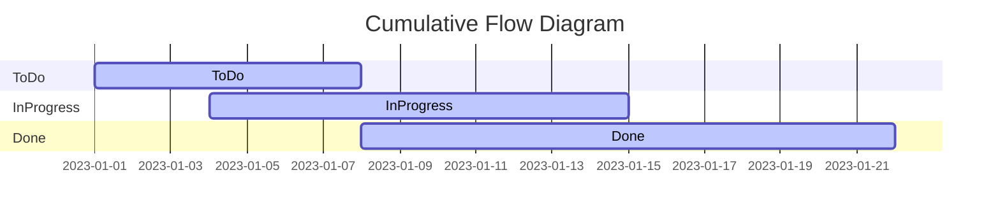
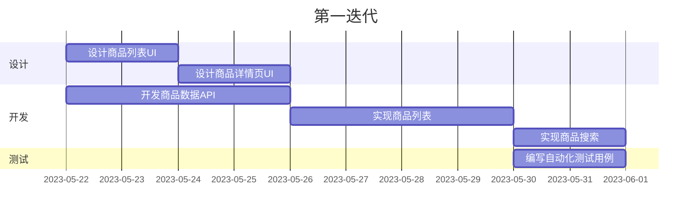

# "执行体系的积极变革：驱动企业成长"

## 1.背景介绍

### 1.1 执行体系的重要性

在当今瞬息万变的商业环境中，企业的生存和发展密切依赖于高效执行力。执行体系是企业战略规划与实际运营之间的纽带,是确保企业目标实现的关键因素。一个优秀的执行体系不仅能够将战略愿景转化为具体行动,更能持续优化运营流程,提高效率,应对不确定性,助力企业保持竞争优势。

### 1.2 传统执行体系的挑战

然而,许多企业的传统执行体系存在诸多弊端,难以满足当前复杂多变的商业需求。这些挑战包括:

- 层级森严的官僚主义结构
- 僵化的流程和决策链条
- 信息孤岛和数据碎片化
- 员工缺乏主人翁意识和创新动力
- 对变革的适应性和敏捷性不足

这些问题不仅降低了执行效率,更重要的是阻碍了企业的持续创新和发展。因此,对执行体系进行积极变革,构建敏捷高效的新型执行模式,是企业保持竞争力的当务之急。

## 2.核心概念与联系

### 2.1 敏捷执行体系

敏捷执行体系(Agile Execution System)是一种以客户价值为中心,快速响应变化,持续交付价值的执行模式。它借鉴了敏捷软件开发的理念,强调跨职能团队协作、迭代式开发、持续交付和持续改进。

敏捷执行体系的核心理念包括:

- 以客户价值为驱动力
- 自组织跨职能团队
- 迭代式执行与持续改进
- 可视化工作流与透明度
- 扁平化管理与分权授权

### 2.2 精益思维

精益思维(Lean Thinking)源于丰田生产模式,旨在通过消除浪费、持续流程改进、尊重员工等方式,提高生产效率和产品质量。在敏捷执行体系中,精益思维是一个重要的支撑理念,有助于优化流程、减少浪费、提高效率。

精益思维的核心原则包括:

- 消除一切浪费
- 建立价值流
- 实现流动生产
- 以拉动式生产
- 追求卓越

### 2.3 DevOps

DevOps是一种将软件开发(Development)和运维(Operations)紧密结合的理念和实践。它旨在打破开发和运维之间的壁垒,实现自动化交付、基础设施即代码、持续集成与持续交付等目标,从而加快软件交付速度,提高系统可靠性。

DevOps的核心实践包括:

- 自动化流水线
- 基础设施即代码
- 持续集成与持续交付
- 监控与反馈闭环

在敏捷执行体系中,DevOps作为一种支撑技术,可以显著提高执行效率,缩短交付周期,提升系统稳定性。

### 2.4 系统思维

系统思维(Systems Thinking)是一种将复杂系统视为相互关联和相互影响的整体的思考方式。它强调整体优化,而非局部最优;强调因果循环反馈,而非线性因果关系。

在敏捷执行体系中,系统思维有助于我们从整体上把握企业的运营机制,识别各个环节之间的相互影响,从而制定出更加科学、合理的执行策略。

## 3.核心算法原理具体操作步骤  

### 3.1 构建自组织跨职能团队

自组织跨职能团队是敏捷执行体系的核心单元。这种团队通常由来自不同职能部门的成员组成,具备所需的全部技能,可以独立完成产品或服务的开发和交付。

构建自组织跨职能团队的步骤如下:

1. **确定产品/服务目标**
2. **识别所需技能**
3. **组建跨职能团队**
4. **赋予团队自主权**
5. **建立共同愿景**
6. **制定工作协议**
7. **持续改进团队效能**

### 3.2 实施迭代式执行

迭代式执行是敏捷执行体系的关键实践。它将整个执行过程分解为一个个迭代周期,每个迭代周期都会交付一部分可用的增量价值。

迭代式执行的具体步骤包括:

1. **制定路线图和发布计划**
2. **确定迭代目标和范围**
3. **规划迭代任务**
4. **执行迭代任务**
5. **评审和回顾**
6. **持续改进**

在每个迭代周期结束时,团队都会进行回顾和反思,持续优化流程和实践。

### 3.3 建立可视化工作流

可视化工作流是敏捷执行体系的另一个重要实践。它通过使用看板、燃尽图等可视化工具,让整个执行过程变得透明和可追踪,从而促进协作、快速反馈和持续改进。

建立可视化工作流的步骤包括:

1. **选择合适的可视化工具**
2. **定义工作流状态**
3. **制定工作流规则**
4. **实施可视化管理**
5. **持续优化工作流**

### 3.4 实现自动化流水线

自动化流水线是DevOps实践在敏捷执行体系中的应用。它通过将构建、测试、部署等环节自动化,实现高效、可靠的持续交付。

构建自动化流水线的步骤包括:

1. **定义交付流程**
2. **选择自动化工具**
3. **配置流水线任务**
4. **集成代码库**
5. **实施持续集成**
6. **实施持续交付**
7. **监控和反馈**

### 3.5 持续改进执行体系

持续改进是敏捷执行体系的核心理念之一。它要求团队和组织不断反思和优化执行实践,以适应不断变化的需求和环境。

持续改进执行体系的步骤包括:

1. **收集反馈和度量**
2. **识别改进机会**
3. **制定改进计划**
4. **实施改进措施**
5. **评估改进效果**
6. **制度化最佳实践**

## 4.数学模型和公式详细讲解举例说明

在敏捷执行体系中,有一些常用的数学模型和公式,可以帮助我们量化和优化执行过程。

### 4.1 小批量理论

小批量理论(Little's Law)是一个描述排队系统行为的重要定理,在敏捷执行体系中被广泛应用。它阐明了throughput(吞吐量)、cycle time(周期时间)和work in progress(在制品)之间的关系:

$$
\text{Cycle Time} = \frac{\text{Work in Progress}}{\text{Throughput}}
$$

利用这个公式,我们可以通过控制在制品数量来缩短周期时间,提高吞吐量。

例如,假设一个团队的平均在制品数量为10个,平均吞吐量为2个故事点/周,那么根据小批量理论:

$$
\begin{aligned}
\text{Cycle Time} &= \frac{10 \text{ stories}}{2 \text{ stories/week}} \\
                  &= 5 \text{ weeks}
\end{aligned}
$$

如果我们将在制品数量控制在5个以内,吞吐量保持不变,那么周期时间就可以缩短为:

$$
\text{Cycle Time} = \frac{5 \text{ stories}}{2 \text{ stories/week}} = 2.5 \text{ weeks}
$$

### 4.2 累积流量图

累积流量图(Cumulative Flow Diagram)是一种可视化工具,用于追踪工作项在不同状态之间的流动情况。它可以帮助我们识别流程中的瓶颈和约束,从而优化执行效率。

累积流量图的纵轴表示工作项的数量,横轴表示时间。每条彩色线代表一种工作状态,线条的斜率反映了该状态的吞吐量。

例如,下图是一个简单的累积流量图:



从图中我们可以看出,在2023-01-08到2023-01-15这个时间段,"InProgress"状态的斜率较大,说明这个阶段存在一定瓶颈,需要优化流程。

### 4.3 蒙特卡罗模拟

蒙特卡罗模拟(Monte Carlo Simulation)是一种通过重复随机抽样来计算概率分布的计算机模拟方法。在敏捷执行体系中,它可以用于估计交付日期、评估风险等场景。

假设我们需要估计一个包含10个故事点的迭代能够在多长时间内完成。我们已知团队的平均每周可交付故事点数服从正态分布,均值为5,标准差为1。那么我们可以通过蒙特卡罗模拟来估计完成时间:

```python
import numpy as np

# 模拟次数
num_sims = 10000

# 每周可交付故事点数的分布
weekly_throughput = np.random.normal(loc=5, scale=1, size=num_sims)

# 计算完成10个故事点所需周数
weeks_to_complete = 10 / weekly_throughput

# 输出结果
print(f"平均完成时间: {np.mean(weeks_to_complete):.2f} 周")
print(f"90% 完成概率: {np.percentile(weeks_to_complete, 90):.2f} 周")
```

输出结果可能如下:

```
平均完成时间: 2.11 周
90% 完成概率: 3.09 周
```

这意味着,如果按照当前团队的交付速度,平均需要2.11周才能完成10个故事点,而有90%的概率在3.09周内完成。

## 4.项目实践:代码实例和详细解释说明

为了更好地理解敏捷执行体系在实践中的应用,我们将通过一个简单的软件项目案例来演示。

### 4.1 项目背景

假设我们需要为一家零售商开发一个移动端购物应用。该应用需要具备以下核心功能:

- 商品浏览和搜索
- 购物车管理
- 在线支付
- 订单跟踪

### 4.2 执行团队组建

首先,我们需要组建一个跨职能的敏捷团队来负责这个项目的执行。该团队将包括:

- 1名产品负责人
- 2名移动端开发工程师
- 1名后端开发工程师
- 1名UI/UX设计师
- 1名测试工程师
- 1名DevOps工程师

团队成员将共同制定产品愿景、路线图和发布计划。

### 4.3 迭代式执行

接下来,团队将按照两周一个迭代周期的节奏,分阶段交付应用的核心功能。

#### 第一迭代:商品浏览和搜索

在第一个迭代中,团队将专注于实现商品浏览和搜索功能。具体任务包括:

- 设计商品列表和详情页UI
- 开发商品数据API
- 实现商品列表和搜索功能
- 编写自动化测试用例



在迭代结束时,团队将进行回顾和演示,收集反馈并规划下一个迭代的工作。

#### 第二迭代:购物车和支付

在第二个迭代中,团队将实现购物车和支付功能。具体任务包括:

- 