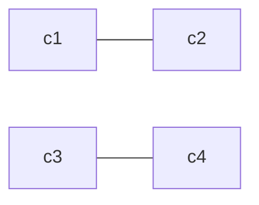
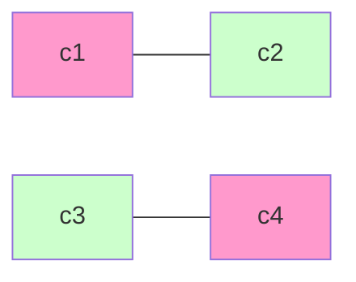

# 排课系统详细设计与具体代码实现

## 1.背景介绍

### 1.1 排课系统的重要性

在教育机构中,合理高效的排课系统对于确保教学质量、优化资源利用和提高师生满意度至关重要。排课是一个复杂的过程,需要考虑多个约束条件和优化目标,如教师可用时间、教室容量、课程先决条件等。手动排课不仅耗时耗力,而且容易出现冲突和低效利用。因此,开发一个自动化、智能化的排课系统就显得尤为必要。

### 1.2 排课问题的复杂性

排课问题属于经典的组合优化问题,是计算机科学中的一个NP难题。随着约束条件和优化目标的增加,问题的复杂性会呈指数级增长。传统的排课算法很难在合理的时间内得到最优解,因此需要借助于人工智能和启发式算法来近似求解。

### 1.3 现有排课系统的局限性

目前的排课系统大多采用规则引擎或简单的优化算法,在处理大规模、高约束的排课问题时表现不佳。此外,它们通常缺乏灵活性,无法适应不同场景的需求变化。随着教育形式和模式的不断创新,传统排课系统已难以满足新的需求。

## 2.核心概念与联系 

### 2.1 课程信息模型

课程是排课系统的核心实体,需要描述如下属性:

- 课程编号
- 课程名称
- 上课老师
- 学生人数
- 先修课程
- 周学时
- 理论/实践比例

### 2.2 教师信息模型

教师是另一个重要实体,需要描述如下属性:

- 教师编号
- 姓名
- 职称
- 专业领域
- 可教授课程
- 空闲时间段

### 2.3 教室信息模型

教室资源是排课的基本条件,需要描述如下属性:

- 教室编号
- 容量
- 地点
- 类型(多媒体/实验室等)
- 可用时间段

### 2.4 时间模型

时间是一个关键维度,需要建模描述:

- 学期时间范围
- 周次
- 节次
- 上课时段

### 2.5 约束条件

排课需要满足多个硬性约束和软性约束:

- 硬约束:不能违反,如同一教室不能同时开设两门课程
- 软约束:尽量满足,如教师时间冲突最小化

### 2.6 优化目标

除了满足约束条件外,排课系统还需要优化多个目标:

- 教室利用率最大化
- 学生课程间隔均匀化
- 教师工作量均衡化

## 3.核心算法原理具体操作步骤

### 3.1 问题建模

首先,我们需要将排课问题形式化建模为组合优化问题。令:

- $C = \{c_1, c_2, \ldots, c_m\}$ 为所有课程集合
- $T = \{t_1, t_2, \ldots, t_n\}$ 为所有教师集合  
- $R = \{r_1, r_2, \ldots, r_k\}$ 为所有教室集合
- $S = \{s_1, s_2, \ldots, s_p\}$ 为所有时间段集合

我们需要找到一个分配方案 $x\in X$,使得:

$$\begin{aligned}
\text{minimize}  & \quad f(x) \\
\text{subject to} & \quad g_i(x) \leq 0, \quad i=1,\ldots,q \\
                  & \quad h_j(x) = 0, \quad j=1,\ldots,r
\end{aligned}$$

其中:

- $f(x)$ 是需要最小化的目标函数,包含多个优化目标的加权和
- $g_i(x)\leq 0$ 是不等式约束条件,对应软约束
- $h_j(x)=0$ 是等式约束条件,对应硬约束

这是一个多目标、多约束的组合优化问题,难以用精确算法求解。我们需要借助启发式算法来近似求解。

### 3.2 算法框架

我们采用遗传算法作为排课系统的核心算法框架,具体步骤如下:

1. **初始化种群**: 随机生成一定数量的可行解(满足硬约束)作为初始种群
2. **评估适应度**: 对每个个体(排课方案)计算其目标函数值作为适应度评分
3. **选择**: 根据适应度从种群中选择父代个体
4. **交叉**: 对选出的父代个体进行交叉操作,生成新的子代个体
5. **变异**: 对crossed个体以一定的低概率进行变异,产生新的个体
6. **重复步骤2-5**: 直到满足终止条件(如迭代次数超过阈值、适应度达到期望等)
7. **输出最佳解**: 返回当前种群中适应度最高的个体作为最终排课方案

其中,交叉和变异操作需要特别设计,以保证生成的新个体满足硬约束条件。

### 3.3 关键技术细节

#### 3.3.1 编码与解码

为了使遗传算法能够处理排课问题,我们需要将候选解(排课方案)编码为适合进化操作的数据结构,如二进制串、排列等。解码则是将这些数据结构映射回排课方案。

例如,我们可以使用两层编码:

- 外层: $n$维向量,每维对应一门课程
- 内层: 三元组$(t, r, s)$,代表课程的教师、教室和时间安排

通过对内外层编码的组合,我们可以高效表示整个排课方案。

#### 3.3.2 初始化

初始化是生成满足硬约束条件的可行解种群。我们可以采用构造启发式算法,如:

- 选择冲突较少的课程优先安排
- 基于课程优先级和资源剩余量进行有序分配
- 采用启发式分阶段构造法

#### 3.3.3 交叉与变异

交叉和变异操作需要特别设计,以保证生成的新个体仍然满足硬约束。

对于交叉,我们可以使用课程窗口交叉、部分映射交叉等特定于排课问题的方法。

对于变异,我们可以对个体的部分课程重新安排,并进行局部检查和修复,确保新个体满足硬约束。

#### 3.3.4 适应度函数

适应度函数需要将多个优化目标和软约束条件综合考虑,通常采用加权求和的方式。例如:

$$\begin{aligned}
f(x) = & w_1 \cdot \frac{\text{总空教室数}}{\text{总教室数}} + w_2 \cdot \frac{\text{课程平均间隔差异}}{\text{最大间隔差异}} \\
       & + w_3 \cdot \frac{\text{教师工作量标准差}}{\text{平均工作量}} + \ldots
\end{aligned}$$

其中 $w_i$ 是各项目标的权重系数,需要根据实际需求进行调整。

#### 3.3.5 终止条件

我们可以采用如下终止条件:

- 达到最大迭代次数
- 适应度达到事先设定的期望值
- 连续若干代适应度没有显著提高

在终止时,我们选择当前种群中适应度最高的个体作为最终输出解。

#### 3.3.6 局部优化

为了进一步提高解的质量,我们可以在遗传算法的基础上,对最终解使用局部优化算法,如模拟退火、禁忌搜索等,得到更优的排课方案。

### 3.4 算法评估

我们需要通过实验评估算法的性能,包括:

- 求解质量: 最终解的目标函数值
- 求解时间: 算法运行时间
- 收敛性: 适应度曲线随迭代次数的变化趋势
- 鲁棒性: 对参数、数据规模等的敏感程度

通过调整算法参数、初始化策略、局部优化等技术,我们可以进一步提高算法性能。

## 4.数学模型和公式详细讲解举例说明

### 4.1 基于图着色的数学模型

我们可以将排课问题建模为图着色问题。具体做法是:

1. 构造冲突图 $G=(V,E)$
    - 每个节点 $v\in V$ 对应一门课程
    - 存在边 $(u,v)\in E)$ 当且仅当课程 $u,v$ 有冲突(如同时段、同教室等)
2. 给定 $k$ 种颜色(对应 $k$ 种可用资源)
3. 要求用最少种类的颜色对图 $G$ 的节点着色,使任意相邻节点的颜色不同

这样,图着色的解就对应了一种无冲突的排课方案。图着色问题是NP难的,但我们可以使用启发式算法求解。

例如,考虑4门课程 $\{c_1,c_2,c_3,c_4\}$,它们的冲突关系如下:

- $c_1$ 与 $c_2$ 同时段冲突
- $c_3$ 与 $c_4$ 同教室冲突
- 其余无冲突

那么其冲突图为:

我们可以使用3种颜色(资源)对其着色:

这对应了一种无冲突的排课方案。

### 4.2 基于约束优化的模型

我们还可以使用约束优化问题(Constraint Optimization Problem, COP)来建模排课问题:

- 决策变量: 课程的教师、教室、时间安排
- 目标函数: 加权优化目标之和(如上文所述)
- 约束条件: 硬约束和软约束

例如,教室容量约束可以表示为:

$$\sum_{i:r(c_i)=j} s_i \leq cap_j, \quad \forall j\in R$$

其中:

- $r(c_i)$ 是课程 $c_i$ 分配到的教室
- $s_i$ 是课程 $c_i$ 的学生人数
- $cap_j$ 是教室 $j$ 的容量

这是一个线性约束。我们还可以表示其他约束,如先修课约束、教师空闲时间约束等。

最终,排课问题可以被表示为:

$$\begin{aligned}
\text{minimize} \quad & f(x) \\
\text{subject to} \quad & Ax \leq b \\
                       & Cx = d \\
                       & x \in \mathbb{Z}^n
\end{aligned}$$

其中:

- $x$ 是决策变量向量
- $f(x)$ 是目标函数
- $Ax\leq b$ 是不等式约束(软约束)
- $Cx=d$ 是等式约束(硬约束)

这是一个整数线性规划问题,可以使用整数规划算法或约束规划算法求解。

### 4.3 排课问题的复杂度分析

排课问题属于NP难问题,其复杂度来源于:

- 组合爆炸: 可能的排课方案数量随问题规模呈指数级增长
- 约束复杂性: 需要同时满足多种不同类型的硬软约束条件
- 多目标优化: 需要权衡多个相互矛盾的优化目标

我们来分析一下排课问题的搜索空间大小。假设有:

- $m$ 门课程
- $n$ 位教师 
- $k$ 间教室
- $p$ 个时间段

则总的可能排课方案数量为:

$$\binom{n^m}{m} \binom{k^m}{m} \binom{p^m}{m}$$

即先为每门课程分配教师,再分配教室,最后分配时间段。

当 $m=20, n=30, k=50, p=100$ 时,总方案数量约为 $10^{52}$ !

这意味着,我们很难用枚举或回溯等精确算法在有限时间内求解。因此,需要借助启发式算法来近似求解。

### 4.4 算法时间复杂度分析

我们以遗传算法为例,分析其时间复杂度:

1. **初始化**: $O(popSize \cdot solutionSize)$
2. **评估适应度**: $O(popSize \cdot evalCost)$ 
    -