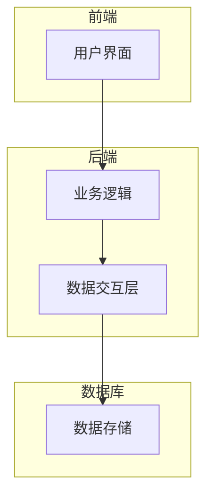
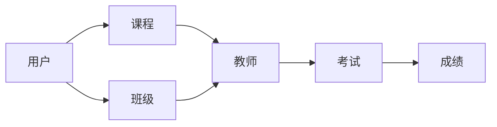
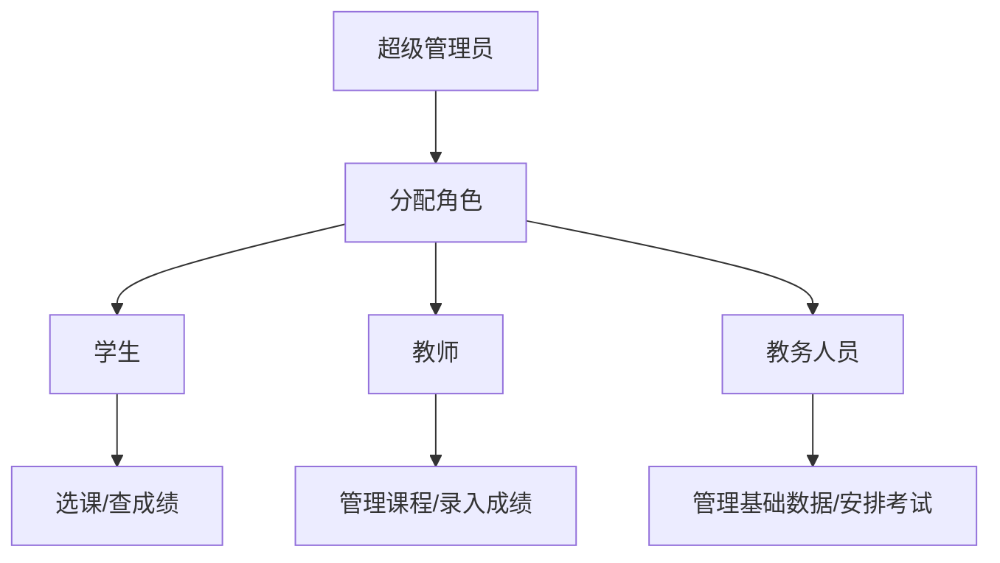

# 教务管理系统详细设计与具体代码实现

## 1. 背景介绍

### 1.1 教务管理系统的重要性

教务管理系统是现代教育机构中不可或缺的基础设施。它是一个集中式的信息管理平台,用于管理学生、课程、教师、考试、成绩等各种教学资源和活动。随着教育规模的不断扩大和教学模式的日益多样化,高效、可靠的教务管理系统变得越来越重要。

### 1.2 传统教务管理的挑战

在传统的教务管理模式下,大量的手工操作和纸质文件流转导致了低效率、高错误率和数据孤岛等问题。例如:

- 学生选课需要填写纸质表格,容易出现遗漏和错误
- 教师工作量统计依赖手工计算,效率低下
- 考试安排和成绩录入全靠人工,工作量巨大
- 各个部门之间数据无法共享,造成信息孤岛

这些问题严重阻碍了教育质量和管理效率的提升。

### 1.3 教务管理系统的作用

基于以上背景,开发一套完善的教务管理信息系统就显得尤为必要。它可以实现:

- 数字化流程,提高工作效率
- 统一的数据中心,实现信息共享
- 自动化的业务处理,降低人工成本
- 标准化的管理模式,提升教学质量

因此,教务管理系统不仅能够大幅提升管理效率,更能为教育决策提供准确数据支持,对提高整体教育水平具有重要意义。

## 2. 核心概念与联系 

### 2.1 系统架构概览

教务管理系统通常采用B/S(Browser/Server)或C/S(Client/Server)架构,包含:

- **前端**:提供用户界面,支持各类用户(学生、教师、管理员等)操作
- **后端**:负责业务逻辑处理、数据存储等核心功能
- **数据库**:存储系统的各种数据

前端、后端和数据库通过网络通信,共同构成了一个完整的应用系统。

### 2.2 核心概念

教务管理系统包含以下核心概念:

- **用户**:系统的使用者,包括学生、教师、教务人员等
- **课程**:教学活动的载体,包括课程基本信息、上课时间地点等
- **班级**:多个学生的组织单元,用于管理选课、考试等
- **教师**:承担教学任务,管理课程、录入成绩等
- **考试**:考核学生知识掌握程度的活动
- **成绩**:考试或平时的评分记录

这些概念相互关联、环环相扣,构成了教务管理的完整业务流程。

## 3. 核心算法原理与操作步骤

### 3.1 用户权限管理

用户权限管理是系统安全的基石,不同角色被赋予不同的操作权限:

1. 创建角色,设置角色权限
2. 为用户分配角色
3. 用户登录,获取权限
4. 按权限过滤菜单和操作

使用**基于角色的访问控制(RBAC)**模型,可实现灵活的权限管理。

### 3.2 选课算法

选课是学生最常用的功能,需要考虑以下因素:

- 课程人数上限
- 学生重复选课
- 课程冲突(时间冲突)
- 先修课程限制

可使用**优先级队列+广度优先搜索**的算法解决选课分配问题:

1. 根据"时间、学分"特征为所有课程编码
2. 广度优先搜索遍历课程树,寻找无冲突最优方案
3. 优先级队列中存储可选方案
4. 分配给学生的是队列中优先级最高的方案

该算法可获得**全局最优**的选课结果,时间复杂度为$O(n^2)$。

### 3.3 自动排课算法

为避免课程时间冲突,需要自动安排合理的上课时间:

1. 构建课程邻接矩阵(课程两两是否冲突)
2. 基于矩阵,将课程着色为不同颜色(冲突的课程颜色不同)
3. 同色课程可并行安排在同一时间段

该算法被称为**图着色算法**,可在$O(n^3)$时间内完成自动排课。

### 3.4 成绩计算

成绩计算是一项重要任务,需要汇总多个环节的分数,并计算加权总分:

$$
总分 = \sum_{i=1}^{n}w_i * 分数_i
$$

其中$w_i$是每个环节的权重,满足$\sum_{i=1}^{n}w_i=1$。

例如期末考试权重0.6,平时作业权重0.4,则:

$$
总分 = 0.6 * 期末分数 + 0.4 * \frac{\sum_{i=1}^{m}作业分数_i}{m}
$$

该算法简单直观,可根据教学大纲进行个性化配置。

### 3.5 数据统计分析

对历史数据进行多维度统计分析,可为决策提供依据:

- 按年级/专业/课程,统计学生成绩分布
- 按教师,分析授课质量和工作量
- 按课程,分析通过率、选课人数变化趋势

可使用**OLAP**技术对多维数据集进行在线分析,并提供直观的**数据可视化**展示。

## 4. 数学模型和公式详细讲解举例说明

在教务管理系统中,有许多场景需要使用数学模型和公式进行描述和计算。以下是一些常见的数学模型和公式,以及它们在系统中的应用。

### 4.1 学生成绩计算模型

学生的最终成绩通常由多个部分组成,例如期末考试、平时作业、课程论文等。每个部分的分数乘以相应的权重,然后相加,即可得到最终成绩。这个过程可以用以下公式表示:

$$
\text{最终成绩} = \sum_{i=1}^{n} w_i \times s_i
$$

其中:
- $n$ 表示成绩组成部分的数量
- $w_i$ 表示第 $i$ 个部分的权重,满足 $\sum_{i=1}^{n} w_i = 1$
- $s_i$ 表示第 $i$ 个部分的分数

例如,如果一门课程的成绩构成为:期末考试 60%,平时作业 30%,课程论文 10%,则公式可以具体化为:

$$
\text{最终成绩} = 0.6 \times \text{期末考试分数} + 0.3 \times \frac{\sum \text{作业分数}}{m} + 0.1 \times \text{论文分数}
$$

其中 $m$ 表示作业的数量。

### 4.2 教师工作量计算模型

为了公平地分配教师的工作量,需要对每位教师的工作量进行量化计算。教师的工作量通常包括授课工作量和非授课工作量两部分。

#### 4.2.1 授课工作量计算

授课工作量与所授课程的学分、学生人数等因素有关,可以用以下公式计算:

$$
\text{授课工作量} = \sum_{i=1}^{m} \left( c_i \times n_i \times f(n_i) \right)
$$

其中:
- $m$ 表示教师所授课程的数量
- $c_i$ 表示第 $i$ 门课程的学分
- $n_i$ 表示第 $i$ 门课程的学生人数
- $f(n_i)$ 是一个与学生人数相关的调节函数,用于体现学生人数对工作量的影响

调节函数 $f(n_i)$ 可以是线性的、对数的或其他形式,具体取决于学校的政策。

#### 4.2.2 非授课工作量计算

非授课工作量包括科研工作、行政工作等,可以根据实际情况进行估算和量化。假设非授课工作量记为 $w_0$,则教师的总工作量可以表示为:

$$
\text{总工作量} = \text{授课工作量} + w_0
$$

### 4.3 课程冲突检测模型

在学生选课时,需要检测所选课程之间是否存在时间冲突。我们可以构建一个二元关系矩阵 $C$,其中 $C_{ij}$ 表示第 $i$ 门课程与第 $j$ 门课程之间是否存在时间冲突:

$$
C_{ij} = \begin{cases}
1, & \text{如果第 $i$ 门课程与第 $j$ 门课程存在时间冲突} \\
0, & \text{否则}
\end{cases}
$$

对于一个包含 $n$ 门课程的课程集合 $S$,如果存在一个子集 $S' \subseteq S$,使得对于任意 $i, j \in S'$ 都有 $C_{ij} = 1$,则说明这些课程之间存在时间冲突。

我们可以使用图着色算法来检测和解决课程冲突问题。将每门课程视为一个节点,如果两门课程存在时间冲突,则在它们之间连一条边。然后,我们尝试为这个图着色,使得相邻节点的颜色不同。如果可以使用 $k$ 种颜色对图进行合法着色,则说明最多可以同时安排 $k$ 门不冲突的课程。

这种方法的时间复杂度为 $O(n^3)$,其中 $n$ 是课程的数量。

### 4.4 考试座位安排模型

在安排考试座位时,需要最大程度地避免作弊的风险。我们可以构建一个"作弊风险"矩阵 $R$,其中 $R_{ij}$ 表示第 $i$ 个学生与第 $j$ 个学生之间的作弊风险程度:

$$
R_{ij} = \begin{cases}
r_{ij}, & \text{如果第 $i$ 个学生与第 $j$ 个学生之间存在作弊风险} \\
0, & \text{否则}
\end{cases}
$$

其中 $r_{ij}$ 是一个实数,用于量化作弊风险的大小。

我们的目标是找到一种座位安排方式,使得所有学生之间的总作弊风险最小。这可以形式化为一个整数规划问题:

$$
\begin{aligned}
\min \quad & \sum_{i=1}^{n} \sum_{j=i+1}^{n} R_{ij} x_{ij} \\
\text{s.t.} \quad & \sum_{j=1}^{n} x_{ij} = 1, \quad \forall i \\
& \sum_{i=1}^{n} x_{ij} = 1, \quad \forall j \\
& x_{ij} \in \{0, 1\}, \quad \forall i, j
\end{aligned}
$$

其中 $n$ 是学生的总数,决策变量 $x_{ij}$ 表示第 $i$ 个学生与第 $j$ 个学生是否相邻就座,如果相邻就座则 $x_{ij} = 1$,否则 $x_{ij} = 0$。

这是一个经典的二元规划问题,可以使用整数规划求解器或启发式算法来求解。

以上是教务管理系统中一些常见的数学模型和公式,它们对于系统的设计和实现至关重要。在实际应用中,我们还需要根据具体的业务需求,构建更加复杂和精确的数学模型。

## 5. 项目实践:代码实例和详细解释说明

在本节中,我们将通过具体的代码实例,展示如何实现教务管理系