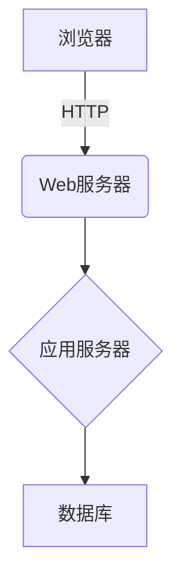

# 教学设备管理系统详细设计与具体代码实现

## 1.背景介绍

### 1.1 教学设备管理的重要性

在现代教育体系中,教学设备扮演着至关重要的角色。它们不仅为教师提供了展示知识和概念的工具,还为学生创造了更加生动、互动和富有吸引力的学习环境。有效管理教学设备的状态、分配和维护,对于确保教学质量、优化资源利用和降低运营成本至关重要。

### 1.2 现有系统的挑战

然而,传统的教学设备管理方式存在诸多挑战:

- 手动管理繁琐、效率低下
- 设备利用率不高,资源浪费
- 维修和更新缺乏系统跟踪
- 设备分配不均,供需失衡

这些问题导致了教学资源的低效利用,增加了管理成本,并可能影响教学质量。因此,开发一个高效、智能的教学设备管理系统势在必行。

## 2.核心概念与联系 

### 2.1 系统架构概览

教学设备管理系统是一个基于Web的应用程序,采用经典的三层架构设计:表示层(前端)、业务逻辑层(后端)和数据访问层。前端通过浏览器与后端进行交互,后端则连接数据库进行数据存取。



### 2.2 核心模块

该系统包含以下核心模块:

- **设备管理模块**:管理设备的基本信息、状态、位置等,支持新增、编辑和搜索功能。
- **预约管理模块**:允许教师预约设备,系统根据设备状态和时间安排自动分配。
- **维修管理模块**:记录和跟踪设备维修信息,包括维修历史和计划维护。
- **报表统计模块**:生成各种统计报表,如设备利用率、故障率等,为决策提供数据支持。

### 2.3 关键技术

系统的关键技术包括但不限于:

- **Spring Boot**:用于构建高效、易于开发的应用程序。
- **MyBatis**:对象关系映射(ORM)框架,简化数据库操作。
- **Vue.js**:构建现代化、交互式的Web用户界面。
- **Element UI**:基于Vue的桌面端UI框架,提供丰富的组件库。
- **MySQL**:开源关系型数据库,用于存储系统数据。

## 3.核心算法原理具体操作步骤

### 3.1 设备预约算法

设备预约是系统的核心功能之一。当教师提交预约申请时,系统需要根据设备可用状态和时间安排,自动分配合适的设备。这个过程可以用以下伪代码描述:

```
输入: 预约请求(设备类型,时间段)
输出: 分配的设备(或者拒绝预约)

函数 设备预约分配(预约请求):
    # 获取符合条件的所有可用设备
    可用设备列表 = 获取可用设备(设备类型,时间段)

    # 如果有可用设备
    如果 可用设备列表不为空:
        # 按照优先级排序(如:使用次数较少的设备优先)
        排序(可用设备列表)

        # 分配优先级最高的设备
        分配设备 = 可用设备列表[0]

        # 更新设备状态
        更新设备状态(分配设备,已预约)

        返回 分配设备
    else:
        返回 预约失败
```

该算法的时间复杂度为O(n\*log n),其中n为可用设备数量,因为需要对可用设备列表进行排序。

### 3.2 设备维修优先级算法

对于需要维修的设备,系统应当根据一定的优先级规则,确定维修顺序,以提高效率。这里提出一种基于设备重要程度和故障严重程度的优先级算法:

$$
优先级分数 = \alpha * 设备重要性分数 + \beta * 故障严重性分数
$$

其中:

- $\alpha$和$\beta$是权重系数,根据实际情况调整,满足$\alpha + \beta = 1$。
- 设备重要性分数可以根据设备类型、使用频率等因素评估。
- 故障严重性分数可以根据故障描述、影响范围等因素评估。

根据优先级分数从高到低排序,依次安排维修。

该算法的时间复杂度为O(n\*log n),其中n为需要维修的设备数量,因为需要对设备列表进行排序。

## 4.数学模型和公式详细讲解举例说明

### 4.1 设备利用率模型

设备利用率是衡量系统运行效率的关键指标之一。我们可以构建如下数学模型来计算设备利用率:

设某类设备总数为$N$,在给定时间段$[t_1,t_2]$内,第$i$个设备的使用时间为$u_i$,则该类设备的利用率为:

$$
利用率 = \frac{\sum_{i=1}^{N}u_i}{N*(t_2-t_1)}
$$

例如,有10台投影仪,在一个月的时间里,各投影仪使用时间分别为{20,25,18,22,30,15,28,16,21,25}小时,则投影仪的利用率为:

$$
利用率 = \frac{20+25+18+22+30+15+28+16+21+25}{10*720}=\frac{220}{7200}=0.306\approx30.6\%
$$

这个模型可以帮助管理员评估设备的使用情况,并为采购和调配提供依据。

### 4.2 设备故障率模型

设备故障率是衡量设备质量和维护效果的重要指标。我们可以建立如下模型:

设某类设备总数为$N$,在给定时间段$[t_1,t_2]$内,发生故障的设备数为$n$,则该类设备的故障率为:

$$
故障率 = \frac{n}{N}
$$

例如,有20台平板电脑,在一年内共发生5次故障,则平板电脑的故障率为:

$$
故障率 = \frac{5}{20} = 0.25 = 25\%
$$

根据故障率的高低,管理员可以评估设备质量,制定维护计划,并为未来采购提供参考。

## 5.项目实践:代码实例和详细解释说明

为了更好地理解系统的实现细节,我们将展示一些关键模块的核心代码。

### 5.1 设备管理模块

#### 5.1.1 设备实体类

```java
@Data
@NoArgsConstructor
@AllArgsConstructor
public class Device {
    private Integer id;
    private String name;
    private String type;
    private String description;
    private String location;
    private DeviceStatus status;
    private LocalDateTime lastMaintained;
    // 其他属性...
}
```

`Device`类描述了设备的基本属性,包括ID、名称、类型、描述、位置、状态和最后维护时间等。

#### 5.1.2 设备服务接口

```java
public interface DeviceService {
    List<Device> getAllDevices();
    Device getDeviceById(Integer id);
    void addDevice(Device device);
    void updateDevice(Device device);
    void deleteDevice(Integer id);
    List<Device> searchDevices(DeviceSearchCriteria criteria);
}
```

`DeviceService`接口定义了设备管理模块的核心功能,包括获取全部设备、根据ID获取设备、添加设备、更新设备、删除设备和搜索设备等方法。

#### 5.1.3 设备服务实现

```java
@Service
public class DeviceServiceImpl implements DeviceService {
    @Autowired
    private DeviceMapper deviceMapper;

    @Override
    public List<Device> getAllDevices() {
        return deviceMapper.selectAll();
    }

    // 其他方法实现...
}
```

`DeviceServiceImpl`是`DeviceService`接口的具体实现类。它通过注入`DeviceMapper`对象(由MyBatis自动生成)与数据库进行交互,实现了各种设备管理操作。

### 5.2 预约管理模块

#### 5.2.1 预约实体类

```java
@Data
@NoArgsConstructor
@AllArgsConstructor
public class Reservation {
    private Integer id;
    private Integer deviceId;
    private Integer userId;
    private LocalDateTime startTime;
    private LocalDateTime endTime;
    private String purpose;
    private ReservationStatus status;
    // 其他属性...
}
```

`Reservation`类描述了预约的基本信息,包括ID、设备ID、用户ID、开始时间、结束时间、用途和状态等。

#### 5.2.2 预约服务接口

```java
public interface ReservationService {
    List<Reservation> getAllReservations();
    Reservation getReservationById(Integer id);
    void makeReservation(Reservation reservation);
    void updateReservation(Reservation reservation);
    void cancelReservation(Integer id);
    List<Reservation> searchReservations(ReservationSearchCriteria criteria);
}
```

`ReservationService`接口定义了预约管理模块的核心功能,包括获取全部预约、根据ID获取预约、创建预约、更新预约、取消预约和搜索预约等方法。

#### 5.2.3 预约服务实现

```java
@Service
public class ReservationServiceImpl implements ReservationService {
    @Autowired
    private ReservationMapper reservationMapper;
    @Autowired
    private DeviceService deviceService;

    @Override
    public void makeReservation(Reservation reservation) {
        // 查找可用设备
        Device availableDevice = findAvailableDevice(reservation.getDeviceType(),
                                                     reservation.getStartTime(),
                                                     reservation.getEndTime());
        if (availableDevice != null) {
            // 设置设备ID
            reservation.setDeviceId(availableDevice.getId());
            // 保存预约
            reservationMapper.insert(reservation);
            // 更新设备状态
            deviceService.updateDeviceStatus(availableDevice.getId(), DeviceStatus.RESERVED);
        } else {
            // 没有可用设备,预约失败
            throw new NoAvailableDeviceException();
        }
    }

    // 其他方法实现...
}
```

在`makeReservation`方法中,我们首先调用`findAvailableDevice`方法查找符合条件的可用设备。如果找到可用设备,则创建预约记录并更新设备状态;否则抛出异常。

这里的`findAvailableDevice`方法就是前面讨论过的设备预约算法的具体实现。

### 5.3 维修管理模块

#### 5.3.1 维修记录实体类

```java
@Data
@NoArgsConstructor
@AllArgsConstructor
public class MaintenanceRecord {
    private Integer id;
    private Integer deviceId;
    private String description;
    private MaintenanceStatus status;
    private LocalDateTime startTime;
    private LocalDateTime endTime;
    private Double cost;
    // 其他属性...
}
```

`MaintenanceRecord`类描述了维修记录的基本信息,包括ID、设备ID、描述、状态、开始时间、结束时间和费用等。

#### 5.3.2 维修服务接口

```java
public interface MaintenanceService {
    List<MaintenanceRecord> getAllRecords();
    MaintenanceRecord getRecordById(Integer id);
    void createRecord(MaintenanceRecord record);
    void updateRecord(MaintenanceRecord record);
    void closeRecord(Integer id);
    List<MaintenanceRecord> searchRecords(MaintenanceSearchCriteria criteria);
}
```

`MaintenanceService`接口定义了维修管理模块的核心功能,包括获取全部维修记录、根据ID获取记录、创建记录、更新记录、关闭记录和搜索记录等方法。

#### 5.3.3 维修服务实现

```java
@Service
public class MaintenanceServiceImpl implements MaintenanceService {
    @Autowired
    private MaintenanceRecordMapper recordMapper;
    @Autowired
    private DeviceService deviceService;

    @Override
    public void createRecord(MaintenanceRecord record) {
        // 计算维修优先级分数
        double priorityScore = calculatePriorityScore(record);
        // 根据优先级分数排序
        List<MaintenanceRecord> pendingRecords = recordMapper.selectPendingRecords();
        pendingRecords.sort((r1, r2) -> Double.compare(r2.getPriorityScore(), r1.getPriorityScore()));
        // 插入新记录
        recordMapper.insert(record);
        // 更新设备状态
        deviceService.updateDeviceStatus(record.getDeviceId(), DeviceStatus.MAINTENANCE);
    }

    // 其他方法实现...
}
```

在`createRecord`方法中,我们首先计算新建维修记录的优先级分数,然后将其与待处理的维修记录列表合并,并按照优先级分数降序排列。最后,插入新记录并更新设备状态。

这里的`calculatePriorityScore`方法就是前面讨论过的设备维修优先级算法的具体实现。

## 6.实际应用场景

教学设备管理系统可以广泛