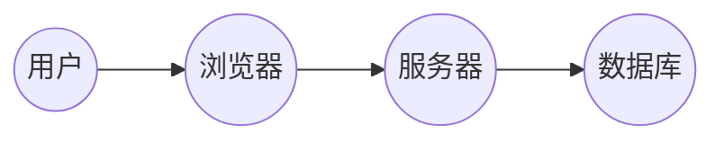

# 教职工信息管理系统详细设计与具体代码实现

作者：禅与计算机程序设计艺术

## 1. 背景介绍

### 1.1 教职工信息管理的必要性

随着教育事业的蓬勃发展，学校规模不断扩大，教职工队伍日益壮大。如何高效地管理教职工信息，成为了学校管理工作中的重要一环。传统的教职工信息管理方式，往往依赖于纸质档案和人工操作，存在着效率低下、易出错、信息安全性差等问题。为了解决这些问题，开发一套教职工信息管理系统显得尤为必要。

### 1.2 教职工信息管理系统的目标

教职工信息管理系统的目标是实现教职工信息的数字化、自动化、智能化管理，提高学校管理效率，减轻管理人员负担，为教职工提供更便捷的服务。具体来说，系统需要实现以下功能：

* 教职工基本信息的录入、修改、查询、统计
* 教职工考勤信息的管理
* 教职工工资信息的管理
* 教职工培训信息的管理
* 教职工科研信息的管理
* 系统权限管理

### 1.3 系统设计原则

教职工信息管理系统的设计应遵循以下原则：

* **实用性:** 系统功能要满足学校实际需求，能够解决实际问题。
* **易用性:** 系统界面简洁易懂，操作方便快捷。
* **安全性:** 系统要保障数据的安全性和可靠性。
* **可扩展性:** 系统要能够方便地进行功能扩展和升级。

## 2. 核心概念与联系

### 2.1 系统架构

教职工信息管理系统采用B/S架构，即浏览器/服务器架构。用户通过浏览器访问系统，系统服务器负责处理用户请求，并返回相应的结果。



### 2.2 数据库设计

系统数据库采用关系型数据库，例如MySQL。数据库中包含以下主要表：

* **教职工信息表:** 存储教职工的基本信息，例如姓名、性别、出生日期、职称、部门等。
* **考勤信息表:** 存储教职工的考勤信息，例如上班时间、下班时间、迟到次数、早退次数等。
* **工资信息表:** 存储教职工的工资信息，例如基本工资、绩效工资、奖金、扣款等。
* **培训信息表:** 存储教职工的培训信息，例如培训时间、培训内容、培训机构等。
* **科研信息表:** 存储教职工的科研信息，例如科研项目、论文发表等。
* **用户表:** 存储系统用户的账号信息，例如用户名、密码、权限等。

### 2.3 系统功能模块

系统功能模块包括：

* **系统管理模块:** 负责系统权限管理、用户管理等功能。
* **教职工信息管理模块:** 负责教职工基本信息的录入、修改、查询、统计等功能。
* **考勤管理模块:** 负责教职工考勤信息的管理。
* **工资管理模块:** 负责教职工工资信息的管理。
* **培训管理模块:** 负责教职工培训信息的管理。
* **科研管理模块:** 负责教职工科研信息的管理。

## 3. 核心算法原理具体操作步骤

### 3.1 教职工信息查询

教职工信息查询功能需要根据用户输入的查询条件，从数据库中检索符合条件的教职工信息，并返回给用户。具体操作步骤如下：

1. 用户在系统界面输入查询条件，例如姓名、部门、职称等。
2. 系统将用户输入的查询条件转换为SQL查询语句。
3. 系统执行SQL查询语句，从数据库中检索符合条件的教职工信息。
4. 系统将查询结果返回给用户。

### 3.2 考勤信息统计

考勤信息统计功能需要统计每个教职工的考勤情况，例如迟到次数、早退次数、缺勤次数等。具体操作步骤如下：

1. 系统从考勤信息表中读取所有考勤记录。
2. 系统根据考勤记录计算每个教职工的迟到次数、早退次数、缺勤次数等。
3. 系统将统计结果保存到数据库中。
4. 用户可以查看统计结果。

### 3.3 工资计算

工资计算功能需要根据教职工的考勤信息、绩效考核结果等信息，计算每个教职工的工资。具体操作步骤如下：

1. 系统从考勤信息表中读取每个教职工的考勤信息。
2. 系统从绩效考核结果表中读取每个教职工的绩效考核结果。
3. 系统根据考勤信息和绩效考核结果计算每个教职工的工资。
4. 系统将计算结果保存到数据库中。
5. 用户可以查看工资信息。

## 4. 数学模型和公式详细讲解举例说明

### 4.1 工资计算公式

教职工工资计算公式如下：

```
工资 = 基本工资 + 绩效工资 + 奖金 - 扣款
```

其中：

* **基本工资:** 教职工的基本工资，由学校根据教职工的职称、工龄等因素确定。
* **绩效工资:** 教职工的绩效工资，由学校根据教职工的绩效考核结果确定。
* **奖金:** 教职工的奖金，由学校根据教职工的工作表现、贡献等因素确定。
* **扣款:** 教职工的扣款，包括个人所得税、社会保险等。

### 4.2 举例说明

例如，某教职工的基本工资为5000元，绩效工资为1000元，奖金为500元，扣款为1000元，则该教职工的工资为：

```
工资 = 5000 + 1000 + 500 - 1000 = 5500 元
```

## 5. 项目实践：代码实例和详细解释说明

### 5.1 开发环境

* 操作系统：Windows 10
* 开发语言：Java
* 数据库：MySQL
* Web服务器：Tomcat

### 5.2 代码实例

```java
// 教职工信息实体类
public class Employee {
    private int id;
    private String name;
    private String gender;
    private Date birthday;
    private String title;
    private String department;
    // getter 和 setter 方法
}

// 教职工信息查询接口
public interface EmployeeService {
    // 根据条件查询教职工信息
    List<Employee> findEmployeesByCondition(Employee condition);
}

// 教职工信息查询接口实现类
public class EmployeeServiceImpl implements EmployeeService {
    @Autowired
    private EmployeeMapper employeeMapper;

    @Override
    public List<Employee> findEmployeesByCondition(Employee condition) {
        // 构建查询条件
        QueryWrapper<Employee> queryWrapper = new QueryWrapper<>();
        if (condition.getName() != null) {
            queryWrapper.like("name", condition.getName());
        }
        if (condition.getDepartment() != null) {
            queryWrapper.eq("department", condition.getDepartment());
        }
        // 查询数据库
        return employeeMapper.selectList(queryWrapper);
    }
}
```

### 5.3 代码解释

* `Employee` 类表示教职工信息实体类，包含教职工的 id、姓名、性别、出生日期、职称、部门等信息。
* `EmployeeService` 接口定义了教职工信息查询接口，包含 `findEmployeesByCondition()` 方法，用于根据条件查询教职工信息。
* `EmployeeServiceImpl` 类实现了 `EmployeeService` 接口，使用 MyBatis 框架查询数据库。

## 6. 实际应用场景

### 6.1 学校人事管理

学校人事部门可以使用教职工信息管理系统进行教职工信息的录入、修改、查询、统计等操作，提高人事管理效率。

### 6.2 教职工自助服务

教职工可以通过教职工信息管理系统查询自己的工资信息、考勤信息、培训信息等，方便快捷地获取个人信息。

### 6.3 学校决策支持

学校管理层可以通过教职工信息管理系统获取教职工队伍的整体情况，例如年龄结构、职称结构、学历结构等，为学校决策提供数据支持。

## 7. 工具和资源推荐

### 7.1 开发工具

* IntelliJ IDEA: 一款功能强大的 Java 集成开发环境。
* Eclipse: 一款开源的 Java 集成开发环境。
* Visual Studio Code: 一款轻量级的代码编辑器，支持多种编程语言。

### 7.2 数据库

* MySQL: 一款流行的关系型数据库管理系统。
* Oracle: 一款企业级关系型数据库管理系统。
* PostgreSQL: 一款开源的关系型数据库管理系统。

### 7.3 Web服务器

* Tomcat: 一款开源的 Java Web 服务器。
* JBoss: 一款企业级 Java 应用服务器。
* WebLogic: 一款企业级 Java 应用服务器。

## 8. 总结：未来发展趋势与挑战

### 8.1 未来发展趋势

随着人工智能、大数据、云计算等技术的不断发展，教职工信息管理系统将朝着更加智能化、自动化、个性化的方向发展。例如，系统可以利用人工智能技术自动识别教职工身份，实现人脸识别考勤；系统可以利用大数据技术分析教职工的工作表现，为教职工提供个性化的培训建议。

### 8.2 面临的挑战

教职工信息管理系统在未来的发展过程中，还将面临一些挑战，例如：

* **数据安全:** 教职工信息属于敏感信息，系统需要采取有效的措施保障数据的安全性和可靠性。
* **系统性能:** 随着教职工数量的增加，系统需要能够处理大量的并发请求，保证系统性能。
* **用户体验:** 系统需要不断优化用户界面和操作流程，提升用户体验。

## 9. 附录：常见问题与解答

### 9.1 如何修改密码？

用户可以通过