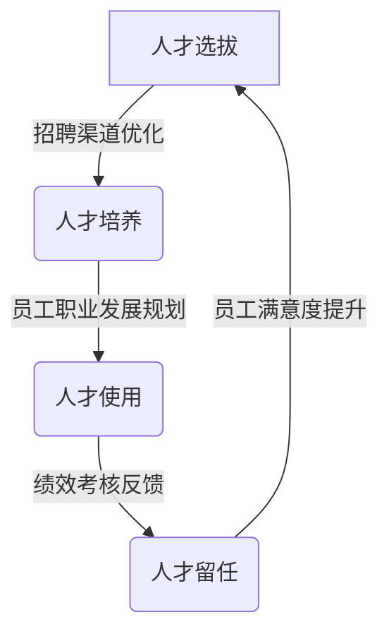

# 数字化人才管理:数字化助力人才选育用留

## 1.背景介绍

### 1.1 人才管理的重要性

在当今瞬息万变的商业环境中,人才已经成为企业最宝贵的资源和核心竞争力。拥有优秀的人才队伍对于企业的持续发展和创新至关重要。有效的人才管理策略可以吸引、培养和留住优秀人才,从而推动企业实现战略目标。

### 1.2 人才管理的传统挑战

传统的人才管理过程面临诸多挑战,例如:

- 繁琐的手工流程导致低效率
- 基于主观判断的决策缺乏数据支持
- 无法实时跟踪和分析人才数据
- 难以及时发现和解决人才问题

### 1.3 数字化转型的必要性

为了应对这些挑战,企业亟需将数字化技术融入人才管理实践,实现人才管理的数字化转型。数字化人才管理可以利用大数据、人工智能等新兴技术,提高人才管理的效率、准确性和洞察力。

## 2.核心概念与联系

### 2.1 人才管理生命周期

人才管理生命周期包括人才选拔(Recruitment)、培养(Development)、使用(Deployment)和留任(Retention)四个关键环节,统称为"选育用留"。数字化技术在每个环节都发挥着重要作用。



### 2.2 数字化人才管理概念

数字化人才管理是指利用数字技术全面赋能人才管理各环节,包括:

- 大数据分析优化招聘渠道
- 人工智能辅助员工职业发展规划 
- 智能化绩效考核系统
- 数字化员工体验管理

### 2.3 数字化人才管理价值

数字化人才管理可以为企业带来诸多价值:

- 提高人才管理效率
- 优化决策依据,降低决策偏差
- 增强人才洞察力,主动发现问题
- 提升员工体验,吸引优秀人才

## 3.核心算法原理具体操作步骤  

数字化人才管理涉及多种算法和技术,下面我们重点介绍几种核心算法原理和具体操作步骤。

### 3.1 聚类算法在人才画像构建中的应用

#### 3.1.1 算法原理

聚类算法的目标是将数据集中的样本数据划分为若干个通常是不相交的子集,使得每个子集内部的数据相似性较高,而不同子集之间的相似性较低。常用的聚类算法有K-Means、层次聚类等。

在人才画像构建中,我们可以利用聚类算法对员工数据进行分组,得到不同的人才群体特征,为后续的人才管理策略制定提供依据。

#### 3.1.2 算法步骤

以K-Means算法为例,构建人才画像的步骤如下:

输入:员工数据集 $D = \{x_1, x_2, \ldots, x_n\}$,聚类数量 $K$

输出:K个聚类 $C = \{C_1, C_2, \ldots, C_K\}$

1) 随机选取 $K$ 个初始质心 $\mu_1, \mu_2, \ldots, \mu_K$
2) **重复**
3)     **对每个** $x_i \in D$
4)         计算 $x_i$ 与每个质心的距离 $d(x_i,\mu_j)$
5)         将 $x_i$ 划分到最近的簇 $C_j$
6)     **对每个** $C_j \in C$
7)         重新计算质心 $\mu_j = \frac{1}{|C_j|}\sum_{x\in C_j}x$
8) **直到** 质心不再变化
9) **返回** $C$

通过聚类分析,我们可以得到不同群体的人才特征描述,为后续的招聘策略、培训方案等制定提供决策支持。

### 3.2 决策树在员工留任预测中的应用

#### 3.2.1 算法原理  

决策树是一种常用的监督学习算法,可以用于分类和回归任务。它通过递归地构建决策树模型,将实例数据根据特征属性值一步步分类,直至达到某个终止条件。常用的决策树算法包括ID3、C4.5、CART等。

在员工留任预测中,我们可以利用决策树模型来预测员工是否会离职,为留任策略制定提供支持。

#### 3.2.2 算法步骤

以ID3算法为例,构建员工留任预测模型的步骤如下:

输入:训练数据集 $D$,特征集 $A = \{a_1, a_2, \ldots, a_n\}$,类别标签 $\{leave, stay\}$

输出:决策树模型 $T$

1) **创建根节点**
2)     **若** $D$ 中样本全属于同一类别 $c$
3)         **则** 将根节点标记为 $c$ 类
4)         **返回** $T$
5)     **否则若** $A = \emptyset$ 或所有实例在 $A$ 上取值相同  
6)         **则** 将根节点标记为 $D$ 中最大类
7)         **返回** $T$
8)     **否则**
9)         $a^* = \arg\max_{a\in A} \text{Gain}(D,a)$
10)        **对** $a^*$ 的每个值 $v$  
11)            $D_v$ 为 $D$ 中 $a^*=v$ 的子集
12)            **设** $T$ 为单节点树,标记为 $a^*=v$
13)            $T$ 的子树 $T_v = \text{ID3}(D_v,A\setminus\{a^*\})$
14)        **返回** $T$

通过决策树模型,我们可以预测员工是否会离职,并分析影响留任的关键因素,从而制定针对性的留任措施。

## 4.数学模型和公式详细讲解举例说明

在数字化人才管理中,我们经常需要借助数学模型来量化分析问题。下面我们以信息熵和信息增益为例,详细讲解相关数学模型和公式。

### 4.1 信息熵(Entropy)

信息熵用于度量样本集合的纯度,公式如下:

$$
\text{Entropy}(D) = -\sum_{c\in C}p(c)\log_2 p(c)
$$

其中:
- $D$ 为样本集合
- $C$ 为类别集合
- $p(c)$ 为 $D$ 中属于类别 $c$ 的样本占比

信息熵的取值范围为 $[0,1]$。当样本集合只包含一个类别时,信息熵为0,表示纯度最高;当每个类别的概率分布均等时,信息熵最大,表示纯度最低。

**举例**:假设我们有一个员工数据集 $D$,包含100名员工,其中有75名员工离职(leave),25名员工留任(stay),则信息熵为:

$$
\begin{aligned}
\text{Entropy}(D) &= -\frac{75}{100}\log_2\frac{75}{100} - \frac{25}{100}\log_2\frac{25}{100}\\
                  &= -0.75\log_2 0.75 - 0.25\log_2 0.25\\
                  &= 0.81
\end{aligned}
$$

可见,该员工数据集的纯度较低,需要进一步划分。

### 4.2 信息增益(Information Gain)

信息增益用于选择最优特征进行数据集划分,公式如下:

$$
\text{Gain}(D,a) = \text{Entropy}(D) - \sum_{v\in V(a)}\frac{|D_v|}{|D|}\text{Entropy}(D_v)
$$

其中:
- $D$ 为样本集合
- $a$ 为特征属性
- $V(a)$ 为特征 $a$ 的取值集合
- $D_v$ 为 $D$ 中特征 $a$ 取值为 $v$ 的子集

**举例**:假设我们有一个员工数据集 $D$,包含1000名员工,其中有600名员工离职(leave),400名员工留任(stay)。我们根据特征"年龄段"将员工划分为"青年"和"中年"两组,具体情况如下:

- 青年组:300人,其中离职200人,留任100人
- 中年组:700人,其中离职400人,留任300人

则根据"年龄段"特征划分的信息增益为:

$$
\begin{aligned}
\text{Gain}(D,\text{年龄段}) &= \text{Entropy}(D) - \frac{300}{1000}\text{Entropy}(D_\text{青年}) - \frac{700}{1000}\text{Entropy}(D_\text{中年})\\
                            &= 0.97 - \frac{300}{1000}\times 0.92 - \frac{700}{1000}\times 0.99\\
                            &= 0.09
\end{aligned}
$$

可见,根据"年龄段"特征划分数据集,信息增益较小,因此我们需要寻找其他更优特征进行数据集划分。

通过对信息熵和信息增益的理解,我们可以更好地构建决策树模型,提高员工留任预测的准确性。

## 4.项目实践:代码实例和详细解释说明

为了更好地理解数字化人才管理中的算法和模型,我们提供一个基于Python的实战项目示例,包括员工聚类分析和留任预测两部分。

### 4.1 员工聚类分析

```python
import pandas as pd
from sklearn.cluster import KMeans

# 加载员工数据
data = pd.read_csv("employee_data.csv")

# 选择聚类特征
X = data[["age", "salary", "tenure"]]

# 构建KMeans模型
kmeans = KMeans(n_clusters=3, random_state=0)

# 训练模型
kmeans.fit(X)

# 添加聚类标签
data["cluster"] = kmeans.labels_

# 分析各聚类群体特征
for i in range(3):
    cluster = data[data["cluster"]==i]
    print(f"Cluster {i} stats:")
    print(cluster.mean())
    print("------------------")
```

上述代码使用scikit-learn库中的KMeans算法对员工数据进行聚类分析。我们首先加载员工数据,选择年龄、工资和任职年限作为聚类特征,然后构建KMeans模型并训练。最后,将聚类标签添加到原始数据中,并分析每个聚类群体的平均特征。

通过聚类分析,我们可以发现不同的员工群体特征,例如:高薪资老员工群体、中低薪年轻员工群体等,为后续的人才培养和留任策略提供依据。

### 4.2 员工留任预测

```python
import pandas as pd
from sklearn.tree import DecisionTreeClassifier
from sklearn.model_selection import train_test_split

# 加载员工数据
data = pd.read_csv("employee_data.csv")

# 特征工程
data = data.dropna()
data = pd.get_dummies(data, columns=["department", "position"])

# 划分训练测试集
X = data.drop("leave", axis=1)
y = data["leave"]
X_train, X_test, y_train, y_test = train_test_split(X, y, test_size=0.2)

# 构建决策树模型
dt = DecisionTreeClassifier()
dt.fit(X_train, y_train)

# 模型评估
accuracy = dt.score(X_test, y_test)
print(f"Accuracy: {accuracy}")
```

上述代码使用scikit-learn库中的DecisionTreeClassifier构建了一个员工留任预测模型。我们首先加载员工数据,进行特征工程(填充缺失值、one-hot编码分类特征),然后划分训练测试集。接下来,构建决策树模型并使用训练集进行训练。最后,使用测试集评估模型的准确性。

通过留任预测模型,我们可以预测员工是否会离职,并分析影响留任的关键因素,为制定留任措施提供决策支持。

## 5.实际应用场景

数字化人才管理技术在现实中有着广泛的应用场景,为企业带来了巨大价值。

### 5.1 招聘优化

利用大数据分析和机器学习算法,企业可以优化招聘渠道、简历筛选和面试流程,提高招聘效率和人才质量匹配度。例如,领英(LinkedIn)利用人工