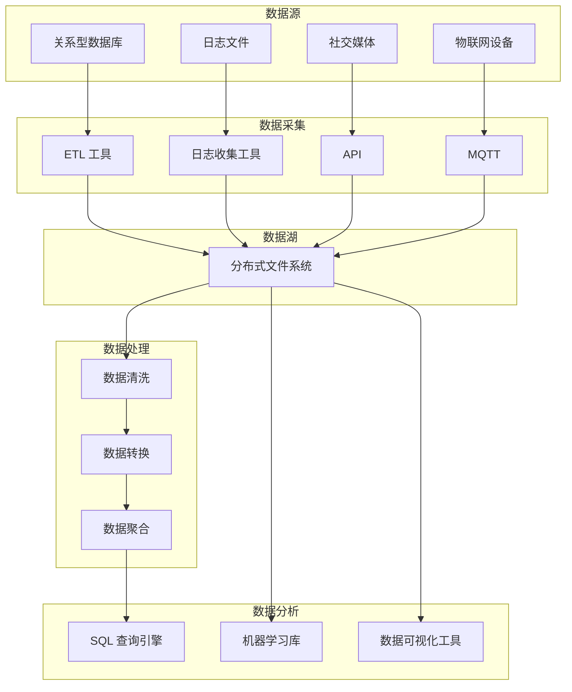

## 1. 背景介绍

### 1.1 大数据时代的挑战

随着互联网、物联网、移动互联网等技术的快速发展，全球数据量呈爆炸式增长，我们正处于一个前所未有的“大数据”时代。海量数据的出现，为各行各业带来了巨大的机遇和挑战。如何有效地存储、管理、分析和利用这些数据，成为了企业和组织亟待解决的问题。

### 1.2 数据仓库的局限性

传统的数据仓库技术，在处理结构化数据方面表现出色，但在面对非结构化数据、半结构化数据以及海量数据时，却显得力不从心。数据仓库通常需要预先定义数据模型，对数据进行清洗和转换，才能进行存储和分析，这在处理多样化、快速变化的数据时效率低下，且成本高昂。

### 1.3 数据湖的兴起

为了应对大数据时代的新挑战，一种新的数据架构应运而生，那就是数据湖。数据湖的概念最早由 Pentaho 公司的 James Dixon 提出，其核心思想是将各种类型的数据集中存储在一个统一的存储库中，并提供各种工具和技术，方便用户进行数据探索、分析和利用。

## 2. 核心概念与联系

### 2.1 数据湖的定义

数据湖是一个集中式存储库，用于存储任何类型的数据，包括结构化、半结构化和非结构化数据。数据湖的特点包括：

* **数据多样性:**  可以存储任何类型的数据，包括关系型数据库、日志文件、图像、视频、音频等。
* **Schema-on-Read:** 数据模式在读取时才定义，而不是在写入时。这意味着数据可以以原始格式存储，无需预先定义数据模型。
* **可扩展性:** 数据湖可以根据需要进行扩展，以适应不断增长的数据量。
* **数据可发现性:**  数据湖提供元数据管理和数据发现功能，方便用户查找和使用数据。

### 2.2 数据科学与数据湖的联系

数据科学是一门利用数据进行预测、分析和决策的学科。数据湖为数据科学家提供了丰富的、多样化的数据资源，为数据科学的发展提供了强大的支持。数据科学家可以使用数据湖中的数据，进行机器学习、深度学习、数据挖掘等分析，从而获得有价值的洞察，并为企业和组织提供决策支持。

### 2.3 数据湖与数据仓库的区别

数据湖和数据仓库都是用于存储数据的技术，但它们之间存在一些关键区别：

| 特性 | 数据湖 | 数据仓库 |
|---|---|---|
| 数据类型 | 任何类型 | 结构化数据 |
| 数据模式 | Schema-on-Read | Schema-on-Write |
| 数据质量 | 原始数据 | 清洗后的数据 |
| 使用场景 | 数据探索、分析、机器学习 | 商业智能、报表 |

## 3. 核心算法原理具体操作步骤

### 3.1 数据采集

数据湖的第一步是数据采集。数据可以来自各种来源，例如：

* **关系型数据库:**  可以使用 ETL 工具将数据从关系型数据库中提取出来，并加载到数据湖中。
* **日志文件:**  可以使用日志收集工具将日志文件收集到数据湖中。
* **社交媒体:**  可以使用 API 从社交媒体平台收集数据。
* **物联网设备:**  可以使用 MQTT 或其他协议从物联网设备收集数据。

### 3.2 数据存储

数据湖通常使用分布式文件系统来存储数据，例如 Hadoop 分布式文件系统 (HDFS) 或 Amazon S3。这些文件系统可以存储大量数据，并提供高可用性和容错性。

### 3.3 数据处理

数据湖中的数据通常是原始数据，需要进行处理才能进行分析。数据处理包括：

* **数据清洗:**  去除数据中的错误、重复和不一致的数据。
* **数据转换:**  将数据转换为适合分析的格式。
* **数据聚合:**  将多个数据源的数据合并在一起。

### 3.4 数据分析

数据湖提供了各种工具和技术，方便用户进行数据分析。这些工具包括：

* **SQL 查询引擎:**  例如 Apache Hive 和 Apache Spark SQL，可以使用 SQL 查询语言分析数据。
* **机器学习库:**  例如 Apache Spark MLlib 和 TensorFlow，可以使用机器学习算法构建预测模型。
* **数据可视化工具:**  例如 Tableau 和 Power BI，可以使用图表和仪表盘可视化数据。

## 4. 数学模型和公式详细讲解举例说明

### 4.1 数据清洗中的数学模型

数据清洗中常用的数学模型包括：

* **正则表达式:**  用于匹配和替换字符串中的特定模式。
* **统计分析:**  用于识别异常值和离群值。
* **聚类算法:**  用于将相似的数据点分组在一起。

**举例说明:**

假设我们有一个包含客户信息的 CSV 文件，其中包含姓名、地址、电话号码和电子邮件地址等字段。我们想要清洗电话号码字段，以确保所有电话号码都符合特定格式。我们可以使用正则表达式来匹配和替换不符合格式的电话号码。

```python
import re

# 定义电话号码的正则表达式
phone_regex = r"^\(\d{3}\) \d{3}-\d{4}$"

# 读取 CSV 文件
with open("customers.csv", "r") as f:
    reader = csv.reader(f)
    for row in reader:
        # 提取电话号码字段
        phone_number = row[2]

        # 检查电话号码是否符合格式
        if not re.match(phone_regex, phone_number):
            # 使用正则表达式替换不符合格式的电话号码
            phone_number = re.sub(r"[^0-9]", "", phone_number)
            phone_number = f"({phone_number[0:3]}) {phone_number[3:6]}-{phone_number[6:10]}"

            # 更新 CSV 文件中的电话号码字段
            row[2] = phone_number

# 将清洗后的数据写入新的 CSV 文件
with open("cleaned_customers.csv", "w") as f:
    writer = csv.writer(f)
    writer.writerows(reader)
```

### 4.2 数据转换中的数学模型

数据转换中常用的数学模型包括：

* **数据归一化:**  将数据缩放到特定范围，例如 0 到 1 之间。
* **数据标准化:**  将数据转换为均值为 0，标准差为 1 的分布。
* **独热编码:**  将分类变量转换为数值变量。

**举例说明:**

假设我们有一个包含学生考试成绩的数据集，其中包含数学、物理和化学等科目的成绩。我们想要将这些成绩归一化到 0 到 1 之间。我们可以使用以下公式进行数据归一化：

$$
x' = \frac{x - min(x)}{max(x) - min(x)}
$$

其中：

* $x$ 是原始数据。
* $x'$ 是归一化后的数据。
* $min(x)$ 是数据的最小值。
* $max(x)$ 是数据的最大值。

```python
import pandas as pd

# 读取学生成绩数据集
df = pd.read_csv("student_scores.csv")

# 对数学、物理和化学成绩进行归一化
df["math_normalized"] = (df["math"] - df["math"].min()) / (df["math"].max() - df["math"].min())
df["physics_normalized"] = (df["physics"] - df["physics"].min()) / (df["physics"].max() - df["physics"].min())
df["chemistry_normalized"] = (df["chemistry"] - df["chemistry"].min()) / (df["chemistry"].max() - df["chemistry"].min())

# 打印归一化后的数据集
print(df)
```

### 4.3 数据分析中的数学模型

数据分析中常用的数学模型包括：

* **线性回归:**  用于建立变量之间的线性关系。
* **逻辑回归:**  用于预测二元变量的结果。
* **决策树:**  用于构建基于规则的预测模型。

**举例说明:**

假设我们有一个包含客户购买历史的数据集，其中包含客户 ID、购买日期、购买金额和产品类别等字段。我们想要构建一个模型来预测客户是否会购买特定产品。我们可以使用逻辑回归来构建这个模型。

```python
import pandas as pd
from sklearn.linear_model import LogisticRegression

# 读取客户购买历史数据集
df = pd.read_csv("customer_purchases.csv")

# 将产品类别转换为数值变量
df = pd.get_dummies(df, columns=["product_category"])

# 将购买日期转换为时间戳
df["purchase_date"] = pd.to_datetime(df["purchase_date"])

# 创建特征矩阵和目标变量
X = df[["purchase_amount", "product_category_electronics", "product_category_clothing"]]
y = df["purchase"]

# 创建逻辑回归模型
model = LogisticRegression()

# 训练模型
model.fit(X, y)

# 预测新客户是否会购买特定产品
new_customer = [[100, 1, 0]]
prediction = model.predict(new_customer)

# 打印预测结果
print(prediction)
```

## 5. 项目实践：代码实例和详细解释说明

### 5.1 数据湖项目架构

一个典型的数据湖项目架构如下所示：



### 5.2 代码实例

以下是一个使用 Python 构建数据湖的简单示例：

```python
from pyspark.sql import SparkSession

# 创建 SparkSession
spark = SparkSession.builder.appName("DataLakeExample").getOrCreate()

# 读取 CSV 文件
df = spark.read.csv("data.csv", header=True, inferSchema=True)

# 将数据写入 Parquet 文件
df.write.parquet("data.parquet")

# 读取 Parquet 文件
df = spark.read.parquet("data.parquet")

# 执行 SQL 查询
df.createOrReplaceTempView("data")
result = spark.sql("SELECT * FROM data WHERE age > 30")

# 打印查询结果
result.show()

# 停止 SparkSession
spark.stop()
```

**代码解释:**

* 首先，我们使用 `SparkSession.builder` 创建一个 `SparkSession`。
* 然后，我们使用 `spark.read.csv` 读取 CSV 文件，并将数据存储在一个 DataFrame 中。
* 接下来，我们使用 `df.write.parquet` 将 DataFrame 写入 Parquet 文件。Parquet 是一种列式存储格式，它比 CSV 更高效，更适合存储大型数据集。
* 然后，我们使用 `spark.read.parquet` 读取 Parquet 文件，并将数据存储在另一个 DataFrame 中。
* 接下来，我们使用 `df.createOrReplaceTempView` 创建一个临时视图，以便我们可以使用 SQL 查询数据。
* 然后，我们使用 `spark.sql` 执行 SQL 查询，并将结果存储在一个 DataFrame 中。
* 最后，我们使用 `result.show` 打印查询结果。
* 最后，我们使用 `spark.stop` 停止 `SparkSession`。

## 6. 实际应用场景

数据湖在各行各业都有广泛的应用场景，例如：

* **电子商务:**  电商平台可以使用数据湖存储和分析客户购买历史、浏览行为、商品信息等数据，从而进行精准营销、个性化推荐、库存管理等。
* **金融:**  金融机构可以使用数据湖存储和分析交易数据、风险数据、客户数据等，从而进行风险控制、欺诈检测、投资决策等。
* **医疗保健:**  医疗保健机构可以使用数据湖存储和分析患者病历、临床试验数据、医学影像等数据，从而进行疾病诊断、药物研发、个性化治疗等。
* **制造业:**  制造企业可以使用数据湖存储和分析生产数据、设备数据、供应链数据等，从而进行质量控制、设备维护、生产优化等。

## 7. 总结：未来发展趋势与挑战

### 7.1 未来发展趋势

数据湖技术正在不断发展和完善，未来的发展趋势包括：

* **云原生数据湖:**  越来越多的数据湖将部署在云平台上，利用云计算的弹性和可扩展性。
* **数据湖与人工智能的融合:**  数据湖将与人工智能技术深度融合，为数据科学提供更强大的支持。
* **数据湖的安全和隐私:**  随着数据湖存储的数据越来越敏感，数据安全和隐私将成为越来越重要的议题。

### 7.2 面临的挑战

数据湖技术也面临着一些挑战，例如：

* **数据治理:**  数据湖中的数据来自各种来源，需要建立有效的数据治理机制，确保数据的质量和一致性。
* **数据安全:**  数据湖存储了大量敏感数据，需要采取有效的安全措施，防止数据泄露和滥用。
* **成本控制:**  数据湖的建设和维护成本较高，需要进行合理的成本控制。

## 8. 附录：常见问题与解答

### 8.1 什么是数据湖？

数据湖是一个集中式存储库，用于存储任何类型的数据，包括结构化、半结构化和非结构化数据。

### 8.2 数据湖和数据仓库有什么区别？

数据湖和数据仓库都是用于存储数据的技术，但它们之间存在一些关键区别：数据湖可以存储任何类型的数据，而数据仓库通常只存储结构化数据；数据湖使用 Schema-on-Read 模式，而数据仓库使用 Schema-on-Write 模式；数据湖存储原始数据，而数据仓库存储清洗后的数据。

### 8.3 数据湖有哪些应用场景？

数据湖在各行各业都有广泛的应用场景，例如电子商务、金融、医疗保健和制造业。

### 8.4 数据湖有哪些优势？

数据湖的优势包括：可以存储任何类型的数据、Schema-on-Read 模式、可扩展性、数据可发现性。

### 8.5 数据湖有哪些挑战？

数据湖的挑战包括：数据治理、数据安全、成本控制。
