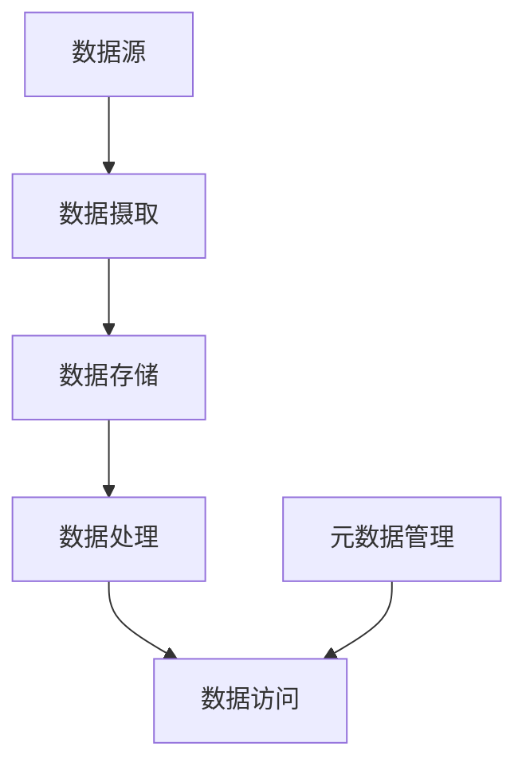

## 1. 背景介绍

### 1.1 大数据时代的数据挑战

随着互联网、物联网、移动互联网的快速发展，全球数据量呈爆炸式增长，数据类型也日益多样化，包括结构化数据、半结构化数据和非结构化数据。传统的数据库管理系统难以有效地存储、管理和分析这些海量、多样的数据。

### 1.2 数据湖的概念及优势

数据湖的概念应运而生，它是一种集中式存储库，用于存储任何类型的数据，包括原始数据、半结构化数据和结构化数据。数据湖具有以下优势：

* **可扩展性:** 数据湖可以存储 PB 级甚至 EB 级的数据，并能随着数据量的增长而轻松扩展。
* **灵活性:** 数据湖支持多种数据格式，包括 CSV、JSON、Parquet、ORC 等，并且可以存储来自不同数据源的数据。
* **成本效益:** 数据湖通常使用廉价的存储介质，例如云对象存储，从而降低了存储成本。
* **数据可发现性:** 数据湖提供元数据管理功能，方便用户搜索和发现所需的数据。
* **支持多种分析方式:** 数据湖中的数据可以用于各种分析目的，例如批处理、流处理、机器学习等。

### 1.3 数据湖架构

典型的数据湖架构包含以下组件：

* **数据源:** 数据来源可以是各种系统，例如关系型数据库、NoSQL 数据库、日志文件、社交媒体数据等。
* **数据摄取:** 数据摄取工具负责将数据从数据源导入数据湖。
* **数据存储:** 数据湖使用云对象存储或分布式文件系统来存储数据。
* **数据处理:** 数据处理工具用于清洗、转换和分析数据。
* **元数据管理:** 元数据管理系统用于存储和管理数据的元数据，例如数据源、数据格式、数据质量等。
* **数据访问:** 用户可以通过 API、查询引擎或数据可视化工具访问数据湖中的数据。


## 2. 核心概念与联系

### 2.1 数据湖与数据仓库的区别

数据湖和数据仓库都是用于存储数据的集中式存储库，但它们之间存在一些关键区别：

| 特性 | 数据湖 | 数据仓库 |
|---|---|---|
| 数据结构 | 任何结构 | 结构化 |
| 数据格式 | 多种格式 | 关系型 |
| 数据处理 | 延迟处理 | 预先处理 |
| 数据质量 | 可变 | 高 |
| 使用场景 | 探索性分析、机器学习 | 商业智能、报表 |

### 2.2 数据湖的关键技术

* **云对象存储:** 提供可扩展、廉价的存储服务，例如 Amazon S3、Azure Blob Storage、Google Cloud Storage。
* **分布式文件系统:** 提供高性能、高可用的文件存储服务，例如 Hadoop Distributed File System (HDFS)。
* **数据处理引擎:** 用于处理和分析数据，例如 Apache Spark、Apache Hive、Apache Flink。
* **元数据管理工具:** 用于存储和管理数据的元数据，例如 Apache Atlas、Cloudera Navigator。

### 2.3 数据湖生态系统的组成

数据湖生态系统由各种工具和技术组成，共同实现数据湖的功能。



## 3. 核心算法原理具体操作步骤

### 3.1 数据摄取

数据摄取是指将数据从数据源导入数据湖的过程。常用的数据摄取工具包括：

* **Apache Flume:** 用于收集和聚合流数据，例如日志文件、社交媒体数据。
* **Apache Kafka:** 用于实时数据流处理，例如网站点击流数据、传感器数据。
* **Apache Sqoop:** 用于将数据从关系型数据库导入 Hadoop。

#### 3.1.1 Apache Flume 数据摄取流程

1. 配置 Flume Agent，指定数据源、数据格式和目标数据湖路径。
2. 启动 Flume Agent，开始收集数据。
3. Flume Agent 将数据写入数据湖。

#### 3.1.2 Apache Kafka 数据摄取流程

1. 配置 Kafka Producer，指定数据源和 Kafka 主题。
2. 启动 Kafka Producer，开始发送数据。
3. 配置 Kafka Consumer，指定 Kafka 主题和目标数据湖路径。
4. 启动 Kafka Consumer，开始消费数据并写入数据湖。

### 3.2 数据存储

数据湖使用云对象存储或分布式文件系统来存储数据。

#### 3.2.1 云对象存储

* **Amazon S3:** Amazon Simple Storage Service，提供可扩展、可靠、廉价的对象存储服务。
* **Azure Blob Storage:** Microsoft Azure Blob Storage，提供类似于 Amazon S3 的对象存储服务。
* **Google Cloud Storage:** Google Cloud Storage，提供高性能、高可用的对象存储服务。

#### 3.2.2 分布式文件系统

* **Hadoop Distributed File System (HDFS):** Apache Hadoop 的分布式文件系统，提供高吞吐量、高容错性的文件存储服务。

### 3.3 数据处理

数据处理工具用于清洗、转换和分析数据。常用的数据处理引擎包括：

* **Apache Spark:** 用于大规模数据处理，支持批处理、流处理、机器学习等。
* **Apache Hive:** 基于 Hadoop 的数据仓库工具，提供 SQL 查询接口。
* **Apache Flink:** 用于实时数据流处理，支持流式 SQL、复杂事件处理等。

#### 3.3.1 Apache Spark 数据处理流程

1. 创建 SparkSession，配置 Spark 应用程序。
2. 读取数据湖中的数据。
3. 使用 Spark SQL 或 Spark DataFrame API 进行数据处理。
4. 将处理结果写入数据湖或其他目标系统。

### 3.4 元数据管理

元数据管理工具用于存储和管理数据的元数据，例如数据源、数据格式、数据质量等。常用的元数据管理工具包括：

* **Apache Atlas:** Apache Hadoop 的元数据管理工具，提供数据治理、数据血缘追踪等功能。
* **Cloudera Navigator:** Cloudera 的元数据管理工具，提供数据发现、数据质量监控等功能。

### 3.5 数据访问

用户可以通过 API、查询引擎或数据可视化工具访问数据湖中的数据。

#### 3.5.1 API

* **Amazon S3 API:** 用于访问 Amazon S3 中的数据。
* **Azure Blob Storage API:** 用于访问 Azure Blob Storage 中的数据。
* **Google Cloud Storage API:** 用于访问 Google Cloud Storage 中的数据。

#### 3.5.2 查询引擎

* **Apache Hive:** 提供 SQL 查询接口，可以查询数据湖中的数据。
* **Apache Presto:** 分布式 SQL 查询引擎，可以查询各种数据源，包括数据湖。

#### 3.5.3 数据可视化工具

* **Tableau:** 商业智能工具，可以连接到数据湖并创建交互式仪表板。
* **Power BI:** Microsoft 的商业智能工具，可以连接到数据湖并创建报表和仪表板。

## 4. 数学模型和公式详细讲解举例说明

数据湖中常用的数学模型和公式包括：

* **数据质量指标:** 用于评估数据的准确性、完整性和一致性。例如，数据缺失率、数据重复率、数据一致性规则。
* **数据分布:** 用于描述数据的统计特征，例如均值、方差、标准差、分位数。
* **相关性分析:** 用于衡量两个变量之间的线性关系，例如 Pearson 相关系数。
* **回归分析:** 用于建立变量之间的关系模型，例如线性回归、逻辑回归。

## 5. 项目实践：代码实例和详细解释说明

以下是一个使用 Apache Spark 读取数据湖数据并进行数据处理的代码示例：

```python
from pyspark.sql import SparkSession

# 创建 SparkSession
spark = SparkSession.builder.appName("DataLakeProcessing").getOrCreate()

# 读取数据湖中的数据
df = spark.read.parquet("s3a://mybucket/data.parquet")

# 数据处理
df.groupBy("country").agg({"revenue": "sum"})

# 将处理结果写入数据湖
df.write.parquet("s3a://mybucket/processed_data.parquet")

# 关闭 SparkSession
spark.stop()
```

**代码解释:**

1. 首先，我们创建了一个 SparkSession，它是 Spark 应用程序的入口点。
2. 然后，我们使用 `spark.read.parquet()` 方法读取数据湖中的数据。
3. 接下来，我们使用 Spark DataFrame API 对数据进行处理。在本例中，我们按国家/地区对收入进行分组，并计算每个国家/地区的总收入。
4. 最后，我们使用 `df.write.parquet()` 方法将处理结果写入数据湖。

## 6. 实际应用场景

数据湖技术可以应用于 various industries and scenarios, including:

* **电子商务:** 分析用户行为、优化产品推荐、检测欺诈行为。
* **金融服务:** 风险管理、欺诈检测、客户关系管理。
* **医疗保健:** 疾病预测、药物研发、个性化医疗。
* **制造业:** 预测性维护、供应链优化、质量控制。
* **物联网:** 分析传感器数据、预测设备故障、优化设备性能。

## 7. 工具和资源推荐

以下是一些数据湖相关的工具和资源：

* **Apache Hadoop:** 开源的分布式计算框架，提供 HDFS、MapReduce、YARN 等组件。
* **Apache Spark:** 用于大规模数据处理的开源框架，支持批处理、流处理、机器学习等。
* **Amazon Web Services (AWS):** 提供各种云服务，包括 Amazon S3、Amazon EMR、Amazon Redshift 等。
* **Microsoft Azure:** 提供各种云服务，包括 Azure Blob Storage、Azure Databricks、Azure Synapse Analytics 等。
* **Google Cloud Platform (GCP):** 提供各种云服务，包括 Google Cloud Storage、Google Cloud Dataproc、Google BigQuery 等。

## 8. 总结：未来发展趋势与挑战

数据湖技术正在不断发展，未来将呈现以下趋势：

* **云原生数据湖:** 数据湖将更多地采用云原生架构，利用云服务的可扩展性和成本效益。
* **数据湖与数据仓库的融合:** 数据湖和数据仓库将更紧密地集成，提供更全面的数据管理解决方案。
* **人工智能与数据湖:** 人工智能技术将越来越多地应用于数据湖，例如数据质量分析、数据发现、数据洞察。

数据湖技术也面临一些挑战：

* **数据治理:** 确保数据湖中的数据质量、安全性和合规性。
* **数据安全:** 保护数据湖中的数据免受未授权访问和攻击。
* **成本管理:** 优化数据湖的存储和计算成本。

## 9. 附录：常见问题与解答

**Q: 数据湖和数据仓库有什么区别？**

A: 数据湖是一种集中式存储库，用于存储任何类型的数据，包括原始数据、半结构化数据和结构化数据。数据仓库是一种用于存储结构化数据的数据库，通常用于商业智能和报表。

**Q: 数据湖有哪些优势？**

A: 数据湖具有可扩展性、灵活性、成本效益、数据可发现性和支持多种分析方式等优势。

**Q: 数据湖有哪些应用场景？**

A: 数据湖可以应用于 various industries and scenarios, including 电子商务、金融服务、医疗保健、制造业和物联网等。

**Q: 数据湖面临哪些挑战？**

A: 数据湖面临数据治理、数据安全和成本管理等挑战。