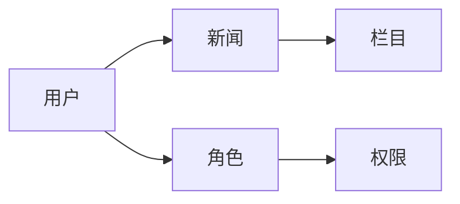

## 1. 背景介绍

### 1.1 新闻发布系统的意义
新闻发布系统是现代社会信息传播的重要工具，它能够及时、准确地将新闻信息传递给广大用户。随着互联网技术的快速发展，新闻发布系统已经成为各大媒体、企业、政府机构等信息发布的重要平台。

### 1.2  新闻发布系统的现状
目前，市面上的新闻发布系统种类繁多，功能也各不相同。一些系统功能简单，只提供基本的新闻发布功能；而一些系统功能强大，可以实现新闻采集、编辑、审核、发布、统计等一系列功能。

### 1.3 本文的目的
本文将详细介绍一个新闻发布系统的详细设计方案和具体代码实现，旨在为广大开发者提供一个参考，帮助他们更好地理解新闻发布系统的架构和实现原理。

## 2. 核心概念与联系

### 2.1 新闻发布系统的核心概念

* **新闻**:  新闻是新闻发布系统中最核心的概念，它包含标题、内容、作者、发布时间等信息。
* **栏目**: 栏目是对新闻进行分类的一种方式，例如政治、经济、文化、体育等。
* **用户**: 用户是指使用新闻发布系统的个人或组织，用户可以浏览新闻、发布新闻、管理新闻等。
* **角色**: 角色是指用户在新闻发布系统中所扮演的不同身份，例如管理员、编辑、记者等。
* **权限**: 权限是指不同角色在新闻发布系统中所拥有的不同操作权限，例如管理员可以管理所有新闻，而编辑只能编辑自己发布的新闻。

### 2.2  核心概念之间的联系

* 新闻属于某个栏目，一个栏目可以包含多篇新闻。
* 用户可以发布新闻，新闻可以属于某个用户。
* 用户可以拥有不同的角色，角色拥有不同的权限。

### 2.3  核心概念的 Mermaid 流程图



## 3. 核心算法原理具体操作步骤

### 3.1  新闻发布流程

1. 用户登录新闻发布系统。
2. 用户选择要发布新闻的栏目。
3. 用户填写新闻标题、内容、作者等信息。
4. 用户提交新闻，系统进行审核。
5. 审核通过后，新闻发布到网站上。

### 3.2  新闻审核流程

1. 管理员登录新闻发布系统。
2. 管理员查看待审核的新闻。
3. 管理员对新闻进行审核，可以选择通过或拒绝。
4. 审核通过后，新闻发布到网站上。

## 4. 数学模型和公式详细讲解举例说明

新闻发布系统中并不涉及复杂的数学模型和公式，主要是一些数据库操作和逻辑判断。

## 5. 项目实践：代码实例和详细解释说明

### 5.1  技术选型

* **开发语言**:  Python
* **Web框架**: Django
* **数据库**: MySQL
* **前端框架**: Bootstrap

### 5.2  数据库设计

| 表名 | 字段 | 类型 | 说明 |
|---|---|---|---|
| news | id | int | 新闻ID |
| news | title | varchar(255) | 新闻标题 |
| news | content | text | 新闻内容 |
| news | author | varchar(255) | 新闻作者 |
| news | create_time | datetime | 新闻创建时间 |
| news | category_id | int | 新闻所属栏目ID |
| category | id | int | 栏目ID |
| category | name | varchar(255) | 栏目名称 |
| user | id | int | 用户ID |
| user | username | varchar(255) | 用户名 |
| user | password | varchar(255) | 密码 |
| role | id | int | 角色ID |
| role | name | varchar(255) | 角色名称 |
| permission | id | int | 权限ID |
| permission | name | varchar(255) | 权限名称 |

### 5.3  代码实现

```python
from django.db import models

class Category(models.Model):
    name = models.CharField(max_length=255)

class News(models.Model):
    title = models.CharField(max_length=255)
    content = models.TextField()
    author = models.CharField(max_length=255)
    create_time = models.DateTimeField(auto_now_add=True)
    category = models.ForeignKey(Category, on_delete=models.CASCADE)

class User(models.Model):
    username = models.CharField(max_length=255)
    password = models.CharField(max_length=255)

class Role(models.Model):
    name = models.CharField(max_length=255)

class Permission(models.Model):
    name = models.CharField(max_length=255)
```

## 6. 实际应用场景

新闻发布系统可以应用于以下场景：

* **媒体网站**:  用于发布新闻资讯，吸引用户流量。
* **企业网站**:  用于发布企业新闻、产品信息、活动公告等。
* **政府机构**:  用于发布政策法规、办事指南、公告通知等。

## 7. 工具和资源推荐

* **Django**:  Python Web框架，用于构建Web应用程序。
* **MySQL**:  关系型数据库管理系统，用于存储新闻数据。
* **Bootstrap**:  前端框架，用于快速构建美观易用的网页。

## 8. 总结：未来发展趋势与挑战

### 8.1  未来发展趋势

* **个性化推荐**:  根据用户的兴趣爱好，推荐相关新闻。
* **人工智能**:  利用人工智能技术，实现新闻自动采集、编辑、审核等功能。
* **多平台发布**:  将新闻发布到多个平台，例如网站、APP、社交媒体等。

### 8.2  挑战

* **信息安全**:  如何保障新闻信息的真实性和安全性。
* **内容质量**:  如何提高新闻内容的质量，避免虚假新闻和低俗内容。
* **用户体验**:  如何提升用户体验，让用户更容易地获取新闻信息。

## 9. 附录：常见问题与解答

### 9.1  如何发布新闻？

用户登录新闻发布系统后，选择要发布新闻的栏目，填写新闻标题、内容、作者等信息，提交新闻后，系统会进行审核，审核通过后，新闻就会发布到网站上。

### 9.2  如何修改新闻？

用户登录新闻发布系统后，找到要修改的新闻，点击编辑按钮，修改新闻内容后，保存即可。

### 9.3  如何删除新闻？

用户登录新闻发布系统后，找到要删除的新闻，点击删除按钮，确认删除即可。